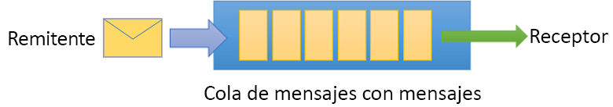

# <a name="tutorial-update-inventory-using-powershell-and-topicssubscriptions"></a>Tutorial: Actualización del inventario mediante PowerShell y temas y suscripciones

Microsoft Azure Service Bus es un servicio de mensajería multiinquilino en la nube que envía información entre aplicaciones y servicios. Las operaciones asincrónicas le ofrecen una mensajería flexible y asincrónica, además de funcionalidades de mensajería estructurada de tipo FIFO (primero en entrar, primero en salir) y de publicación y suscripción. 

En este tutorial se muestra cómo enviar y recibir mensajes en una cola de Service Bus, cómo usar PowerShell para crear un espacio de nombres de mensajería y una cola dentro de ese espacio de nombres y cómo obtener las credenciales de autorización en ese espacio de nombres. El procedimiento muestra después cómo enviar y recibir mensajes de esta cola mediante la [biblioteca de .NET Standard](https://www.nuget.org/packages/Microsoft.Azure.ServiceBus).

En este tutorial, aprenderá a:
> [!div class="checklist"]
> * Crear un tema de Service Bus y una o varias suscripciones a ese tema mediante Azure PowerShell
> * Agregar filtros de tema mediante PowerShell
> * Crear dos mensajes con contenido diferente
> * Enviar los mensajes y comprobar que llegaron a las suscripciones esperadas
> * Recibir mensajes de las suscripciones

Un ejemplo de este escenario es una actualización del surtido de inventario de varias tiendas. En este escenario, cada tienda o conjunto de tiendas, recibe mensajes dirigidos a que actualicen sus inventarios. En este tutorial se muestra cómo implementar este escenario mediante suscripciones y filtros. En primer lugar puede crear un tema con 3 suscripciones, agregar algunas reglas y filtros y, a continuación, enviar y recibir mensajes de los temas y las suscripciones.



Si no tiene una suscripción a Azure, cree una [cuenta gratuita][] antes de empezar.

## <a name="prerequisites"></a>requisitos previos

Para completar este tutorial, asegúrese de que tiene instalados los siguientes elementos:

1. [Visual Studio 2017 Update 3 (versión 15.3, 26730.01)](http://www.visualstudio.com/vs) o posterior.
2. [NET Core SDK](https://www.microsoft.com/net/download/windows), versión 2.0 o posterior.

En este tutorial es necesario ejecutar la versión más reciente de Azure PowerShell. Si necesita instalarlo o actualizarlo, consulte [Instalación y configuración de Azure PowerShell][].

[!INCLUDE [cloud-shell-try-it.md](../../includes/cloud-shell-try-it.md)]

## <a name="log-in-to-azure"></a>Inicio de sesión en Azure

Emita los comandos siguientes para iniciar sesión en Azure. Estos pasos no son necesarios si ejecuta comandos de PowerShell en Cloud Shell: 

1. Instale el módulo de PowerShell de Service Bus:

   ```azurepowershell-interactive
   Install-Module AzureRM.ServiceBus
   ```

2. Ejecute el siguiente comando para iniciar sesión en Azure:

   ```azurepowershell-interactive
   Login-AzureRmAccount
   ```

4. Establezca el contexto de suscripción actual, o vea la suscripción actualmente activa:

   ```azurepowershell-interactive
   Select-AzureRmSubscription -SubscriptionName "MyAzureSubName" 
   Get-AzureRmContext
   ```

## <a name="provision-resources"></a>Aprovisionamiento de recursos

Después de iniciar sesión en Azure, emita los siguientes comandos para aprovisionar recursos de Service Bus. Asegúrese de reemplazar todos los marcadores de posición por los valores apropiados:

```azurepowershell-interactive
# Create a resource group 
New-AzureRmResourceGroup –Name my-resourcegroup –Location westus2

# Create a Messaging namespace
New-AzureRmServiceBusNamespace -ResourceGroupName my-resourcegroup -NamespaceName namespace-name -Location westus2

# Create a queue 
New-AzureRmServiceBusQueue -ResourceGroupName my-resourcegroup -NamespaceName namespace-name -Name queue-name -EnablePartitioning $False

# Get primary connection string (required in next step)
Get-AzureRmServiceBusKey -ResourceGroupName my-resourcegroup -Namespace namespace-name -Name RootManageSharedAccessKey
```

Después de la ejecución del cmdlet `Get-AzureRmServiceBusKey`, copie y pegue la cadena de conexión y el nombre de cola que ha seleccionado en una ubicación temporal, por ejemplo, en el Bloc de notas. Esta información la necesitará en el siguiente paso.

## <a name="send-and-receive-messages"></a>Envío y recepción de mensajes

Una vez que haya creado el espacio de nombres y la cola, y disponga de las credenciales necesarias, estará listo para enviar y recibir mensajes. Puede examinar el código en [esta carpeta de ejemplos de GitHub](https://github.com/Azure/azure-service-bus/tree/master/samples/DotNet/GettingStarted/BasicSendReceiveQuickStart).

Para ejecutar el código, haga lo siguiente:

1. Clone el [repositorio de GitHub de Service Bus](https://github.com/Azure/azure-service-bus/) mediante la emisión del comando siguiente:

   ```shell
   git clone https://github.com/Azure/azure-service-bus.git
   ```

2. Abra un símbolo del sistema de PowerShell.

3. Vaya a la carpeta de ejemplos `azure-service-bus\samples\DotNet\GettingStarted\BasicSendReceiveQuickStart\BasicSendReceiveQuickStart`.

4. Si aún no lo ha hecho, obtenga la cadena de conexión mediante el siguiente cmdlet de PowerShell. No olvide reemplazar `my-resourcegroup` y `namespace-name` por los valores específicos: 

   ```azurepowershell-interactive
   Get-AzureRmServiceBusKey -ResourceGroupName my-resourcegroup -Namespace namespace-name -Name RootManageSharedAccessKey
   ```
5.  En el símbolo del sistema de PowerShell, escriba el siguiente comando:

   ```shell
   dotnet build
   ```
6.  Vaya a la carpeta `\bin\Debug\netcoreapp2.0`.
7.  Escriba el siguiente comando para ejecutar el programa. No olvide reemplazar `myConnectionString` por el valor que obtuvo previamente, y `myQueueName` por el nombre de la cola que creó:

   ```shell
   dotnet BasicSendReceiveQuickStart.dll -ConnectionString "myConnectionString" -QueueName "myQueueName"
   ``` 
8. Observe que se envían 10 mensajes a la cola y que, posteriormente, se reciben de ella:

   

## <a name="clean-up-resources"></a>Limpieza de recursos

Ejecute el siguiente comando para quitar el grupo de recursos, el espacio de nombres y todos los recursos relacionados:

```powershell-interactive
Remove-AzureRmResourceGroup -Name my-resourcegroup
```

## <a name="understand-the-sample-code"></a>Descripción del código de ejemplo

Esta sección contiene información más detallada acerca de lo que hace el código de ejemplo. 

### <a name="get-connection-string-and-queue"></a>Obtención de la cadena de conexión y la cola

La cadena de conexión y el nombre de la cola se pasan al método `Main()` como argumentos de la línea de comandos. `Main()` declara dos variables de cadena que contienen estos valores:

```csharp
static void Main(string[] args)
{
    string ServiceBusConnectionString = "";
    string QueueName = "";

    for (int i = 0; i < args.Length; i++)
    {
        var p = new Program();
        if (args[i] == "-ConnectionString")
        {
            Console.WriteLine($"ConnectionString: {args[i+1]}");
            ServiceBusConnectionString = args[i + 1]; 
        }
        else if(args[i] == "-QueueName")
        {
            Console.WriteLine($"QueueName: {args[i+1]}");
            QueueName = args[i + 1];
        }                
    }

    if (ServiceBusConnectionString != "" && QueueName != "")
        MainAsync(ServiceBusConnectionString, QueueName).GetAwaiter().GetResult();
    else
    {
        Console.WriteLine("Specify -Connectionstring and -QueueName to execute the example.");
        Console.ReadKey();
    }                            
}
```
 
El método `Main()` inicia entonces el bucle de mensajes asincrónicos `MainAsync()`.

### <a name="message-loop"></a>Bucle de mensajes

El método `MainAsync()` crea un cliente de cola con los argumentos de la línea de comandos, llama a un controlador de mensajes de recepción denominado `RegisterOnMessageHandlerAndReceiveMessages()` y envía el conjunto de mensajes:

```csharp
static async Task MainAsync(string ServiceBusConnectionString, string QueueName)
{
    const int numberOfMessages = 10;
    queueClient = new QueueClient(ServiceBusConnectionString, QueueName);

    Console.WriteLine("======================================================");
    Console.WriteLine("Press any key to exit after receiving all the messages.");
    Console.WriteLine("======================================================");

    // Register QueueClient's MessageHandler and receive messages in a loop
    RegisterOnMessageHandlerAndReceiveMessages();

    // Send Messages
    await SendMessagesAsync(numberOfMessages);

    Console.ReadKey();

    await queueClient.CloseAsync();
}
```

El método `RegisterOnMessageHandlerAndReceiveMessages()` establece unas cuantas opciones del controlador de mensajes y, a continuación, llama al método `RegisterMessageHandler()` del cliente de la cola, que inicia la recepción:

```csharp
static void RegisterOnMessageHandlerAndReceiveMessages()
{
    // Configure the MessageHandler Options in terms of exception handling, number of concurrent messages to deliver etc.
    var messageHandlerOptions = new MessageHandlerOptions(ExceptionReceivedHandler)
    {
        // Maximum number of Concurrent calls to the callback `ProcessMessagesAsync`, set to 1 for simplicity.
        // Set it according to how many messages the application wants to process in parallel.
        MaxConcurrentCalls = 1,

        // Indicates whether MessagePump should automatically complete the messages after returning from User Callback.
        // False below indicates the Complete will be handled by the User Callback as in `ProcessMessagesAsync` below.
        AutoComplete = false
    };

    // Register the function that will process messages
    queueClient.RegisterMessageHandler(ProcessMessagesAsync, messageHandlerOptions);
} 
```

### <a name="send-messages"></a>Envío de mensajes

Se producen las operaciones de creación y envío de mensajes del método `SendMessagesAsync()`:

```csharp
static async Task SendMessagesAsync(int numberOfMessagesToSend)
{
    try
    {
        for (var i = 0; i < numberOfMessagesToSend; i++)
        {
            // Create a new message to send to the queue
            string messageBody = $"Message {i}";
            var message = new Message(Encoding.UTF8.GetBytes(messageBody));

            // Write the body of the message to the console
            Console.WriteLine($"Sending message: {messageBody}");

            // Send the message to the queue
            await queueClient.SendAsync(message);
        }
    }
    catch (Exception exception)
    {
        Console.WriteLine($"{DateTime.Now} :: Exception: {exception.Message}");
    }
}
```

### <a name="process-messages"></a>Procesamiento de mensajes

El método `ProcessMessagesAsync()` confirma, procesa y completa la recepción de los mensajes:

```csharp
static async Task ProcessMessagesAsync(Message message, CancellationToken token)
{
    // Process the message
    Console.WriteLine($"Received message: SequenceNumber:{message.SystemProperties.SequenceNumber} Body:{Encoding.UTF8.GetString(message.Body)}");

    // Complete the message so that it is not received again.
    await queueClient.CompleteAsync(message.SystemProperties.LockToken);
}
```

## <a name="next-steps"></a>Pasos siguientes

En este tutorial, aprovisionó recursos mediante Azure PowerShell, y luego envió y recibió mensajes desde un tema de Service Bus y sus suscripciones. Ha aprendido a:

> [!div class="checklist"]
> * Crear un tema de Service Bus y una o varias suscripciones a ese tema mediante Azure Portal
> * Agregar filtros de tema mediante código .NET
> * Crear dos mensajes con contenido diferente
> * Enviar los mensajes y comprobar que llegaron a las suscripciones esperadas
> * Recibir mensajes de las suscripciones

Para más ejemplos de envío y recepción de mensajes, empiece a trabajar con los [ejemplos de Service Bus en GitHub](https://github.com/Azure/azure-service-bus/tree/master/samples/DotNet/GettingStarted).

Avance hasta el siguiente tutorial para aprender más acerca del uso de las funcionalidades de publicación y suscripción de Service Bus.

> [!div class="nextstepaction"]
> [Actualización del inventario mediante PowerShell y temas/suscripciones](service-bus-tutorial-topics-subscriptions-cli.md)

[cuenta gratuita]: https://azure.microsoft.com/free/?ref=microsoft.com&utm_source=microsoft.com&utm_medium=docs&utm_campaign=visualstudio
[Instalación y configuración de Azure PowerShell]: /powershell/azure/install-azurerm-ps