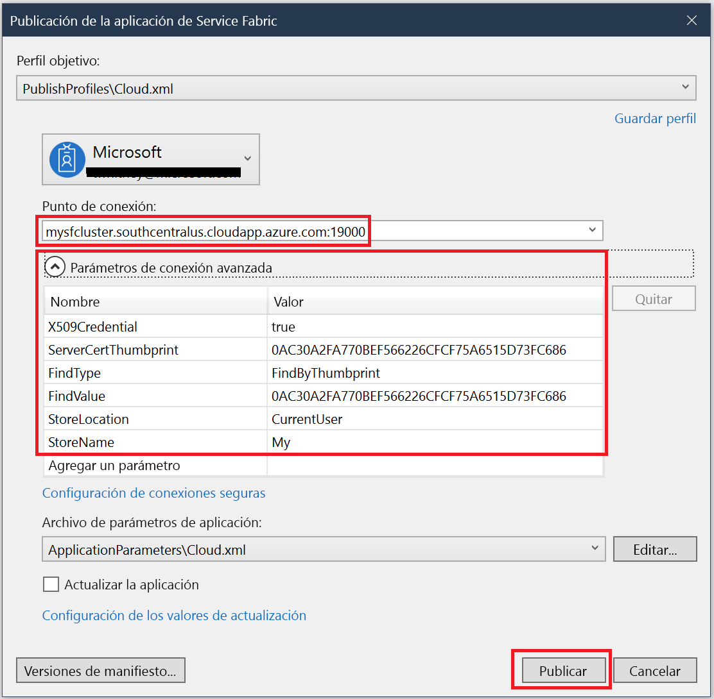

# <a name="quickstart-deploy-windows-containers-to-service-fabric"></a>Inicio rápido: Implementación de contenedores de Windows en Service Fabric

Azure Service Fabric es una plataforma de sistemas distribuidos para implementar y administrar microservicios y contenedores escalables y confiables.

Para ejecutar una aplicación que existe en un contenedor de Windows en un clúster de Service Fabric no hay que hacer ningún cambio en la aplicación. Esta guía de inicio rápido muestra cómo implementar una imagen de contenedor Docker creada previamente en una aplicación de Service Fabric. Cuando haya terminado, tendrá un contenedor de Windows Server Core 2016 Server e IIS en ejecución. Esta guía de inicio rápido describe la implementación de un contenedor Windows; lea [esta otra guía](service-fabric-quickstart-containers-linux.md) para implementar un contenedor Linux.

![Página web predeterminada de IIS][iis-default]

En esta guía de inicio rápido, aprenderá a hacer lo siguiente:

* Empaquetado de un contenedor de imagen de Docker
* Configuración de la comunicación
* Creación y empaquetamiento de la aplicación de Service Fabric
* Implementación de la aplicación contenedora en Azure


[!INCLUDE [updated-for-az](../../includes/updated-for-az.md)]

## <a name="prerequisites"></a>Requisitos previos

* Una suscripción de Azure (puede crear una [cuenta gratuita](https://azure.microsoft.com/free/?WT.mc_id=A261C142F)).
* Un equipo de desarrollo en el que se ejecute:
  * Visual Studio 2015 o Visual Studio 2017.
  * [SDK y herramientas de Service Fabric](service-fabric-get-started.md).

## <a name="package-a-docker-image-container-with-visual-studio"></a>Empaquetado de un contenedor de imagen de Docker con Visual Studio

Las herramientas y el SDK de Service Fabric proporcionan una plantilla de servicio que le ayuda a implementar un contenedor en un clúster de Service Fabric.

Inicie Visual Studio como administrador.  Seleccione **Archivo** > **Nuevo** > **Proyecto**.

Seleccione **Aplicación de Service Fabric**, asígnele el nombre "MyFirstContainer" y haga clic en **Aceptar**.

Seleccione **Contenedor** en las plantillas **Aplicaciones y contenedores hospedados**.

En **Nombre de la imagen**, escriba "mcr.microsoft.com/windows/servercore/iis:windowservercore-ltsc2016", la [imagen base de Windows Server Core Server e IIS](https://hub.docker.com/r/microsoft-windows-servercore-iis).

Configure la asignación de los puertos del host al contenedor para que las solicitudes que lleguen al puerto 80 para el servicio se asignen al puerto 80 del contenedor.  Establezca **Puerto del contenedor** en "80" y establezca **Puerto del host** en "80".  

Asigne el nombre "MyContainerService" al servicio y haga clic en **Aceptar**.

![Cuadro de diálogo Nuevo servicio][new-service]

## <a name="specify-the-os-build-for-your-container-image"></a>Especificación de la compilación del sistema operativo para la imagen de contenedor

Los contenedores creados con una versión específica de Windows Server podrían no ejecutarse en un host que ejecute una versión distinta de Windows Server. Por ejemplo, los contenedores creados con Windows Server versión 1709 no funcionan en hosts que ejecutan Windows Server 2016. Para más información, consulte [Sistema operativo del contenedor Windows Server y compatibilidad con el sistema operativo del host](service-fabric-get-started-containers.md#windows-server-container-os-and-host-os-compatibility). 

Con la versión 6.1 del runtime de Service Fabric y versiones más recientes, puede especificar varias imágenes de sistema operativo por contenedor y etiquetar cada una con la versión de compilación del sistema operativo en el que deben implementarse. Esto ayuda a asegurarse de que la aplicación se ejecutará en hosts que ejecutan versiones diferentes del sistema operativo Windows. Para más información, consulte [Especificación de las imágenes de contenedores de compilación específica del sistema operativo](service-fabric-get-started-containers.md#specify-os-build-specific-container-images). 

Microsoft publica imágenes distintas para las versiones de IIS que se compilaron con versiones distintas de Windows Server. Para asegurarse de que Service Fabric implementa un contenedor compatible con la versión de Windows Server que se ejecuta en los nodos del clúster donde se implementa la aplicación, agregue las líneas siguientes al archivo *ApplicationManifest.xml*. La versión de compilación de Windows Server 2016 es la 14393 y la versión de compilación de la versión 1709 de Windows Server es la 16299.

```xml
    <ContainerHostPolicies CodePackageRef="Code"> 
      <ImageOverrides> 
        ...
          <Image Name="mcr.microsoft.com/windows/servercore/iis:windowservercore-1803" /> 
          <Image Name= "mcr.microsoft.com/windows/servercore/iis:windowservercore-ltsc2016" Os="14393" /> 
          <Image Name="mcr.microsoft.com/windows/servercore/iis:windowservercore-1709" Os="16299" /> 
      </ImageOverrides> 
    </ContainerHostPolicies> 
```

El manifiesto de servicio continúa especificando solo una imagen para el servidor nanoserver, `mcr.microsoft.com/windows/servercore/iis:windowservercore-ltsc2016`.

También en el archivo *ApplicationManifest.xml*, cambie **PasswordEncrypted** a **false**. La cuenta y la contraseña están en blanco para la imagen de contenedor público que está en Docker Hub, por lo que es necesario desactivar el cifrado porque al cifrar una contraseña en blanco se generará un error de compilación.

```xml
<RepositoryCredentials AccountName="" Password="" PasswordEncrypted="false" />
```

## <a name="create-a-cluster"></a>Creación de un clúster

En este script de ejemplo se crea un clúster de Service Fabric de cinco nodos protegido con un certificado X.509. El comando crea un certificado autofirmado y lo carga en un nuevo almacén de claves. El certificado también se copia en un directorio local. Puede aprender más sobre cómo crear un clúster mediante este script en [Creación de un clúster de Service Fabric](scripts/service-fabric-powershell-create-secure-cluster-cert.md).

Si es necesario, instale PowerShell con la instrucción que se encuentra en la [Guía de instalación de Azure PowerShell](/powershell/azure/overview).

Antes de ejecutar el siguiente script, ejecute `Connect-AzAccount` en PowerShell para crear una conexión con Azure.

Copie el script siguiente en el Portapapeles y abra **Windows PowerShell ISE**.  Pegue el contenido en la ventana Untitled1.ps1 vacía. A continuación, proporcione valores para las variables del script: `subscriptionId`, `certpwd`, `certfolder`, `adminuser`, `adminpwd`, etc.  El directorio que especifique para `certfolder` debe existir antes de ejecutar el script.

[!code-powershell[main](../../powershell_scripts/service-fabric/create-secure-cluster/create-secure-cluster.ps1 "Create a Service Fabric cluster")]

Cuando haya proporcionado los valores para las variables, presione **F5** para ejecutar el script.

Después de ejecutar el script y crear el clúster, busque `ClusterEndpoint` en la salida. Por ejemplo: 

```powershell
...
ClusterEndpoint : https://southcentralus.servicefabric.azure.com/runtime/clusters/b76e757d-0b97-4037-a184-9046a7c818c0
```

### <a name="install-the-certificate-for-the-cluster"></a>Instalación del certificado para el clúster

Ahora, se va a instalar el PFX en el almacén de certificados *CurrentUser\My*. El archivo PFX estará en el directorio especificado mediante la variable de entorno `certfolder` en el script de PowerShell anterior.

Cambie a ese directorio y, luego, ejecute el siguiente comando de PowerShell; sustituya el nombre del archivo PFX que se encuentra en su directorio `certfolder` y la contraseña que especificó en la variable `certpwd`. En este ejemplo, el directorio actual se establece en el directorio especificado por la variable `certfolder` en el script de PowerShell. A partir de ahí, se ejecuta el comando `Import-PfxCertificate`:

```powershell
PS C:\mycertificates> Import-PfxCertificate -FilePath .\mysfclustergroup20190130193456.pfx -CertStoreLocation Cert:\CurrentUser\My -Password (ConvertTo-SecureString Password#1234 -AsPlainText -Force)
```

El comando devuelve la huella digital:

```powershell
  ...
  PSParentPath: Microsoft.PowerShell.Security\Certificate::CurrentUser\My

Thumbprint                                Subject
----------                                -------
0AC30A2FA770BEF566226CFCF75A6515D73FC686  CN=mysfcluster.SouthCentralUS.cloudapp.azure.com
```

Recuerde el valor de la huella digital para el paso siguiente.

## <a name="deploy-the-application-to-azure-using-visual-studio"></a>Implementación de la aplicación en Azure con Visual Studio

Ahora que la aplicación está lista, puede implementarla en un clúster directamente desde Visual Studio.

Haga clic con el botón derecho en **MyFirstContainer** en el Explorador de soluciones y seleccione **Publicar**. Aparece el cuadro de diálogo de publicación.

Copie el siguiente contenido **CN=** en la ventana de PowerShell cuando ejecutó el comando `Import-PfxCertificate` anterior y agregue el puerto `19000`. Por ejemplo, `mysfcluster.SouthCentralUS.cloudapp.azure.com:19000`. Cópielo en el campo **Connection Endpoint** (Punto de conexión). Recuerde este valor porque lo necesitará en un paso posterior.

Haga clic en **Parámetros de conexión avanzada** y compruebe la información de los parámetros de conexión.  Los valores *FindValue* y *ServerCertThumbprint* deben coincidir con la huella digital del certificado instalado cuando ejecutó `Import-PfxCertificate` en el paso anterior.



Haga clic en **Publicar**.

Todas las aplicaciones del clúster deben tener un nombre único. Si se produce un conflicto de nombres, cambie el nombre del proyecto de Visual Studio y vuelva a realizar la implementación.

Abra un explorador y vaya a la dirección que especificó en el campo **Connection Endpoint** (Punto de conexión) en el paso anterior. Si lo desea, puede anteponer el identificador de esquema `http://` y agregar el puerto `:80` a la dirección URL. Por ejemplo, http:\//mysfcluster.SouthCentralUS.cloudapp.azure.com:80.

 Verá la página web predeterminada de IIS: ![Página web predeterminada de IIS][iis-default]

## <a name="clean-up"></a>Limpieza

Mientras el clúster está en ejecución, se siguen generando cargos. Considere la posibilidad de [eliminar el clúster](service-fabric-cluster-delete.md).

## <a name="next-steps"></a>Pasos siguientes

En este tutorial, ha aprendido a hacer lo siguiente:

* Empaquetado de un contenedor de imagen de Docker
* Configuración de la comunicación
* Creación y empaquetamiento de la aplicación de Service Fabric
* Implementación de la aplicación contenedora en Azure

Para más información sobre cómo trabajar con contenedores de Windows en Service Fabric, siga el tutorial para aplicaciones de contenedor de Windows.

> [!div class="nextstepaction"]
> [Creación de una aplicación de contenedor de Windows](./service-fabric-host-app-in-a-container.md)

[iis-default]: ./media/service-fabric-quickstart-containers/iis-default.png
[publish-dialog]: ./media/service-fabric-quickstart-containers/publish-dialog.png
[new-service]: ./media/service-fabric-quickstart-containers/NewService.png
