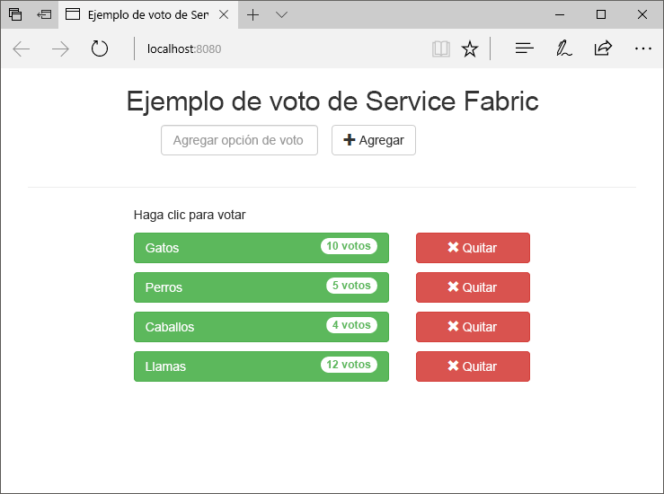
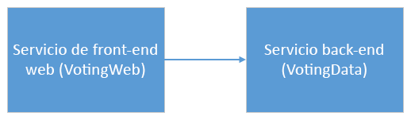
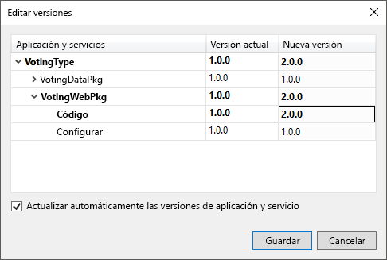
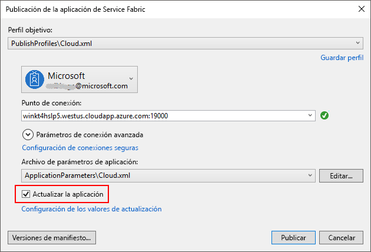
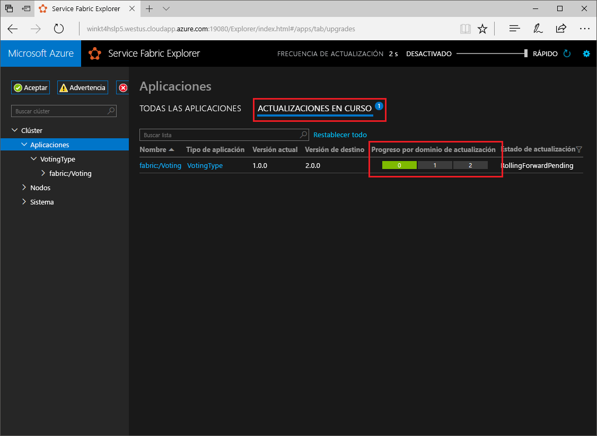

# <a name="quickstart-deploy-a-net-reliable-services-application-to-service-fabric"></a>Inicio rápido: Implementación de una aplicación de .NET Reliable Services en Service Fabric

Azure Service Fabric es una plataforma de sistemas distribuidos para implementar y administrar microservicios y contenedores escalables y confiables.

En este tutorial rápido se muestra cómo implementar la primera aplicación .NET en Service Fabric. Cuando termine, tendrá una aplicación de votación con un front-end web de ASP.NET Core que guarda los resultados de la votación en un servicio back-end con estado en el clúster.



Mediante el uso de esta aplicación, aprenderá a hacer lo siguiente:

* Crear una aplicación con .NET y Service Fabric
* Usar ASP.NET Core como front-end web
* Almacenar datos de la aplicación en un servicio con estado
* Depurar la aplicación de forma local
* Escalar horizontalmente la aplicación en varios nodos
* Realizar una actualización gradual de aplicaciones

## <a name="prerequisites"></a>Requisitos previos

Para completar esta guía de inicio rápido:

1. [Instale Visual Studio 2019](https://www.visualstudio.com/) con las cargas de trabajo **Desarrollo de Azure** y **Desarrollo de ASP.NET y web**.
2. [Instalación de Git](https://git-scm.com/)
3. [Instale el SDK de Microsoft Azure Service Fabric](https://www.microsoft.com/web/handlers/webpi.ashx?command=getinstallerredirect&appid=MicrosoftAzure-ServiceFabric-CoreSDK).
4. Ejecute el comando siguiente para permitir que Visual Studio implemente en el clúster de Service Fabric local:

   ```powershell
   Set-ExecutionPolicy -ExecutionPolicy Unrestricted -Force -Scope CurrentUser
   ```
    
## <a name="build-a-cluster"></a>Compilación de un clúster

Después de instalar el entorno de ejecución, los SDK, las herramientas de Visual Studio y Docker, y de que Docker se ejecute, cree un clúster de desarrollo local de cinco nodos.

> [!Note]
> La razón para hacer que Docker se ejecute cuando se crea el clúster es que se cree con las características de contenedor habilitadas. Si Docker no se está ejecutando, tendrá que volver a crear el clúster para habilitar las características del contenedor.
> Aunque sea innecesario para este inicio rápido concreto, la instrucción para que Docker se ejecute cuando cree el clúster se incluye como procedimiento recomendado.
> Compruebe que Docker se está ejecutando. Para ello, abra una ventana de terminal y ejecute `docker ps` para ver si se produce un error. Si la respuesta no indica un error, Docker se está ejecutando y ya está listo para compilar un clúster.

1. Abra una nueva ventana de PowerShell con privilegios elevados como administrador.
2. Ejecute el siguiente comando de PowerShell para crear un clúster de desarrollo:

   ```powershell
   . "C:\Program Files\Microsoft SDKs\Service Fabric\ClusterSetup\DevClusterSetup.ps1"
   ```
3. Ejecute el siguiente comando para iniciar la herramienta de administración de clústeres locales:

   ```powershell
   . "C:\Program Files\Microsoft SDKs\Service Fabric\Tools\ServiceFabricLocalClusterManager\ServiceFabricLocalClusterManager.exe"
   ```

>[!NOTE]
> La aplicación de ejemplo en esta guía de inicio rápido utiliza características que no están disponibles en Windows 7.
>

## <a name="download-the-sample"></a>Descarga del ejemplo

En una ventana Comandos, ejecute el comando siguiente para clonar el repositorio de la aplicación de ejemplo en la máquina local.

```git
git clone https://github.com/Azure-Samples/service-fabric-dotnet-quickstart
```

## <a name="run-the-application-locally"></a>Ejecución de la aplicación de forma local

Haga clic con el botón derecho en el icono de Visual Studio en el menú Inicio y seleccione **Ejecutar como administrador**. Para asociar el depurador a los servicios, debe ejecutar Visual Studio como administrador.

Abra la solución **Voting.sln** de Visual Studio desde el repositorio que ha clonado.

De manera predeterminada, la aplicación Voting escucha en el puerto 8080.  El puerto de la aplicación se establece en el archivo */VotingWeb/PackageRoot/ServiceManifest.xml*.  Puede cambiar el puerto de la aplicación si actualiza el atributo **Port** del elemento **Endpoint**.  Para implementar y ejecutar la aplicación localmente, el puerto de la aplicación debe estar abierto y disponible en el equipo.  Si cambia el puerto de la aplicación, sustituya el nuevo valor de este por "8080" en todo este artículo.

Pulse **F5** para implementar la aplicación.

> [!NOTE]
> En la ventana de salida de Visual Studio, verá el mensaje "No se ha establecido la dirección URL de la aplicación o no es una dirección HTTP/HTTPS, por lo que no se abrirá el explorador para la aplicación".  Este mensaje no indica un error, sino que un explorador no se inicia de forma automática.

Una vez completada la implementación, inicie un explorador y abra `http://localhost:8080` para ver el front-end web de la aplicación.


Ahora puede agregar una serie de opciones de votación y empezar a recibir votos. La aplicación se ejecuta y almacena todos los datos en el clúster de Service Fabric, sin necesidad de una base de datos independiente.

## <a name="walk-through-the-voting-sample-application"></a>Tutorial de la aplicación de ejemplo de votación

La aplicación de votación consta de dos servicios:

* Servicio front-end web (VotingWeb): front-end web de ASP.NET Core, que ofrece servicio a la página web y expone API web para comunicarse con el servicio back-end.
* Servicio back-end (VotingData): servicio web de ASP.NET Core, que expone una API para almacenar los resultados de una votación en un diccionario de confianza que se conserva en el disco.



Al votar en la aplicación, se producen los eventos siguientes:

1. JavaScript envía la solicitud de votación a la API web del servicio front-end web como una solicitud HTTP PUT.

2. El servicio front-end web usa un proxy para localizar y reenviar una solicitud HTTP PUT al servicio back-end.

3. El servicio back-end recibe la solicitud entrante y almacena el resultado actualizado en un diccionario de confianza, que se replica en varios nodos del clúster y se conserva en el disco. Todos los datos de la aplicación se almacenan en el clúster, por lo que no se necesita una base de datos.

## <a name="debug-in-visual-studio"></a>Depurar en Visual Studio

La aplicación debería ejecutarse correctamente, pero puede usar el depurador para ver cómo funcionan las partes principales de ella. Al depurar la aplicación en Visual Studio se usa un clúster de desarrollo de Service Fabric local. Puede ajustar la experiencia de depuración a su escenario. En esta aplicación, los datos se almacenan en el servicio back-end mediante un diccionario de confianza. Visual Studio quita la aplicación de forma predeterminada cuando se detiene el depurador. Cuando se quita la aplicación, los datos del servicio back-end también se quitan. Para conservar los datos entre sesiones de depuración, puede cambiar el **modo de depuración de la aplicación** como una propiedad del proyecto **Voting** en Visual Studio.

Para ver lo que ocurre en el código, siga estos pasos:

1. Abra el archivo **/VotingWeb/Controllers/VotesController.cs** y establezca un punto de interrupción en el método **Put** (línea 69) de la API web (el archivo se puede buscar en el Explorador de soluciones de Visual Studio).

2. Abra el archivo **/VotingData/ControllersVoteDataController.cs** y establezca un punto de interrupción en el método **Put** (línea 54) de esta API web.

3. Vuelva al explorador y haga clic en una opción de votación o agregue una nueva opción de votación. Alcanzará el primer punto de interrupción del controlador de API del front-end web.
   * En este paso es donde el código JavaScript del explorador envía una solicitud al controlador de API web del servicio front-end.

     

   * Primero, construya la dirección URL para el valor de ReverseProxy para nuestro servicio back-end **(1)** .
   * A continuación, envíe la solicitud PUT de HTTP a ReverseProxy **(2)** .
   * Por último, devuelva la respuesta desde el servicio back-end al cliente **(3)** .

4. Pulse **F5** para continuar
   - Si el explorador se lo pide, conceda al grupo ServiceFabricAllowedUsers permisos de lectura y ejecución para el modo de depuración.
   - Ya está en el punto de interrupción del servicio back-end.

     

   - En la primera línea del método **(1)** , `StateManager` obtiene un diccionario de confianza llamado `counts`, o bien lo agrega.
   - Todas las interacciones con valores de un diccionario de confianza requieren una transacción. Esta instrucción using **(2)** crea dicha transacción.
   - Después, en la transacción, actualice el valor de la tecla correspondiente para la opción de votación y confirme la operación **(3)** . Una vez que se devuelve el método Commit, los datos se actualizan en el diccionario y se replican en otros nodos del clúster. Los datos ahora están almacenados de forma segura en el clúster y el servicio back-end puede conmutar por error a otros nodos, mientras sigue teniendo los datos disponibles.
5. Pulse **F5** para continuar

Para detener la sesión de depuración, presione **Mayús+F5**.

## <a name="perform-a-rolling-application-upgrade"></a>Realizar una actualización gradual de aplicaciones

Al implementar nuevas actualizaciones en la aplicación, Service Fabric implementa la actualización de forma segura. Las actualizaciones graduales eliminan el tiempo de inactividad durante el proceso de actualización y permiten la reversión automática en caso de que se produzcan errores.

Para actualizar la aplicación, haga lo siguiente:

1. Abra el archivo **/VotingWeb/Views/Home/Index.cshtml** en Visual Studio.
2. Cambie el encabezado de la página agregando o actualizando el texto. Por ejemplo, cambie el encabezado a "Ejemplo de votación de Service Fabric v2".
3. Guarde el archivo.
4. Haga clic con el botón derecho en el proyecto **Voting** en el Explorador de soluciones y seleccione **Publicar**. Aparece el cuadro de diálogo de publicación.
5. Haga clic en el botón **Versión de manifiesto** para cambiar la versión del servicio y la aplicación.
6. Cambie la versión del elemento **Code** situado bajo **VotingWebPkg** a "2.0.0", por ejemplo, y haga clic en **Guardar**.

    
7. En el cuadro de diálogo **Publicación de la aplicación de Service Fabric**, active la casilla **Actualizar la aplicación**.
8.  Cambie **Perfil objetivo** a **PublishProfiles\Local.5Node.xml** y asegúrese de que **Punto de conexión** está establecido en **Clúster local**. 
9. Seleccione **Actualizar la aplicación**.

    

10. Haga clic en **Publicar**.

    Mientras se ejecuta la actualización, puede usar la aplicación. Dado que en el clúster se ejecutan dos instancias del servicio, algunas de las solicitudes podrían obtener una versión actualizada de la aplicación, mientras que otras podrían obtener la versión anterior.

11. Abra el explorador y vaya a la dirección del clúster en el puerto 19080. Por ejemplo, `http://localhost:19080/`.
12. Haga clic en el nodo **Aplicaciones** en la vista de árbol y, después, en **Upgrades in Progress** (Actualizaciones en curso) en el panel de la derecha. Verá cómo la actualización se aplica en los dominios de actualización del clúster y se asegura de que cada dominio es correcto antes de continuar con el siguiente. Una vez que se haya verificado el estado del dominio, aparecerá uno actualizado en verde en la barra de progreso.
    

    Service Fabric hace que las actualizaciones sean seguras, ya que espera dos minutos después de actualizar el servicio en cada nodo del clúster. El proceso completo de actualización tardará aproximadamente ocho minutos.

## <a name="next-steps"></a>Pasos siguientes

En este tutorial, ha aprendido a hacer lo siguiente:

* Crear una aplicación con .NET y Service Fabric
* Usar ASP.NET Core como front-end web
* Almacenar datos de la aplicación en un servicio con estado
* Depurar la aplicación de forma local
* Escalar horizontalmente la aplicación en varios nodos
* Realizar una actualización gradual de aplicaciones

Para obtener más información sobre Service Fabric y .NET, eche un vistazo a este tutorial:
> [!div class="nextstepaction"]
> [Aplicación .NET en Service Fabric](service-fabric-tutorial-create-dotnet-app.md)
