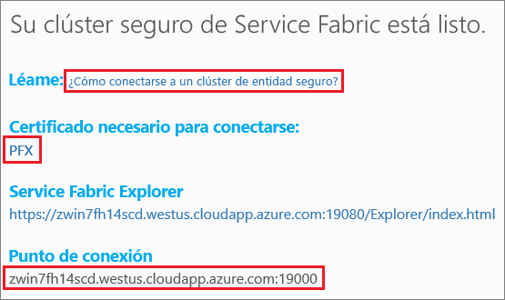
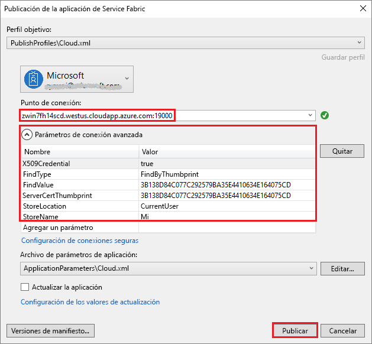

# <a name="tutorial-deploy-a-service-fabric-application-to-a-cluster-in-azure"></a>Tutorial: Implementación de una aplicación de Service Fabric en un clúster en Azure

Este tutorial es la segunda parte de una serie. En él se muestra cómo implementar una aplicación de Azure Service Fabric en un clúster nuevo en Azure.

En este tutorial, aprenderá a:
> [!div class="checklist"]
> * Crear un clúster de entidad.
> * Implementar una aplicación en un clúster remoto mediante Visual Studio

En esta serie de tutoriales, se aprende a:
> [!div class="checklist"]
> * [Crear una aplicación .NET de Service Fabric](service-fabric-tutorial-create-dotnet-app.md).
> * Implementar la aplicación en un clúster remoto.
> * [Agregar un punto de conexión HTTPS a un servicio de front-end de ASP.NET Core](service-fabric-tutorial-dotnet-app-enable-https-endpoint.md).
> * [Configuración de CI/CD con Azure Pipelines](service-fabric-tutorial-deploy-app-with-cicd-vsts.md).
> * [Configurar la supervisión y el diagnóstico de la aplicación](service-fabric-tutorial-monitoring-aspnet.md).

## <a name="prerequisites"></a>Requisitos previos

Antes de empezar este tutorial:

* Si no tiene una suscripción a Azure, cree una [cuenta gratuita](https://azure.microsoft.com/free/?WT.mc_id=A261C142F).
* [Instale Visual Studio 2017](https://www.visualstudio.com/) y las cargas de trabajo de **desarrollo de Azure** y de **desarrollo web y de ASP.NET**.
* [Instale el SDK de Service Fabric](service-fabric-get-started.md).

## <a name="download-the-voting-sample-application"></a>Descarga de la aplicación de ejemplo de votación

Si no compiló la aplicación de ejemplo de votación en la [primera parte de esta serie de tutoriales](service-fabric-tutorial-create-dotnet-app.md), puede descargarla. En una ventana Comandos, ejecute el código siguiente para clonar el repositorio de la aplicación de ejemplo en la máquina local.

```git
git clone https://github.com/Azure-Samples/service-fabric-dotnet-quickstart 
```

## <a name="publish-to-a-service-fabric-cluster"></a>Publicación en un clúster de Service Fabric

Ahora que la aplicación está lista, puede implementarla en un clúster directamente desde Visual Studio. Un [clúster de Service Fabric](https://docs.microsoft.com/azure/service-fabric/service-fabric-deploy-anywhere) es un conjunto de máquinas físicas o virtuales conectadas a la red, en las que se implementan y administran los microservicios.

En este tutorial, tiene dos opciones para implementar la aplicación de votación en un clúster de Service Fabric mediante Visual Studio:

* Publicar en un clúster de prueba (entidad). 
* Publicar en un clúster existente en su suscripción. Los clústeres de Service Fabric se pueden crear desde [Azure Portal](https://portal.azure.com) mediante los scripts de [PowerShell](./scripts/service-fabric-powershell-create-secure-cluster-cert.md) o de la [CLI de Azure](./scripts/cli-create-cluster.md), o desde una [plantilla de Azure Resource Manager](service-fabric-tutorial-create-vnet-and-windows-cluster.md).

> [!NOTE]
> Muchos servicios usan el proxy inverso para comunicarse entre ellos. Tanto los clústeres creados desde Visual Studio como los clústeres de entidad tienen el proxy inverso habilitado de forma predeterminada. Si va a usar un clúster existente, debe [habilitar el proxy inverso en el clúster](service-fabric-reverseproxy-setup.md).


### <a name="find-the-voting-web-service-endpoint-for-your-azure-subscription"></a>Búsqueda del punto de conexión del servicio web de votación para la suscripción de Azure

Para publicar la aplicación de votación en su propia suscripción de Azure, busque el punto de conexión del servicio web de front-end. Si utiliza un clúster de entidad, conéctese al puerto 8080 mediante el ejemplo de votación de apertura automática. No es preciso configurarlo en el equilibrador de carga del clúster de entidad.

El servicio web de front-end está escuchando en un puerto específico. Cuando la aplicación se implementa en un clúster de Azure, el clúster y la aplicación se ejecutan detrás de un equilibrador de carga de Azure. El puerto de la aplicación se debe abrir mediante una regla del equilibrador de carga de Azure para el clúster. El puerto abierto envía el tráfico entrante a través del servicio web. El puerto se encuentra en el archivo **VotingWeb/PackageRoot/ServiceManifest.xml** del elemento **Endpoint**. Un ejemplo es el puerto 8080.

```xml
<Endpoint Protocol="http" Name="ServiceEndpoint" Type="Input" Port="8080" />
```

Para la suscripción de Azure, abra este puerto mediante una regla de equilibrio de carga en Azure con un [script de PowerShell](./scripts/service-fabric-powershell-open-port-in-load-balancer.md) o mediante el equilibrador de carga para este clúster de [Azure Portal](https://portal.azure.com).

### <a name="join-a-party-cluster"></a>Unión a un clúster de entidad

> [!NOTE]
>  Para publicar la aplicación en su propio clúster en una suscripción de Azure, vaya a la sección [Publicación de la aplicación mediante Visual Studio](#publish-the-application-by-using-visual-studio). 

Los Party Cluster son clústeres de Service Fabric gratuitos, de duración limitada, hospedados en Azure y operados por el equipo de Service Fabric. Cualquiera puede implementar aplicaciones y aprender todo lo relacionado con la plataforma. El clúster usa un único certificado autofirmado para la seguridad tanto de nodo a nodo como de cliente a nodo.

Inicie sesión y [únase a un clúster de Windows](http://aka.ms/tryservicefabric). Para descargar el certificado PFX en el equipo, seleccione el vínculo **PFX**. Seleccione el vínculo **How to connect to a secure Party cluster?** (Cómo conectarse a un clúster de entidad seguro) y copie la contraseña del certificado. El certificado, la contraseña del certificado y el valor de **Punto de conexión** se usan en los pasos siguientes.



> [!Note]
> Hay un número limitado de clústeres de entidad por hora. Si se produce un error al intentar suscribirse a un clúster de entidad, espere y vuelva a intentarlo. O bien siga estos pasos en el tutorial [implementación de una aplicación .NET](https://docs.microsoft.com/azure/service-fabric/service-fabric-tutorial-deploy-app-to-party-cluster#deploy-the-sample-application) para crear un clúster de Service Fabric en su suscripción de Azure e implementar la aplicación en él. Si aún no tiene una suscripción a Azure, puede crear una [cuenta gratuita](https://azure.microsoft.com/free/?WT.mc_id=A261C142F).
>

En el equipo Windows, instale el archivo PFX en el almacén de certificados **CurrentUser\My**.

```powershell
PS C:\mycertificates> Import-PfxCertificate -FilePath .\party-cluster-873689604-client-cert.pfx -CertStoreLocation Cert:\CurrentUser\My -Password (ConvertTo-SecureString 873689604 -AsPlainText -Force)


   PSParentPath: Microsoft.PowerShell.Security\Certificate::CurrentUser\My

Thumbprint                                Subject
----------                                -------
3B138D84C077C292579BA35E4410634E164075CD  CN=zwin7fh14scd.westus.cloudapp.azure.com
```

Recuerde la huella digital para el paso siguiente.

> [!Note]
> De manera predeterminada, el servicio front-end web está configurado para escuchar en el puerto 8080 el tráfico entrante. El puerto 8080 está abierto en el clúster de entidad. Si necesita cambiar el puerto de la aplicación, cámbielo a uno de los puertos abiertos en el clúster de entidad.
>

### <a name="publish-the-application-by-using-visual-studio"></a>Publicación de la aplicación mediante Visual Studio

Ahora que la aplicación está lista, puede implementarla en un clúster directamente desde Visual Studio.

1. Haga clic con el botón derecho en **Voting** (Votación) en el Explorador de soluciones. Elija **Publicar**. Aparece el cuadro de diálogo **Publicar**.

2. Copie el valor de **Punto de conexión** de la página del clúster de entidad o de la suscripción de Azure en el campo **Punto de conexión**. Un ejemplo es `zwin7fh14scd.westus.cloudapp.azure.com:19000`. Seleccione **Parámetros de conexión avanzada**.  Asegúrese de que los valores **FindValue** y **ServerCertThumbprint** coinciden con la huella digital del certificado instalado en un paso anterior de un clúster de entidad o el certificado que coincide con la suscripción de Azure.

    

    Todas las aplicaciones del clúster deben tener un nombre único. Los clústeres de entidad son un entorno público compartido, por lo que pueden entrar en conflicto con una aplicación existente. Si se produce un conflicto de nombres, cambie el nombre del proyecto de Visual Studio y vuelva a implementarlo.

3. Seleccione **Publicar**.

4. Para acceder a la aplicación de votación en el clúster, abra un explorador y escriba la dirección del clúster, seguida de **: 8080**. O especifique otro puerto si hay uno configurado. Un ejemplo es `http://zwin7fh14scd.westus.cloudapp.azure.com:8080`. Se ve la aplicación en ejecución en el clúster de Azure. En la página web de votación, pruebe a agregar y eliminar opciones de votación y a votar por una o varias de estas opciones.

    


## <a name="next-steps"></a>Pasos siguientes

Avance hasta el siguiente tutorial:
> [!div class="nextstepaction"]
> [Habilitamiento de HTTPS](service-fabric-tutorial-dotnet-app-enable-https-endpoint.md)
