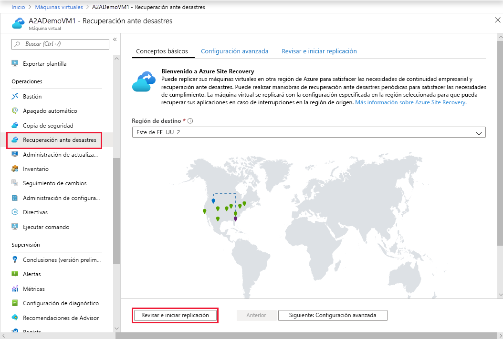
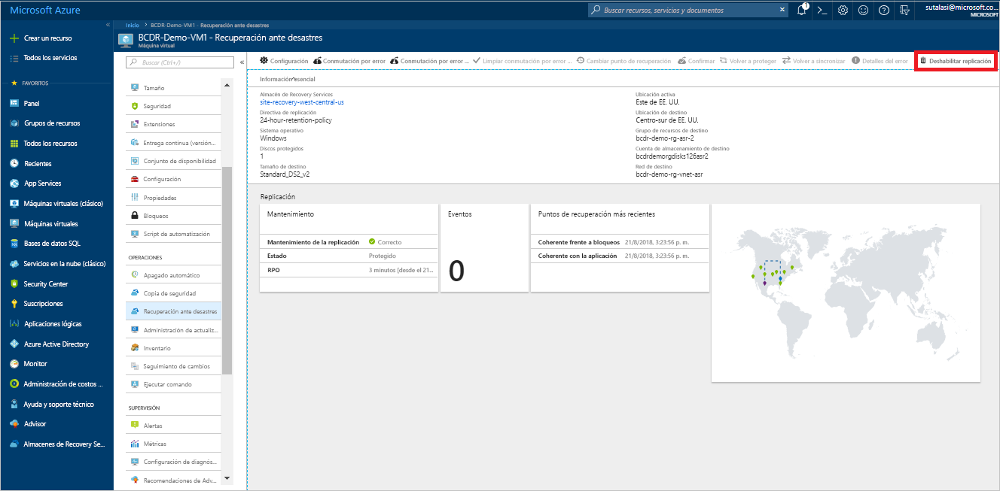

# Configuración de la recuperación ante desastres en una región secundaria de Azure de una máquina virtual de Azure        

El servicio [Azure Site Recovery](site-recovery-overview.md) contribuye a la estrategia de recuperación ante desastres y continuidad empresarial (BCDR) al mantener sus aplicaciones empresariales al día y disponibles durante interrupciones planeadas y no planeadas. Azure Site Recovery administra y coordina la recuperación ante desastres de máquinas locales y máquinas virtuales de Azure, lo que incluye la replicación, la conmutación por error y la recuperación.

En este inicio rápido se describe cómo configurar la recuperación ante desastres en una máquina virtual de Azure replicándola a otra región de Azure.

Si no tiene una suscripción a Azure, cree una [cuenta gratuita](https://azure.microsoft.com/free/?WT.mc_id=A261C142F) antes de empezar.

> [!NOTE]
> Este artículo es un tutorial rápido para nuevos usuarios. Usa la ruta más sencilla, con las opciones predeterminadas y la mínima personalización.  Para ver un tutorial más completo, consulte [el nuestro](azure-to-azure-tutorial-enable-replication.md).

## Inicio de sesión en Azure

Inicie sesión en Azure Portal en https://portal.azure.com.

## Habilitación de la replicación para la máquina virtual de Azure

1. En el menú de Azure Portal, seleccione **Máquinas virtuales** o busque y seleccione *Máquinas virtuales* en cualquier página. Seleccione la máquina virtual que quiere replicar.
2. En **Operaciones**, seleccione **Recuperación ante desastres**.
3. En **Configurar recuperación ante desastres** > **Región de destino**, seleccione la región de destino en la que quiere realizar la replicación.
4. En esta guía de inicio rápido, acepte los restantes valores predeterminados.
5. Seleccione **Revisar e iniciar replicación**. Después, seleccione **Iniciar replicación** para iniciar un trabajo y habilitar la replicación de la máquina virtual.

    

## Comprobación de la configuración

Cuando haya finalizado el trabajo de replicación, puede comprobar el estado de replicación, modificar la configuración de replicación y probar la implementación.

1. En el menú de Azure Portal, seleccione **Máquinas virtuales** o busque y seleccione *Máquinas virtuales* en cualquier página. Seleccione la máquina virtual que quiera comprobar.
2. En **Operaciones**, seleccione **Recuperación ante desastres**.

   Puede comprobar el estado de replicación, los puntos de recuperación que se han creado y las regiones de origen y destino en el mapa.

   

## Limpieza de recursos

La máquina virtual de la región primaria deja de replicar al deshabilitar la replicación:

- La configuración de replicación de origen se limpia automáticamente. La extensión de Site Recovery que se instala en la máquina virtual como parte de la replicación no se ha eliminado y tiene que quitarse manualmente. 
- La facturación de Site Recovery para la máquina virtual se detiene.

Detenga la replicación como se indica a continuación

1. En el menú de Azure Portal, seleccione **Máquinas virtuales** o busque y seleccione *Máquinas virtuales* en cualquier página. Seleccione la máquina virtual que quiera modificar.
2. En **Recuperación ante desastres**, haga clic en **Deshabilitar replicación**.

   

## Pasos siguientes

En esta guía de inicio rápido, se replica una única máquina virtual en una región secundaria. Ahora, pruebe a replicar varias máquinas virtuales de Azure con un plan de recuperación.

> [!div class="nextstepaction"]
> [Configuración de la recuperación ante desastres para las máquinas virtuales de Azure](azure-to-azure-tutorial-enable-replication.md)
