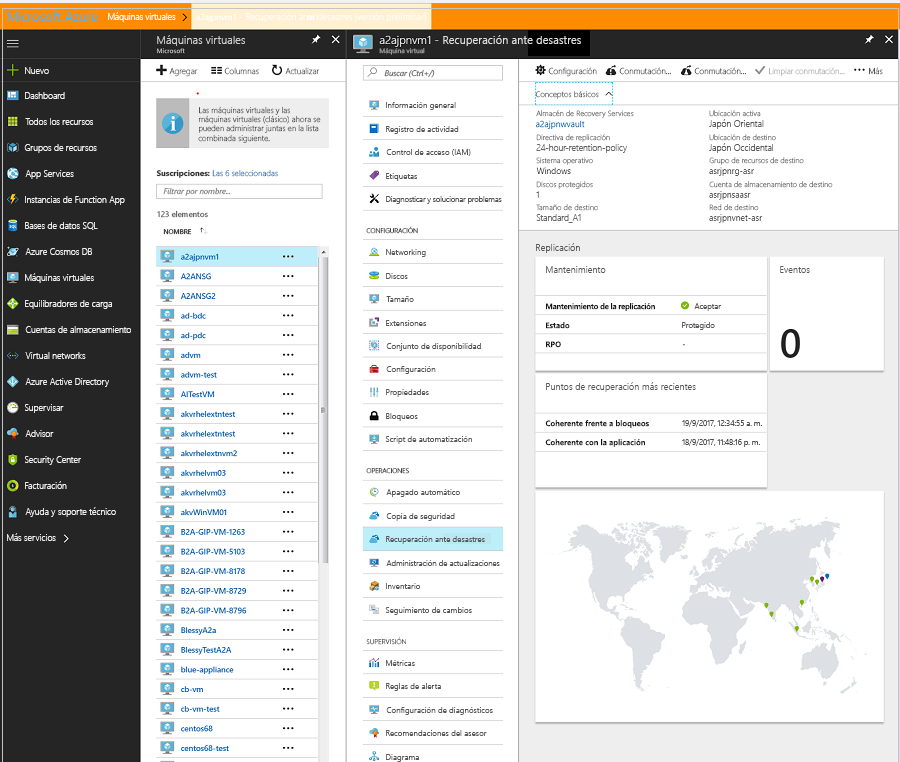

# Traslado de máquinas virtuales de Azure a zonas de disponibilidad
En Azure, Availability Zones ayuda a proteger las aplicaciones y los datos de errores del centro de datos. Cada zona de disponibilidad consta de uno o varios centros de datos equipados con alimentación, refrigeración y redes independientes. Para garantizar la resistencia, hay tres zonas independientes como mínimo en todas las regiones habilitadas. La separación física de Availability Zones dentro de una región ayuda a proteger las aplicaciones y los datos frente a los errores del centro de datos. Con la incorporación de Availability Zones, Azure ofrece un acuerdo de nivel de servicio (SLA) que garantiza un tiempo de actividad de las máquinas virtuales (VM) del 99,99 %. Availability Zones se admite en regiones exclusivas, tal como se indica en [¿Qué es Availability Zones en Azure?](https://docs.microsoft.com/azure/availability-zones/az-overview#services-support-by-region)

En un escenario en el que se implementan las máquinas virtuales como de *instancia única* en una región específica y desea mejorar la disponibilidad trasladándolas a una instancia de Availability Zones, puede hacerlo con Azure Site Recovery. Esta acción se puede categorizar aún más al hacer lo siguiente:

- Trasladar máquinas virtuales de instancia única a Availability Zones en una región de destino
- Trasladar máquinas virtuales de un conjunto de disponibilidad a Availability Zones en una región de destino

> [!IMPORTANT]
> Actualmente Azure Site Recovery permite trasladar máquinas virtuales de una región a otra, pero no admite el traslado dentro de una misma región.

## Comprobación de los requisitos previos

- Compruebe si la región de destino es [compatible con Availability Zones](https://docs.microsoft.com/azure/availability-zones/az-overview#services-support-by-region). Compruebe que su opción de [combinación de región de origen y región de destino se admite](https://docs.microsoft.com/azure/site-recovery/azure-to-azure-support-matrix#region-support). Tome una decisión informada sobre la región de destino.
- Asegúrese de entender la [arquitectura y los componentes del escenario](azure-to-azure-architecture.md).
- Revise las [limitaciones y los requisitos de compatibilidad](azure-to-azure-support-matrix.md).
- Compruebe los permisos de la cuenta Si acaba de crear su cuenta de Azure gratis, ya es el administrador de la suscripción. Si no es administrador de la suscripción, solicite al administrador que le asigne los permisos que necesita. Para habilitar la replicación para una máquina virtual y finalmente copiar los datos al destino mediante Azure Site Recovery, debe tener:

    1. Permisos para crear una máquina virtual en recursos de Azure. El rol integrado *Colaborador de la máquina virtual* tiene estos permisos, que incluyen:
        - Permiso para crear una máquina virtual en el grupo de recursos seleccionado.
        - Permiso para crear una máquina virtual en la red virtual seleccionada
        - Permiso para escribir en la cuenta de almacenamiento seleccionada

    2. Permisos para administrar las tareas de Azure Site Recovery. El rol *Colaborador de Site Recovery* tiene todos los permisos necesarios para administrar las acciones de Site Recovery en un almacén de Recovery Services.

## Preparación de las máquinas virtuales de origen

1. Las máquinas virtuales deben usar discos administrados si desea trasladarlas a una instancia de Availability Zones mediante Site Recovery. Puede convertir VM Windows existentes que usan discos no administrados para que usen discos administrados. Siga los pasos en [Conversión de una máquina virtual Windows con discos no administrados en discos administrados](https://docs.microsoft.com/azure/virtual-machines/windows/convert-unmanaged-to-managed-disks). Asegúrese de que el conjunto de disponibilidad esté configurado como *administrado*.
2. Asegúrese de que todos los certificados raíz más recientes estén presentes en las máquinas virtuales de Azure que quiera trasladar. Si los últimos certificados raíz no están presentes, la copia de datos en la región de destino no se puede habilitar debido a las restricciones de seguridad.

3. Para las máquinas virtuales de Windows, instale las actualizaciones de Windows más recientes en la máquina virtual, de modo que todos los certificados raíz de confianza estén en ella. En un entorno desconectado, siga los procesos estándar de actualización de certificados y de Windows Update de su organización.

4. En las máquinas virtuales Linux, para obtener los últimos certificados raíz de confianza y la lista de revocación de certificados en la máquina virtual, siga las instrucciones proporcionadas por su distribuidor de Linux.
5. Asegúrese de que no utiliza ningún proxy de autenticación para controlar la conectividad de red de las máquinas virtuales que quiere trasladar.

6. Si la máquina virtual que está intentando trasladar no tiene acceso a Internet y utiliza un proxy de firewall para controlar el acceso de salida, compruebe los requisitos en [Configuración de la conectividad de red saliente](azure-to-azure-tutorial-enable-replication.md#set-up-outbound-network-connectivity-for-vms).

7. Identifique el diseño de la red de origen y los recursos que utiliza actualmente para la verificación, incluidos equilibradores de carga, grupos de seguridad de red y dirección IP pública.

## Preparación de la región de destino

1. Compruebe que su suscripción de Azure permite crear máquinas virtuales en la región de destino que se usa para la recuperación ante desastres. Si es preciso, póngase en contacto con el soporte técnico para habilitar la cuota necesaria.

2. Asegúrese de que su suscripción tiene suficientes recursos para admitir máquinas virtuales con tamaños que se correspondan con las máquinas virtuales de origen. Si usa Site Recovery para copiar datos en el destino, elige el mismo tamaño para la máquina virtual de destino o el más cercano posible.

3. Cree un recurso de destino para cada componente identificado en el diseño de la red de origen. Esta acción garantiza que, tras la migración a la región de destino, las máquinas virtuales tengan toda la funcionalidad y características que tenían en el origen.

    > [!NOTE]
    > Azure Site Recovery detecta y crea automáticamente una red virtual y una cuenta de almacenamiento al habilitar la replicación para la máquina virtual de origen. También puede crear previamente estos recursos y asignar a la máquina virtual como parte del paso para habilitar la replicación. Pero para cualquier otro recurso, como se menciona posteriormente, es necesario crearlo manualmente en la región de destino.

     En los siguientes documentos se explica cómo crear los recursos de red más utilizados y que considere más relevantes, en función de la configuración de la máquina virtual de origen.

    - [Grupos de seguridad de red](https://docs.microsoft.com/azure/virtual-network/manage-network-security-group)
    - [Equilibradores de carga](https://docs.microsoft.com/azure/load-balancer)
    - [Dirección IP pública](../virtual-network/virtual-network-public-ip-address.md)
    
   Para cualquier otro componente de red, consulte la [documentación](https://docs.microsoft.com/azure/?pivot=products&panel=network) de red.

    > [!IMPORTANT]
    > Asegúrese de usar un equilibrador de carga con redundancia de zona en el destino. Puede leer más en [Standard Load Balancer y Availability Zones](https://docs.microsoft.com/azure/load-balancer/load-balancer-standard-availability-zones).

4. Si desea probar la configuración antes de realizar la migración a la región de destino, [cree manualmente una red sin producción](https://docs.microsoft.com/azure/virtual-network/quick-create-portal) en la región de destino. Se recomienda este enfoque porque provoca interferencias mínimas con el entorno de producción.

## Habilitar replicación
Los siguientes pasos le guiarán al usar Azure Site Recovery para permitir la replicación de datos en la región de destino, antes de que finalmente los traslade a Availability Zones.

> [!NOTE]
> Estos pasos son para una sola máquina virtual. Puede ampliarlos para varias máquinas virtuales. Vaya al almacén de Recovery Services, seleccione **+ Replicar** y elija las máquinas virtuales pertinentes de forma conjunta.

1. En Azure Portal, seleccione **Máquinas virtuales** y elija la máquina virtual que desea trasladar a Availability Zones.
2. En **Operaciones**, seleccione **Recuperación ante desastres**.
3. En **Configurar la recuperación ante desastres** > **Región de destino**, seleccione la región de destino en la que quiere realizar la replicación. Asegúrese de que esta región [admita](https://docs.microsoft.com/azure/availability-zones/az-overview#services-support-by-region) Availability Zones.

    

4. Seleccione **Siguiente: Configuración avanzada**.
5. Elija los valores adecuados para la suscripción de destino, el grupo de recursos de la máquina virtual de destino y la red virtual.
6. En la sección **Disponibilidad**, elija la instancia de Availability Zones a la que desea trasladar la máquina virtual. 
   > [!NOTE]
   > Si no ve la opción para el conjunto de disponibilidad o la instancia de Availability Zones, compruebe que se cumplen los [requisitos previos](#prepare-the-source-vms) y que se ha completado la [preparación](#prepare-the-source-vms) de las máquinas virtuales de origen.
  
    

7. Seleccione **Habilitar replicación**. Esta acción inicia un trabajo para habilitar la replicación de la máquina virtual.

## Comprobación de la configuración

Cuando haya finalizado el trabajo de replicación, puede comprobar el estado de replicación, modificar la configuración de replicación y probar la implementación.

1. En el menú de la máquina virtual, seleccione **Recuperación ante desastres**.
2. Puede comprobar el estado de replicación, los puntos de recuperación que se han creado y las regiones de origen y destino en el mapa.

   

## Pruebe la configuración.

1. En el menú de la máquina virtual, seleccione **Recuperación ante desastres**.
2. Seleccione el icono **Conmutación por error de prueba**.
3. En **Conmutación por error**, seleccione el punto de recuperación que usará para la conmutación por error:

   - **Procesado más recientemente**: error de la VM en el último punto de recuperación procesado por el servicio Site Recovery. Se muestra la marca de tiempo. Con esta opción, no se emplea tiempo en el procesamiento de datos, por lo que se proporciona un objetivo de tiempo de recuperación (RTO) bajo.
   - **Más reciente coherente con la aplicación**: esta opción conmuta por error todas las VM en el punto de recuperación más reciente coherente con la aplicación. Se muestra la marca de tiempo.
   - **Personalizado**: seleccione un punto de recuperación.

3. Seleccione la red virtual de Azure de destino de prueba a la que desea mover las máquinas virtuales de Azure para probar la configuración. 

    > [!IMPORTANT]
    > Le recomendamos que utilice una red de máquinas virtuales de Azure independiente para la conmutación por error de prueba y no la red de producción de la región de destino a la que desea trasladar las máquinas virtuales.

4. Para comenzar el traslado de prueba, seleccione **Aceptar**. Para realizar el seguimiento del progreso, seleccione la máquina virtual para abrir sus propiedades. También puede seleccionar el trabajo **Conmutación por error de prueba** en el nombre del almacén > **Configuración** > **Trabajos** > **Trabajos de Site Recovery**.
5. Una vez finalizada la conmutación por error, la VM de Azure de réplica aparece en Azure Portal > **Virtual Machines**. Asegúrese de que la máquina virtual está en funcionamiento, tiene el tamaño adecuado y está conectada a la red apropiada.
6. Si desea eliminar la máquina virtual creada como parte de la prueba del traslado, seleccione **Limpiar conmutación por error de prueba** en el elemento replicado. En **Notas**, registre y guarde las observaciones asociadas a la prueba.

## Realización del traslado a la región de destino y confirmar

1.  En el menú de la máquina virtual, seleccione **Recuperación ante desastres**.
2. Seleccione el icono **Conmutación por error**.
3. En **Conmutación por error**, seleccione **Más reciente**. 
4. Seleccione **Apague la máquina antes de comenzar con la conmutación por error**. A continuación, Site Recovery intentará apagar la máquina virtual de origen antes de desencadenar la conmutación por error. La conmutación por error continúa aunque se produzca un error de cierre. Puede seguir el progreso de la conmutación por error en la página **Trabajos**. 
5. Una vez finalizado el trabajo, compruebe que la máquina virtual aparece en la región de Azure de destino como se esperaba.
6. En **Elementos replicados**, haga clic con el botón derecho en la máquina virtual > **Confirmar**. Esto finaliza el proceso de traslado a la región de destino. Espere hasta que el trabajo de confirmación finalice.

## Descarte de los recursos en la región de origen

Vaya a la máquina virtual. Seleccione **Deshabilitar replicación**. Esta acción detiene el proceso de copiar los datos para la máquina virtual.  

> [!IMPORTANT]
> Realice el paso anterior para evitar cargos por la replicación de Site Recovery tras el traslado. La configuración de replicación de origen se limpia automáticamente. Tenga en cuenta que la extensión de Site Recovery que se instala como parte de la replicación no se ha eliminado y tiene que quitarse manualmente.

## Pasos siguientes

En este tutorial ha aumentado la disponibilidad de una máquina virtual de Azure al trasladarla a un conjunto de disponibilidad o instancia de Availability Zones. Ya puede establecer la opción de recuperación ante desastres para la máquina virtual que ha trasladado.

> [!div class="nextstepaction"]
> [Configurar la recuperación ante desastres después de la migración](azure-to-azure-quickstart.md)

