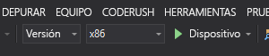

# Inicio rápido: Creación de una aplicación HoloLens con Azure Spatial Anchors en C++/WinRT y DirectX

En este inicio rápido, se describe cómo crear una aplicación HoloLens con [Azure Spatial Anchors](../overview.md) en C++/WinRT y DirectX. Azure Spatial Anchors es un servicio multiplataforma para desarrolladores que le permite crear experiencias de realidad mixta mediante objetos cuya ubicación persiste en todos los dispositivos a lo largo del tiempo. Cuando haya terminado, tendrá una aplicación HoloLens que puede guardar y recuperar un delimitador espacial.

Aprenderá a:

> [!div class="checklist"]
> * Crear una cuenta de Spatial Anchors
> * Configurar la clave y el identificador de la cuenta de Spatial Anchors
> * Realizar implementaciones y ejecuciones en un dispositivo HoloLens

[!INCLUDE [quickstarts-free-trial-note](../../../includes/quickstarts-free-trial-note.md)]

## Requisitos previos

Para completar esta guía de inicio rápido, asegúrese de que dispone de lo siguiente:
- Una máquina Windows con <a href="https://www.visualstudio.com/downloads/" target="_blank">Visual Studio 2019</a> instalado, con la carga de trabajo **Desarrollo de la plataforma universal de Windows** y el componente **Windows 10 SDK (10.0.18362.0 o versiones posteriores)** y <a href="https://git-scm.com/download/win" target="_blank">Git para Windows</a>.
- La [extensión de Visual Studio para C++/WinRT (VSIX)](https://aka.ms/cppwinrt/vsix) para Visual Studio instalada desde [Visual Studio Marketplace](https://marketplace.visualstudio.com/).
- Un dispositivo HoloLens con el [modo de desarrollador](https://docs.microsoft.com/windows/mixed-reality/using-visual-studio) habilitado. Este artículo requiere un dispositivo HoloLens con la [actualización de octubre de 2018 de Windows 10](https://docs.microsoft.com/windows/mixed-reality/release-notes-october-2018 ) (también conocida como RS5). Para actualizar a la versión más reciente en HoloLens, abra la aplicación **Settings** (Configuración), vaya a **Update & Security** (Actualización y seguridad) y, a continuación, seleccione el botón **Check for updates** (Buscar actualizaciones).
- La aplicación debe establecer la funcionalidad **spatialPerception** en su manifiesto AppX.

[!INCLUDE [Create Spatial Anchors resource](../../../includes/spatial-anchors-get-started-create-resource.md)]

## Apertura del proyecto de ejemplo

[!INCLUDE [Clone Sample Repo](../../../includes/spatial-anchors-clone-sample-repository.md)]

Abra `HoloLens\DirectX\SampleHoloLens.sln` en Visual Studio.

## Configuración del identificador y la clave de la cuenta

El paso siguiente es configurar la aplicación para usar el identificador de cuenta y la clave de cuenta. Los copió en un editor cuando [configuró el recurso de Spatial Anchors](#create-a-spatial-anchors-resource).

Abra `HoloLens\DirectX\SampleHoloLens\ViewController.cpp`.

Busque el campo `SpatialAnchorsAccountKey` y reemplace `Set me` por la clave de la cuenta.

Busque el campo `SpatialAnchorsAccountId` y reemplace `Set me` por el identificador de la cuenta.

## Implementación de la aplicación en el dispositivo HoloLens

Cambiar **Configuración de la solución** a **Versión**, cambie **Plataforma de la solución** a **x86** y seleccione **Dispositivo**  en las opciones de destino de implementación.

Si usa HoloLens 2, utilice **ARM64** como **Plataforma de soluciones**, en lugar de **x86**.

Encienda el dispositivo HoloLens, inicie sesión y conéctelo al equipo mediante un cable USB.

Seleccione **Depurar** > **Iniciar depuración** para implementar la aplicación y comenzar la depuración.

Siga las instrucciones de la aplicación para colocar y recuperar un delimitador.

En Visual Studio, seleccione **Detener depuración** o presione **Mayús + F5** para detener la depuración.

[!INCLUDE [Clean-up section](../../../includes/clean-up-section-portal.md)]

[!INCLUDE [Next steps](../../../includes/spatial-anchors-quickstarts-nextsteps.md)]

> [!div class="nextstepaction"]
> [Tutorial: Uso compartido de Spatial Anchors entre dispositivos](../tutorials/tutorial-share-anchors-across-devices.md)
