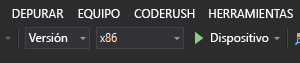

# Inicio rápido: Creación de una aplicación HoloLens en Unity que use Azure Spatial Anchors

En este inicio rápido se creará una aplicación HoloLens en Unity con [Azure Spatial Anchors](../overview.md). Spatial Anchors es un servicio multiplataforma para desarrolladores que permite crear experiencias de realidad mixta con objetos cuya ubicación persiste en todos los dispositivos a lo largo del tiempo. Cuando haya terminado, tendrá una aplicación HoloLens compilada con Unity que puede guardar y recuperar un delimitador espacial.

Aprenderá a:

- Crear una cuenta de Spatial Anchors.
- Preparar la configuración de compilación de Unity.
- Configurar la clave y el identificador de la cuenta de Spatial Anchors.
- Exportar el proyecto HoloLens de Visual Studio.
- Implementar la aplicación y ejecutarla en un dispositivo HoloLens.

[!INCLUDE [quickstarts-free-trial-note](../../../includes/quickstarts-free-trial-note.md)]

## Prerrequisitos

Para completar esta guía de inicio rápido:

- Necesita un equipo Windows en el que estén instalados <a href="https://unity3d.com/get-unity/download" target="_blank">Unity 2019.1 o 2019.2</a> o una versión posterior y <a href="https://www.visualstudio.com/downloads/" target="_blank">Visual Studio 2019</a> o una versión posterior. La instalación de Visual Studio debe incluir la carga de trabajo de **desarrollo de la Plataforma universal de Windows** y el componente **SDK de Windows 10 (10.0.18362.0 o posterior)** . También se debe instalar <a href="https://git-scm.com/download/win" target="_blank">Git para Windows</a> y <a href="https://git-lfs.github.com/">Git LFS</a>.
- Se necesita un dispositivo HoloLens en el que esté habilitado el [modo de desarrollador](https://docs.microsoft.com/windows/mixed-reality/using-visual-studio). La [actualización de Windows 10 de octubre de 2018](https://docs.microsoft.com/windows/mixed-reality/release-notes-october-2018) (también conocida como RS5) debe estar instalada en el dispositivo. Para actualizar a la versión más reciente en HoloLens, abra la aplicación **Settings** (Configuración), vaya a **Update & Security** (Actualización y seguridad) y seleccione **Check for updates** (Buscar actualizaciones).
- En la aplicación, debe habilitar la funcionalidad **SpatialPerception**. Este valor está en **Build Settings** > **Player Settings** > **Publishing Settings** > **Capabilities** (Configuración de compilación > Configuración del reproductor > Configuración de publicación > Funcionalidades).
- En la aplicación, es preciso habilitar **Virtual Reality Supported** (Admite realidad virtual) con el **SDK de Windows Mixed Reality**. Este valor está en **Build Settings** > **Player Settings** > **XR Settings** (Configuración de compilación > Configuración del reproductor > Configuración de XR).

[!INCLUDE [Create Spatial Anchors resource](../../../includes/spatial-anchors-get-started-create-resource.md)]

## Descarga y apertura del proyecto de Unity de ejemplo

[!INCLUDE [Clone Sample Repo](../../../includes/spatial-anchors-clone-sample-repository.md)]

[!INCLUDE [Open Unity Project](../../../includes/spatial-anchors-open-unity-project.md)]

Seleccione **File** > **Build Settings** (Archivo > Configuración de compilación) para abrir **Build Settings** (Configuración de compilación).

En la sección **Platform** (Plataforma), seleccione **Universal Windows Platform** (Plataforma universal de Windows). Cambie el valor de **Target Device** (Dispositivo de destino) a **HoloLens**.

Seleccione **Switch Platform** (Cambiar plataforma) para cambiar la plataforma a **Universal Windows Platform** (Plataforma universal de Windows). Unity puede solicitarle que instale los componentes de compatibilidad con Plataforma universal de Windows si no están presentes.

Cierre la ventana **Build Settings** (Configuración de compilación).

## Configuración del identificador y la clave de la cuenta

En el panel **Project** (Proyecto), vaya a `Assets/AzureSpatialAnchors.Examples/Scenes` y abra el archivo de escena `AzureSpatialAnchorsBasicDemo.unity`.

[!INCLUDE [Configure Unity Scene](../../../includes/spatial-anchors-unity-configure-scene.md)]

Para guardar la escena, seleccione **File** > **Save** (Archivo > Guardar).

## Exportar el proyecto de HoloLens de Visual Studio

[!INCLUDE [Export Unity Project](../../../includes/spatial-anchors-unity-export-project-snip.md)]

Seleccione **Build** (Compilar). En el cuadro de diálogo, seleccione la carpeta en la que se va a exportar el proyecto HoloLens de Visual Studio.

Cuando se complete la exportación, aparecerá una carpeta que contiene el proyecto HoloLens exportado.

## Implementación de la aplicación HoloLens

En la carpeta, haga doble clic en **HelloAR U3D.sln** para abrir el proyecto en Visual Studio.

Cambie el valor de **Configuración de solución** a **Versión**, cambie el de **Plataforma de solución** a **x86** y seleccione **Dispositivo** en las opciones de destino de implementación.

Si usa HoloLens 2, utilice **ARM64** como **Plataforma de soluciones**, en lugar de **x86**.

   

Encienda el dispositivo HoloLens, inicie sesión y conéctelo al equipo mediante un cable USB.

Seleccione **Depurar** > **Iniciar depuración** para implementar la aplicación y comenzar la depuración.

Siga las instrucciones de la aplicación para colocar y recuperar un delimitador.

En Visual Studio, seleccione **Detener depuración** o presione Mayús + F5 para detener la depuración.

## Solución de problemas

### Unity 2019.3

Debido a cambios importantes, Unity 2019.3 no se admite actualmente. Use Unity 2019.1 o 2019.2.

[!INCLUDE [Clean-up section](../../../includes/clean-up-section-portal.md)]

[!INCLUDE [Next steps](../../../includes/spatial-anchors-quickstarts-nextsteps.md)]

> [!div class="nextstepaction"]
> [Tutorial: Uso compartido de Spatial Anchors entre dispositivos](../tutorials/tutorial-share-anchors-across-devices.md)
