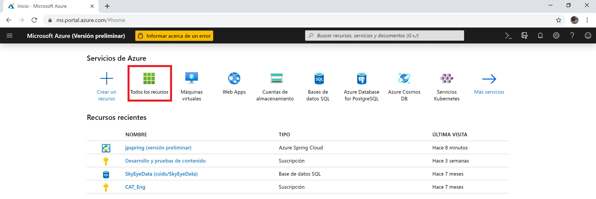
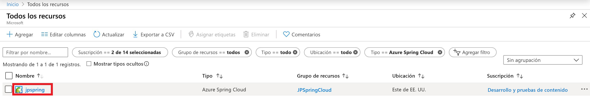
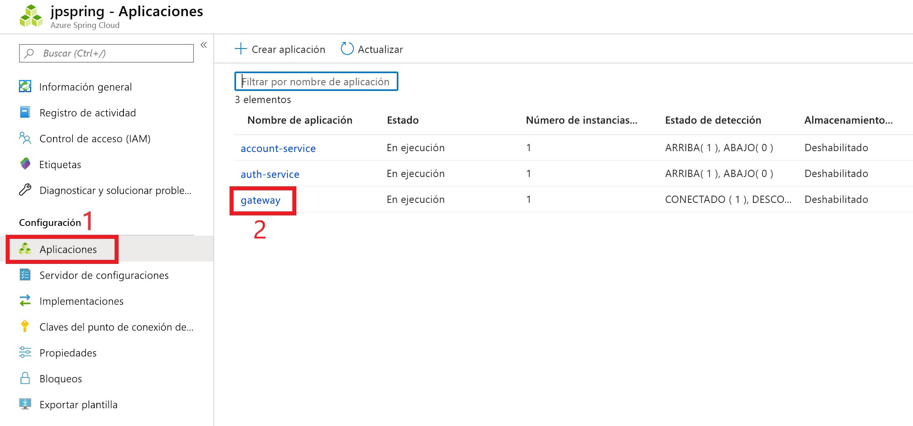
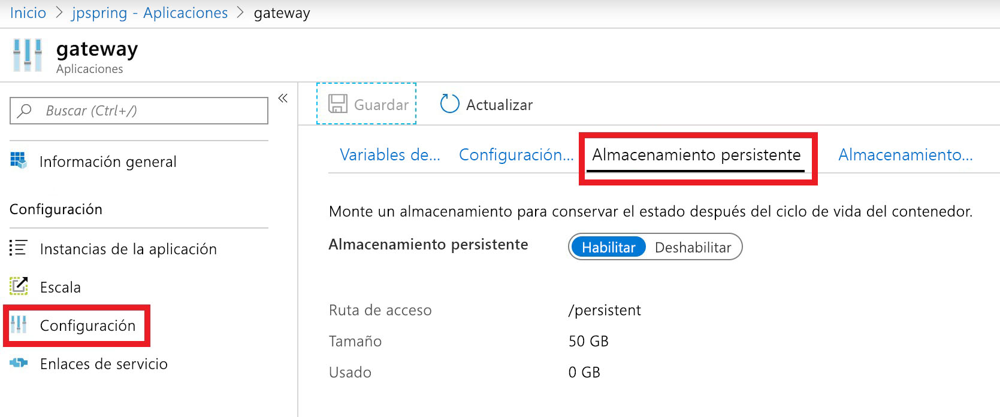

# <a name="how-to-use-persistent-storage-in-azure-spring-cloud"></a>Uso del almacenamiento persistente en Azure Spring Cloud

Azure Spring Cloud proporciona dos tipos de almacenamiento para las aplicaciones: persistente y temporal.  De forma predeterminada, Azure Spring Cloud habilita el almacenamiento temporal para cada instancia de aplicación. El almacenamiento temporal tiene una limitación de 5 GB y su ruta de montaje predeterminada es `/tmp`.

> [!WARNING]
> Al reiniciar una instancia de aplicación, se eliminará de forma permanente el almacenamiento temporal que tiene asociado.

El almacenamiento persistente es un contenedor de recursos compartidos administrado por Azure que se asigna por aplicación. Los datos almacenados en el almacenamiento persistente se comparten entre todas las instancias de la aplicación. Las instancias de servicio de Azure Spring Cloud pueden tener un máximo de diez aplicaciones con disco persistente habilitado. Cada aplicación recibe 50 GB de almacenamiento persistente. La ruta de montaje predeterminada para el almacenamiento persistente es `/persistent`.

> [!WARNING]
> Al *deshabilitar* el almacenamiento persistente, se desasignará el almacenamiento de la aplicación.  Se perderán todos los datos de esa cuenta de almacenamiento. 

## <a name="enable-persistent-storage-using-the-azure-portal"></a>Habilitación del almacenamiento persistente mediante Azure Portal

1. En la pantalla de inicio de Azure Portal, seleccione **Todos los recursos**.

     >

1. Busque y seleccione el recurso de Azure Spring Cloud que necesita almacenamiento persistente.  En este ejemplo, la aplicación se denomina *jpspring*.

    > 

1. En el encabezado **Configuración**, seleccione **Aplicaciones**.

1. Los servicios de Spring Cloud aparecerán en la tabla.  Seleccione el servicio al que desea agregar el almacenamiento persistente.  En este ejemplo, se seleccionará nuestro servicio **gateway**.

    > 

1. En la hoja de configuración del servicio, seleccione **Configuración**.

1. Seleccione la pestaña **Almacenamiento persistente** y habilite el almacenamiento persistente.

    > 

Cuando se habilita el almacenamiento persistente, su tamaño y ruta de acceso se muestran en esta página.

## <a name="use-the-azure-cli-to-modify-persistent-storage"></a>Uso de la CLI de Azure para modificar el almacenamiento persistente

Si es necesario, instale la extensión de Spring Cloud para la CLI de Azure:

```azurecli
az extension add --name spring-cloud
```

Cree una aplicación con un disco persistente habilitado:
 
```azurecli
az spring-cloud app create -n <app> -g <resource-group> -s <service-name> --enable-persistent-storage true
```

Habilite el almacenamiento persistente en una aplicación existente:

```azurecli
az spring-cloud app update -n <app> -g <resource-group> -s <service-name> --enable-persistent-storage true
``` 

Deshabilite el almacenamiento persistente en una aplicación existente:

> [!WARNING]
> Al deshabilitar el almacenamiento persistente, se desasignará el almacenamiento de la aplicación, con lo que se perderán permanentemente todos los datos almacenados en él. 

```azurecli
az spring-cloud app update -n <app> -g <resource-group> -s <service-name> --enable-persistent-storage false
```

## <a name="next-steps"></a>Pasos siguientes

Obtenga información sobre la [aplicación y las cuotas de servicio](spring-cloud-quotas.md), o bien aprenda a [escalar manualmente su aplicación](spring-cloud-tutorial-scale-manual.md).