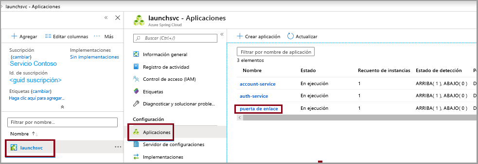
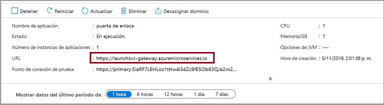

# <a name="quickstart-launch-a-java-spring-application-using-the-azure-cli"></a>Inicio rápido: Inicio de una aplicación Java Spring mediante la CLI de Azure

Azure Spring Cloud permite ejecutar fácilmente en Azure una aplicación de microservicios basada en Spring Boot.

En este inicio rápido se muestra cómo implementar una aplicación de Java Spring Cloud existente en Azure. Cuando haya terminado, puede seguir administrando la aplicación mediante la CLI de Azure o cambiar a usar Azure Portal.

En este inicio rápido aprenderá a:

> [!div class="checklist"]
> * Aprovisionar una instancia de servicio
> * Establecer un servidor de configuración para una instancia
> * Compilar una aplicación de microservicios localmente
> * Implementar cada microservicio
> * Asignar un punto de conexión público para la aplicación

## <a name="prerequisites"></a>Prerrequisitos

>[!Note]
> Azure Spring Cloud se ofrece actualmente como versión preliminar pública. Las ofertas de versión preliminar pública permiten a los clientes experimentar con nuevas características antes de su publicación oficial.  Los servicios y las características en versión preliminar pública no están diseñados para su uso en producción.  Para más información sobre el soporte técnico durante las versiones preliminares, revise las [preguntas frecuentes](https://azure.microsoft.com/support/faq/) o envíe una [solicitud de soporte técnico](https://docs.microsoft.com/azure/azure-portal/supportability/how-to-create-azure-support-request) para obtener más información.

>[!TIP]
> Azure Cloud Shell es un shell interactivo gratuito que puede usar para ejecutar los pasos de este artículo.  Incluye herramientas comunes de Azure preinstaladas, entre las que se incluyen las versiones más recientes de Git, JDK, Maven y la CLI de Azure. Si ha iniciado sesión en su suscripción de Azure, inicie [Azure Cloud Shell](https://shell.azure.com) desde shell.azure.com.  Para más información sobre Azure Cloud Shell, [lea la documentación](../cloud-shell/overview.md).

Para completar esta guía de inicio rápido:

1. [Instalación de Git](https://git-scm.com/)
2. [Instalación de JDK 8](https://docs.microsoft.com/java/azure/jdk/?view=azure-java-stable)
3. [Instalación de Maven 3.0, o cualquier versión superior](https://maven.apache.org/download.cgi)
4. [Instalación de la CLI de Azure versión 2.0.67 o superior](https://docs.microsoft.com/cli/azure/install-azure-cli?view=azure-cli-latest)
5. [Registro para obtener una suscripción a Azure](https://azure.microsoft.com/free/)

## <a name="install-the-azure-cli-extension"></a>Instalación de la extensión de la CLI de Azure

Instale la extensión de Azure Spring Cloud para la CLI de Azure, para lo cual debe usar el siguiente comando

```azurecli
az extension add --name spring-cloud
```

## <a name="provision-a-service-instance-on-the-azure-cli"></a>Aprovisionamiento de una instancia de servicio en la CLI de Azure

1. Inicie sesión en la CLI de Azure y elija una suscripción activa. Asegúrese de elegir la suscripción activa que se encuentre en la lista de permitidos para Azure Spring Cloud

    ```azurecli
        az login
        az account list -o table
        az account set --subscription <Name or ID of subscription from the last step>
    ```

2. Prepare un nombre para el servicio Azure Spring Cloud.  El nombre debe tener entre 4 y 32 caracteres, y solo puede contener números, letras minúsculas y guiones.  El primer carácter del nombre del servicio debe ser una letra y el último debe ser una letra o un número.

3. Cree un grupo de recursos que contenga el servicio Azure Spring Cloud.

    ```azurecli
        az group create --location eastus --name <resource group name>
    ```
    Más información sobre los [grupos de recursos de Azure](../azure-resource-manager/management/overview.md).

4. Abra una ventana de la CLI de Azure y ejecute los siguientes comandos para aprovisionar una instancia de Azure Spring Cloud.

    ```azurecli
        az spring-cloud create -n <service instance name> -g <resource group name>
    ```

    La instancia de servicio tardará aproximadamente cinco minutos en implementarse.

5. Establezca el nombre del grupo de recursos y el nombre del clúster predeterminados con los siguientes comandos:

    ```azurecli
        az configure --defaults group=<resource group name>
        az configure --defaults spring-cloud=<service instance name>
    ```

> [!div class="nextstepaction"]
> [He tenido un problema](https://www.research.net/r/javae2e?tutorial=asc-cli-quickstart&step=provision)

## <a name="setup-your-configuration-server"></a>Configuración de un servidor de configuración

Actualice config-server con la ubicación del repositorio de Git de nuestro proyecto:

```azurecli
az spring-cloud config-server git set -n <service instance name> --uri https://github.com/Azure-Samples/piggymetrics-config
```

> [!div class="nextstepaction"]
> [He tenido un problema](https://www.research.net/r/javae2e?tutorial=asc-cli-quickstart&step=config-server)

## <a name="build-the-microservices-applications-locally"></a>Compilación local de aplicaciones de microservicios

1. Cree una carpeta y clone el repositorio de la aplicación de ejemplo en su cuenta de la nube de Azure.  

    ```azurecli
        mkdir source-code
        git clone https://github.com/Azure-Samples/piggymetrics
    ```

2. Cambie de directorio y compile el proyecto.

    ```azurecli
        cd piggymetrics
        mvn clean package -D skipTests
    ```

La compilación del proyecto tarda aproximadamente 5 minutos.  Una vez completado, debe tener archivos JAR individuales para cada servicio en sus respectivas carpetas.

## <a name="create-the-microservices"></a>Creación de los microservicios

Cree microservicios de Spring Cloud mediante los archivos JAR compilados en el paso anterior. Creará tres microservicios: **gateway**, **auth-service** y **account-service**.

```azurecli
az spring-cloud app create --name gateway
az spring-cloud app create --name auth-service
az spring-cloud app create --name account-service
```

## <a name="deploy-applications-and-set-environment-variables"></a>Implementación de aplicaciones y establecimiento de variables de entorno

Necesitamos implementar nuestras aplicaciones en Azure. Use los siguientes comandos para implementar las tres aplicaciones:

```azurecli
az spring-cloud app deploy -n gateway --jar-path ./gateway/target/gateway.jar
az spring-cloud app deploy -n account-service --jar-path ./account-service/target/account-service.jar
az spring-cloud app deploy -n auth-service --jar-path ./auth-service/target/auth-service.jar
```

> [!div class="nextstepaction"]
> [He tenido un problema](https://www.research.net/r/javae2e?tutorial=asc-cli-quickstart&step=deploy)

## <a name="assign-public-endpoint-to-gateway"></a>Asignación de un punto de conexión público a una puerta de enlace

Necesitamos una forma de acceder a la aplicación mediante un explorador web. La aplicación de puerta de enlace necesita un punto de conexión que esté de cara al público.

1. Use el siguiente comando para asignar el punto de conexión:

```azurecli
az spring-cloud app update -n gateway --is-public true
```
2. Consulte la aplicación de **puerta de enlace** para ver su dirección IP pública, con el fin de que pueda comprobar que la aplicación se está ejecutando:

Linux:
```azurecli
az spring-cloud app show --name gateway | grep url
```
Windows:
```azurecli
az spring-cloud app show -s <service name> -g <resource group> -n gateway -o table
```
3. Vaya hasta la dirección URL proporcionada por el comando anterior para ejecutar la aplicación PiggyMetrics.
    

También puede navegar por el Azure Portal para buscar la dirección URL. 
1. Vaya al servicio.
2. Seleccione **Aplicaciones**.
3. Seleccione **gateway**.

    
    
4. Busque la dirección URL en la página **Información general de gateway**

> [!div class="nextstepaction"]
> [He tenido un problema](https://www.research.net/r/javae2e?tutorial=asc-cli-quickstart&step=public-endpoint)

## <a name="next-steps"></a>Pasos siguientes

En este inicio rápido, ha implementado una aplicación de Spring Cloud desde la CLI de Azure.  Para más información sobre Azure Spring Cloud, consulte el tutorial sobre la preparación de la aplicación para la implementación.

> [!div class="nextstepaction"]
> [Preparación de la aplicación Azure Spring Cloud para la implementación](spring-cloud-tutorial-prepare-app-deployment.md)

Hay más ejemplos disponibles en GitHub: [Ejemplos de Azure Spring Cloud](https://github.com/Azure-Samples/Azure-Spring-Cloud-Samples/tree/master/service-binding-cosmosdb-sql).
