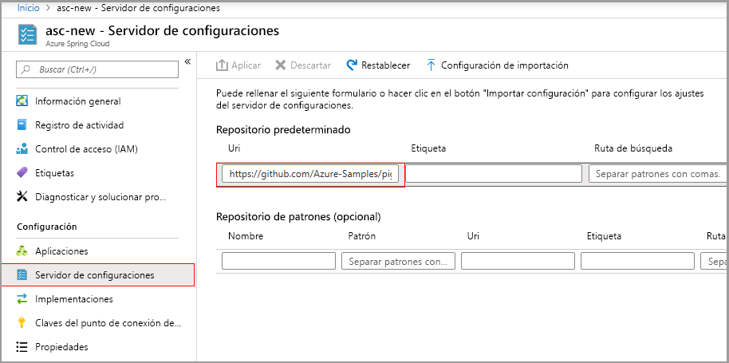
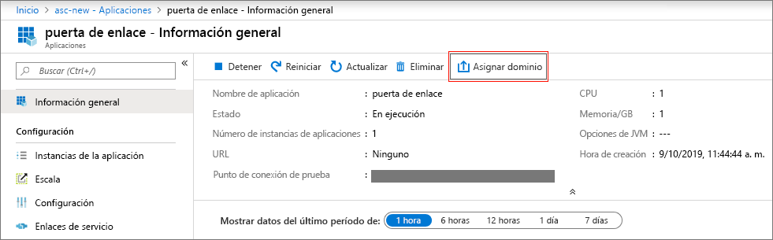
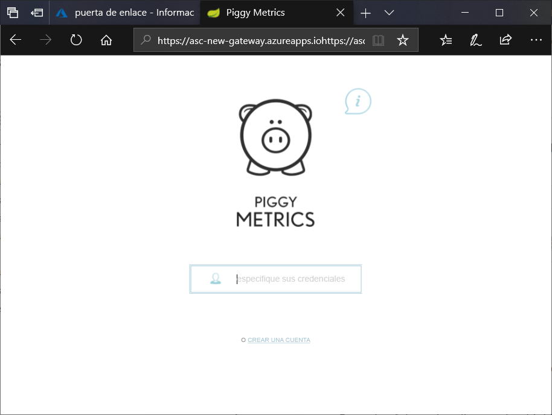

# <a name="quickstart-launch-an-existing-azure-spring-cloud-application-using-the-azure-portal"></a>Inicio rápido: Inicio de una aplicación de Azure Spring Cloud existente desde Azure Portal

En este inicio rápido se muestra cómo implementar una aplicación de Spring Cloud existente en Azure. Azure Spring Cloud permite ejecutar fácilmente en Azure aplicaciones de microservicios basadas en Spring Cloud. 

Puede encontrar el código de aplicación de ejemplo que se usa en este tutorial en nuestro [repositorio de ejemplos de GitHub](https://github.com/Azure-Samples/PiggyMetrics). Cuando haya terminado, se podrá acceder en línea a la aplicación de ejemplo proporcionada y está estará lista para ser administrada mediante Azure Portal.

En este inicio rápido aprenderá a:

> [!div class="checklist"]
> * Aprovisionar una instancia de servicio
> * Establecer un servidor de configuración para una instancia
> * Compilar una aplicación de microservicios localmente
> * Implementar cada microservicio
> * Asignar un punto de conexión público para la aplicación

## <a name="prerequisites"></a>Prerrequisitos

>[!Note]
> Azure Spring Cloud se ofrece actualmente como versión preliminar pública. Las ofertas de versión preliminar pública permiten a los clientes experimentar con nuevas características antes de su publicación oficial.  Los servicios y las características en versión preliminar pública no están diseñados para su uso en producción.  Para más información sobre el soporte técnico durante las versiones preliminares, revise las [preguntas frecuentes](https://azure.microsoft.com/support/faq/) o envíe una [solicitud de soporte técnico](https://docs.microsoft.com/azure/azure-portal/supportability/how-to-create-azure-support-request) para obtener más información.

>[!TIP]
> Azure Cloud Shell es un shell interactivo gratuito que puede usar para ejecutar los pasos de este artículo.  Incluye herramientas comunes de Azure preinstaladas, entre las que se incluyen las versiones más recientes de Git, JDK, Maven y la CLI de Azure. Si ha iniciado sesión en su suscripción de Azure, inicie [Azure Cloud Shell](https://shell.azure.com) desde shell.azure.com.  Para más información sobre Azure Cloud Shell, [lea la documentación](../cloud-shell/overview.md).

Para completar esta guía de inicio rápido:

1. [Instalación de Git](https://git-scm.com/)
2. [Instalación de JDK 8](https://docs.microsoft.com/java/azure/jdk/?view=azure-java-stable)
3. [Instalación de Maven 3.0, o cualquier versión superior](https://maven.apache.org/download.cgi)
4. [Instalación de la CLI de Azure versión 2.0.67 o superior](https://docs.microsoft.com/cli/azure/install-azure-cli?view=azure-cli-latest)
5. [Registro para obtener una suscripción a Azure](https://azure.microsoft.com/free/)

## <a name="install-the-azure-cli-extension"></a>Instalación de la extensión de la CLI de Azure

Instale la extensión de Azure Spring Cloud para la CLI de Azure, para lo cual debe usar el siguiente comando

```Azure CLI
az extension add --name spring-cloud
```

## <a name="provision-a-service-instance-on-the-azure-portal"></a>Aprovisionamiento de una instancia de servicio en Azure Portal

1. En un explorador web, abra [este vínculo a Azure Spring Cloud en Azure Portal](https://ms.portal.azure.com/#create/Microsoft.AppPlatform).

1. Rellene el formulario en la página **Crear** de Azure Spring Cloud.  Tenga en cuenta las directrices siguientes:
    - Nombre del servicio: especifique el nombre de la instancia de servicio.  El nombre debe tener entre 4 y 32 caracteres, y solo puede contener números, letras minúsculas y guiones.  El primer carácter del nombre del servicio debe ser una letra y el último debe ser una letra o un número.
    - Suscripción: seleccione la suscripción a la que desea que se facture este recurso.  Asegúrese de que esta suscripción se ha agregado a nuestra lista de permitidos para Azure Spring Cloud.
    - Grupo de recursos: se recomienda crear grupos de recursos para los nuevos recursos.
    - Ubicación: seleccione la ubicación de la instancia de servicio. Las ubicaciones admitidas actualmente son Este de EE. UU., Oeste de EE. UU. 2, Oeste de Europa y Sudeste de Asia.

1. Haga clic en **Revisar y crear**.

1. Verifique sus especificaciones y haga clic en **Crear**.

El servicio tarda aproximadamente 5 minutos en implementarse.  Una vez implementado, aparecerá la página **Información general** de la instancia de servicio.

> [!div class="nextstepaction"]
> [He tenido un problema](https://www.research.net/r/javae2e?tutorial=asc-portal-quickstart&step=provision)


## <a name="set-up-your-configuration-server"></a>Configuración del servidor de configuración

1. Vaya a la página **Información general** del servicio y seleccione **Config Server**.

1. En la sección **Repositorio predeterminado**, establezca **URI** en "https\://github.com/Azure-Samples/piggymetrics".

1. En **ETIQUETA**, seleccione "config".

1. Seleccione **Aplicar** para guardar los cambios.

    

> [!div class="nextstepaction"]
> [He tenido un problema](https://www.research.net/r/javae2e?tutorial=asc-portal-quickstart&step=config-server)

## <a name="build-and-deploy-microservice-applications"></a>Compilación e implementación de aplicaciones de microservicios

1. Abra una instancia de [Azure Cloud Shell](https://shell.azure.com) y clone el repositorio de la aplicación de ejemplo en la máquina local.  Aquí, primero se crea un directorio temporal denominado `source-code` antes de clonar la aplicación.

    ```azurecli
    mkdir source-code
    cd source-code
    git clone https://github.com/Azure-Samples/piggymetrics
    ```

1. Cree el paquete clonado.

    ```azurecli
    cd piggymetrics
    mvn clean package -DskipTests
    ```
1. Asigne nombres a su grupo de recursos y a su servicio. Asegúrese de sustituir los marcadores de posición siguientes por el nombre del grupo de recursos y el nombre del servicio que aprovisionó anteriormente en este tutorial.

    ```azurecli
    az configure --defaults group=<resource group name>
    az configure --defaults spring-cloud=<service instance name>
    ```

1. Cree la aplicación `gateway` e implemente el archivo JAR.

    ```azurecli
    az spring-cloud app create -n gateway
    az spring-cloud app deploy -n gateway --jar-path ./gateway/target/gateway.jar
    ```

1. Siguiendo el mismo patrón, cree las aplicaciones `account-service` y `auth-service`, e implemente sus archivos JAR.

    ```azurecli
    az spring-cloud app create -n account-service
    az spring-cloud app deploy -n account-service --jar-path ./account-service/target/account-service.jar
    az spring-cloud app create -n auth-service
    az spring-cloud app deploy -n auth-service --jar-path ./auth-service/target/auth-service.jar
    ```

1. La implementación de las aplicaciones tarda unos minutos en completarse. Para confirmar que se han implementado, vaya a la hoja **Aplicaciones** de Azure Portal. Debería ver una línea de cada una de las tres aplicaciones.

> [!div class="nextstepaction"]
> [He tenido un problema](https://www.research.net/r/javae2e?tutorial=asc-portal-quickstart&step=deploy)

## <a name="assign-a-public-endpoint-to-gateway"></a>Asignación de un punto de conexión público a una puerta de enlace

1. Abra la pestaña **Aplicaciones** en el menú de la izquierda.

1. Seleccione la aplicación `gateway` para mostrar la página **Información general**.

1. Seleccione **Asignar dominio** para asignar un punto de conexión público a la puerta de enlace. Esta operación puede tardar unos minutos.

    

1. Escriba el punto de conexión público asignado (con la etiqueta **URL**) en el explorador para ver la aplicación en ejecución.

    

> [!div class="nextstepaction"]
> [He tenido un problema](https://www.research.net/r/javae2e?tutorial=asc-portal-quickstart&step=public-endpoint)

## <a name="next-steps"></a>Pasos siguientes

En este tutorial, ha aprendido a hacer lo siguiente:

> [!div class="checklist"]
> * Aprovisionar una instancia de servicio
> * Establecer un servidor de configuración para una instancia
> * Compilar una aplicación de microservicios localmente
> * Implementar cada microservicio
> * Asignar un punto de conexión público a la puerta de enlace de aplicaciones

> [!div class="nextstepaction"]
> [Preparación de la aplicación Azure Spring Cloud para la implementación](spring-cloud-tutorial-prepare-app-deployment.md)

Hay más ejemplos disponibles en GitHub: [Ejemplos de Azure Spring Cloud](https://github.com/Azure-Samples/Azure-Spring-Cloud-Samples/tree/master/service-binding-cosmosdb-sql).
