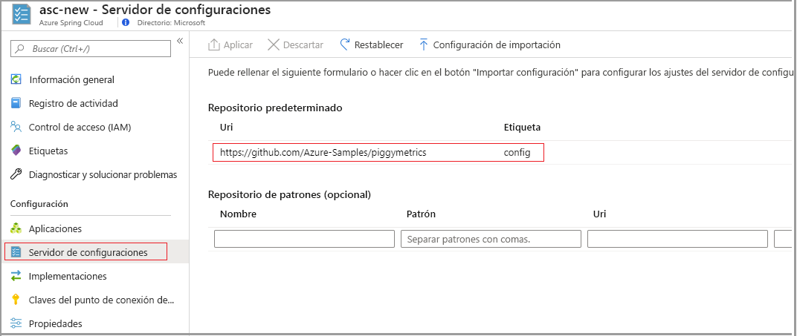

# <a name="tutorial-set-up-a-spring-cloud-config-server-instance-for-your-service"></a>Tutorial: Configuración de una instancia de Config Server en Spring Cloud para su servicio

En este tutorial se muestra cómo conectar una instancia de Config Server en Spring Cloud con el servicio Azure Spring Cloud.

Spring Cloud Config ofrece soporte técnico para servidor y cliente para las configuraciones externalizadas de un sistema distribuido. La instancia de Config Server es un lugar centralizado donde puede administrar las propiedades externas de las aplicaciones de todos los entornos. Para más información al respecto, consulte la [Guía de referencia de Config Server en Spring Cloud](https://spring.io/projects/spring-cloud-config).

## <a name="prerequisites"></a>Prerequisites
* Suscripción a Azure. Si no tiene una suscripción a Azure, cree una [cuenta gratuita](https://azure.microsoft.com/free/?WT.mc_id=A261C142F) antes de empezar. 
* Un servicio de Azure Spring Cloud aprovisionado y en ejecución. Para configurar e iniciar el servicio Azure Spring Cloud, consulte [Inicio rápido: Inicio de una aplicación Java Spring mediante la CLI de Azure](spring-cloud-quickstart-launch-app-cli.md).

## <a name="restriction"></a>Restricción

Cuando se usa Config Server con un back-end de Git, hay algunas restricciones. Algunas propiedades se insertan automáticamente en el entorno de una aplicación para acceder a Config Server y a Service Discovery. Si también configura esas propiedades desde los archivos de Config Server, pueden aparecer conflictos y un comportamiento inesperado. Estas propiedades incluyen: 

```yaml
eureka.client.service-url.defaultZone
eureka.client.tls.keystore
server.port
spring.cloud.config.tls.keystore
spring.application.name
```

> [!CAUTION]
> Se recomienda encarecidamente _no_ colocar las propiedades anteriores en los archivos de aplicación de Config Server.

## <a name="create-your-config-server-files"></a>Creación de los archivos del servidor de configuración

Azure Spring Cloud admite Azure DevOps, GitHub, GitLab y Bitbucket para almacenar los archivos del servidor de configuración. Cuando el repositorio esté preparado, cree los archivos de configuración con las siguientes instrucciones y almacénelos ahí.

Además, algunas propiedades configurables solo están disponibles para ciertos tipos. En las siguientes subsecciones se enumeran las propiedades de cada tipo de repositorio.

### <a name="public-repository"></a>Repositorio público

Si se usa un repositorio público, las propiedades configurables son más limitadas.

En la siguiente tabla se enumeran todas las propiedades configurables que se usan para configurar el repositorio de Git público:

> [!NOTE]
> El uso de un guion (-) para separar palabras es la única convención de nomenclatura que se admite actualmente. Por ejemplo, se puede usar *default-label*, pero no *defaultLabel*.

| Propiedad        | Obligatorio | Característica                                                      |
| :-------------- | -------- | ------------------------------------------------------------ |
| `uri`           | Sí    | El identificador URI del repositorio de Git que se usa como back-end de Config Server comienza por *http://* , *https://* , *git@* o *ssh://* . |
| `default-label` | No     | La etiqueta predeterminada del repositorio de Git debe ser el *nombre de rama*, el *nombre de etiqueta* o el  *identificador de confirmación* del repositorio. |
| `search-paths`  | No     | Matriz de cadenas que se usan para buscar en subdirectorios del repositorio de Git. |

------

### <a name="private-repository-with-ssh-authentication"></a>Repositorio privado con autenticación SSH

En la siguiente tabla se enumeran todas las propiedades configurables que se usan para configurar el repositorio de Git privado con SSH:

> [!NOTE]
> El uso de un guion (-) para separar palabras es la única convención de nomenclatura que se admite actualmente. Por ejemplo, se puede usar *default-label*, pero no *defaultLabel*.

| Propiedad                   | Obligatorio | Característica                                                      |
| :------------------------- | -------- | ------------------------------------------------------------ |
| `uri`                      | Sí    | El identificador URI del repositorio de Git que se usa como back-end de Config Server debe empezar por *http://* , *https://* , *git@* o *ssh://* . |
| `default-label`            | No     | La etiqueta predeterminada del repositorio de Git debe ser el *nombre de rama*, el *nombre de etiqueta* o el  *identificador de confirmación* del repositorio. |
| `search-paths`             | No     | Matriz de cadenas que se usa para buscar en subdirectorios del repositorio de Git. |
| `private-key`              | No     | La clave privada de SSH para acceder al repositorio de Git; se _requiere_ cuando el identificador URI comienza por *git@* o *ssh://* . |
| `host-key`                 | No     | La clave de host del servidor de repositorio de Git no debe incluir el prefijo del algoritmo, tal y como se describe en `host-key-algorithm`. |
| `host-key-algorithm`       | No     | El algoritmo de la clave de host debe ser *ssh-dss*, *ssh-rsa*, *ecdsa-sha2-nistp256*, *ecdsa-sha2-nistp384* o *ecdsa-sha2-nistp521*. *Se requiere* solo si `host-key` existe. |
| `strict-host-key-checking` | No     | Indica si la instancia de Config Server no se inicia al utilizar el valor de `host-key` de tipo privado. Debería ser *true* (valor predeterminado) o *false*. |

-----

### <a name="private-repository-with-basic-authentication"></a>Repositorio privado con autenticación básica

A continuación se enumeran todas las propiedades configurables que se usan para configurar el repositorio de Git privado con autenticación básica.

> [!NOTE]
> El uso de un guion (-) para separar palabras es la única convención de nomenclatura que se admite actualmente. Por ejemplo, use *default-label*, no *defaultLabel*.

| Propiedad        | Obligatorio | Característica                                                      |
| :-------------- | -------- | ------------------------------------------------------------ |
| `uri`           | Sí    | El identificador URI del repositorio de Git que se usa como back-end de Config Server debe empezar por *http://* , *https://* , *git@* o *ssh://* . |
| `default-label` | No     | La etiqueta predeterminada del repositorio de Git debe ser el *nombre de rama*, el *nombre de etiqueta* o el  *identificador de confirmación* del repositorio. |
| `search-paths`  | No     | Matriz de cadenas que se usa para buscar en subdirectorios del repositorio de Git. |
| `username`      | No     | El nombre de usuario que se utiliza para acceder al servidor del repositorio de Git; _se requiere_ cuando el servidor del repositorio de GIT admite `Http Basic Authentication`. |
| `password`      | No     | La contraseña que se utiliza para acceder al servidor del repositorio de Git; _se requiere_ cuando el servidor del repositorio de GIT admite `Http Basic Authentication`. |

> [!NOTE]
> Muchos servidores de repositorio de `Git` admiten el uso de tokens, en lugar de contraseñas, para la autenticación HTTP básica. En algunos repositorios, como GitHub, se permite que los tokens se conserven indefinidamente. Sin embargo, algunos servidores de repositorio de Git, incluido Azure DevOps, obligan a que los tokens expiren en unas horas. Los repositorios que hacen que los tokens expiren no deben usar la autenticación basada en tokens con Azure Spring Cloud.

### <a name="git-repositories-with-pattern"></a>Repositorios de Git con patrón

A continuación se enumeran todas las propiedades configurables que se usan para configurar los repositorios GIT con patrones.

> [!NOTE]
> El uso de un guion (-) para separar palabras es la única convención de nomenclatura que se admite actualmente. Por ejemplo, use *default-label*, no *defaultLabel*.

| Propiedad                           | Obligatorio         | Característica                                                      |
| :--------------------------------- | ---------------- | ------------------------------------------------------------ |
| `repos`                            | No             | Mapa que consta de los valores de un repositorio de Git con un nombre determinado. |
| `repos."uri"`                      | Sí en `repos` | El identificador URI del repositorio de Git que se usa como back-end de Config Server debe empezar por *http://* , *https://* , *git@* o *ssh://* . |
| `repos."name"`                     | Sí en `repos` | Nombre que se identifica en el repositorio de Git; _se requiere_ solo si `repos` existe. Por ejemplo, *equipo-A* o *equipo-B*. |
| `repos."pattern"`                  | No             | Matriz de cadenas que se utiliza para coincidir con un nombre de aplicación. Para cada patrón, use el formato `{application}/{profile}` con caracteres comodín. |
| `repos."default-label"`            | No             | La etiqueta predeterminada del repositorio de Git debe ser el *nombre de rama*, el *nombre de etiqueta* o el  *identificador de confirmación* del repositorio. |
| `repos."search-paths`"             | No             | Matriz de cadenas que se usa para buscar en subdirectorios del repositorio de Git. |
| `repos."username"`                 | No             | El nombre de usuario que se utiliza para acceder al servidor del repositorio de Git; _se requiere_ cuando el servidor del repositorio de GIT admite `Http Basic Authentication`. |
| `repos."password"`                 | No             | La contraseña que se utiliza para acceder al servidor del repositorio de Git; _se requiere_ cuando el servidor del repositorio de GIT admite `Http Basic Authentication`. |
| `repos."private-key"`              | No             | La clave privada de SSH para acceder al repositorio de Git, _se requiere_ cuando el identificador URI comienza por *git@* o *ssh://* . |
| `repos."host-key"`                 | No             | La clave de host del servidor de repositorio de Git no debe incluir el prefijo del algoritmo, tal y como se describe en `host-key-algorithm`. |
| `repos."host-key-algorithm"`       | No             | El algoritmo de la clave de host debe ser *ssh-dss*, *ssh-rsa*, *ecdsa-sha2-nistp256*, *ecdsa-sha2-nistp384* o *ecdsa-sha2-nistp521*. *Se requiere* solo si `host-key` existe. |
| `repos."strict-host-key-checking"` | No             | Indica si la instancia de Config Server no se inicia al utilizar el valor de `host-key` de tipo privado. Debería ser *true* (valor predeterminado) o *false*. |

## <a name="attach-your-config-server-repository-to-azure-spring-cloud"></a>Conexión de un repositorio de Config Server a Azure Spring Cloud

Una vez que los archivos de configuración se han guardado en un repositorio, es preciso conectarlo a Azure Spring Cloud.

1. Inicie sesión en [Azure Portal](https://portal.azure.com).

1. Vaya a la página **Información general** de Azure Spring Cloud.

1. Seleccione el servicio que desea configurar.

1. En el panel izquierdo de la página del servicio, en **Settings** (Configuración), seleccione la pestaña **Config Server** (Servidor de configuraciones).



### <a name="enter-repository-information-directly-to-the-azure-portal"></a>Especificación de la información del repositorio directamente en Azure Portal

#### <a name="default-repository"></a>Repositorio predeterminado

* **Repositorio público**: en la sección **Repositorio predeterminado**, en el cuadro **URI**, pegue el identificador URI del repositorio.  En el campo **Etiqueta**, seleccione **config**. Asegúrese de que el valor de **Autenticación** es **Pública** y, después, seleccione **Aplicar** para finalizar. 

* **Repositorio privado**: Azure Spring Cloud admite la autenticación básica basada en contraseñas o en tokens, y SSH.

    * **Autenticación básica**: en la sección **Default repository** (Repositorio predeterminado), en el cuadro **URI**, pegue el identificador URI del repositorio y, después, seleccione el botón de **autenticación** (icono de "lápiz"). En el panel **Edit Authentication** (Editar autenticación), en la lista desplegable **Authentication type** (Tipo de autenticación), seleccione **HTTP Basic** (HTTP básica) y, después, escriba el nombre de usuario y la contraseña o el token para conceder acceso a Azure Spring Cloud. Seleccione **OK** (Aceptar) y **Apply** (Aplicar) para terminar de configurar la instancia de Config Server.

    
    
    > [!CAUTION]
    > Algunos servidores de repositorio de Git, como GitHub, usan un *token personal* o un *token de acceso* a modo de contraseña para la **autenticación básica**. Esos tipos de token se pueden usar como contraseña en Azure Spring Cloud, ya que nunca expiran. Pero en el caso de otros servidores de repositorio de Git, como Bitbucket y Azure DevOps, el *token de acceso* expira en una o dos horas. Esto significa que la opción no es viable cuando se usan estos servidores de repositorio con Azure Spring Cloud.

    * **SSH**: en la sección **Default repository** (Repositorio predeterminado), en el cuadro **URI**, pegue el identificador URI del repositorio y, después, seleccione el botón de **autenticación** (icono de "lápiz"). En el panel **Edit Authentication** (Editar autenticación), en la lista desplegable **Authentication type** (Tipo de autenticación), seleccione **SSH**y, después, escriba su **clave privada**. También puede especificar los valores de **Host key** (Clave de host) y **Host key algorithm** (Algoritmo de claves de host). Asegúrese de incluir la clave pública en el repositorio de Config Server. Seleccione **OK** (Aceptar) y **Apply** (Aplicar) para terminar de configurar la instancia de Config Server.

    

#### <a name="pattern-repository"></a>Repositorio de patrones

Si quiere usar un **Repositorio de patrones** opcional para configurar el servicio, especifique el **URI** y la **Autenticación** de la misma manera que el **Repositorio predeterminado**. En **Name** (Nombre), asigne un nombre al patrón y, después, seleccione **Apply** (Aplicar) para asociarlo a la instancia. 

### <a name="enter-repository-information-into-a-yaml-file"></a>Introducción de la información del repositorio en un archivo YAML

Si ha escrito un archivo YAML con la configuración del repositorio, puede importarlo directamente desde la máquina local a Azure Spring Cloud. Un archivo YAML simple para un repositorio privado con autenticación básica tendrá un aspecto similar al siguiente:

```yml
spring:
    cloud:
        config:
            server:
                git:
                    uri: https://github.com/azure-spring-cloud-samples/config-server-repository.git
                    username: <username>
                    password: <password/token>

```

Seleccione el botón **Import settings** (Importar configuración) y, después, seleccione el archivo YAML en el directorio del proyecto. Seleccione **Import** (Importar) y aparecerá una de las `async`operaciones de **Notifications** (Notificaciones). Después de uno o dos minutos, debería informar de que se ha realizado correctamente.


La información del archivo YAML debería mostrarse en Azure Portal. Seleccione **Apply** (Aplicar) para finalizar. 


## <a name="delete-your-app-configuration"></a>Eliminación de la configuración de la aplicación

Una vez guardado un archivo de configuración, aparece el botón **Delete app configuration** (Eliminar configuración de la aplicación) en la pestaña **Configuration** (Configuración). Si se selecciona este botón, se borrará completamente la configuración existente. Debe hacerlo si desea conectar la instancia de Config Server a otro origen, por ejemplo, para pasarla de GitHub a Azure DevOps.


## <a name="next-steps"></a>Pasos siguientes

En este tutorial, ha aprendido a habilitar y configurar una instancia de Config Server de Spring Cloud. Para más información sobre la administración de aplicaciones, consulte el tutorial en el que se explica el escalado manual de aplicaciones.

> [!div class="nextstepaction"]
> [Tutorial: Escalado de una aplicación en Azure Spring Cloud](spring-cloud-tutorial-scale-manual.md)
