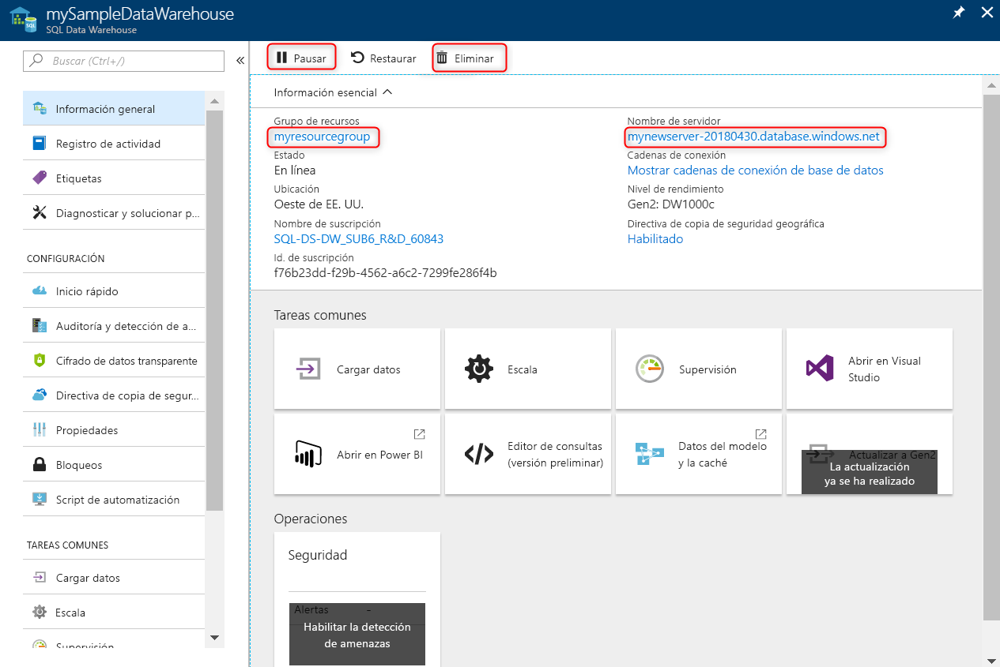

# <a name="quickstart-pause-and-resume-compute-in-synapse-sql-pool-with-azure-powershell"></a>Inicio rápido: Pausa y reanudación del proceso en el grupo de SQL de Synapse con Azure PowerShell

Azure PowerShell se puede usar para pausar y reanudar los recursos de proceso del grupo de SQL de Synapse (almacenamiento de datos). Si no tiene una suscripción a Azure, cree una cuenta [gratuita](https://azure.microsoft.com/free/) antes de empezar.

## <a name="before-you-begin"></a>Antes de empezar

[!INCLUDE [updated-for-az](../../includes/updated-for-az.md)]

En este inicio rápido se da por supuesto que ya tiene un grupo de SQL que puede pausar y reanudar. Si tiene que crear uno, puede usar el artículo sobre la [creación y conexión desde el portal](create-data-warehouse-portal.md) para crear un grupo de SQL llamado **mySampleDataWarehouse**.

## <a name="log-in-to-azure"></a>Inicio de sesión en Azure

Inicie sesión en la suscripción de Azure con el comando [Connect-AzAccount](/powershell/module/az.accounts/connect-azaccount) y siga las instrucciones de la pantalla.

```powershell
Connect-AzAccount
```

Para ver qué suscripción está usando, ejecute [Get-AzSubscription](/powershell/module/az.accounts/get-azsubscription).

```powershell
Get-AzSubscription
```

Si necesita usar una suscripción diferente de la predeterminada, ejecute [Set-AzContext](/powershell/module/az.accounts/set-azcontext).

```powershell
Set-AzContext -SubscriptionName "MySubscription"
```

## <a name="look-up-sql-pool-information"></a>Búsqueda de información del grupo de SQL

Busque el nombre de la base de datos, el nombre del servidor y el grupo de recursos del grupo de SQL que tiene previsto pausar y reanudar.

Siga estos pasos para buscar la información de ubicación del grupo de SQL:

1. Inicie sesión en [Azure Portal](https://portal.azure.com/).
1. Haga clic en **Azure Synapse Analytics (formerly SQL DW)** a la izquierda de la página de Azure Portal.
1. Seleccione **mySampleDataWarehouse** en la página de **Azure Synapse Analytics (formerly SQL DW)** . Se abre el grupo de SQL.

    

1. Anote el nombre del grupo de SQL, que es el nombre de la base de datos. Además, anote el nombre del servidor y el grupo de recursos.
1. Use solo la primera parte del nombre del servidor en los cmdlets de PowerShell. En la imagen anterior, el nombre completo del servidor es sqlpoolservername.database.windows.net. Se usará **sqlpoolservername** como nombre del servidor en el cmdlet de PowerShell.

## <a name="pause-compute"></a>Pausa del proceso

Para ahorrar costos, puede pausar y reanudar recursos de proceso a petición. Por ejemplo, si no va a usar la base de datos durante la noche y los fines de semana, puede pausarla durante esas horas y reanudarla durante el día. 

>[!NOTE]
>No se le cobrará por recursos de proceso mientras la base de datos se encuentre en pausa. Sin embargo, se le seguirá cobrando por el almacenamiento.

Para pausar una base de datos, use el cmdlet [Suspend-AzSqlDatabase](/powershell/module/az.sql/suspend-azsqldatabase). En el ejemplo siguiente, se pausa un grupo de SQL denominado **mySampleDataWarehouse** hospedado en un servidor denominado **sqlpoolservername**. El servidor está en un grupo de recursos de Azure denominado **myResourceGroup**.


```Powershell
Suspend-AzSqlDatabase –ResourceGroupName "myResourceGroup" `
–ServerName "nsqlpoolservername" –DatabaseName "mySampleDataWarehouse"
```

En el ejemplo siguiente se recupera la base de datos en el objeto $database. A continuación, canaliza el objeto a [Suspend-AzSqlDatabase](/powershell/module/az.sql/suspend-azsqldatabase). Los resultados se almacenan en el objeto resultDatabase. El comando final muestra los resultados.

```Powershell
$database = Get-AzSqlDatabase –ResourceGroupName "myResourceGroup" `
–ServerName "sqlpoolservername" –DatabaseName "mySampleDataWarehouse"
$resultDatabase = $database | Suspend-AzSqlDatabase
$resultDatabase
```

## <a name="resume-compute"></a>Reanudación del proceso

Para iniciar una base de datos, use el cmdlet [Resume-AzSqlDatabase](/powershell/module/az.sql/resume-azsqldatabase). En el ejemplo siguiente se inicia una base de datos denominada **mySampleDataWarehouse** que está hospedada en un servidor denominado **sqlpoolservername**. El servidor está en un grupo de recursos de Azure denominado **myResourceGroup**.

```Powershell
Resume-AzSqlDatabase –ResourceGroupName "myResourceGroup" `
–ServerName "sqlpoolservername" -DatabaseName "mySampleDataWarehouse"
```

En el ejemplo siguiente se recupera la base de datos en el objeto $database. A continuación, canaliza el objeto a [Resume-AzSqlDatabase](/powershell/module/az.sql/resume-azsqldatabase) y almacena los resultados en $resultDatabase. El comando final muestra los resultados.

```Powershell
$database = Get-AzSqlDatabase –ResourceGroupName "myResourceGroup" `
–ServerName "sqlpoolservername" –DatabaseName "mySampleDataWarehouse"
$resultDatabase = $database | Resume-AzSqlDatabase
$resultDatabase
```

## <a name="check-status-of-your-sql-pool-operation"></a>Comprobación del estado de una operación del grupo de SQL

Para comprobar el estado del grupo de SQL, use el cmdlet [Get-AzSqlDatabaseActivity](https://docs.microsoft.com/powershell/module/az.sql/Get-AzSqlDatabaseActivity#description).

```Powershell
Get-AzSqlDatabaseActivity -ResourceGroupName "myResourceGroup" -ServerName "sqlpoolservername" -DatabaseName "mySampleDataWarehouse"
```

## <a name="clean-up-resources"></a>Limpieza de recursos

Se le está cobrando por unidades de almacenamiento de datos y por los datos almacenados en el grupo de SQL. Estos recursos de proceso y de almacenamiento se facturan por separado.

- Si quiere conservar los datos de almacenamiento, pause el proceso.
- Si quiere eliminar cobros futuros, puede eliminar el grupo de SQL.

Siga estos pasos para limpiar los recursos según estime oportuno.

1. Inicie sesión en [Azure Portal](https://portal.azure.com) y haga clic en el grupo de SQL.

    

2. Para pausar el proceso, haga clic en el botón **Pausar**. Cuando el grupo de SQL esté en pausa, verá un botón **Iniciar**.  Para reanudar el proceso, haga clic en **Iniciar**.

3. Para quitar el grupo de SQL para que no le cobren por proceso o almacenamiento, haga clic en **Eliminar**.

4. Para quitar el servidor SQL que creó, haga clic en **sqlpoolservername.database.windows.net** y, luego, en **Eliminar**.  Debe tener cuidado con este procedimiento, ya que la eliminación del servidor elimina también todas las bases de datos asignadas al servidor.

5. Para quitar el grupo de recursos, haga clic en **myResourceGroup** y luego haga clic en **Eliminar grupo de recursos**.


## <a name="next-steps"></a>Pasos siguientes

Para más información acerca del grupo de SQL, diríjase al artículo [Carga de datos en un grupo de SQL](load-data-from-azure-blob-storage-using-polybase.md). Para más información acerca de la administración de funcionalidades de proceso, consulte el artículo sobre [introducción a la administración de proceso](sql-data-warehouse-manage-compute-overview.md). 