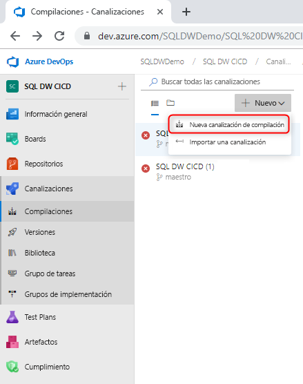
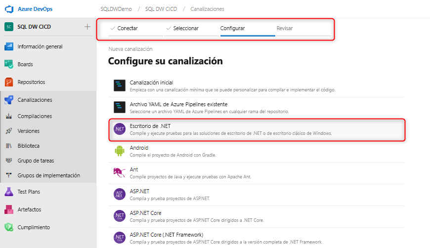
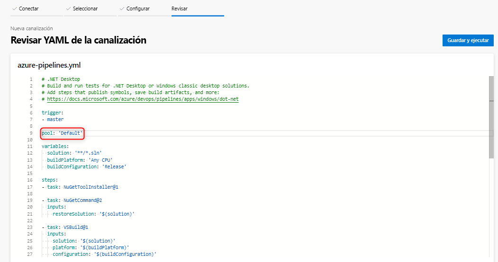
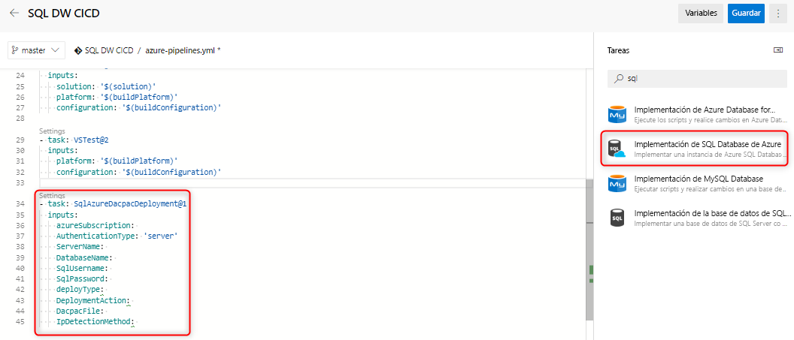
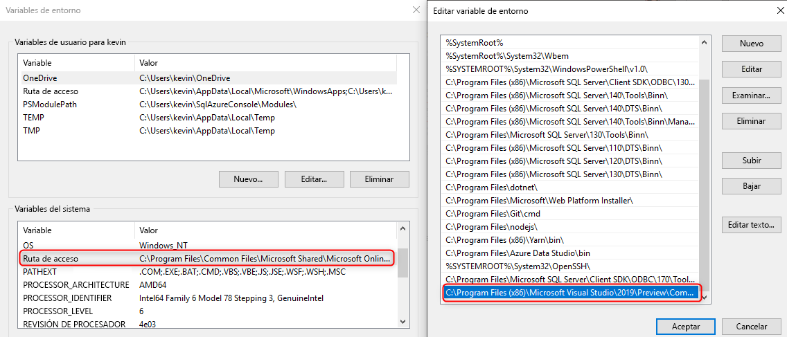

# Integración e implementación continuas para el almacenamiento de datos

En este sencillo tutorial se describe cómo integrar un proyecto de base de datos de SQL Server Data Tools (SSDT) con Azure DevOps y aprovechar Azure Pipelines para configurar la integración e implementación continuas. Este tutorial es el segundo paso en la creación de la canalización de integración e implementación continuas para el almacenamiento de datos. 

## Antes de empezar

- Realice el [tutorial de integración del control de código fuente](https://docs.microsoft.com/azure/sql-data-warehouse/sql-data-warehouse-source-control-integration).

- Configuración y conexión con Azure DevOps

## Integración continua con la compilación de Visual Studio

1. Vaya a Azure Pipelines y cree una nueva canalización de compilación.

      

2. Seleccione el repositorio de código fuente (Git de Azure Repos) y elija la plantilla de aplicaciones Escritorio de .NET.

       

3. Edite el archivo YAML para usar el grupo adecuado del agente. El archivo YAML debe tener un aspecto similar al siguiente:

      

En este punto, tiene un entorno simple en el que cualquier inserción en la rama maestra del repositorio de control de código fuente debe desencadenar automáticamente una compilación correcta en Visual Studio del proyecto de base de datos. Realice un cambio en el proyecto de base de datos local e insértelo en la rama maestra para asegurarse de que la automatización funciona de principio a fin.

## Implementación continua con la tarea de implementación de Azure SQL Data Warehouse (o Database)

1. Agregue una nueva tarea mediante la [tarea de implementación de Azure SQL Database](https://docs.microsoft.com/azure/devops/pipelines/tasks/deploy/sql-azure-dacpac-deployment?view=azure-devops) y rellene los campos necesarios para conectarse al almacenamiento de datos de destino. Cuando se ejecuta esta tarea, el paquete de aplicación de capa de datos generado a partir del proceso de compilación anterior se implementa en el almacenamiento de datos de destino. También puede usar la [tarea de implementación de Azure SQL Data Warehouse](https://marketplace.visualstudio.com/items?itemName=ms-sql-dw.SQLDWDeployment) 

      

2. Si usa un agente autohospedado, asegúrese de establecer que su variable de entorno use el archivo SqlPackage.exe correcto para SQL Data Warehouse. La ruta de acceso debe tener un aspecto similar al siguiente:

      

   C:\Archivos de programa (x86)\Microsoft Visual Studio\2019\Preview\Common7\IDE\Extensions\Microsoft\SQLDB\DAC\150  

   Ejecute y valide la canalización. Puede realizar cambios localmente e insertarlos en el repositorio de control de código fuente; deberían generar una compilación e implementación automáticas.

## Pasos siguientes

- Explore la [arquitectura MPP de SQL Analytics](massively-parallel-processing-mpp-architecture.md)
- [Creación rápida de un grupo de SQL](create-data-warehouse-portal.md)
- [Carga de datos de ejemplo](sql-data-warehouse-load-sample-databases.md)
- Explore [vídeos](/azure/sql-data-warehouse/sql-data-warehouse-videos).
