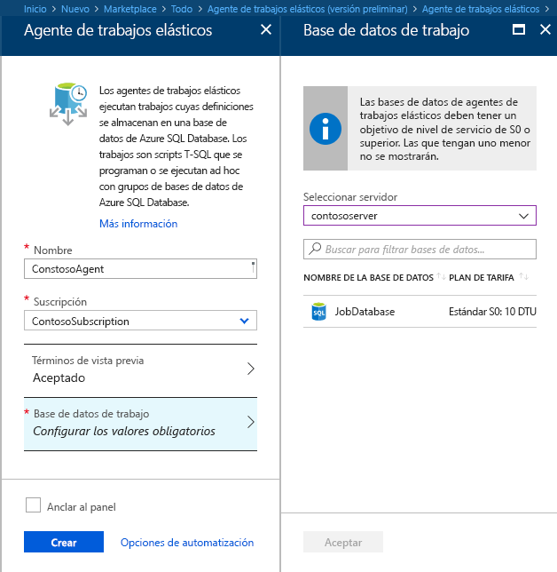
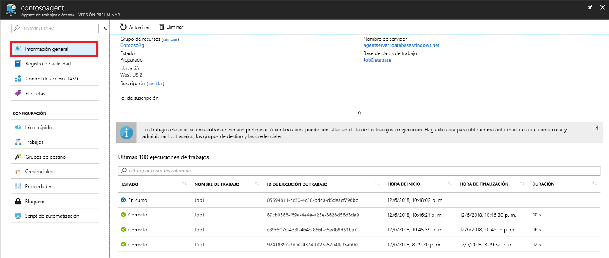
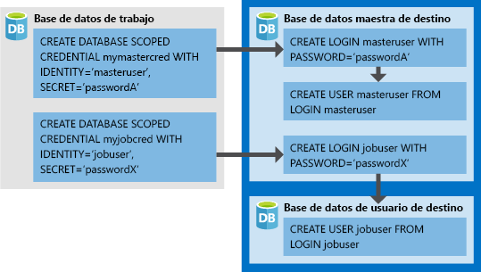

# <a name="create-configure-and-manage-elastic-jobs"></a>Creación, configuración y administración de trabajos elásticos

En este artículo, obtendrá información sobre cómo crear, configurar y administrar trabajos elásticos.

Si no ha usado los trabajos elásticos, [aprenda más sobre los conceptos de automatización de los trabajos en Azure SQL Database](sql-database-job-automation-overview.md).

## <a name="create-and-configure-the-agent"></a>Creación y configuración del agente

1. Cree o identifique una base de datos SQL vacía S0 o superior. Esta base de datos se usará como la *base de datos de trabajos* durante la creación del agente de trabajos elásticos.
2. Cree un agente de trabajos elásticos en el [portal](https://portal.azure.com/#create/Microsoft.SQLElasticJobAgent) o con [PowerShell](elastic-jobs-powershell.md#create-the-elastic-job-agent).

   

## <a name="create-run-and-manage-jobs"></a>Creación, ejecución y administración de trabajos

1. Cree una credencial para la ejecución del trabajo en la *base de datos de trabajos* mediante [PowerShell](elastic-jobs-powershell.md) o [T-SQL](elastic-jobs-tsql.md#create-a-credential-for-job-execution).
2. Defina el grupo de destino (las bases de datos en las que se quiere ejecutar el trabajo) mediante [PowerShell](elastic-jobs-powershell.md) o [T-SQL](elastic-jobs-tsql.md#create-a-target-group-servers).
3. Cree una credencial del agente de trabajos en cada base de datos en las que debe ejecutarse el trabajo [(agregue el usuario (o el rol) a cada base de datos del grupo)](sql-database-control-access.md). Para obtener un ejemplo, consulte el [tutorial de PowerShell](elastic-jobs-powershell.md).
4. Cree un trabajo mediante [PowerShell](elastic-jobs-powershell.md) o [T-SQL](elastic-jobs-tsql.md#deploy-new-schema-to-many-databases).
5. Agregue pasos de trabajo mediante [PowerShell](elastic-jobs-powershell.md) o [T-SQL](elastic-jobs-tsql.md#deploy-new-schema-to-many-databases).
6. Ejecute un trabajo mediante [PowerShell](elastic-jobs-powershell.md#run-the-job) o [T-SQL](elastic-jobs-tsql.md#begin-ad-hoc-execution-of-a-job).
7. Supervise el estado de ejecución del trabajo mediante el portal, [PowerShell](elastic-jobs-powershell.md#monitor-status-of-job-executions) o [T-SQL](elastic-jobs-tsql.md#monitor-job-execution-status).

   

## <a name="credentials-for-running-jobs"></a>Credenciales para la ejecución de trabajos

Los trabajos usan [credenciales de ámbito de base de datos](/sql/t-sql/statements/create-database-scoped-credential-transact-sql) para conectarse a las bases de datos que especifica el grupo de destino en la ejecución. Si un grupo de destino contiene servidores o grupos, estas credenciales de ámbito de base de datos se utilizan para conectarse a la base de datos maestra para enumerar las bases de datos disponibles.

La configuración de las credenciales adecuadas para ejecutar un trabajo puede ser un poco confusa, por lo que debe tener en cuenta los puntos siguientes:

- Las credenciales de ámbito de base de datos se deben crear en la *base de datos del trabajo*.
- **Todas las bases de datos de destino deben tener un inicio de sesión con [permisos suficientes](https://docs.microsoft.com/sql/relational-databases/security/permissions-database-engine) para que el trabajo se complete correctamente** (`jobuser` en el siguiente diagrama).
- Las credenciales se pueden reutilizar en los trabajos y las contraseñas de las credenciales se cifran y protegen para los usuarios que tienen acceso de solo lectura a los objetos del trabajo.

La siguiente imagen está diseñada para ayudar a comprender y configurar las credenciales del trabajo adecuadas. **Recuerde que debe crear el usuario en cada base de datos (todas las *bases de datos de usuario de destino*) en las que se debe ejecutar el trabajo**.



## <a name="security-best-practices"></a>Recomendaciones de seguridad

Algunas consideraciones sobre procedimientos recomendados para trabajar con trabajos elásticos:

- Limitar el uso de las API a las personas de confianza.
- Las credenciales deben tener los privilegios mínimos necesarios para realizar el paso de trabajo. Para más información, consulte [Autorización y permisos de SQL Server](https://docs.microsoft.com/dotnet/framework/data/adonet/sql/authorization-and-permissions-in-sql-server).
- Cuando se utiliza un servidor o un miembro del grupo de destino, se recomienda crear una credencial independiente con derechos en la base de datos maestra para ver y enumerar las bases de datos, que se utiliza para expandir las listas de bases de datos de los servidores o grupos antes de la ejecución del trabajo.

## <a name="agent-performance-capacity-and-limitations"></a>Rendimiento, capacidad y limitaciones del agente

Los trabajos elásticos utilizan recursos de proceso mínimos mientras se espera hasta que los trabajos de larga ejecución finalicen.

Dependiendo del tamaño del grupo de destino de las bases de datos y el tiempo de ejecución deseado para un trabajo (número de trabajadores simultáneos), el agente requiere distintas cantidades de proceso y rendimiento de la *base de datos de trabajos* (cuantos más destinos y número de trabajos, mayor será la cantidad de proceso necesaria).

Actualmente, la versión preliminar está limitada a 100 trabajos simultáneos.

### <a name="prevent-jobs-from-reducing-target-database-performance"></a>Evitar que los trabajos reduzcan el rendimiento de la base de datos de destino

Para asegurarse de que los recursos no están sobrecargados al ejecutar trabajos en las bases de datos de un grupo elástico de SQL, los trabajos se pueden configurar para limitar el número de bases de datos en las que puede ejecutarse un trabajo al mismo tiempo.

Establezca el número de bases de datos simultáneas que ejecuta un trabajo estableciendo el parámetro `@max_parallelism` del procedimiento almacenado `sp_add_jobstep` en T-SQL o `Add-AzSqlElasticJobStep -MaxParallelism` en PowerShell.

## <a name="best-practices-for-creating-jobs"></a>Procedimientos recomendados para crear trabajos

### <a name="idempotent-scripts"></a>Scripts idempotentes
Los scripts de T-SQL de un trabajo deben ser [idempotentes](https://en.wikipedia.org/wiki/Idempotence). **Idempotente** significa que si el script se ejecuta correctamente y se vuelve a ejecutar, produce el mismo resultado. Un script puede producir errores debido a problemas de red transitorios. En ese caso, el trabajo volverá a intentar ejecutar automáticamente el script un número de veces predefinido antes de desistir. Un script idempotente produce el mismo resultado aunque se ejecute correctamente dos veces (o más).

Una táctica sencilla es probar la existencia de un objeto antes de crearlo.


```sql
IF NOT EXISTS (some_object)
    -- Create the object
    -- If it exists, drop the object before recreating it.
```

De forma similar, un script debe ser capaz de comprobar lógicamente y contrarrestar las condiciones que encuentre para ejecutarse correctamente.


## <a name="next-steps"></a>Pasos siguientes

- [Creación y administración de trabajos elásticos mediante PowerShell](elastic-jobs-powershell.md)
- [Creación y administración de trabajos elásticos mediante Transact-SQL (T-SQL)](elastic-jobs-tsql.md)
