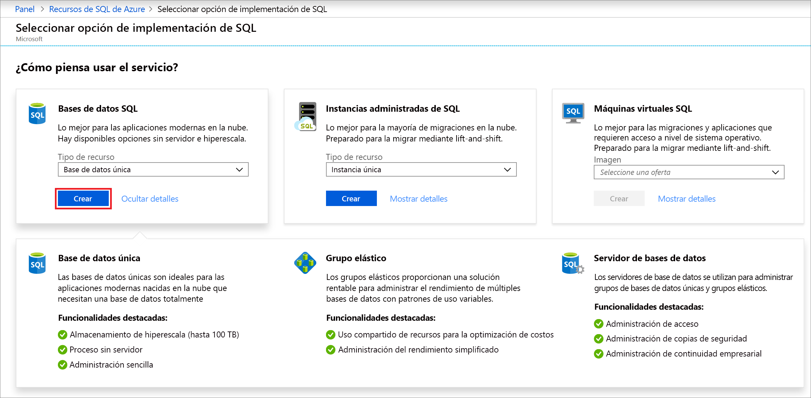
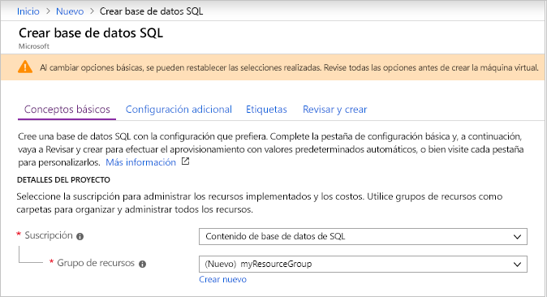
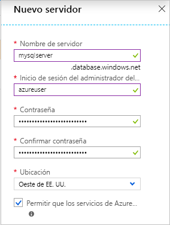
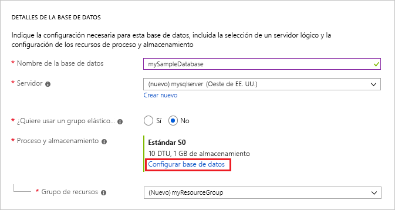
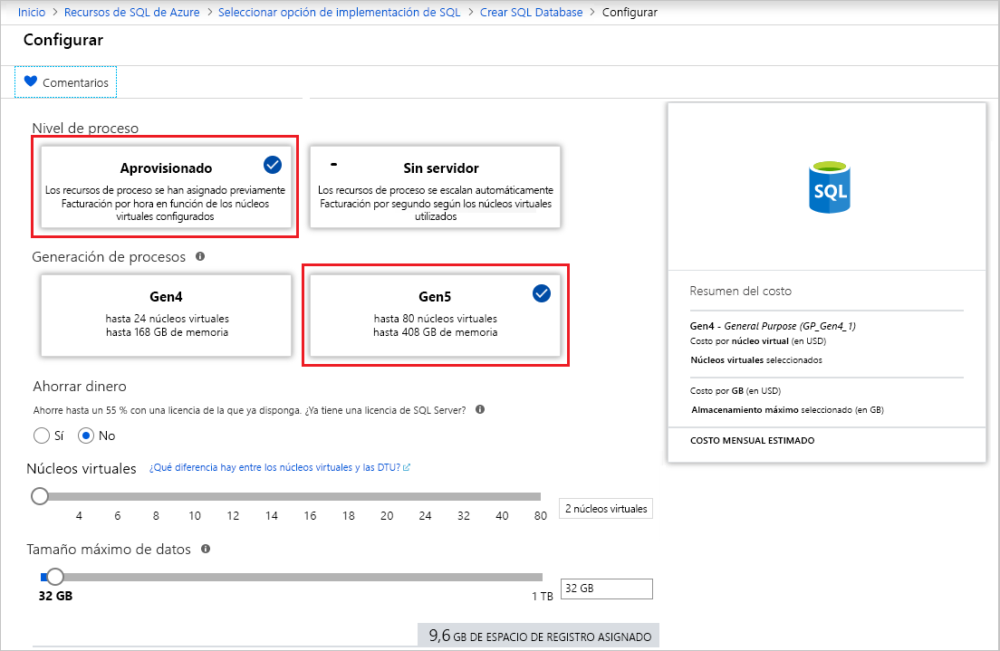
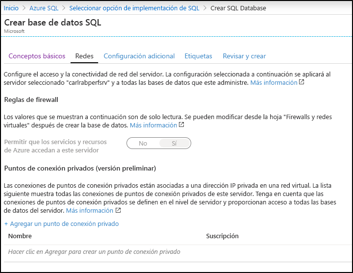
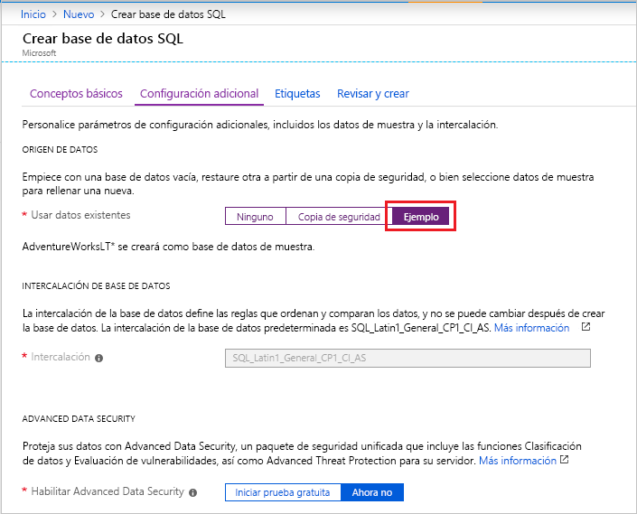

En este paso, creará una base de datos única de Azure SQL Database. 

> [!IMPORTANT]
> Asegúrese de configurar reglas de firewall para usar la dirección IP pública del equipo que va a usar para completar este artículo.
>
> Para más información, consulte [Creación de una regla de firewall a nivel de base de datos](/sql/relational-databases/system-stored-procedures/sp-set-database-firewall-rule-azure-sql-database) o, para determinar la dirección IP que usa la regla de firewall a nivel de base de datos para el equipo, consulte [Creación de un firewall a nivel de servidor](../sql-database-server-level-firewall-rule.md).  

# <a name="portal"></a>[Portal](#tab/azure-portal)

Cree el grupo de recursos y la base de datos única mediante Azure Portal.

1. Seleccione **Azure SQL** en el menú izquierdo de [Azure Portal](https://portal.azure.com). Si **Azure SQL** no está en la lista, seleccione **Todos los servicios** y, luego, escriba *Azure SQL* en el cuadro de búsqueda. (Opcional) Seleccione la estrella junto a **Azure SQL** para marcarlo como favorito y agréguelo como un elemento en el panel de navegación izquierdo. 
2. Seleccione **+ Agregar** para abrir la página **Select SQL deployment option** (Seleccionar la opción de implementación de SQL). Para ver más información acerca de las distintas bases de datos, seleccione **Mostrar detalles** en el icono **Bases de datos**.
3. Seleccione **Crear**:

   

4. En la pestaña **Conceptos básicos**, en la sección **Detalles del proyecto**, escriba o seleccione los siguientes valores:

   - **Suscripción**: Abra la lista desplegable y seleccione la suscripción correcta, en caso de que no aparezca.
   - **Grupo de recursos**: Seleccione **Crear nuevo**, escriba `myResourceGroup` y seleccione **Aceptar**.

     

5. En la sección **Detalles de la base de datos**, escriba o seleccione los siguientes valores:

   - **Nombre de base de datos**: Escriba `mySampleDatabase`.
   - **Servidor**: En la página **Crear nuevo**, escriba los valores siguientes y elija **Seleccionar**.
       - **Nombre del servidor**: Escriba `mysqlserver`, junto con algunos números con fines de unicidad.
       - **Inicio de sesión del administrador del servidor**: Escriba `azureuser`.
       - **Contraseña**: Escriba una contraseña compleja que cumpla los requisitos de contraseña.
       - **Ubicación**: Elija una ubicación en la lista desplegable, como `West US`.

         

      > [!IMPORTANT]
      > No olvide registrar el inicio de sesión y la contraseña del administrador del servidor, con el fin de poder iniciar sesión en el servidor y las bases de datos en este y otros inicios rápidos. Si olvida la contraseña o el inicio de sesión, puede obtener el nombre de inicio de sesión o restablecer la contraseña en la página de **SQL server**. Para abrir la página de **SQL server**, seleccione el nombre del servidor en la página de **información general** de la base de datos después de la creación de esta.

   - **¿Quiere usar un grupo elástico de SQL?** Seleccione la opción **No**.
   - **Proceso y almacenamiento**: Seleccione **Configurar base de datos**. 

     

   - Seleccione **Aprovisionado**.

     

   - Revise la configuración de **núcleos virtuales**y **tamaño máximo de los datos**. Cámbielos según sea necesario. 
     - Opcionalmente, también puede seleccionar **Cambiar configuración** para cambiar la generación del hardware.
   - Seleccione **Aplicar**.

6. Seleccione la pestaña **Redes** y decida si desea [**Permitir que los servicios y recursos de Azure accedan a este servidor**](../sql-database-networkaccess-overview.md) o agregar un [punto de conexión privado](../../private-link/private-endpoint-overview.md).

   

7. Seleccione la pestaña **Configuración adicional**. 
8. En la sección **Origen de datos**, en **Usar datos existentes**, seleccione `Sample`.

   

   > [!IMPORTANT]
   > Asegúrese de seleccionar los datos de **Sample (AdventureWorksLT)** para poder seguir fácilmente este y otros inicios rápidos de Azure SQL Database que usan estos datos.

9. Deje el resto de los valores como predeterminados y seleccione **Revisar y crear** en la parte inferior del formulario.
10. Revise la configuración final y seleccione **Crear**.

11. En el formulario **SQL Database**, seleccione **Crear** para implementar y aprovisionar el grupo de recursos, el servidor y la base de datos.

# <a name="powershell"></a>[PowerShell](#tab/azure-powershell)

[!INCLUDE [updated-for-az](../../../includes/updated-for-az.md)]

Cree el grupo de recursos y la base de datos única con PowerShell.

   ```powershell-interactive
   # Set variables for your server and database
   $subscriptionId = '<SubscriptionID>'
   $resourceGroupName = "myResourceGroup-$(Get-Random)"
   $location = "West US"
   $adminLogin = "azureuser"
   $password = "PWD27!"+(New-Guid).Guid
   $serverName = "mysqlserver-$(Get-Random)"
   $databaseName = "mySampleDatabase"

   # The ip address range that you want to allow to access your server 
   # (leaving at 0.0.0.0 will prevent outside-of-azure connections to your DB)
   $startIp = "0.0.0.0"
   $endIp = "0.0.0.0"

   # Show randomized variables
   Write-host "Resource group name is" $resourceGroupName 
   Write-host "Password is" $password  
   Write-host "Server name is" $serverName 

   # Connect to Azure
   Connect-AzAccount

   # Set subscription ID
   Set-AzContext -SubscriptionId $subscriptionId 

   # Create a resource group
   Write-host "Creating resource group..."
   $resourceGroup = New-AzResourceGroup -Name $resourceGroupName -Location $location -Tag @{Owner="SQLDB-Samples"}
   $resourceGroup

   # Create a server with a system wide unique server name
   Write-host "Creating primary logical server..."
   $server = New-AzSqlServer -ResourceGroupName $resourceGroupName `
      -ServerName $serverName `
      -Location $location `
      -SqlAdministratorCredentials $(New-Object -TypeName System.Management.Automation.PSCredential `
      -ArgumentList $adminLogin, $(ConvertTo-SecureString -String $password -AsPlainText -Force))
   $server

   # Create a server firewall rule that allows access from the specified IP range
   Write-host "Configuring firewall for primary logical server..."
   $serverFirewallRule = New-AzSqlServerFirewallRule -ResourceGroupName $resourceGroupName `
      -ServerName $serverName `
      -FirewallRuleName "AllowedIPs" -StartIpAddress $startIp -EndIpAddress $endIp
   $serverFirewallRule

   # Create General Purpose Gen4 database with 1 vCore
   Write-host "Creating a gen5 2 vCore database..."
   $database = New-AzSqlDatabase  -ResourceGroupName $resourceGroupName `
      -ServerName $serverName `
      -DatabaseName $databaseName `
      -Edition GeneralPurpose `
      -VCore 2 `
      -ComputeGeneration Gen5 `
      -MinimumCapacity 2 `
      -SampleName "AdventureWorksLT"
   $database
   ```

En esta parte del artículo se usan los siguientes cmdlets de PowerShell:

| Get-Help | Notas |
|---|---|
| [New-AzResourceGroup](/powershell/module/az.resources/new-azresourcegroup) | Crea un grupo de recursos en el que se almacenan todos los recursos. |
| [New-AzSqlServer](/powershell/module/az.sql/new-azsqlserver) | Crea un servidor de SQL Database que hospeda bases de datos únicas y grupos elásticos. |
| [New-AzSqlServerFirewallRule](/powershell/module/az.sql/new-azsqlserverfirewallrule) | Crea una regla de firewall para un servidor lógico. | 
| [New-AzSqlDatabase](/powershell/module/az.sql/new-azsqldatabase) | Crea una nueva base de datos única de Azure SQL Database | 

# <a name="azure-cli"></a>[CLI de Azure](#tab/azure-cli)

Cree el grupo de recursos y la base de datos única mediante la CLI de AZ.

   ```azurecli-interactive
   #!/bin/bash
   # Set variables
   subscriptionID=<SubscriptionID>
   resourceGroupName=myResourceGroup-$RANDOM
   location=SouthCentralUS
   adminLogin=azureuser
   password="PWD27!"+`openssl rand -base64 18`
   serverName=mysqlserver-$RANDOM
   databaseName=mySampleDatabase
   drLocation=NorthEurope
   drServerName=mysqlsecondary-$RANDOM
   failoverGroupName=failovergrouptutorial-$RANDOM

   # The ip address range that you want to allow to access your DB. 
   # Leaving at 0.0.0.0 will prevent outside-of-azure connections to your DB
   startip=0.0.0.0
   endip=0.0.0.0
  
   # Connect to Azure
   az login

   # Set the subscription context for the Azure account
   az account set -s $subscriptionID

   # Create a resource group
   echo "Creating resource group..."
   az group create \
      --name $resourceGroupName \
      --location $location \
      --tags Owner[=SQLDB-Samples]

   # Create a logical server in the resource group
   echo "Creating primary logical server..."
   az sql server create \
      --name $serverName \
      --resource-group $resourceGroupName \
      --location $location  \
      --admin-user $adminLogin \
      --admin-password $password

   # Configure a firewall rule for the server
   echo "Configuring firewall..."
   az sql server firewall-rule create \
      --resource-group $resourceGroupName \
      --server $serverName \
      -n AllowYourIp \
      --start-ip-address $startip \
      --end-ip-address $endip

   # Create a gen5 1vCore database in the server 
   echo "Creating a gen5 2 vCore database..."
   az sql db create \
      --resource-group $resourceGroupName \
      --server $serverName \
      --name $databaseName \
      --sample-name AdventureWorksLT \
      --edition GeneralPurpose \
      --family Gen5 \
      --capacity 2
   ```

Este script usa los siguientes comandos. Cada comando de la tabla crea un vínculo a documentación específica del comando.

| Get-Help | Notas |
|---|---|
| [az account set](/cli/azure/account?view=azure-cli-latest#az-account-set) | Establece una suscripción como la suscripción activa actual. | 
| [az group create](/cli/azure/group#az-group-create) | Crea un grupo de recursos en el que se almacenan todos los recursos. |
| [az sql server create](/cli/azure/sql/server#az-sql-server-create) | Crea un servidor de SQL Database que hospeda bases de datos únicas y grupos elásticos. |
| [az sql server firewall-rule create](/cli/azure/sql/server/firewall-rule) | Crea las reglas de firewall de un servidor. | 
| [az sql db create](/cli/azure/sql/db?view=azure-cli-latest) | Crea una base de datos. | 


---
