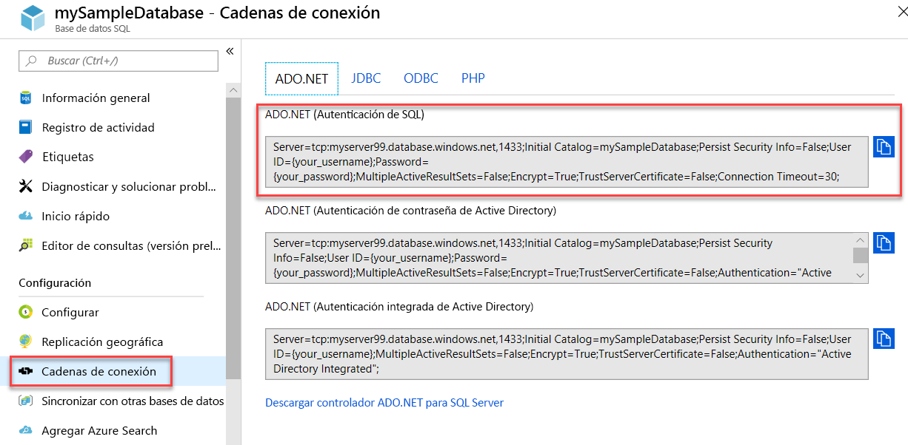

# <a name="quickstart-use-net-core-c-to-query-an-azure-sql-database"></a>Guía de inicio rápido: Uso de .NET Core (C#) para consultar una instancia de Azure SQL Database

En este tutorial de inicio rápido, usará código de C# y [.NET Core](https://www.microsoft.com/net/) para conectarse a una instancia de Azure SQL Database. Luego, ejecutará una instrucción Transact-SQL para consultar los datos.

## <a name="prerequisites"></a>Requisitos previos

En este tutorial, necesitará:

- Una base de datos SQL de Azure. Puede utilizar uno de estos inicios rápidos para crear y configurar una base de datos en Azure SQL Database:

  || Base de datos única | Instancia administrada |
  |:--- |:--- |:---|
  | Crear| [Portal](sql-database-single-database-get-started.md) | [Portal](sql-database-managed-instance-get-started.md) |
  || [CLI](scripts/sql-database-create-and-configure-database-cli.md) | [CLI](https://medium.com/azure-sqldb-managed-instance/working-with-sql-managed-instance-using-azure-cli-611795fe0b44) |
  || [PowerShell](scripts/sql-database-create-and-configure-database-powershell.md) | [PowerShell](scripts/sql-database-create-configure-managed-instance-powershell.md) |
  | Configuración | [Regla de firewall de IP en el nivel de servidor](sql-database-server-level-firewall-rule.md)| [Conectividad desde una máquina virtual](sql-database-managed-instance-configure-vm.md)|
  |||[Conectividad desde el sitio](sql-database-managed-instance-configure-p2s.md)
  |Carga de datos|Adventure Works cargado por inicio rápido|[Restauración de World Wide Importers](sql-database-managed-instance-get-started-restore.md)
  |||Restauración o importación de Adventure Works a partir del archivo [BACPAC](sql-database-import.md) desde [GitHub](https://github.com/Microsoft/sql-server-samples/tree/master/samples/databases/adventure-works)|
  |||

  > [!IMPORTANT]
  > Los scripts de este artículo se escriben para utilizar la base de datos Adventure Works. Con una instancia administrada, debe importar la base de datos Adventure Works en una base de datos de instancia o modificar los scripts de este artículo para utilizar la base de datos Wide World Importers.

- Se instaló [.NET Core para su sistema operativo](https://www.microsoft.com/net/core).

> [!NOTE]
> En esta guía de inicio rápido se usa la base de datos *mySampleDatabase*. Si quiere usar otra base de datos, deberá cambiar las referencias de base de datos y modificar la consulta `SELECT` en el código C#.

## <a name="get-sql-server-connection-information"></a>Obtención de información de conexión de SQL Server

Obtención de la información de conexión necesaria para conectarse a Azure SQL Database. En los procedimientos siguientes, necesitará el nombre completo del servidor o nombre de host, el nombre de la base de datos y la información de inicio de sesión.

1. Inicie sesión en el [Azure Portal](https://portal.azure.com/).

2. Vaya a las páginas **SQL Database** o **Instancias administradas de SQL**.

3. En la página **Información general**, revise el nombre completo del servidor junto a **Nombre del servidor** para una única base de datos o el nombre completo del servidor junto a **Host** para una instancia administrada. Para copiar el nombre del servidor o nombre de host, mantenga el cursor sobre él y seleccione el icono **Copiar**.

## <a name="get-adonet-connection-information-optional"></a>Obtención de información de conexión de ADO.NET (opcional)

1. Vaya a la página **mySampleDatabase** y, en **Configuración**, seleccione **Cadenas de conexión**.

2. Revise la cadena de conexión completa de **ADO.NET**.

    

3. Copie la cadena de conexión **ADO.NET** si quiere usarla.
  
## <a name="create-a-new-net-core-project"></a>Creación de un proyecto de .NET Core

1. Abra un símbolo del sistema y cree una carpeta denominada **sqltest**. Vaya a esta carpeta y ejecute este comando.

    ```cmd
    dotnet new console
    ```
    Con este comando se crean nuevos archivos de proyecto de aplicaciones, incluido un archivo de código de C# inicial (**Program.cs**), un archivo de configuración XML (**sqltest.csproj**) y los archivos binarios necesarios.

2. En un editor de texto, abra **sqltest.csproj** y pegue el XML siguiente entre las etiquetas `<Project>`. Este XML agrega `System.Data.SqlClient` como dependencia.

    ```xml
    <ItemGroup>
        <PackageReference Include="System.Data.SqlClient" Version="4.6.0" />
    </ItemGroup>
    ```

## <a name="insert-code-to-query-sql-database"></a>Inserción de código para consultar la base de datos SQL

1. En un editor de texto, abra **Program.cs**.

2. Reemplace el contenido con el código siguiente y agregue los valores adecuados para el servidor, la base de datos, el nombre de usuario y la contraseña.

> [!NOTE]
> Para usar una cadena de conexión ADO.NET, reemplace las 4 líneas del código donde se establece el servidor, la base de datos, el nombre de usuario y la contraseña por la línea que aparece a continuación. En la cadena, establezca el nombre de usuario y la contraseña.
>
>    `builder.ConnectionString="<your_ado_net_connection_string>";`

```csharp
using System;
using System.Data.SqlClient;
using System.Text;

namespace sqltest
{
    class Program
    {
        static void Main(string[] args)
        {
            try 
            { 
                SqlConnectionStringBuilder builder = new SqlConnectionStringBuilder();

                builder.DataSource = "<your_server.database.windows.net>"; 
                builder.UserID = "<your_username>";            
                builder.Password = "<your_password>";     
                builder.InitialCatalog = "<your_database>";
         
                using (SqlConnection connection = new SqlConnection(builder.ConnectionString))
                {
                    Console.WriteLine("\nQuery data example:");
                    Console.WriteLine("=========================================\n");
                    
                    connection.Open();       
                    StringBuilder sb = new StringBuilder();
                    sb.Append("SELECT TOP 20 pc.Name as CategoryName, p.name as ProductName ");
                    sb.Append("FROM [SalesLT].[ProductCategory] pc ");
                    sb.Append("JOIN [SalesLT].[Product] p ");
                    sb.Append("ON pc.productcategoryid = p.productcategoryid;");
                    String sql = sb.ToString();

                    using (SqlCommand command = new SqlCommand(sql, connection))
                    {
                        using (SqlDataReader reader = command.ExecuteReader())
                        {
                            while (reader.Read())
                            {
                                Console.WriteLine("{0} {1}", reader.GetString(0), reader.GetString(1));
                            }
                        }
                    }                    
                }
            }
            catch (SqlException e)
            {
                Console.WriteLine(e.ToString());
            }
            Console.WriteLine("\nDone. Press enter.");
            Console.ReadLine(); 
        }
    }
}
```

## <a name="run-the-code"></a>Ejecución del código

1. En el símbolo del sistema, ejecute estos comandos.

   ```cmd
   dotnet restore
   dotnet run
   ```

2. Compruebe que se devuelven las 20 primeras filas.

   ```text
   Query data example:
   =========================================

   Road Frames HL Road Frame - Black, 58
   Road Frames HL Road Frame - Red, 58
   Helmets Sport-100 Helmet, Red
   Helmets Sport-100 Helmet, Black
   Socks Mountain Bike Socks, M
   Socks Mountain Bike Socks, L
   Helmets Sport-100 Helmet, Blue
   Caps AWC Logo Cap
   Jerseys Long-Sleeve Logo Jersey, S
   Jerseys Long-Sleeve Logo Jersey, M
   Jerseys Long-Sleeve Logo Jersey, L
   Jerseys Long-Sleeve Logo Jersey, XL
   Road Frames HL Road Frame - Red, 62
   Road Frames HL Road Frame - Red, 44
   Road Frames HL Road Frame - Red, 48
   Road Frames HL Road Frame - Red, 52
   Road Frames HL Road Frame - Red, 56
   Road Frames LL Road Frame - Black, 58
   Road Frames LL Road Frame - Black, 60
   Road Frames LL Road Frame - Black, 62

   Done. Press enter.
   ```
3. Elija **ENTRAR** para cerrar la ventana de la aplicación.

## <a name="next-steps"></a>Pasos siguientes

- [Introducción a .NET Core en Windows, Linux y macOS mediante la línea de comandos](/dotnet/core/tutorials/using-with-xplat-cli).
- Obtenga información sobre cómo [conectarse y consultar una base de datos SQL de Azure mediante .NET Framework y Visual Studio](sql-database-connect-query-dotnet-visual-studio.md).  
- Aprenda a [diseñar la primera base de datos de Azure SQL con SSMS](sql-database-design-first-database.md) o [diseñar una base de datos de Azure SQL y conectarse con C# y ADO.NET](sql-database-design-first-database-csharp.md).
- Para más información acerca de. NET, consulte la [Documentación de .NET](https://docs.microsoft.com/dotnet/).
