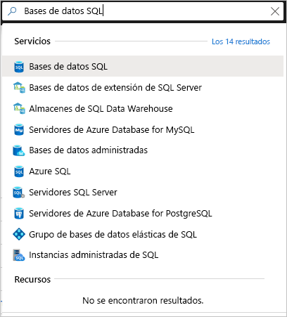
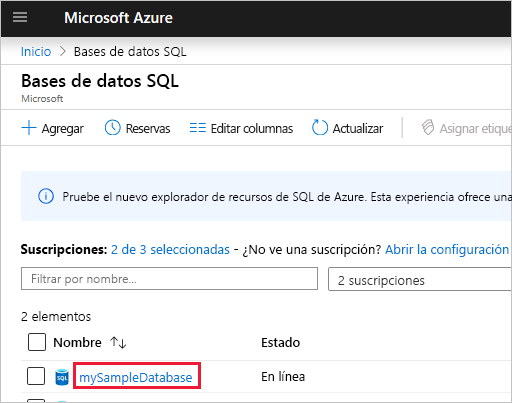
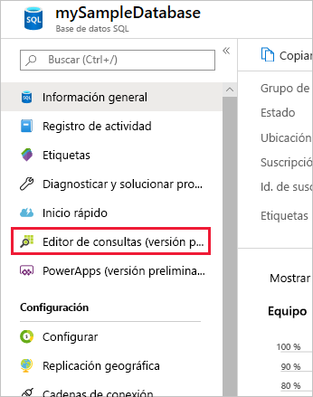
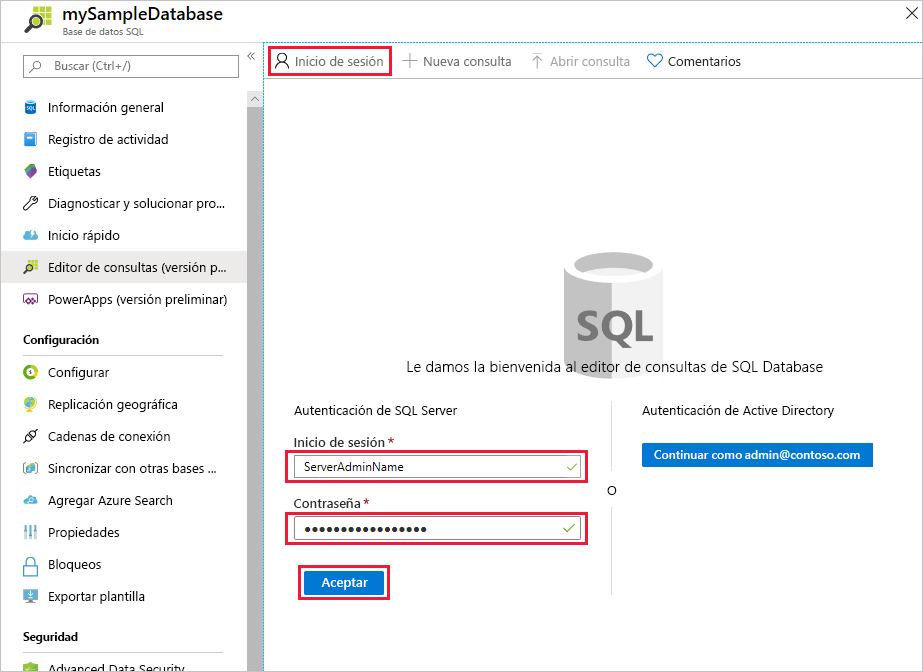
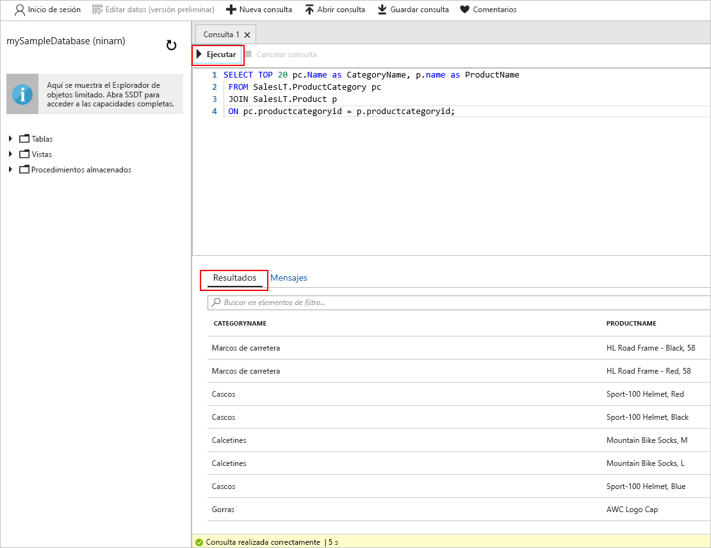

# <a name="quickstart-use-the-azure-portals-sql-query-editor-to-connect-and-query-data"></a>Inicio rápido: Uso del Editor de consultas SQL de Azure Portal para conectarse a datos y consultarlos

El Editor de consultas SQL es una herramienta del explorador de Azure Portal que proporciona una manera fácil de ejecutar consultas SQL en su base de datos de Azure SQL o almacenamiento de Azure SQL Data Warehouse. En este inicio rápido, usará el editor de consultas para conectarse a una base de datos SQL y ejecutar instrucciones Transact-SQL para consultar, insertar, actualizar y eliminar datos.

## <a name="prerequisites"></a>Prerrequisitos

Para completar este tutorial, necesita:

- Una base de datos de Azure SQL. Puede utilizar uno de estos inicios rápidos para crear y configurar una base de datos en Azure SQL Database:

  || Base de datos única |
  |:--- |:--- |
  | Crear| [Portal](sql-database-single-database-get-started.md) |
  || [CLI](scripts/sql-database-create-and-configure-database-cli.md) |
  || [PowerShell](scripts/sql-database-create-and-configure-database-powershell.md) |
  | Configuración | [Regla de firewall de IP en el nivel de servidor](sql-database-server-level-firewall-rule.md)|
  |||

> [!NOTE]
> El editor de consultas usa los puertos 443 y 1443 para comunicarse.  Asegúrese de que ha habilitado el tráfico HTTPS saliente en estos puertos. También deberá agregar la dirección IP saliente a las reglas de firewall permitidas del servidor para acceder a las bases de datos y los almacenes de datos.

## <a name="sign-in-the-azure-portal"></a>Inicio de sesión en Azure Portal

Inicie sesión en [Azure Portal](https://portal.azure.com/).

## <a name="connect-using-sql-authentication"></a>Conexión con la autenticación de SQL

1. Vaya a Azure Portal para conectarse a una base de datos SQL. Busque y seleccione **base de datos SQL**.

    

2. Seleccione la base de datos SQL.

    

3. En el menú de **Base de datos SQL**, seleccione **Editor de consultas (versión preliminar)** .

    

4. En la página **Inicio de sesión**, en la etiqueta **Autenticación de SQL Server**, escriba el **identificador de usuario** y la **contraseña** de la cuenta de administrador del servidor usada para crear la base de datos. Después, seleccione **Aceptar**.

    

## <a name="connect-using-azure-active-directory"></a>Clientes que usan Azure Active Directory

La configuración de un administrador de Azure Active Directory (Azure AD) le permite usar una identidad única para iniciar sesión en Azure Portal y en la base de datos SQL. Siga los pasos que figuran a continuación para configurar un administrador de Azure AD para su servidor SQL Server.

> [!NOTE]
> * Las cuentas de correo electrónico (por ejemplo, outlook.com, gmail.com, yahoo.com, etc.) aún no se admiten como administradores de Azure AD. Elija un usuario creado de forma nativa en Azure AD o que esté federada en Azure AD.
> * El iniciar sesión del administrador de Azure AD no funciona con cuentas que tengan habilitada la autenticación en 2 fases.

1. En el menú de la izquierda de Azure Portal o en la **página principal**, seleccione **Todos los recursos**.

2. Seleccione el servidor SQL Server.

3. En el menú **SQL Server** en **Configuración**, seleccione **Administrador de Active Directory**.

4. En la barra de herramientas de la página **Administrador de Active Directory**, seleccione **Establecer administrador** y elija el usuario o grupo como el administrador de Azure AD.

    

5. En la página **Agregar administrador**, en el cuadro de búsqueda, escriba el usuario o grupo que desea buscar, selecciónelo como administrador y, a continuación, elija el botón **Seleccionar**.

6. De nuevo en la barra de herramientas de la página **Administrador de Active Directory** de SQL Server, seleccione **Guardar**.

7. En el menú de **SQL Server**, seleccione **Bases de datos SQL** y, después, seleccione la base de datos SQL.

8. En el menú de **Base de datos SQL**, seleccione **Editor de consultas (versión preliminar)** . En la página **Inicio de sesión**, en la etiqueta **Autenticación de Active Directory**, aparece un mensaje que indica que ha iniciado sesión si es un administrador de Azure AD. Seleccione el botón **Continuar como** *\<IdentificadorDeSuUsuariooGrupo>* .

## <a name="view-data"></a>Visualización de datos

1. Una vez autenticado, pegue la siguiente consulta SQL en el Editor de consultas para consultar los 20 primeros productos por categoría.

   ```sql
    SELECT TOP 20 pc.Name as CategoryName, p.name as ProductName
    FROM SalesLT.ProductCategory pc
    JOIN SalesLT.Product p
    ON pc.productcategoryid = p.productcategoryid;
   ```

2. En la barra de herramientas, seleccione **Ejecutar** y, a continuación, revise los resultados en el panel **Resultados**.

   

## <a name="insert-data"></a>Insertar datos

Ejecute la siguiente instrucción Transact-SQL [INSERT](https://msdn.microsoft.com/library/ms174335.aspx) para agregar un nuevo producto en la tabla `SalesLT.Product`.

1. Reemplace la consulta anterior por esta otra.

    ```sql
    INSERT INTO [SalesLT].[Product]
           ( [Name]
           , [ProductNumber]
           , [Color]
           , [ProductCategoryID]
           , [StandardCost]
           , [ListPrice]
           , [SellStartDate]
           )
    VALUES
           ('myNewProduct'
           ,123456789
           ,'NewColor'
           ,1
           ,100
           ,100
           ,GETDATE() );
   ```


2. Seleccione **Ejecutar** para insertar una nueva fila en la tabla `Product`. El panel **Mensajes** muestra **Consulta realizada correctamente: Filas afectadas: 1**.


## <a name="update-data"></a>Actualización de datos

Ejecute la siguiente instrucción Transact-SQL [UPDATE](https://msdn.microsoft.com/library/ms177523.aspx) para modificar el nuevo producto.

1. Reemplace la consulta anterior por esta otra.

   ```sql
   UPDATE [SalesLT].[Product]
   SET [ListPrice] = 125
   WHERE Name = 'myNewProduct';
   ```

2. Seleccione **Ejecutar** para actualizar la fila especificada en la tabla `Product`. El panel **Mensajes** muestra **Consulta realizada correctamente: Filas afectadas: 1**.

## <a name="delete-data"></a>Eliminación de datos

Ejecute la siguiente instrucción Transact-SQL [DELETE](https://msdn.microsoft.com/library/ms189835.aspx) para quitar el nuevo producto.

1. Reemplace la consulta anterior por esta:

   ```sql
   DELETE FROM [SalesLT].[Product]
   WHERE Name = 'myNewProduct';
   ```

2. Seleccione **Ejecutar** para eliminar la fila especificada en la tabla `Product`. El panel **Mensajes** muestra **Consulta realizada correctamente: Filas afectadas: 1**.


## <a name="query-editor-considerations"></a>Consideraciones acerca del Editor de consultas

Hay algunos aspectos que debe conocer al trabajar con el Editor de consultas.

* El editor de consultas usa los puertos 443 y 1443 para comunicarse.  Asegúrese de que ha habilitado el tráfico HTTPS saliente en estos puertos. También deberá agregar la dirección IP saliente a las reglas de firewall permitidas del servidor para acceder a las bases de datos y los almacenes de datos.

* El editor de consultas funciona con Private Link sin necesidad de agregar la dirección IP del cliente al firewall de SQL Database

* Al presionar F5, se actualiza la página del Editor de consultas y se perderá cualquier consulta en la que se esté trabajando.

* El editor de consultas no puede conectarse a una base de datos `master`.

* La ejecución de consultas tienen un tiempo de expiración de 5 minutos.

* El Editor de consultas solo admite la proyección cilíndrica de tipos de datos geográficos.

* Las vistas y las tablas de base de datos no son compatibles con IntelliSense. Sin embargo, el editor permite autocompletar los nombres que ya se han escrito.


## <a name="next-steps"></a>Pasos siguientes

Para obtener información sobre las instrucciones Transact-SQL admitidas en las bases de datos de Azure SQL, vea [Resolución de diferencias de Transact-SQL durante la migración a SQL Database](sql-database-transact-sql-information.md).
