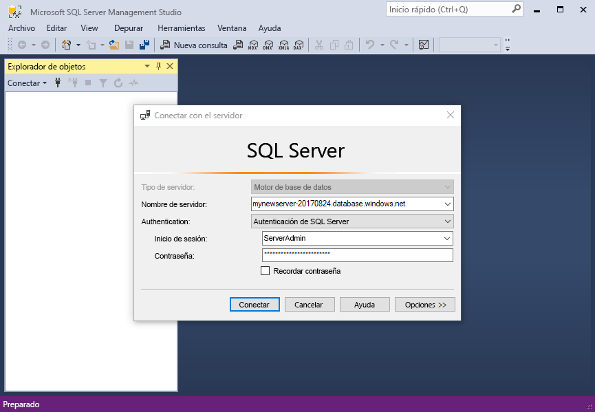
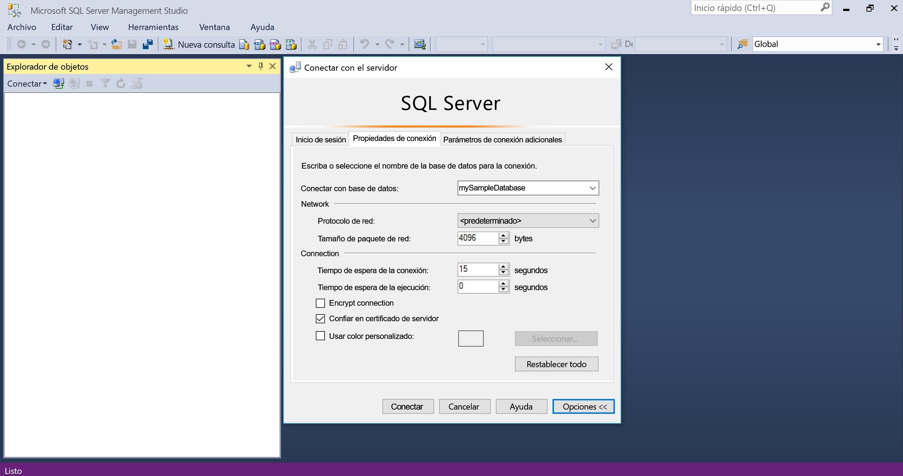
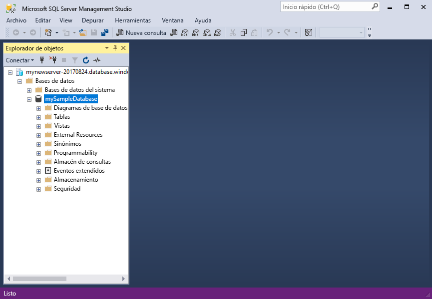
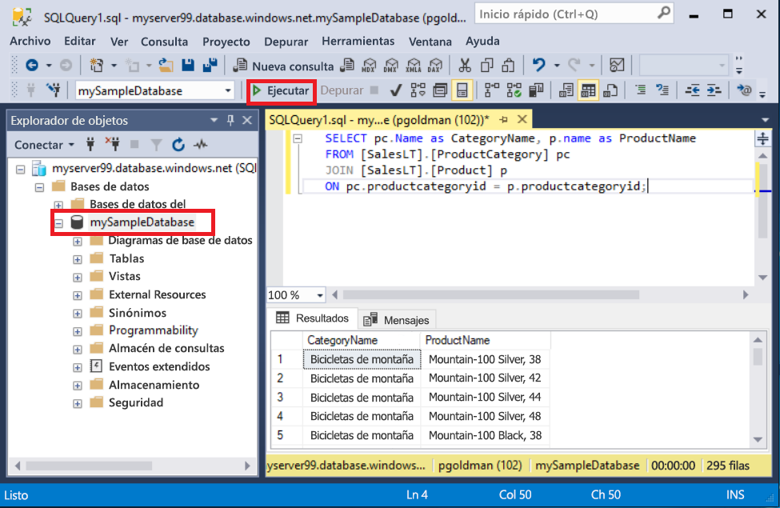
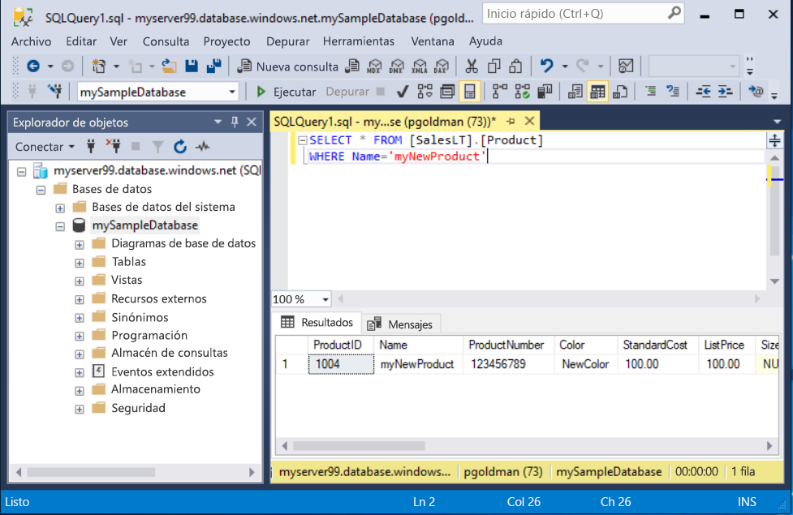

# <a name="quickstart-use-sql-server-management-studio-to-connect-and-query-an-azure-sql-database"></a>Guía de inicio rápido: uso de SQL Server Management Studio para conectarse a una base de datos de Azure SQL Database y realizar consultas en ella

En este inicio rápido usará [SQL Server Management Studio][ssms-install-latest-84g] (SSMS) para conectarse a una instancia de Azure SQL Database. Después, usará instrucciones Transact-SQL para consultar, insertar, actualizar y eliminar datos. Puede usar SSMS para administrar cualquier infraestructura de SQL, desde SQL Server a SQL Database para Microsoft Windows.  

## <a name="prerequisites"></a>Requisitos previos

Para completar este tutorial, necesita:

[!INCLUDE [prerequisites-create-db](../../includes/sql-database-connect-query-prerequisites-create-db-includes.md)]

* Una regla de firewall configurada a nivel de servidor. Para más información, consulte [Creación de una regla de firewall de nivel de servidor](sql-database-get-started-portal-firewall.md).

#### <a name="install-the-latest-ssms"></a>Instalación del SSMS más reciente

Antes de empezar, asegúrese de tener instala la versión más reciente de [SSMS][ssms-install-latest-84g]. 

## <a name="sql-server-connection-information"></a>Información de conexión de SQL server

[!INCLUDE [prerequisites-server-connection-info](../../includes/sql-database-connect-query-prerequisites-server-connection-info-includes.md)]

## <a name="connect-to-your-database"></a>Conectarse a la base de datos

En SMSS, conéctese al servidor de Azure SQL Database. 

> [!IMPORTANT]
> Un servidor lógico de Azure SQL Database escucha en el puerto 1433. Para conectarse a un servidor lógico desde detrás de un firewall corporativo, el firewall debe tener abierto este puerto.
>

1. Abra SSMS. Aparecerá el cuadro de diálogo **Conectar con el servidor** .

2. Escriba la siguiente información:

   | Configuración      | Valor sugerido    | DESCRIPCIÓN | 
   | ------------ | ------------------ | ----------- | 
   | **Tipo de servidor** | Motor de base de datos | Valor requerido. |
   | **Nombre del servidor** | Nombre completo del servidor | Algo similar a: **mynewserver20170313.database.windows.net**. |
   | **Autenticación** | Autenticación de SQL Server | Este tutorial usa Autenticación de SQL. |
   | **Inicio de sesión** | Identificador de usuario de la cuenta de administrador del servidor | El identificador de usuario de la cuenta de administrador del servidor que se usó para crear el servidor. |
   | **Contraseña** | Contraseña segura de la cuenta de administrador | La contraseña de la cuenta de administrador del servidor que se usó para crear el servidor. |
   ||||

     

3. Seleccione **Opciones** en el cuadro de diálogo **Conectar con el servidor**. En el menú desplegable **Conectar con el servidor**, seleccione **mySampleDatabase**.

     

4. Seleccione **Conectar**. Se abre la ventana del Explorador de objetos. 

5. Para ver los objetos de la base de datos, expanda **Bases de datos** y luego expanda **mySampleDatabase**.

     

## <a name="query-data"></a>Datos de consulta

Ejecute el código Transact-SQL [SELECT](https://msdn.microsoft.com/library/ms189499.aspx) para consultar los 20 primeros productos por categoría.

1. En el Explorador de objetos, haga clic con el botón derecho en **mySampleDatabase** y seleccione **Nueva consulta**. Se abre una ventana de consulta conectada a la base de datos.

2. En la ventana de consulta, pegue esta consulta SQL.

   ```sql
   SELECT pc.Name as CategoryName, p.name as ProductName
   FROM [SalesLT].[ProductCategory] pc
   JOIN [SalesLT].[Product] p
   ON pc.productcategoryid = p.productcategoryid;
   ```

3. En la barra de herramienta, seleccione **Ejecutar** para recuperar los datos de las tablas `Product` y `ProductCategory`.

    

## <a name="insert-data"></a>Insertar datos

Ejecute el código Transact-SQL [INSERT](https://msdn.microsoft.com/library/ms174335.aspx) para crear un nuevo producto en la tabla `SalesLT.Product`.

1. Reemplace la consulta anterior por esta otra.

   ```sql
   INSERT INTO [SalesLT].[Product]
           ( [Name]
           , [ProductNumber]
           , [Color]
           , [ProductCategoryID]
           , [StandardCost]
           , [ListPrice]
           , [SellStartDate] )
     VALUES
           ('myNewProduct'
           ,123456789
           ,'NewColor'
           ,1
           ,100
           ,100
           ,GETDATE() );
   ```

2. Seleccione **Ejecutar** para insertar una nueva fila en la tabla `Product`. El panel **Mensajes** muestra **(1 fila afectada)**.

## <a name="view-the-result"></a>Visualización del resultado

1. Reemplace la consulta anterior por esta otra.

   ```sql
   SELECT * FROM [SalesLT].[Product] 
   WHERE Name='myNewProduct' 

2. Select **Execute**. The following result appears. 

   

 
## Update data

Run this [UPDATE](https://msdn.microsoft.com/library/ms177523.aspx) Transact-SQL code to modify your new product.

1. Replace the previous query with this one.

   ```sql
   UPDATE [SalesLT].[Product]
   SET [ListPrice] = 125
   WHERE Name = 'myNewProduct';
   ```

2. Seleccione **Ejecutar** para actualizar la fila especificada en la tabla `Product`. El panel **Mensajes** muestra **(1 fila afectada)**.

## <a name="delete-data"></a>Eliminación de datos

Ejecute el código Transact-SQL [DELETE](https://msdn.microsoft.com/library/ms189835.aspx) para eliminar el nuevo producto.

1. Reemplace la consulta anterior por esta otra.

   ```sql
   DELETE FROM [SalesLT].[Product]
   WHERE Name = 'myNewProduct';
   ```

2. Seleccione **Ejecutar** para eliminar la fila especificada en la tabla `Product`. El panel **Mensajes** muestra **(1 fila afectada)**.

## <a name="next-steps"></a>Pasos siguientes

- Para más información sobre SSMS, consulte [SQL Server Management Studio](https://msdn.microsoft.com/library/ms174173.aspx).
- Para conectarse y consultar mediante Azure Portal, consulte [Conexión y consulta con el editor de consultas SQL de Azure Portal](sql-database-connect-query-portal.md).
- Para conectarse y consultar con Visual Studio, vea [Conexión y consultas con Visual Studio Code](sql-database-connect-query-vscode.md).
- Para conectarse y consultar con .NET, vea [Conexión y consultas con .NET](sql-database-connect-query-dotnet.md).
- Para conectarse y consultar con PHP, vea [Conexión y consultas con PHP](sql-database-connect-query-php.md).
- Para conectarse y consultar con Node.js, vea [Conexión y consultas con Node.js](sql-database-connect-query-nodejs.md).
- Para conectarse y consultar con Java, vea [Conexión y consultas con Java](sql-database-connect-query-java.md).
- Para conectarse y consultar con Python, vea [Conexión y consultas con Python](sql-database-connect-query-python.md).
- Para conectarse y consultar con Ruby, vea [Conexión y consultas con Ruby](sql-database-connect-query-ruby.md).


<!-- Article link references. -->

[ssms-install-latest-84g]: https://docs.microsoft.com/sql/ssms/sql-server-management-studio-ssms

