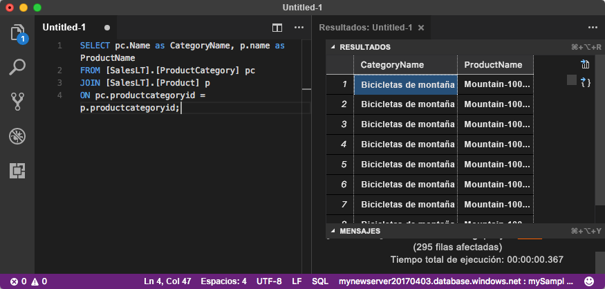

# <a name="quickstart-use-visual-studio-code-to-connect-and-query-an-azure-sql-database"></a>Inicio rápido: Uso de Visual Studio Code para conectar y consultar una instancia de Azure SQL Database

[Visual Studio Code](https://code.visualstudio.com/docs) es un editor de código gráfico para Linux, macOS y Windows. Admite extensiones, como la [extensión mssql](https://aka.ms/mssql-marketplace) para consultar Microsoft SQL Server, Azure SQL Database y SQL Data Warehouse. En este inicio rápido, usará Visual Studio Code para conectarse a una instancia de Azure SQL Database y luego ejecutará instrucciones Transact-SQL para consultar, insertar, actualizar y eliminar datos.

## <a name="prerequisites"></a>Requisitos previos

Para completar este tutorial, necesita:

[!INCLUDE [prerequisites-create-db](../../includes/sql-database-connect-query-prerequisites-create-db-includes.md)]

#### <a name="install-visual-studio-code"></a>Instalación de Visual Studio Code

Asegúrese de haber instalado la versión más reciente de [Visual Studio Code](https://code.visualstudio.com/Download) y de haber cargado la [extensión mssql](https://aka.ms/mssql-marketplace). Para instrucciones sobre cómo instalar la extensión mssql, consulte [Instalación de VS Code](https://docs.microsoft.com/sql/linux/sql-server-linux-develop-use-vscode#install-vs-code) y [mssql para Visual Studio Code](https://marketplace.visualstudio.com/items?itemName=ms-mssql.mssql). 

## <a name="configure-visual-studio-code"></a>Configuración deVisual Studio Code 

### <a name="mac-os"></a>**Mac OS**
En el caso de macOS, debe instalar OpenSSL, que es un requisito previo para .Net Core que la extensión mssql utiliza. Abra el terminal y escriba los siguientes comandos para instalar **brew** y **OpenSSL**. 

```bash
ruby -e "$(curl -fsSL https://raw.githubusercontent.com/Homebrew/install/master/install)"
brew update
brew install openssl
mkdir -p /usr/local/lib
ln -s /usr/local/opt/openssl/lib/libcrypto.1.0.0.dylib /usr/local/lib/
ln -s /usr/local/opt/openssl/lib/libssl.1.0.0.dylib /usr/local/lib/
```

### <a name="linux-ubuntu"></a>**Linux (Ubuntu)**

No se necesita ninguna configuración especial.

### <a name="windows"></a>**Windows**

No se necesita ninguna configuración especial.

## <a name="sql-server-connection-information"></a>Información de conexión de SQL server

[!INCLUDE [prerequisites-server-connection-info](../../includes/sql-database-connect-query-prerequisites-server-connection-info-includes.md)]

## <a name="set-language-mode-to-sql"></a>Definición del modo de lenguaje en SQL

En Visual Studio Code, establezca el modo de lenguaje en **SQL** para habilitar los comandos de mssql y T-SQL IntelliSense.

1. Abra una nueva ventana de Visual Studio Code. 

2. Presione **CTRL**+**N**. Se abre un nuevo archivo de texto sin formato. 

3. Seleccione **Texto sin formato** en la esquina inferior derecha de la barra de estado.

4. En el menú desplegable **Seleccionar modo de lenguaje** que se abre, seleccione **SQL**. 

## <a name="connect-to-your-database"></a>Conectarse a la base de datos

Use Visual Studio Code para establecer una conexión con el servidor de Azure SQL Database.

> [!IMPORTANT]
> Antes de continuar, asegúrese de tener preparados el servidor y la información de inicio de sesión. Cuando comience a escribir la información de perfil de conexión, si cambia el foco de Visual Studio Code, tendrá que reiniciar la creación del perfil.
>

1. En Visual Studio Code, presione **Ctrl+Mayús+P** (o **F1**) para abrir la paleta de comandos.

2. Seleccione **MS SQL:Connect** y elija **Entrar**.

3. Seleccione **Crear perfil de conexión**.

4. Siga las indicaciones y especifique las propiedades de conexión del perfil nuevo. Después de especificar cada valor, elija **Entrar** para continuar. 

   | Propiedad       | Valor sugerido | DESCRIPCIÓN |
   | ------------ | ------------------ | ------------------------------------------------- | 
   | **Nombre del servidor** | Nombre completo del servidor | Algo similar a: **mynewserver20170313.database.windows.net**. |
   | **Nombre de la base de datos** | mySampleDatabase | La base de datos a la que hay que conectarse. |
   | **Autenticación** | Inicio de sesión SQL| Este tutorial usa Autenticación de SQL. |
   | **Nombre de usuario** | Nombre de usuario | El nombre de usuario de la cuenta de administrador del servidor que se usó para crear el servidor. |
   | **Contraseña (Inicio de sesión de SQL)** | Contraseña | La contraseña de la cuenta de administrador del servidor que se usó para crear el servidor. |
   | **¿Guardar la contraseña?** | Sí o no | Seleccione **Sí** si no quiere escribir la contraseña cada vez que inicie sesión. |
   | **Escribir un nombre para este perfil** | Un nombre de perfil, como **mySampleProfile** | Un perfil guardado acelera la conexión en los inicios de sesión posteriores. | 

   Si se realiza correctamente, aparece una notificación que indica que se creó y conectó el perfil.

## <a name="query-data"></a>Datos de consulta

Ejecute la siguiente instrucción Transact-SQL [SELECT](https://msdn.microsoft.com/library/ms189499.aspx) para consultar los 20 primeros productos por categoría.

1. En la ventana del editor, pegue la consulta SQL siguiente.

   ```sql
   SELECT pc.Name as CategoryName, p.name as ProductName
   FROM [SalesLT].[ProductCategory] pc
   JOIN [SalesLT].[Product] p
   ON pc.productcategoryid = p.productcategoryid;
   ```

2. Presione **Ctrl**+**Mayús**+**E** para ejecutar la consulta y mostrar los resultados de las tablas `Product` y `ProductCategory`.

    

## <a name="insert-data"></a>Insertar datos

Ejecute la siguiente instrucción Transact-SQL [INSERT](https://msdn.microsoft.com/library/ms174335.aspx) para agregar un nuevo producto en la tabla `SalesLT.Product`.

1. Reemplace la consulta anterior por esta otra.

   ```sql
   INSERT INTO [SalesLT].[Product]
           ( [Name]
           , [ProductNumber]
           , [Color]
           , [ProductCategoryID]
           , [StandardCost]
           , [ListPrice]
           , [SellStartDate]
           )
     VALUES
           ('myNewProduct'
           ,123456789
           ,'NewColor'
           ,1
           ,100
           ,100
           ,GETDATE() );
   ```

2. Presione **Ctrl**+**Mayús**+**E** para insertar una fila nueva en la tabla `Product`.

## <a name="update-data"></a>Actualización de datos

Ejecute la siguiente instrucción Transact-SQL [UPDATE](https://msdn.microsoft.com/library/ms177523.aspx) para actualizar el producto agregado.

1. Reemplace la consulta anterior por esta:

   ```sql
   UPDATE [SalesLT].[Product]
   SET [ListPrice] = 125
   WHERE Name = 'myNewProduct';
   ```

2. Presione **Ctrl**+**Mayús**+**E** para actualizar la fila especificada en la tabla `Product`.

## <a name="delete-data"></a>Eliminación de datos

Ejecute la siguiente instrucción Transact-SQL [DELETE](https://docs.microsoft.com/sql/t-sql/statements/delete-transact-sql) para quitar el producto nuevo.

1. Reemplace la consulta anterior por esta:

   ```sql
   DELETE FROM [SalesLT].[Product]
   WHERE Name = 'myNewProduct';
   ```

2. Presione **Ctrl**+**Mayús**+**E** para eliminar la fila especificada en la tabla `Product`.

## <a name="next-steps"></a>Pasos siguientes

- Para conectarse y hacer consultas mediante SQL Server Management Studio, consulte [Guía de inicio rápido: Azure SQL Database: uso de SQL Server Management Studio para conectarse a los datos y realizar consultas en ellos](sql-database-connect-query-ssms.md).
- Para conectarse y hacer consultas con Azure Portal, consulte [Guía de inicio rápido: Azure Portal: uso del editor de consultas SQL para conectarse y consultar datos](sql-database-connect-query-portal.md).
- Si está interesado en ver un artículo de la revista de MSDN sobre el uso de Visual Studio Code, consulte la entrada del blob sobre cómo [crear un IDE de base de datos con la extensión MSSQL](https://msdn.microsoft.com/magazine/mt809115).
