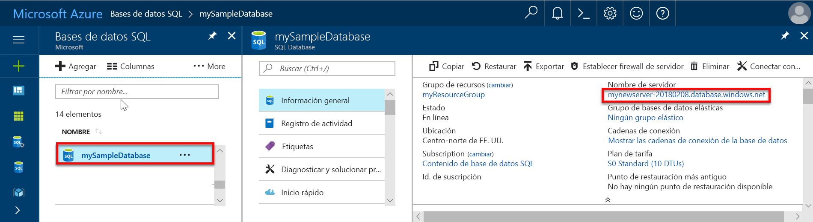

# Guía de inicio rápido: Creación de una regla de firewall de nivel de servidor para SQL Database mediante Azure Portal

Este inicio rápido le guía a través de la creación de una regla de firewall de nivel de servidor para una instancia de Azure SQL Database para que pueda conectarse a ella desde un recurso local.

## Requisitos previos

En esta guía de inicio rápido se usan los recursos creados en [Creación de una instancia de Azure SQL Database en Azure Portal](sql-database-get-started-portal.md) como punto de partida.

## Inicio de sesión en Azure Portal

Inicie sesión en el [Azure Portal](https://portal.azure.com/).

## Crear una regla de firewall de nivel de servidor

El servicio SQL Database crea un firewall en el nivel de servidor. Este firewall evita que herramientas y aplicaciones se conecten al servidor o a las bases de datos del servidor a menos que se cree una regla de firewall para abrir el firewall. Para una conexión desde una dirección IP fuera de Azure, cree una regla de firewall para una dirección IP específica o un intervalo de direcciones. Para más información general acerca de las reglas de firewall, consulte [Creación de una regla de firewall de nivel de servidor para SQL Database mediante Azure Portal](sql-database-firewall-configure.md).

> [!NOTE]
> SQL Database se comunica a través del puerto 1433. Si intenta conectarse desde una red corporativa, es posible que el firewall de la red no permita el tráfico saliente a través del puerto 1433. En ese caso, no puede conectarse al servidor de Azure SQL Database, salvo que el departamento de TI abra el puerto 1433.
>

Siga estos pasos para crear una regla de firewall de nivel de servidor para la dirección IP de su cliente y habilite la conectividad externa mediante el firewall de SQL Database solo para su dirección IP.

1. Una vez completa la implementación del [requisito de la base de datos de Azure SQL](#prerequisites), seleccione **Bases de datos SQL** en el menú izquierdo y, después, elija **mySampleDatabase** en la página **Bases de datos SQL**. Se abre la página de información general de la base de datos, que muestra el nombre completo del servidor (por ejemplo, **mynewserver-20170824.database.windows.net**) y proporciona opciones para otras configuraciones.

2. Copie este nombre de servidor completo para conectarse a su servidor y a sus bases de datos en otras guías de inicio rápido.

   

3. Seleccione **Establecer el firewall del servidor** en la barra de herramientas. Se abrirá la página **Configuración del firewall** del servidor de SQL Database.

   

4. Elija **Agregar IP de cliente** en la barra de herramientas para agregar la dirección IP actual a la nueva regla de firewall. La regla de firewall puede abrir el puerto 1433 para una única dirección IP o un intervalo de direcciones IP.

   > [!IMPORTANT]
   > De forma predeterminada, el acceso a través del firewall de SQL Database está habilitado para todos los servicios de Azure. Elija **OFF** (Desactivar) en esta página para deshabilitar todos los servicios de Azure.
   >

5. Seleccione **Guardar**. Se crea una regla de firewall de nivel de servidor para el puerto 1433 de la dirección IP actual en el servidor lógico.

6. Cierre la página **Configuración de firewall**.

Mediante SQL Server Management Studio o cualquier otra herramienta que elija, ahora puede conectarse al servidor de SQL Database y a sus bases de datos desde esta dirección IP, usando la cuenta de administrador del servidor creada con anterioridad.

## Limpieza de recursos

Guarde estos recursos si desea volver a la sección [Pasos siguientes](#next-steps) y aprender a conectarse y consultar la base de datos mediante una serie de métodos diferentes. Sin embargo, si desea eliminar los recursos que ha creado en esta guía de inicio rápido, siga estos pasos.

1. En el menú izquierdo de Azure Portal, seleccione **Grupos de recursos** y **myResourceGroup**.
2. En la página del grupo de recursos, seleccione **Eliminar**, escriba **myResourceGroup** en el cuadro de texto y, después, seleccione **Eliminar**.

## Pasos siguientes

- Ahora que tiene una base de datos, puede [conectarse y realizar consultas](sql-database-connect-query.md) con las herramientas o lenguajes que prefiera, incluidas:
  - [Conexión y consulta con SQL Server Management Studio](sql-database-connect-query-ssms.md)
  - [Conexión y consulta de datos con Azure Data Studio](https://docs.microsoft.com/sql/azure-data-studio/quickstart-sql-database?toc=/azure/sql-database/toc.json)
- Para aprender a diseñar su primera base de datos, crear tablas e insertar datos, consulte uno de estos tutoriales:
  - [Diseño de la primera instancia de Azure SQL Database mediante SSMS](sql-database-design-first-database.md)
  - [Diseño de una base de datos de Azure SQL Database y conexión con C# y ADO.NET](sql-database-design-first-database-csharp.md)
