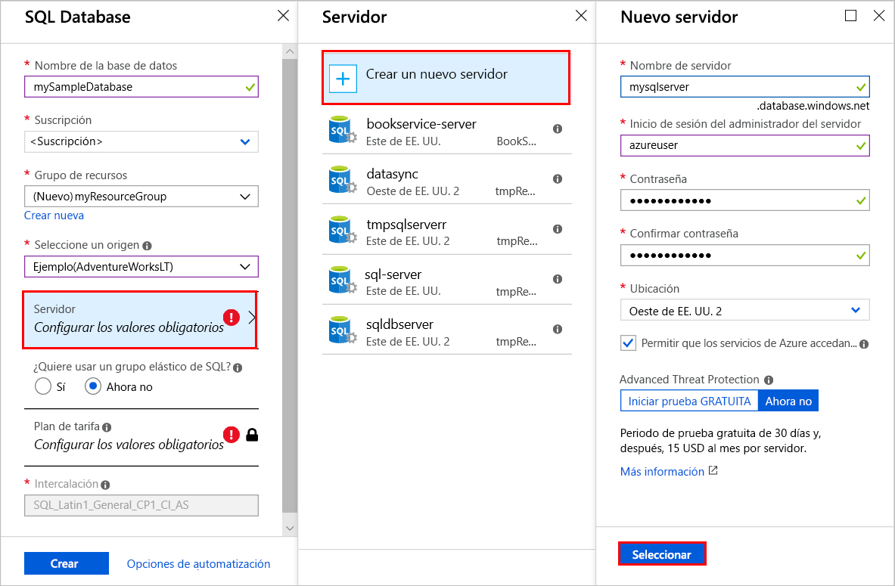
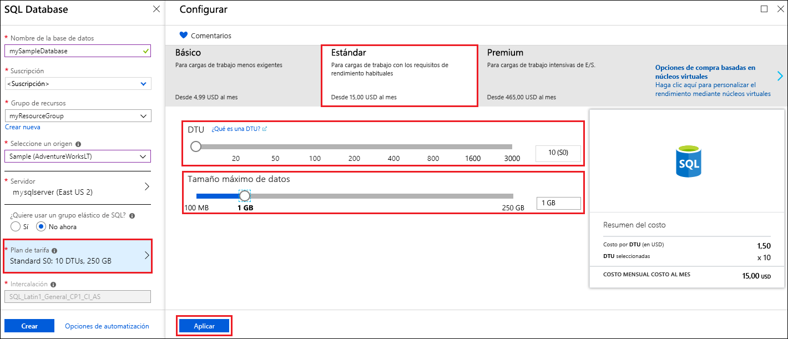
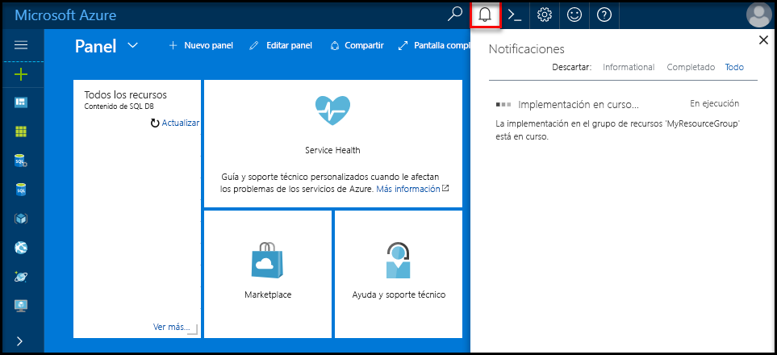

# <a name="quickstart-create-an-azure-sql-database-in-the-azure-portal"></a>Inicio rápido: Creación de una instancia de Azure SQL Database en Azure Portal

Azure SQL Database es una *base de datos como servicio* que permite ejecutar y escalar bases de datos de SQL Server de alta disponibilidad en la nube. En este inicio rápido se muestra cómo comenzar mediante la creación y la posterior consulta de una base de datos de Azure SQL desde Azure Portal. 

Si no tiene una suscripción a Azure, [cree una cuenta gratuita](https://azure.microsoft.com/free/).

Para seguir todos los pasos de este artículo de inicio rápido debe iniciar sesión en [Azure Portal](https://portal.azure.com/).

## <a name="create-a-sql-database"></a>Creación de una base de datos SQL

Una instancia de Azure SQL Database tiene un conjunto definido de [recursos de proceso y almacenamiento](sql-database-service-tiers-dtu.md). La base de datos se crea en un [servidor lógico de Azure SQL Database](sql-database-features.md) que se encuentra dentro de un [grupo de recursos de Azure](../azure-resource-manager/resource-group-overview.md).

Para crear una base de datos SQL que contenga los datos de ejemplo AdventureWorksLT:

1. Haga clic en **Crear un recurso** en la esquina superior izquierda de Azure Portal.
   
1. Seleccione **Bases de datos** y, luego, **SQL Database**.
   
1. En el formulario **Crear base de datos SQL**, escriba o seleccione los siguientes valores: 
   
   - **Nombre de base de datos**: Escriba *mySampleDatabase*.
   - **Suscripción**: Abra la lista desplegable y seleccione la suscripción correcta, en caso de que no aparezca.
   - **Grupo de recursos**: Seleccione **Crear nuevo**, escriba *myResourceGroup* y seleccione **Aceptar**. 
   - **Seleccionar origen**: Abra la lista desplegable y seleccione **Sample (AdventureWorksLT)** [Ejemplo (AdventureWorksLT)].
    
    >[!IMPORTANT]
    >Asegúrese de seleccionar los datos de **Sample (AdventureWorksLT)** para poder seguir este y otros artículos de inicio rápido de Azure SQL Database que usan estos datos.
  
   
   
1. En **Servidor**, seleccione **Crear nuevo**. 
   
1. En el formulario **Nuevo servidor** , escriba o seleccione los siguientes valores: 
   
   - **Nombre del servidor**: Escriba *mysqlserver*.
   - **Inicio de sesión del administrador del servidor**: escriba *azureuser*. 
   - **Contraseña**: Escriba *Azure1234567*. 
   - **Confirmar contraseña**: vuelva a escribir la contraseña.
   - **Ubicación**: abra la lista desplegable y seleccione cualquier ubicación válida.  
   
   >[!IMPORTANT]
   >No olvide registrar el inicio de sesión y la contraseña del administrador del servidor, con el fin de poder iniciar sesión en el servidor y las bases de datos en este y otros inicios rápidos. Si olvida la contraseña o el inicio de sesión, puede obtener el nombre de inicio de sesión o restablecer la contraseña en la página de **SQL server**. Para abrir la página de **SQL server**, seleccione el nombre del servidor en la página de **información general** de la base de datos después de la creación de esta.
   
    

1. Elija **Seleccionar**.
   
1. En el formulario **SQL Database**, seleccione **Plan de tarifa**. Explore la cantidad de almacenamiento y de DTU disponibles para cada nivel de servicio.
   
   >[!NOTE]
   >Este artículo de inicio rápido usa el [modelo de compra basado en DTU](sql-database-service-tiers-vcore.md), pero también está disponible el [modelo de compra basado en núcleos virtuales](sql-database-service-tiers-dtu.md).
   
   >[!NOTE]
   >Existe más de 1 TB de almacenamiento en el nivel Premium actualmente disponible en todas las regiones excepto: Norte de Reino Unido, Centro-oeste de EE. UU., Sur de Reino Unido 2, Este de China, US DoD (centro), Centro de Alemania, US DoD (este), US Gov (suroeste), US Gov (centro-sur), Nordeste de Alemania, Norte de China y US Gov (este). En estas regiones, el almacenamiento máximo en el nivel Prémium está limitado a 1 TB. Para más información, consulte las [limitaciones actuales de P11 y P15](sql-database-dtu-resource-limits-single-databases.md#single-database-limitations-of-p11-and-p15-when-the-maximum-size-greater-than-1-tb).  
   
1. Para este artículo de inicio rápido, seleccione el nivel de servicio **Estándar** y utilice el control deslizante para seleccionar **10 DTU (S0)** y **1** GB de almacenamiento.
   
1. Seleccione **Aplicar**.  
   
   
   
1. En el formulario **SQL Database**, seleccione **Crear** para implementar y aprovisionar el grupo de recursos, el servidor y la base de datos. 
   
   La implementación tarda unos minutos. Para supervisar el proceso de implementación, puede seleccionar **Notificaciones** en la barra de herramientas.

   

## <a name="query-the-sql-database"></a>Consulta a SQL Database

Ahora que ha creado una instancia de Azure SQL Database, use la herramienta de consulta integrada en Azure Portal para conectarse a la base de datos y realizar consultas en los datos.

1. En la página **SQL Database** de su base de datos, seleccione **Editor de consultas (versión preliminar)** en el menú de la izquierda. 
   
   
   
1. Escriba su información de inicio de sesión y seleccione **Aceptar**.
   
1. Escriba la siguiente consulta en el panel del **Editor de consultas**.
   
   ```sql
   SELECT TOP 20 pc.Name as CategoryName, p.name as ProductName
   FROM SalesLT.ProductCategory pc
   JOIN SalesLT.Product p
   ON pc.productcategoryid = p.productcategoryid;
   ```
   
1. Seleccione **Ejecutar** y examine los resultados de la consulta en el panel **Resultados**.

   
   
1. Cierre la página **Editor de consultas** y seleccione **Aceptar** cuando se le pida que descarte los cambios que no se hayan guardado.

## <a name="clean-up-resources"></a>Limpieza de recursos

Mantenga este grupo de recursos, el servidor SQL y la base de datos SQL si quiere ir a [Pasos siguientes](#next-steps). Los pasos siguientes muestran cómo conectarse a la base de datos y consultarla mediante distintos métodos. 

Cuando haya terminado con estos recursos, puede eliminarlos como se indica a continuación:

1. En el menú izquierdo de Azure Portal, seleccione **Grupos de recursos** y, después, **myResourceGroup**.
1. En la página del grupo de recursos, seleccione **Eliminar grupo de recursos**. 
1. Escriba *myResourceGroup* en el campo y, después, seleccione **Eliminar**.

## <a name="next-steps"></a>Pasos siguientes

- Cree una regla de firewall de nivel de servidor para conectarse a su instancia de Azure SQL Database desde herramientas locales o remotas. Para más información, consulte [Creación de una regla de firewall de nivel de servidor](sql-database-get-started-portal-firewall.md).
- Después de crear una regla de firewall de nivel de servidor, puede usar varias herramientas y lenguajes para [conectarse a la base de datos y realizar consultas en ella](sql-database-connect-query.md). 
  - [Conexión y consulta con SQL Server Management Studio](sql-database-connect-query-ssms.md)
  - [Conexión y consulta de datos con Azure Data Studio](https://docs.microsoft.com/sql/azure-data-studio/quickstart-sql-database?toc=/azure/sql-database/toc.json)
- Para crear instancias de Azure SQL Database mediante la CLI de Azure, consulte [Ejemplos de la CLI de Azure para Azure SQL Database](sql-database-cli-samples.md).
- Para crear instancias de Azure SQL Database mediante Azure Powershell, consulte [Ejemplos de Azure PowerShell para Azure SQL Database](sql-database-powershell-samples.md).
