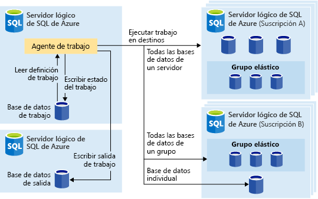
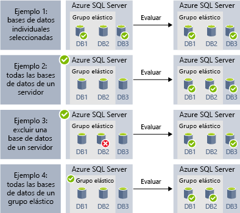
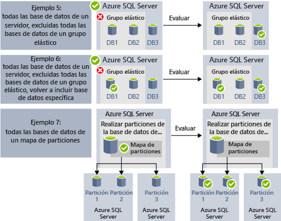

# <a name="automate-management-tasks-using-database-jobs"></a>Automatización de tareas de administración mediante trabajos de base de datos

Azure SQL Database le permite crear y programar trabajos que se pueden ejecutar periódicamente en una o varias bases de datos para realizar consultas T-SQL y llevar a cabo tareas de mantenimiento. Cada trabajo registra el estado de ejecución y también reintenta automáticamente las operaciones si se produce algún error.
Puede definir la base de datos o los grupos de bases de datos de Azure SQL de destino donde se ejecutará el trabajo y también las programaciones para ejecutar un trabajo.
Un trabajo gestiona la tarea de iniciar sesión en la base de datos de destino. También definirá, mantendrá y conservará los scripts de Transact-SQL que se van a ejecutar en un grupo de bases de datos de Azure SQL.

## <a name="when-to-use-automated-jobs"></a>Cuándo usar trabajos automatizados

Son varios los escenarios en los que podría usar la automatización de trabajos:

- Automatización de las tareas de administración y, luego, su programación para ejecutarlas todos los días laborables, después de horas, etc.
  - Implementación de cambios de esquema, administración de credenciales, recopilación de datos de rendimiento o recopilación de datos de telemetría de inquilinos (clientes).
  - Actualización de datos de referencia (información común entre todas las bases de datos), carga de datos desde Azure Blob Storage.
  - Regeneración de índices para mejorar el rendimiento de consultas. Configuración de trabajos para su ejecución en una colección de bases de datos periódicamente como, por ejemplo, fuera de horas pico.
  - Recopile los resultados de consulta de un conjunto de bases de datos en una tabla central de forma continua. Las consultas de rendimiento pueden ejecutarse continuamente y configurarse para que desencadenen la ejecución de otras tareas.
- Recopilación de datos para informes
  - Agregue datos de una colección de bases de datos de Azure SQL en una tabla de destino única.
  - Ejecute consultas de procesamiento de datos de ejecución más larga en un conjunto grande de bases de datos; por ejemplo, la recopilación de telemetría de cliente. Los resultados se recopilan en una sola tabla de destino para su posterior análisis.
- Movimientos de datos
  - Cree trabajos que repliquen los cambios realizados en las bases de datos a otras bases de datos o que recopilen las actualizaciones realizadas en las bases de datos remotas y apliquen los cambios en la base de datos.
  - Cree trabajos que carguen los datos desde o hacia sus bases de datos mediante SQL Server Integration Services (SSIS).

## <a name="overview"></a>Información general

Las siguientes tecnologías de programación de trabajos están disponibles en Azure SQL Database:

- Los **trabajos del Agente SQL** son componentes de programación de trabajos de SQL Server clásicos y probados que están disponibles en Instancia administrada. Los trabajos del Agente SQL no están disponibles en las bases de datos únicas de Azure SQL.
- Los **trabajos de Elastic Database (versión preliminar)** son el servicio de programación de trabajos que ejecuta trabajos personalizados en una o varias bases de datos de Azure SQL.

Cabe destacar un par de diferencias entre el Agente SQL (disponible de modo local y como parte de Instancia administrada de SQL Database) y el agente de trabajos elásticos de base de datos (disponible para bases de datos únicas en Azure SQL Database y bases de datos en SQL Data Warehouse).

|  |Trabajos elásticos  |Agente SQL |
|---------|---------|---------|
|Ámbito     |  Cualquier número de almacenamientos de datos o bases de datos de Azure SQL en la misma nube de Azure que el agente de trabajos. Los destinos pueden estar en diferentes servidores de SQL Database, suscripciones o regiones. <br><br>Los grupos de destino pueden estar compuestos de bases de datos individuales o almacenamientos de datos o de todas las bases de datos de un servidor, grupo o mapa de particiones (enumeradas dinámicamente en el momento de la ejecución de trabajo). | Cualquier base de datos individual en la misma instancia de SQL Server que el Agente SQL. |
|Herramientas y API admitidas     |  Azure Portal, PowerShell, T-SQL, Azure Resource Manager      |   T-SQL, SQL Server Management Studio (SSMS)     |

## <a name="sql-agent-jobs"></a>Trabajos del Agente SQL

Los trabajos del Agente SQL son una serie especificada de scripts de T-SQL que se ejecutan en la base de datos. Use trabajos para definir una tarea administrativa que se puede ejecutar una o varias veces y supervisar para detectar si lo hace correctamente o con errores.
Un trabajo se puede ejecutar en un servidor local o en varios servidores remotos. Los trabajos del Agente SQL son un componente interno del motor de base de datos que se ejecuta dentro del servicio Instancia administrada.
En los trabajos del Agente SQL, hay varios conceptos clave que conviene describir:

- **Pasos del trabajo**: conjunto de uno o varios pasos que se deben ejecutar dentro del trabajo. Para cada paso de trabajo se puede definir la estrategia de reintento y la acción que tendrá lugar si el paso del trabajo se realiza correctamente o con errores.
- **Programaciones**: definen cuándo se debe ejecutar el trabajo.
- **Notificaciones**: le permiten definir las reglas que se usarán para notificar a los operadores la finalización del trabajo mediante un mensaje de correo electrónico.

### <a name="job-steps"></a>Pasos de trabajo

Los pasos del trabajo del Agente SQL son secuencias de acciones que debe ejecutar el Agente SQL. Cada paso tiene el siguiente paso que se debe ejecutar si el paso se realiza correctamente o con errores y el número de reintentos en caso de error.
El Agente SQL le permite crear distintos tipos de pasos de trabajo, como pasos de trabajo de Transact-SQL que ejecutan un único lote de Transact-SQL en la base de datos, pasos de PowerShell o de comandos del sistema operativo que pueden ejecutar scripts personalizados del sistema operativo, pasos de trabajo de SSIS que le permiten cargar datos con el entorno de ejecución de SSIS o pasos de [replicación](sql-database-managed-instance-transactional-replication.md) que pueden publicar los cambios de la base de datos en otras bases de datos.

La [replicación transaccional](sql-database-managed-instance-transactional-replication.md) es una característica del motor de base de datos que le permite publicar los cambios realizados en una o varias tablas de una base de datos y publicarlos o distribuirlos a un conjunto de bases de datos del suscriptor. La publicación de los cambios se implementa mediante los siguientes tipos de paso de trabajo del Agente SQL:

- Lector del registro de transacciones.
- Instantánea.
- Distribuidor.

Actualmente no se admiten otros tipos de pasos de trabajo, incluidos:

- No se admite el paso de trabajo de replicación de mezcla.
- Aún no se admite el lector de colas.
- No se admite Analysis Services.

### <a name="job-schedules"></a>Programación de trabajos

Una programación especifica cuándo se ejecuta un trabajo. Se puede ejecutar más de un trabajo en la misma programación y se puede aplicar más de una programación al mismo trabajo.
Una programación puede definir las condiciones siguientes para el momento en que se ejecuta un trabajo:

- Cada vez que se reinicie la instancia (o cuando se inicia el Agente SQL Server). El trabajo se activa después de cada conmutación por error.
- Una vez, en una fecha y a una hora específicas, que sea útil para la ejecución retrasada de algún trabajo.
- Según una programación periódica.

> [!Note]
> Instancia administrada de SQL Database no permite actualmente iniciar un trabajo cuando la instancia está "inactiva".

### <a name="job-notifications"></a>Notificaciones del trabajo

Los trabajos del Agente SQL le permiten recibir notificaciones cuando el trabajo finaliza correctamente o con errores. Puede recibir notificaciones por correo electrónico.

En primer lugar, deberá configurar la cuenta de correo electrónico que se usará para enviar las notificaciones de correo electrónico y asignar la cuenta al perfil de correo electrónico denominado `AzureManagedInstance_dbmail_profile`, como se muestra en el ejemplo siguiente:

```sql
-- Create a Database Mail account
EXECUTE msdb.dbo.sysmail_add_account_sp
    @account_name = 'SQL Agent Account',
    @description = 'Mail account for Azure SQL Managed Instance SQL Agent system.',
    @email_address = '$(loginEmail)',
    @display_name = 'SQL Agent Account',
    @mailserver_name = '$(mailserver)' ,
    @username = '$(loginEmail)' ,  
    @password = '$(password)' 

-- Create a Database Mail profile
EXECUTE msdb.dbo.sysmail_add_profile_sp
    @profile_name = 'AzureManagedInstance_dbmail_profile',
    @description = 'E-mail profile used for messages sent by Managed Instance SQL Agent.' ;

-- Add the account to the profile
EXECUTE msdb.dbo.sysmail_add_profileaccount_sp
    @profile_name = 'AzureManagedInstance_dbmail_profile',
    @account_name = 'SQL Agent Account',
    @sequence_number = 1;
```

También, deberá habilitar el correo electrónico de base de datos en Instancia administrada:

```sql
GO
EXEC sp_configure 'show advanced options', 1;  
GO  
RECONFIGURE;  
GO  
EXEC sp_configure 'Database Mail XPs', 1;  
GO  
RECONFIGURE 
```

Puede notificar al operador que algo ha sucedido con los trabajos del Agente SQL. Un operador define la información de contacto de los responsables del mantenimiento de una o varias instancias administradas. En ocasiones, las responsabilidades del operador se asignan a una sola persona.
En sistemas con varias instancias administradas o servidores SQL, muchas personas pueden compartir las responsabilidades del operador. Un operador no contiene información de seguridad y no define una entidad de seguridad.

Puede crear operadores mediante SSMS o el script de Transact-SQL que se muestra en el ejemplo siguiente:

```sql
EXEC msdb.dbo.sp_add_operator 
    @name=N'Mihajlo Pupun', 
        @enabled=1, 
        @email_address=N'mihajlo.pupin@contoso.com'
```

Puede modificar cualquier trabajo y asignar el operador al que se le notificará por correo electrónico si el trabajo se completa, produce errores o se realiza correctamente mediante SSMS o el siguiente script de Transact-SQL:

```sql
EXEC msdb.dbo.sp_update_job @job_name=N'Load data using SSIS', 
        @notify_level_email=3,                        -- Options are: 1 on succeed, 2 on failure, 3 on complete
        @notify_email_operator_name=N'Mihajlo Pupun'
```

### <a name="sql-agent-job-limitations"></a>Limitaciones de los trabajos del Agente SQL

Algunas de las características del Agente SQL que están disponibles en SQL Server no se admiten en Instancia administrada:
- La configuración del Agente SQL es de solo lectura. El procedimiento `sp_set_agent_properties` no se admite en Instancia administrada.
- La habilitación o deshabilitación del Agente SQL no se admite actualmente en Instancia administrada. El Agente SQL se ejecuta de forma continua.
- Las notificaciones se admiten parcialmente.
  - No se admite el paginador.
  - No se admite NetSend.
  - No se admiten las alertas.
- No se admiten servidores proxy.
- No se admite Eventlog.

Para más información acerca del Agente SQL Server, consulte [Agente SQL Server](https://docs.microsoft.com/sql/ssms/agent/sql-server-agent).

## <a name="elastic-database-jobs-preview"></a>Trabajos de Elastic Database (versión preliminar)

Los **trabajos de Elastic Database** proporcionan la posibilidad de ejecutar uno o varios scripts de T-SQL en paralelo, en un gran número de bases de datos, bajo una programación o a petición.

**Ejecute trabajos en cualquier combinación de bases de datos**: una o más bases de datos individuales, todas las bases de datos de un servidor, todas las bases de datos de un grupo elástico o mapa de particiones, con la flexibilidad adicional de incluir o excluir cualquier base de datos específica. **Los trabajos se pueden ejecutar en varios servidores, en varios grupos e incluso en bases de datos de distintas suscripciones.** Los servidores y los grupos se enumeran dinámicamente en tiempo de ejecución, por lo que los trabajos se ejecutarán en todas las bases de datos que existan en el grupo de destino en el momento de la ejecución.

La siguiente imagen muestra a un agente de trabajos que ejecuta los trabajos en los diferentes tipos de grupos de destino:



### <a name="elastic-job-components"></a>Componentes de los trabajos elásticos

|Componente  | Descripción (los detalles adicionales se encuentran debajo de la tabla) |
|---------|---------|
|[**Agente de trabajos elásticos**](#elastic-job-agent) |  El recurso de Azure creado para ejecutar y administrar los trabajos.   |
|[**Base de datos de trabajos**](#job-database)    |    Una base de datos de Azure SQL que el agente de trabajos utiliza para almacenar los datos relacionados con los trabajos, definiciones de trabajos, etc.      |
|[**Grupo de destino**](#target-group)      |  El conjunto de servidores, grupos, bases de datos y mapas de particiones en los que se va a ejecutar un trabajo.       |
|[**Trabajo**](#job)  |  Un trabajo es una unidad de trabajo que se compone de uno o varios [pasos de trabajo](#job-step). Los pasos de trabajo especifican el script de T-SQL que se va a ejecutar, así como otros detalles necesarios para ejecutar el script.  |


#### <a name="elastic-job-agent"></a>Agente de trabajos elásticos

Un agente de trabajos elásticos es un recurso de Azure para crear, ejecutar y administrar trabajos. El agente de trabajos elásticos es un recurso de Azure que se crea en el portal ([PowerShell](elastic-jobs-powershell.md) y REST también se admiten). 

La creación de un **agente de trabajos elásticos** requiere una base de datos SQL existente. El agente configura esta base de datos existente como la [*base de datos de trabajos*](#job-database).

El agente de trabajos elásticos es gratis. La base de datos de trabajos se factura con la misma tarifa que cualquier base de datos SQL.

#### <a name="job-database"></a>Base de datos de trabajos

La *base de datos de trabajos* se utiliza para definir los trabajos y realizar el seguimiento del estado e historial de las ejecuciones de los trabajos. La *base de datos de trabajos* también se utiliza para almacenar metadatos del agente, registros, resultados, definiciones de trabajos y también contiene muchos procedimientos almacenados útiles y otros objetos de base de datos para crear, ejecutar y administrar trabajos mediante T-SQL.

En la versión preliminar actual, es necesaria una base de datos de Azure SQL (S0 o superior) para crear un agente de trabajos elásticos.

La *base de datos de trabajos* no necesita ser nueva literalmente, pero debe estar vacía y pertenecer al objetivo de servicio S0 o superior. El objetivo de servicio recomendado de la *base de datos de trabajos* es S1 o superior, pero la opción óptima depende de las necesidades de rendimiento de los trabajos: el número de pasos de los trabajos, el número de destinos de los trabajos y la frecuencia con que se ejecutan los trabajos. Por ejemplo, una base de datos S0 puede ser suficiente para un agente de trabajos que ejecute pocos trabajos a la hora y cuyo destino sea inferior a diez bases de datos, pero la ejecución de un trabajo cada minuto podría no ser suficientemente rápida con una base de datos S0 y quizás sea mejor un nivel de servicio superior. 

Si las operaciones realizadas en la base de datos de trabajos son más lentas de lo esperado, [supervise](sql-database-monitor-tune-overview.md#monitor-database-performance) el rendimiento de la base de datos y el uso de los recursos en la base de datos de trabajos durante los períodos de lentitud mediante Azure Portal o la vista de administración dinámica [sys.dm_db_resource_stats](https://docs.microsoft.com/sql/relational-databases/system-dynamic-management-views/sys-dm-db-resource-stats-azure-sql-database). Si la utilización de un recurso, como la CPU, la E/S de datos o el registro de escritura, se aproxima al 100 % y se correlaciona con períodos de lentitud, considere la posibilidad de escalar incrementalmente la base de datos a objetivos de servicio más altos (ya sea en el [modelo de DTU](sql-database-service-tiers-dtu.md) o en el [modelo de núcleo virtual](sql-database-service-tiers-vcore.md)) hasta que el rendimiento de la base de datos mejore lo suficiente.


##### <a name="job-database-permissions"></a>Permisos de la base de datos de trabajos

Durante la creación del agente de trabajos, se crean un esquema, tablas y un rol llamado *jobs_reader* en la *base de datos de trabajos*. El rol se crea con los permisos siguientes y está diseñado para proporcionar a los administradores un mayor control de acceso para la supervisión de trabajos:


|Nombre de rol  |permisos del esquema "jobs"  |permisos del esquema "jobs_internal"  |
|---------|---------|---------|
|**jobs_reader**     |    SELECT     |    None     |

> [!IMPORTANT]
> Tenga en cuenta las implicaciones de seguridad antes de conceder acceso a la *base de datos de trabajos* como un administrador de base de datos. Un usuario malintencionado con permisos para crear o editar trabajos puede crear o modificar un trabajo que utiliza una credencial almacenada para conectarse a una base de datos bajo el control del usuario malintencionado, lo que podría permitir que el usuario malintencionado determinara la contraseña de la credencial.


#### <a name="target-group"></a>Grupo de destino

Un *grupo de destino* define el conjunto de bases de datos en las que se ejecutará un paso de trabajo. Un grupo de destino puede contener cualquier número y combinación de los siguientes elementos:

- **Servidor de SQL Database**: si se especifica un servidor, todas las bases de datos que existen en el servidor en el momento de la ejecución del trabajo forman parte del grupo. Se debe proporcionar la credencial de la base de datos maestra para que el grupo se pueda enumerar y actualizar antes de la ejecución del trabajo.
- **Grupo elástico**: si se especifica un grupo elástico, todas las bases de datos que se encuentran en el grupo elástico en el momento de la ejecución del trabajo forman parte del grupo. Igual que para un servidor, se debe proporcionar la credencial de la base de datos maestra para que el grupo se pueda actualizar antes de la ejecución del trabajo.
- **Base de datos individual**: especifique una o más bases de datos individuales que van a formar parte del grupo.
- **Mapa de particiones**: bases de datos de un mapa de particiones.

> [!TIP]
> En el momento de la ejecución del trabajo,la *enumeración dinámica* vuelve a evaluar el conjunto de bases de datos de los grupos de destino que incluyan servidores o grupos. La enumeración dinámica garantiza que los **trabajos se ejecutan en todas las bases de datos que existen en el servidor o grupo de servidores en el momento de la ejecución del trabajo**. Volver a evaluar la lista de bases de datos en tiempo de ejecución es específicamente útil en escenarios donde la pertenencia al grupo o servidor cambia con frecuencia.

Los grupos y bases de datos individuales se pueden especificar como incluidas o excluidas del grupo. Esto permite crear un grupo de destino con cualquier combinación de bases de datos. Por ejemplo, puede agregar un servidor a un grupo de destino, pero excluir bases de datos específicas de un grupo elástico (o excluir un grupo completo).

Un grupo de destino puede incluir bases de datos de varias suscripciones y de varias regiones. Tenga en cuenta que las ejecuciones entre regiones tienen una latencia mayor que las ejecuciones en la misma región.

Los ejemplos siguientes muestran cómo se enumeran dinámicamente distintas definiciones de grupo de destino en el momento de la ejecución del trabajo para determinar en qué bases de datos se ejecutará el trabajo:



El **Ejemplo 1** muestra un grupo de destino que consta de una lista de bases de datos individuales. Cuando se ejecuta un paso de trabajo con este grupo de destino, la acción del paso de trabajo se ejecutará en cada una de esas bases de datos.<br>
El **Ejemplo 2** muestra un grupo de destino que contiene un servidor de Azure SQL Server como destino. Cuando se ejecuta un paso de trabajo con este grupo de destino, el servidor se enumera de forma dinámica para determinar la lista de bases de datos que existen actualmente en el servidor. La acción del paso de trabajo se ejecutará en cada una de esas bases de datos.<br>
El **Ejemplo 3** muestra un grupo de destino similar al del *Ejemplo 2*, pero se excluye específicamente una base de datos individual. La acción del paso de trabajo *no* se ejecutará en la base de datos excluida.<br>
El **Ejemplo 4** muestra un grupo de destino que contiene un grupo elástico como destino. De forma similar al *Ejemplo 2*, el grupo se enumerará dinámicamente en tiempo de ejecución del trabajo para determinar la lista de bases de datos del grupo.
<br><br>




El **Ejemplo 5** y el **Ejemplo 6** muestran escenarios avanzados en los que se pueden combinar servidores de Azure SQL, grupos elásticos y bases de datos con reglas de inclusión y exclusión.<br>
En el **Ejemplo 7** se muestra que las particiones de un mapa de particiones también se pueden evaluar en tiempo de ejecución del trabajo.

> [!NOTE]
> La propia base de datos de trabajos puede ser el destino de un trabajo. En este escenario, la base de datos de trabajos se trata como cualquier otra base de datos de destino. Se debe crear el usuario del trabajo y se le deben conceder permisos suficientes en la base de datos de trabajos. Las credenciales del usuario del trabajo con ámbito en la base de datos también debe existir en la base de datos de trabajos, igual que en cualquier otra base de datos de destino.
>

#### <a name="job"></a>Trabajo

Un *trabajo* es una unidad de trabajo que se ejecuta según una programación o como un trabajo de una sola vez. Un trabajo consta de uno o varios *pasos de trabajo*.

##### <a name="job-step"></a>Paso de trabajo

Cada paso de trabajo especifica un script de T-SQL que se va a ejecutar, uno o varios grupos de destino en los que se va a ejecutar el script de T-SQL y las credenciales que necesita el agente de trabajos para conectarse a la base de datos de destino. Cada paso de trabajo tiene directivas de tiempo de espera y de reintento personalizables y, opcionalmente, puede especificar parámetros de salida.

#### <a name="job-output"></a>Salida del trabajo

El resultado de los pasos de un trabajo en cada base de datos de destino se registra en detalle y se puede capturar la salida del script en una tabla especificada. Puede especificar una base de datos para guardar los datos devueltos de un trabajo.

#### <a name="job-history"></a>Historial de trabajos

El historial de ejecución de los trabajos se almacena en la *base de datos de trabajos*. Un trabajo de limpieza del sistema purga el historial de ejecución anterior a 45 días. Para eliminar el historial de menos de 45 días de antigüedad, llame al procedimiento almacenado **sp_purge_history** de la *base de datos de trabajos*.

### <a name="agent-performance-capacity-and-limitations"></a>Rendimiento, capacidad y limitaciones del agente

Los trabajos elásticos utilizan recursos de proceso mínimos mientras se espera hasta que los trabajos de larga ejecución finalicen.

Dependiendo del tamaño del grupo de destino de las bases de datos y el tiempo de ejecución deseado para un trabajo (número de trabajadores simultáneos), el agente requiere distintas cantidades de proceso y rendimiento de la *base de datos de trabajos* (cuantos más destinos y número de trabajos, mayor será la cantidad de proceso necesaria).

Actualmente, la versión preliminar está limitada a 100 trabajos simultáneos.

#### <a name="prevent-jobs-from-reducing-target-database-performance"></a>Evitar que los trabajos reduzcan el rendimiento de la base de datos de destino

Para asegurarse de que los recursos no están sobrecargados al ejecutar trabajos en las bases de datos de un grupo elástico de SQL, los trabajos se pueden configurar para limitar el número de bases de datos en las que puede ejecutarse un trabajo al mismo tiempo.

## <a name="next-steps"></a>Pasos siguientes

- [Qué es el Agente SQL Server](https://docs.microsoft.com/sql/ssms/agent/sql-server-agent) 
- [Creación y administración de trabajos elásticos](elastic-jobs-overview.md) 
- [Creación y administración de trabajos elásticos mediante PowerShell](elastic-jobs-powershell.md) 
- [Creación y administración de trabajos elásticos mediante Transact-SQL (T-SQL)](elastic-jobs-tsql.md) 
