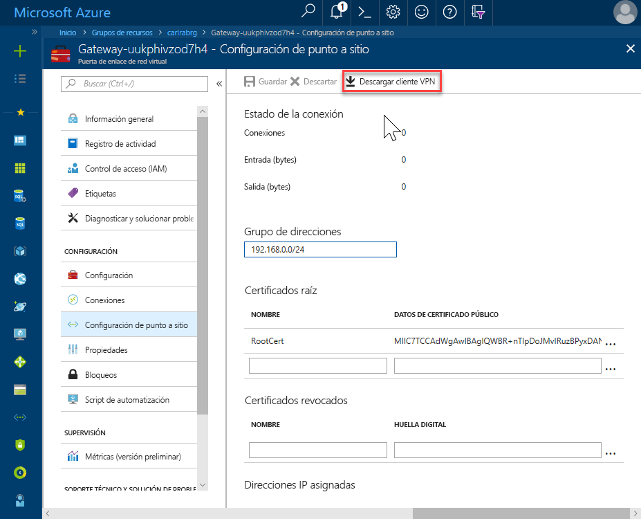
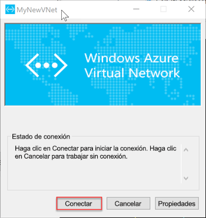

# <a name="configure-a-point-to-site-connection-to-an-azure-sql-database-managed-instance-from-on-premises"></a>Configuración de una conexión de punto a sitio a una Instancia administrada de Azure SQL Database desde el entorno local

Esta guía de inicia rápido demuestra cómo conectarse a una Instancia administrada de Azure SQL Database mediante [SQL Server Management Studio](https://docs.microsoft.com/sql/ssms/sql-server-management-studio-ssms) (SSMS) desde un equipo cliente local con una conexión de punto a sitio. Para más información acerca de las conexiones de punto a sitio, consulte [Acerca de las conexiones VPN de punto a sitio](../vpn-gateway/point-to-site-about.md).

## <a name="prerequisites"></a>Requisitos previos

En esta guía de inicio rápido:

- Se usan como punto de partida los recursos creados en esta guía de inicio rápido: [Creación de una Instancia administrada de Azure SQL](sql-database-managed-instance-get-started.md).
- Requiere PowerShell 5.1 y Azure PowerShell 5.4.2 o posterior en el equipo cliente local.
- Requiere la versión más reciente de [SQL Server Management Studio](https://docs.microsoft.com/sql/ssms/sql-server-management-studio-ssms) (SSMS) en el equipo cliente local.

## <a name="attach-a-vpn-gateway-to-your-managed-instance-virtual-network"></a>Asociación de una puerta de enlace VPN a la red virtual de Instancia administrada

1. Abra Powershell en el equipo cliente local.
2. Copie y pegue este script de PowerShell. Este script asocia una puerta de enlace VPN Gateway a la red virtual de Instancia administrada que creó en la guía de inicio rápido [Creación de una instancia administrada de Azure SQL](sql-database-managed-instance-get-started.md). Este script realiza los tres pasos siguientes:

   - Crea e instala certificados en la máquina cliente
   - Calcula el intervalo futuro de IP de subred de puerta de enlace VPN Gateway
   - Crea el elemento GatewaySubnet
   - Implementa la plantilla de Azure Resource Manager que asocia la puerta de enlace VPN Gateway a la subred VPN

     ```powershell
     $scriptUrlBase = 'https://raw.githubusercontent.com/Microsoft/sql-server-samples/master/samples/manage/azure-sql-db-managed-instance/attach-vpn-gateway'

     $parameters = @{
       subscriptionId = '<subscriptionId>'
       resourceGroupName = '<resourceGroupName>'
       virtualNetworkName = '<virtualNetworkName>'
       certificateNamePrefix  = '<certificateNamePrefix>'
       }

     Invoke-Command -ScriptBlock ([Scriptblock]::Create((iwr ($scriptUrlBase+'/attachVPNGateway.ps1?t='+ [DateTime]::Now.Ticks)).Content)) -ArgumentList $parameters, $scriptUrlBase
     ```

3. Proporcione los parámetros solicitados en el script de PowerShell. Los valores de `<subscriptionId>`, `<resourceGroup>` y `<virtualNetworkName>` deben coincidir con los que se usan en la guía de inicio rápido [Creación de una Instancia administrada de Azure SQL](sql-database-managed-instance-get-started.md). El valor de `<certificateNamePrefix>` puede ser la cadena que prefiera.

4. Ejecute el script de PowerShell.

## <a name="create-a-vpn-connection-to-your-managed-instance"></a>Creación de una conexión VPN a la Instancia administrada

1. Inicie sesión en el [Azure Portal](https://portal.azure.com/).
2. Abra el grupo de recursos en el que creó la puerta de enlace de red virtual y, a continuación, abra el recurso de puerta de enlace de red virtual.

      

3. Haga clic en **Configuración de punto a sitio** y, después, en **Descargar cliente VPN**.

      
4. Extraiga los archivos del archivo ZIP y, a continuación, abra la carpeta extraída.
5. Vaya a la carpeta WindowsAmd64 y abra el archivo **VpnClientSetupAmd64.exe**.
6. Si recibe un mensaje que indica que **Windows protegió su PC**, haga clic en **Más información** y, a continuación, haga clic en **Ejecutar de todas formas**.

    \
7. Haga clic en **Sí** en el cuadro de diálogo Control de cuentas de usuario para continuar.
8. En el cuadro de diálogo MyNewVNet, haga clic en **Sí** para instalar un cliente VPN para MyNewVNet.

## <a name="connect-to-the-vpn-connection"></a>Conexión a VPN

1. Vaya a las conexiones VPN en el equipo cliente y haga clic en **MyNewVNet** para establecer una conexión a esta red virtual.

      
2. Haga clic en **Conectar**.
3. En el cuadro de diálogo MyNewVNet, haga clic en **Conectar**.

      
4. Cuando se le indique que Connection Manager necesita privilegios elevados para actualizar la tabla de rutas, haga clic en **Continuar**.
5. Haga clic en **Sí** en el cuadro de diálogo Control de cuentas de usuario para continuar.

      

   Ha establecido una conexión VPN a la red virtual de la Instancia administrada.

## <a name="use-ssms-to-connect-to-the-managed-instance"></a>Uso de SSMS para conectarse a la Instancia administrada

1. En el equipo cliente local, abra SQL Server Management Studio (SSMS).
2. En el cuadro de diálogo **Conectar al servidor**, especifique el **nombre de host** completo de la Instancia administrada en el cuadro **Nombre del servidor**, seleccione **Autenticación de SQL Server**, especifique el nombre de usuario y la contraseña, y haga clic en **Conectar**.

      

Después de conectarse, puede ver las bases de datos del sistema y de los usuarios en el nodo Bases de datos, así como varios objetos en los nodos Seguridad, Objetos de servidor, Replicación, Administración, Agente SQL Server y XEvent Profiler.

## <a name="next-steps"></a>Pasos siguientes

- Para obtener una guía de inicio rápido que muestra cómo conectarse desde una máquina virtual de Azure, consulte [Configuración de una conexión punto a sitio](sql-database-managed-instance-configure-p2s.md)
- Para información general de las opciones de conexión para las aplicaciones, consulte [Conexión de aplicaciones a Instancia administrada](sql-database-managed-instance-connect-app.md).
- Para restaurar una base de datos SQL Server existente desde el entorno local en una Instancia administrada, puede usar [Azure Database Migration Service (DMS) para la migración](../dms/tutorial-sql-server-to-managed-instance.md) a fin de restaurar desde un archivo de copia de seguridad de base de datos, o bien el [comando T-SQL RESTORE](sql-database-managed-instance-get-started-restore.md) para restaurar desde un archivo de copia de seguridad de base de datos.
