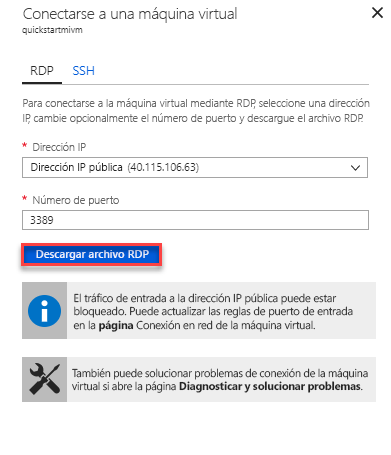

# Configurar una máquina virtual de Azure para la conexión a una Instancia administrada de Azure SQL Database

Esta guía de inicio rápido muestra cómo configurar una máquina virtual de Azure para conectarse a una Instancia administrada de Azure SQL Database mediante SQL Server Management Studio (SSMS). Para obtener una guía de inicio rápido en la que se muestra cómo conectarse desde un equipo cliente local mediante una conexión de punto a sitio, vea [Configuración de una conexión de punto a sitio](sql-database-managed-instance-configure-p2s.md). 

## Requisitos previos

En esta guía de inicio rápido se usan como punto de partida los recursos creados en: [Creación de una Instancia administrada](sql-database-managed-instance-get-started.md).

## Inicio de sesión en Azure Portal

Inicie sesión en el [Azure Portal](https://portal.azure.com/).

## Creación de una nueva subred en la red virtual de Instancia administrada

En los pasos siguientes se crea una nueva subred en la red virtual de Instancia administrada para conectar una máquina virtual de Azure a la Instancia administrada. La subred de Instancia administrada está dedicada a las instancias administradas y no se pueden crear otros recursos (por ejemplo Azure Virtual Machines) en esa subred. 

1. Abra el grupo de recursos para la Instancia administrada que creó en la guía de inicio rápido [Creación de una Instancia administrada](sql-database-managed-instance-get-started.md), haga clic en la red virtual de la Instancia administrada y, a continuación, haga clic en **Subredes**.

   

2. Haga clic en el signo **+** junto a **Subred** para crear una nueva subred.

   

3. Rellene el formulario con la información solicitada utilizando los datos de la siguiente tabla:

   | Configuración| Valor sugerido | Descripción |
   | ---------------- | ----------------- | ----------- | 
   | **Nombre** | Cualquier nombre válido|Para conocer cuáles son los nombres válidos, consulte el artículo [Convenciones de nomenclatura](https://docs.microsoft.com/azure/architecture/best-practices/naming-conventions).|
   | **Intervalo de direcciones (bloque CIDR)** | Un intervalo válido | El valor predeterminado es adecuado para este inicio rápido.|
   | **Grupo de seguridad de red** | None | El valor predeterminado es adecuado para este inicio rápido.|
   | **Tabla de rutas** | None | El valor predeterminado es adecuado para este inicio rápido.|
   | **Puntos de conexión de servicio** | 0 seleccionado | El valor predeterminado es adecuado para este inicio rápido.|
   | **Delegación de subred** | None | El valor predeterminado es adecuado para este inicio rápido.|
 
   

4. Haga clic en **Aceptar** para crear esta subred adicional en la red virtual de Instancia administrada.

## Creación de una máquina virtual en la nueva subred de la red virtual

En los pasos siguientes se muestra cómo crear una máquina virtual en la nueva subred para la conexión a la Instancia administrada. 

## Preparación de la máquina virtual de Azure

Dado que la instancia administrada de SQL está colocada en su red virtual privada, es preciso que cree una máquina virtual de Azure con una herramienta de cliente SQL como SQL Server Management Studio o Azure Data Studio para conectarse a la instancia administrada y ejecutar consultas. En esta guía de inicio rápido se usa SQL Server Management Studio.

La forma más fácil de crear una máquina virtual cliente con todas las herramientas necesarias es usar las plantillas de Azure Resource Manager.

1. Haga clic en el botón siguiente para crear una máquina virtual cliente e instalar SQL Server Management Studio (asegúrese de iniciar sesión en Azure Portal en otra pestaña del explorador):

    

2. Rellene el formulario con la información solicitada utilizando los datos de la siguiente tabla:

   | Configuración| Valor sugerido | DESCRIPCIÓN |
   | ---------------- | ----------------- | ----------- |
   | **Suscripción** | Una suscripción válida | Debe ser una suscripción en la que tiene permiso para crear recursos. |
   | **Grupo de recursos** |Grupo de recursos que especificó en el inicio rápido [Crear Instancia administrada](sql-database-managed-instance-get-started.md).|Debe ser el grupo de recursos donde existe la red virtual.|
   | **Ubicación** | Ubicación del grupo de recursos | Este valor se rellena según el grupo de recursos seleccionado. | 
   | **Nombre de la máquina virtual**  | Cualquier nombre válido | Para conocer cuáles son los nombres válidos, consulte el artículo [Convenciones de nomenclatura](https://docs.microsoft.com/azure/architecture/best-practices/naming-conventions).|
   |**Nombre de usuario administrador**|Cualquier nombre de usuario válido|Para conocer cuáles son los nombres válidos, consulte el artículo [Convenciones de nomenclatura](https://docs.microsoft.com/azure/architecture/best-practices/naming-conventions). No utilice "serveradmin", ya es un rol de nivel de servidor reservado.| 
   |**Contraseña**|Cualquier contraseña válida|La contraseña debe tener al menos 12 caracteres de largo y cumplir con los [requisitos de complejidad definidos](../virtual-machines/windows/faq.md#what-are-the-password-requirements-when-creating-a-vm).|
   | **Tamaño de máquina virtual** | Cualquier tamaño válido | El valor predeterminado de esta plantilla de **Standard_B2s es suficiente para este inicio rápido. |
   | **Ubicación**|[resourceGroup().location].| No cambie este valor. |
   | **Nombre de la red virtual**|La ubicación que ha seleccionado anteriormente|Para obtener información acerca de las regiones, consulte [Regiones de Azure](https://azure.microsoft.com/regions/).|
   | **Nombre de subred**|El nombre de la subred que creó en el procedimiento anterior| No elija la subred en la que creó la Instancia administrada|
   | **Ubicación de artefactos** | [deployment().properties.templateLink.uri]. No cambie este valor. |
   | **Token de Sas de ubicación de artefactos** | déjelo en blanco | No cambie este valor. |

   

   Si usa el nombre de red virtual sugerido y la subred predeterminada de [Crear la Instancia administrada](sql-database-managed-instance-get-started.md), no es necesario cambiar los dos últimos parámetros. En caso contrario, debe cambiar estos valores a los valores que especificó al configurar el entorno de red.

3. Seleccione la casilla **Acepto los términos y condiciones indicados anteriormente**.
4. Haga clic en **Comprar** para implementar la máquina virtual de Azure en la red.
5. Haga clic en el icono de **notificaciones** para ver el estado de la implementación.
   
   No continúe hasta que haya creado la máquina virtual de Azure. 

## Conexión a la máquina virtual

En los pasos siguientes se muestra cómo conectarse a la máquina virtual recién creada mediante una conexión de escritorio remoto.

1. Una vez finalizada la implementación, vaya al recurso de máquina virtual.

      

2. Haga clic en **Conectar**. 
   
   Aparece un formulario de archivo de Protocolo de escritorio remoto (archivo .rdp) con la dirección IP pública y el número de puerto de la máquina virtual. 

     

3. Haga clic en **Descargar archivo RDP**.
 
   > [!NOTE]
   > También puede usar SSH para conectarse a la máquina virtual.

4. Cierre el formulario **Conexión a la máquina virtual**.
5. Para conectarse a la máquina virtual, abra el archivo RDP descargado. 
6. Cuando se le solicite, haga clic en **Conectar**. En un equipo Mac, necesita un cliente RDP como este [Cliente de Escritorio remoto](https://itunes.apple.com/us/app/microsoft-remote-desktop/id715768417?mt=12) de Mac App Store.

6. Escriba el nombre de usuario y la contraseña que especificó al crear la máquina virtual y, a continuación, haga clic en **Aceptar**.

7. Puede recibir una advertencia de certificado durante el proceso de inicio de sesión. Haga clic en **Sí** o **Conectar** para continuar con la conexión.

Está conectado a la máquina virtual en el panel de Administrador del servidor.

## Uso de SSMS para conectarse a la Instancia administrada

1. En la máquina virtual, abra SQL Server Management Studio (SSMS).
 
   Tardará unos instantes en abrirse, ya que debe completar su configuración y esta es la primera vez que se inicia SSMS.
2. En el cuadro de diálogo **Conectar al servidor**, especifique el **nombre de host** completo de la Instancia administrada en el cuadro **Nombre del servidor**, seleccione **Autenticación de SQL Server**, especifique el nombre de usuario y la contraseña, y haga clic en **Conectar**.

      

Después de conectarse, puede ver las bases de datos del sistema y de los usuarios en el nodo Bases de datos, así como varios objetos en los nodos Seguridad, Objetos de servidor, Replicación, Administración, Agente SQL Server y XEvent Profiler.

## Pasos siguientes

- Para obtener una guía de inicio rápido en la que se muestra cómo conectarse a una Instancia administrada desde un equipo cliente local mediante una conexión de punto a sitio, vea [Configuración de una conexión de punto a sitio](sql-database-managed-instance-configure-p2s.md).
- Para información general de las opciones de conexión para las aplicaciones, consulte [Conexión de aplicaciones a Instancia administrada](sql-database-managed-instance-connect-app.md).
- Para restaurar una base de datos SQL Server existente desde el entorno local en una Instancia administrada, puede usar [Azure Database Migration Service (DMS) para la migración](../dms/tutorial-sql-server-to-managed-instance.md) a fin de restaurar desde un archivo de copia de seguridad de base de datos, o bien el [comando T-SQL RESTORE](sql-database-managed-instance-get-started-restore.md) para restaurar desde un archivo de copia de seguridad de base de datos.
