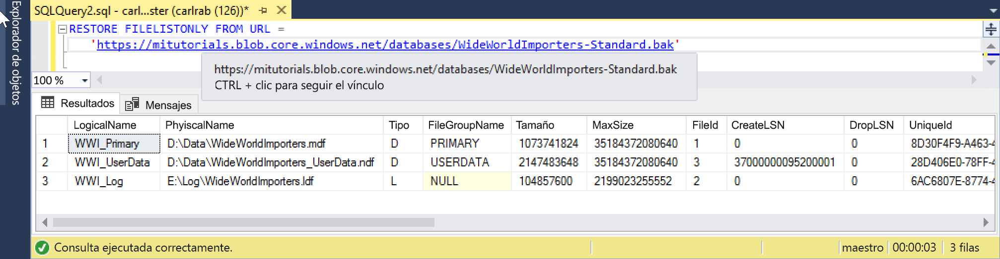

# <a name="restore-a-database-backup-to-an-azure-sql-database-managed-instance"></a>Restauración de una copia de seguridad de datos a una instancia administrada de Azure SQL Database

En este inicio rápido se muestra cómo restaurar una copia de seguridad de una base de datos almacenada en Azure Blob Storage en la Instancia administrada mediante el archivo de copia de seguridad Wide World Importers - Standard. Este método requiere cierto tiempo de inactividad. 

> [!VIDEO https://www.youtube.com/embed/RxWYojo_Y3Q]

Para consultar un tutorial con Azure Database Migration Service (DMS) para la migración, consulte [Migración a Instancia administrada con DMS](../dms/tutorial-sql-server-to-managed-instance.md). Para obtener una descripción de los diversos métodos de migración, vea [Migración de una instancia de SQL Server a Instancia administrada de Azure SQL Database](sql-database-managed-instance-migrate.md).

## <a name="prerequisites"></a>Requisitos previos

En esta guía de inicio rápido:
- Se usan como punto de partida los recursos creados en esta guía: [Creación de una Instancia administrada](sql-database-managed-instance-get-started.md).
- Requiere la versión más reciente de [SQL Server Management Studio](https://docs.microsoft.com/sql/ssms/sql-server-management-studio-ssms) en el equipo cliente local
- Requiere conectividad a la Instancia administrada mediante SQL Server Management Studio. Consulte estas guías de inicio rápido para ver las opciones de conectividad:
  - [Conexión a una Instancia administrada de Azure SQL Database desde una máquina virtual de Azure](sql-database-managed-instance-configure-vm.md)
  - [Conexión a una Instancia administrada de Azure SQL Database desde el entorno local mediante una conexión punto a sitio](sql-database-managed-instance-configure-p2s.md).
- Se usa una cuenta de Azure Blob Storage preconfigurada que contiene el archivo de copia de seguridad Wide World Importers - Standard (descargado desde https://github.com/Microsoft/sql-server-samples/releases/download/wide-world-importers-v1.0/WideWorldImporters-Standard.bak)).

> [!NOTE]
> Para más información acerca de cómo realizar una copia de seguridad y restaurar una base de datos de SQL Server mediante Azure Blob Storage y una Firma de acceso compartido (SAS), consulte [Copia de seguridad en URL de SQL Server](sql-database-managed-instance-get-started-restore.md).

## <a name="restore-the-wide-world-importers-database-from-a-backup-file"></a>Restauración de la base de datos de Wide World Importers desde un archivo de copia de seguridad

Con SSMS, siga estos pasos para restaurar la base de datos de Wide World Importers en la instancia administrada desde el archivo de copia de seguridad.

1. Abra SQL Server Management Studio (SSMS) y conéctese a la Instancia administrada.
2. En SSMS, abra una nueva ventana de consulta.
3. Use el script siguiente para crear una credencial en la Instancia administrada mediante la cuenta de almacenamiento preconfigurada y la clave SAS.

   ```sql
   CREATE CREDENTIAL [https://mitutorials.blob.core.windows.net/databases] 
   WITH IDENTITY = 'SHARED ACCESS SIGNATURE'
   , SECRET = 'sv=2017-11-09&ss=bfqt&srt=sco&sp=rwdlacup&se=2028-09-06T02:52:55Z&st=2018-09-04T18:52:55Z&spr=https&sig=WOTiM%2FS4GVF%2FEEs9DGQR9Im0W%2BwndxW2CQ7%2B5fHd7Is%3D' 
   ```

    

    > [!NOTE]
    > Quite siempre el signo **?** inicial de la clave SAS generada.
  
3. Use el script siguiente para comprobar la credencial SAS y la validez de la copia de seguridad; proporcione la dirección URL del contenedor con el archivo de copia de seguridad:

   ```sql
   RESTORE FILELISTONLY FROM URL = 
      'https://mitutorials.blob.core.windows.net/databases/WideWorldImporters-Standard.bak'
   ```

    

4. Utilice el siguiente script para restaurar la base de datos de Wide World Importers desde una copia de seguridad. Para ello, proporcione la dirección URL del contenedor con el archivo de copia de seguridad:

   ```sql
   RESTORE DATABASE [Wide World Importers] FROM URL =
     'https://mitutorials.blob.core.windows.net/databases/WideWorldImporters-Standard.bak'
   ```

    

5. Para realizar un seguimiento del estado de la restauración, ejecute la consulta siguiente en una nueva sesión de consulta:

   ```sql
   SELECT session_id as SPID, command, a.text AS Query, start_time, percent_complete
      , dateadd(second,estimated_completion_time/1000, getdate()) as estimated_completion_time 
   FROM sys.dm_exec_requests r 
   CROSS APPLY sys.dm_exec_sql_text(r.sql_handle) a 
   WHERE r.command in ('BACKUP DATABASE','RESTORE DATABASE')`
   ```

6. Cuando se completa la restauración, se puede ver en el Explorador de objetos. 

## <a name="next-steps"></a>Pasos siguientes

- Para solucionar problemas con la copia de seguridad en la dirección URL, vea [Prácticas recomendadas y solución de problemas de Copia de seguridad en URL de SQL Server](https://docs.microsoft.com/sql/relational-databases/backup-restore/sql-server-backup-to-url-best-practices-and-troubleshooting).
- Para obtener información general de las opciones de conexión para las aplicaciones, vea [Conexión de la aplicación a Instancia administrada de Azure SQL Database](sql-database-managed-instance-connect-app.md).
- Para realizar consultas con las herramientas o lenguajes que prefiera, vea [Guías de inicio rápido de conexión y consulta de Azure SQL Database](sql-database-connect-query.md).
