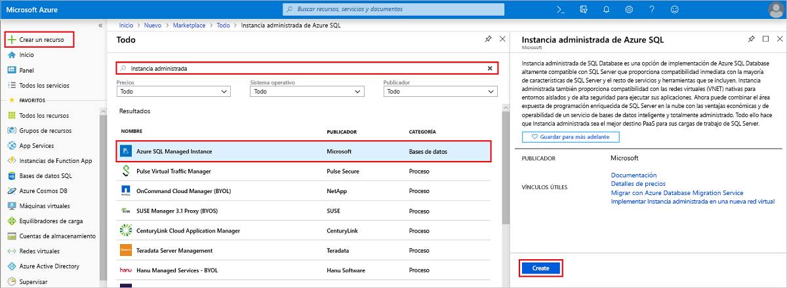
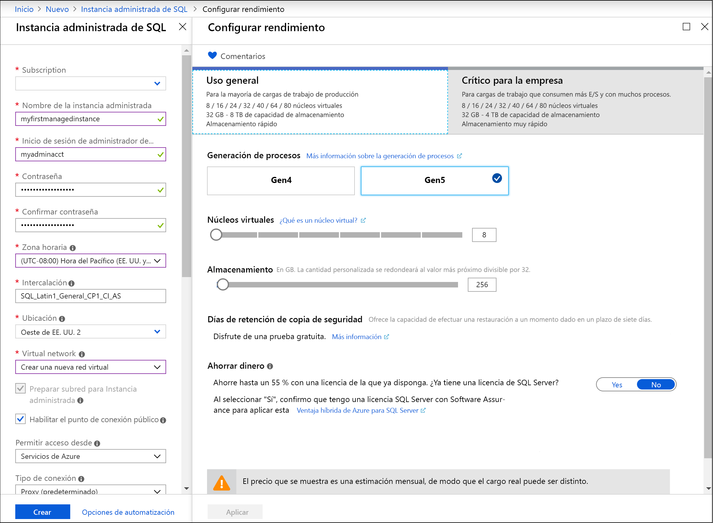
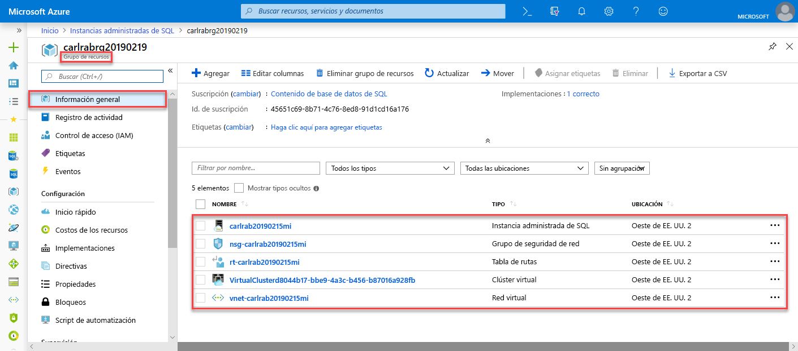
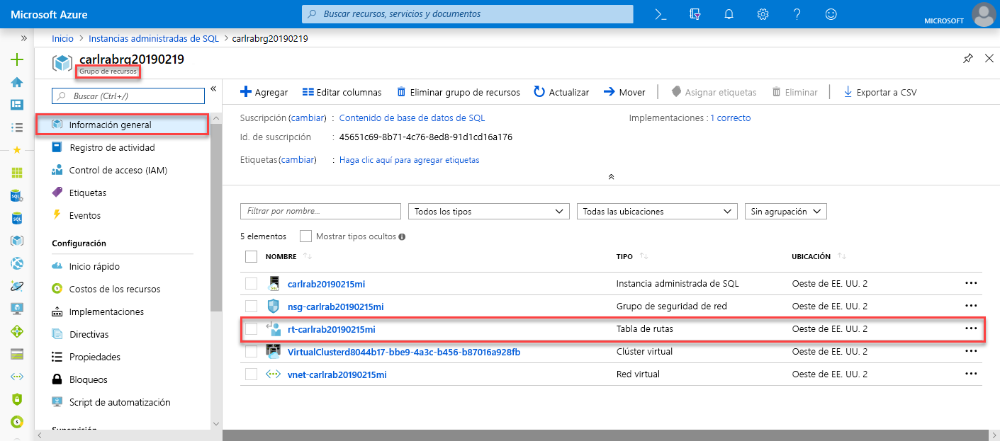
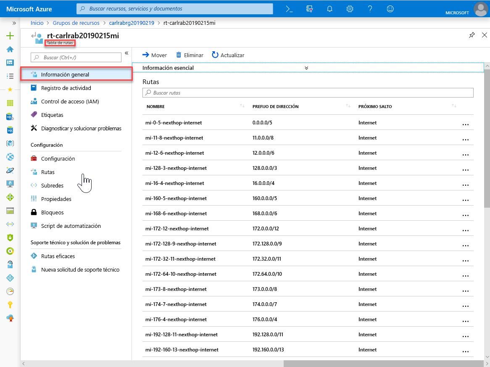
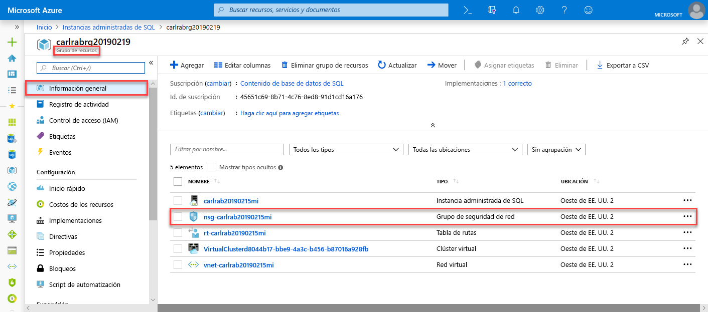
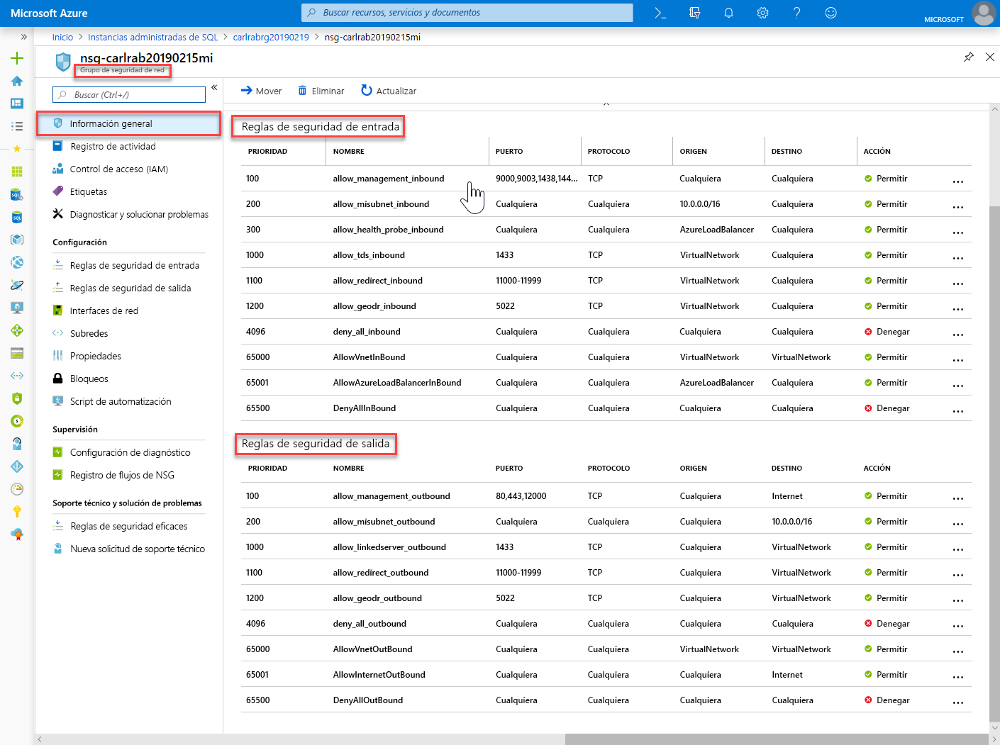
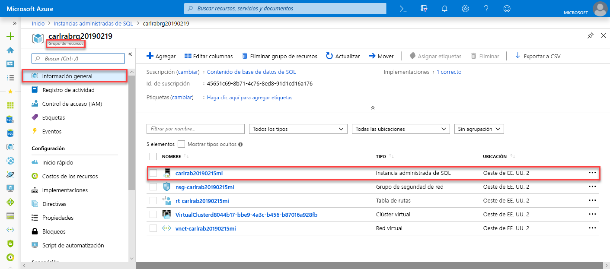
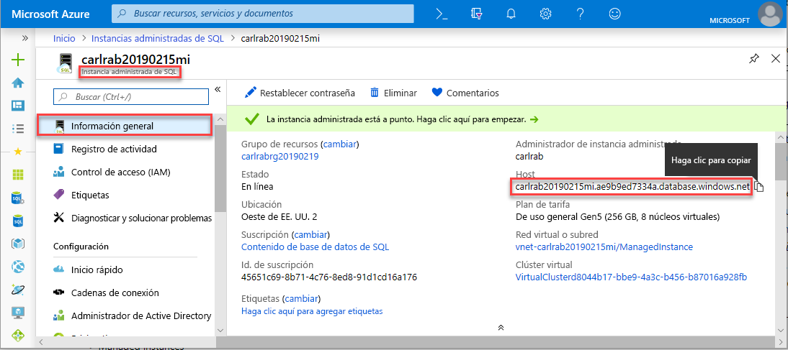

# Inicio rápido: Creación de una Instancia administrada de Azure SQL Database

Este inicio rápido le guía por la creación de una [instancia administrada](sql-database-managed-instance.md) de Azure SQL Database en Azure Portal.

> [!IMPORTANT]
> Para conocer las limitaciones, consulte las [regiones admitidas](sql-database-managed-instance-resource-limits.md#supported-regions) y los [tipos de suscripción admitidos](sql-database-managed-instance-resource-limits.md#supported-subscription-types).

## Inicio de sesión en Azure Portal

Inicie sesión en el [Azure Portal](https://portal.azure.com/). 

## Creación de una instancia administrada

En los pasos siguientes se muestra cómo crear una Instancia administrada.

1. Seleccione **Crear un recurso** en la esquina superior izquierda de Azure Portal.
2. Busque **Instancia administrada** y, después, seleccione **Instancia administrada de Azure SQL**.
3. Seleccione **Crear**.

   

4. Rellene el formulario **Instancia administrada de SQL** con la información solicitada, para lo que debe usar los datos de la siguiente tabla.

   | Configuración| Valor sugerido | DESCRIPCIÓN |
   | ------ | --------------- | ----------- |
   | **Suscripción** | Su suscripción. | Una suscripción en la que tenga permiso para crear recursos. |
   |**Nombre de la instancia administrada**|Cualquier nombre válido.|Para conocer cuáles son los nombres válidos, consulte el artículo [Convenciones de nomenclatura](https://docs.microsoft.com/azure/architecture/best-practices/naming-conventions).|
   |**Inicio de sesión de administrador de la instancia administrada**|Cualquier nombre de usuario válido.|Para conocer cuáles son los nombres válidos, consulte el artículo [Convenciones de nomenclatura](https://docs.microsoft.com/azure/architecture/best-practices/naming-conventions). No utilice "serveradmin", ya es un rol de nivel de servidor reservado.|
   |**Contraseña**|Cualquier contraseña válida.|La contraseña debe tener al menos 16 caracteres de largo y cumplir con los [requisitos de complejidad definidos](../virtual-machines/windows/faq.md#what-are-the-password-requirements-when-creating-a-vm).|
   |**Zona horaria**|La zona horaria que debe observar la instancia administrada.|Para más información, consulte las [zonas horarias](sql-database-managed-instance-timezone.md).|
   |**Intercalación**|La intercalación que desea usar para la instancia administrada.|Si migra bases de datos desde SQL Server, compruebe la intercalación de origen mediante `SELECT SERVERPROPERTY(N'Collation')` y use ese valor. Para obtener información acerca de las intercalaciones, consulte [Configurar o cambiar la intercalación del servidor](https://docs.microsoft.com/sql/relational-databases/collations/set-or-change-the-server-collation).|
   |**Ubicación**|La ubicación en la que desea crear la instancia administrada.|Para obtener información sobre las regiones, consulte [Regiones de Azure](https://azure.microsoft.com/regions/).|
   |**Red virtual**|Seleccione **Crear una nueva red virtual** o una subred y red virtual válidas.| Si hay una red o subred que no esté disponible, se debe [modificar para cumplir los requisitos de la red](sql-database-managed-instance-configure-vnet-subnet.md) antes de seleccionarla como destino de la nueva instancia administrada. Para obtener información acerca los requisitos necesarios para configurar el entorno de red de una instancia administrada, consulte [Arquitectura de conectividad de una instancia administrada de Azure SQL Database](sql-database-managed-instance-connectivity-architecture.md). |
   |**Habilitar el punto de conexión público**   |Seleccione esta opción para habilitar un punto de conexión público   |Para que se pueda acceder a la instancia administrada mediante el punto de conexión de datos público, es preciso seleccionar **Habilitar el punto de conexión público**.| 
   |**Permitir acceso desde**   |Seleccione una de las opciones: <ul> <li>**Servicios de Azure**</li> <li>**Internet**</li> <li>**Sin acceso**</li></ul>   |La experiencia del portal permite configurar un grupo de seguridad con un punto de conexión público.     En función del escenario, seleccione una de las siguientes opciones:   <ul> <li>Servicios de Azure: se recomienda cuando se establece la conexión desde Power BI u otro servicio multiinquilino. </li> <li> Internet: se usar para realizar pruebas cuando se desee poner en marcha rápidamente una instancia administrada. No es aconsejable su uso en entornos de producción. </li> <li> Sin acceso: esta opción crea una regla de seguridad de denegación. Para que se pueda acceder a la instancia administrada mediante un punto de conexión público, esta regla debe modificarse. </li> </ul>   Para más información acerca de la seguridad de los puntos de conexión públicos, consulte [Uso de una instancia administrada de Azure SQL Database de forma segura con puntos de conexión públicos](sql-database-managed-instance-public-endpoint-securely.md).|
   |**Tipo de conexión**|Elija entre el tipo de conexión: Proxy o Redirigir.|Para más información acerca de los tipos de conexión, consulte [Directiva de conexión de Azure SQL](sql-database-connectivity-architecture.md#connection-policy).|
   |**Grupos de recursos**|un grupo de recursos nuevo o existente.|Para conocer cuáles son los nombres de grupo de recursos válidos, consulte el artículo [Naming conventions](https://docs.microsoft.com/azure/architecture/best-practices/naming-conventions) (Convenciones de nomenclatura).|

   

5. Para utilizar la instancia administrada como un grupo de conmutación por error de la instancia secundario, seleccione la restauración y especifique la instancia administrada de DnsAzurePartner. Esta característica está en versión preliminar y no se muestra en la captura de pantalla siguiente.
6. Seleccione **Plan de tarifa** para cambiar el tamaño de los recursos de almacenamiento y de proceso, así como para revisar las opciones del plan de tarifa. El plan de tarifa de uso general con 32 GB de memoria y 16 núcleos de virtuales es el valor predeterminado.
7. Utilice los controles deslizantes o cuadros de texto para especificar la cantidad de almacenamiento y el número de núcleos virtuales.
8. Cuando haya terminado, seleccione **Aplicar** para guardar las opciones que haya elegido. 
9. Seleccione **Crear** para implementar la instancia administrada.
10. Seleccione el icono **Notificaciones** para ver el estado de la implementación.

    

11. Seleccione **Implementación en curso** para abrir la ventana de la instancia administrada y supervisar el progreso de la implementación. 

> [!IMPORTANT]
> En la primera instancia de una subred el tiempo de implementación habitualmente es mucho mayor que en las siguientes. No cancele la operación de implementación porque dure más de lo previsto. La creación de la segunda instancia administrada en la subred solo tarda un par de minutos.

## Revisión de los recursos y recuperación del nombre del servidor completo

Una vez que la implementación se haya realizado correctamente, revise los recursos creados y recupere el nombre completo del servidor para su uso en tutoriales posteriores.

1. Abra el grupo de recursos de la instancia administrada. Vea los recursos que se crearon de forma automática en el inicio rápido [Creación de una instancia administrada](#create-a-managed-instance).

   

2. Seleccione la tabla de rutas para revisar la tabla de la ruta definida por el usuario (UDR) que se creó automáticamente.

   

3. En la tabla de rutas, revise las entradas para enrutar el tráfico desde y dentro de la red virtual de instancia administrada. Si crea o configura manualmente su tabla de rutas, debe asegurarse de crear estas entradas en ella.

   

4. Vuelva al grupo de recursos y seleccione el grupo de seguridad de red para examinar las reglas de seguridad.

   

5. Revise las reglas de seguridad entrantes y salientes. Si ha configurado puntos de conexión públicos para la instancia administrada, consulte el artículo [Configuración de puntos de conexión públicos](sql-database-managed-instance-public-endpoint-configure.md#allow-public-endpoint-traffic-on-the-network-security-group), donde encontrará más información al respecto.

   

6. Vuelva al grupo de recursos y seleccione la instancia administrada.

   

7. En la pestaña **Información general**, busque la propiedad **Host**. Copie la dirección de host completa de la instancia administrada para usarla en el siguiente inicio rápido.

   

   El nombre es similar **nombre_del_equipo.a1b2c3d4e5f6.database.windows.net**.

## Pasos siguientes

- Para aprender a conectarse a una instancia administrada:
  - Si desea información general acerca de las opciones de conexión de las aplicaciones, consulte [Conexión de la aplicación a Instancia administrada de Azure SQL Database](sql-database-managed-instance-connect-app.md).
  - Para obtener un inicio rápido que muestre cómo conectarse a una instancia administrada desde una máquina virtual de Azure, consulte [Configuración de la conexión a una máquina virtual de SQL](sql-database-managed-instance-configure-vm.md).
  - Para obtener un inicio rápido que muestre cómo conectarse a una instancia administrada desde un equipo cliente local mediante una conexión de punto a sitio, consulte [Configuración de una conexión de punto a sitio](sql-database-managed-instance-configure-p2s.md).
- Para restaurar una base de datos de SQL Server desde un entorno local a una instancia administrada: 
    - Use [Azure Database Migration Service (DMS) para la migración](../dms/tutorial-sql-server-to-managed-instance.md) para realizar la restauración de un archivo de copia de seguridad de base de datos. 
    - Use el [comando T-SQL RESTORE](sql-database-managed-instance-get-started-restore.md) para realizar la restauración desde un archivo de copia de seguridad de base de datos.
- Para obtener información acerca de la supervisión avanzada del rendimiento de una base de datos de instancia administrada con inteligencia de solución de problemas integrada, consulte [Supervisión de Azure SQL Database mediante Azure SQL Analytics](../azure-monitor/insights/azure-sql.md).
