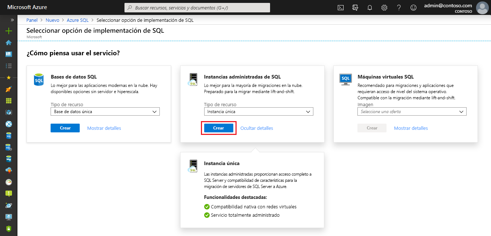
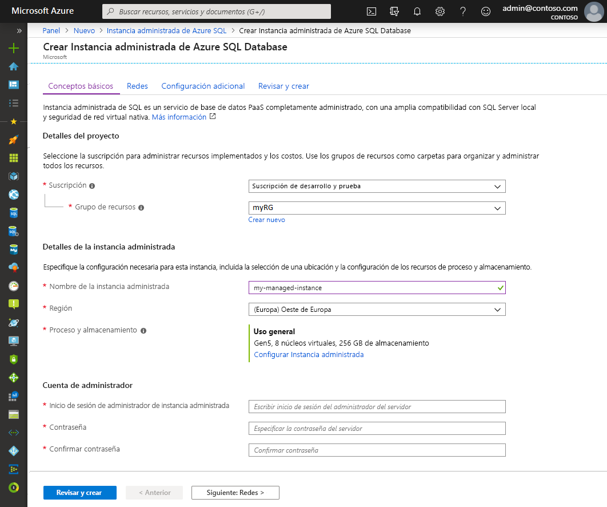
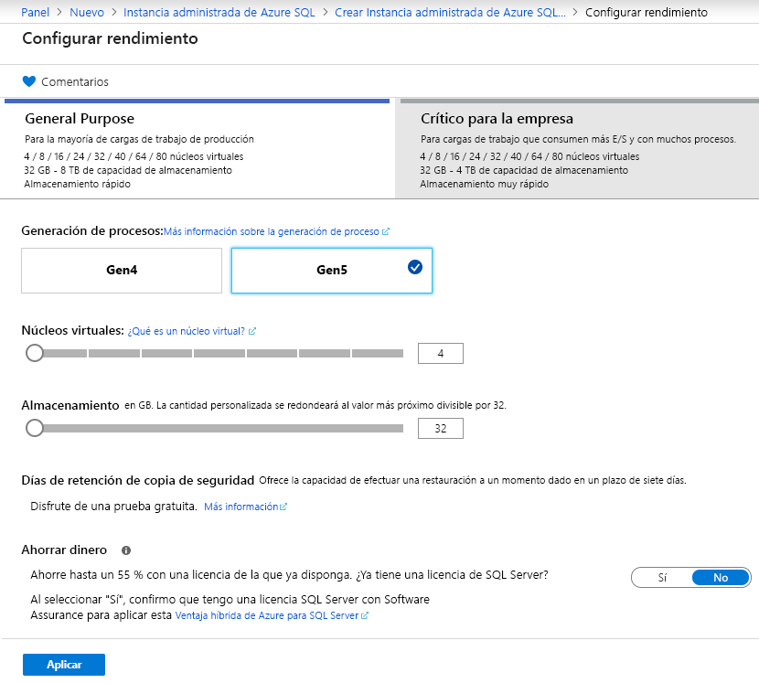
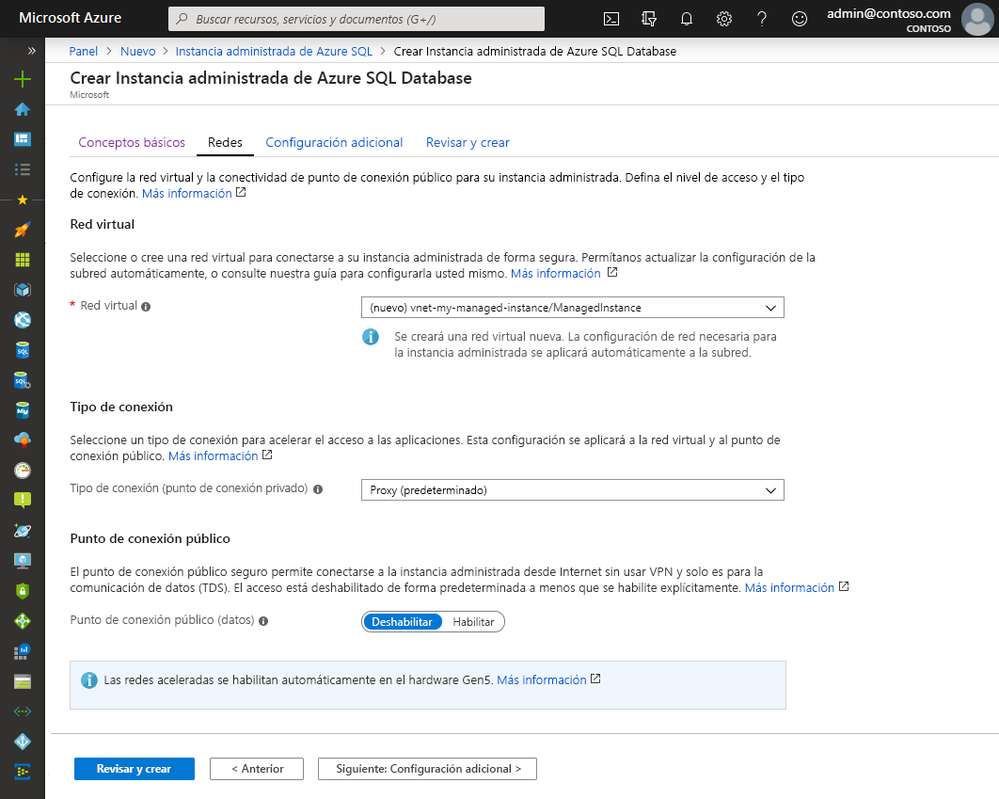
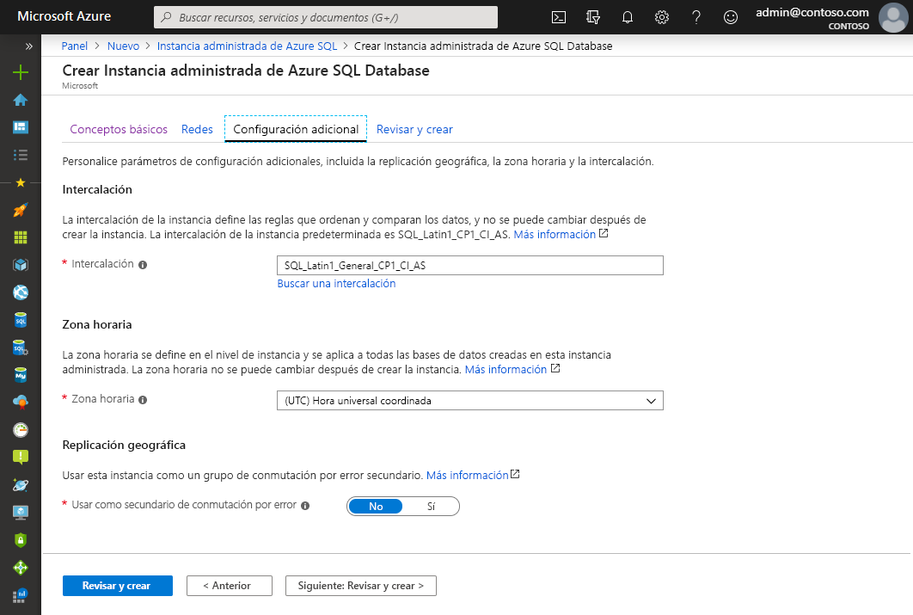
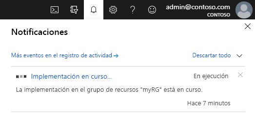

# Inicio rápido: Creación de una Instancia administrada de Azure SQL Database

Este inicio rápido le guía por la creación de una [instancia administrada](sql-database-managed-instance.md) de Azure SQL Database en Azure Portal.

> [!IMPORTANT]
> Para conocer las limitaciones, consulte las [regiones admitidas](sql-database-managed-instance-resource-limits.md#supported-regions) y los [tipos de suscripción admitidos](sql-database-managed-instance-resource-limits.md#supported-subscription-types).

## Inicio de sesión en Azure Portal

Si no tiene una suscripción a Azure, [cree una cuenta gratuita](https://azure.microsoft.com/free/).

Inicie sesión en el [Azure Portal](https://portal.azure.com/).

## Creación de una instancia administrada

En los pasos siguientes se muestra cómo crear una instancia administrada:

1. Seleccione **Azure SQL** en el menú de la izquierda de Azure Portal. Si **Azure SQL** no está en la lista, seleccione **Todos los servicios** y escriba **Azure SQL** en el cuadro de búsqueda.
2. Seleccione **+ Agregar** para abrir la página **Select SQL deployment option** (Seleccionar la opción de implementación de SQL). Para ver información adicional acerca de una instancia administrada de Azure SQL Database, seleccione **Mostrar detalles** en el icono **Instancias administradas**.
3. Seleccione **Crear**.

   

4. Use las pestañas del formulario de aprovisionamiento **Crear instancia administrada de Azure SQL Database** para agregar tanto la información necesaria como la opcional. En las siguientes secciones se describen estas pestañas.

### Aspectos básicos

Para rellenar la información necesaria de la pestaña **Aspectos básicos**, use la siguiente tabla. Es un conjunto mínimo de información para aprovisionar una instancia administrada.

| Configuración| Valor sugerido | DESCRIPCIÓN |
| ------ | --------------- | ----------- |
| **Suscripción** | Su suscripción. | Una suscripción en la que tenga permiso para crear recursos. |
| **Grupos de recursos** | un grupo de recursos nuevo o existente.|Para conocer cuáles son los nombres de grupo de recursos válidos, consulte el artículo [Convenciones de nomenclatura](https://docs.microsoft.com/azure/architecture/best-practices/naming-conventions).|
| **Nombre de la instancia administrada** | Cualquier nombre válido.|Para conocer cuáles son los nombres válidos, consulte el artículo [Convenciones de nomenclatura](https://docs.microsoft.com/azure/architecture/best-practices/naming-conventions).|
| **Región** |La región en la que desea crear la instancia administrada.|Para obtener información sobre las regiones, consulte [Regiones de Azure](https://azure.microsoft.com/regions/).|
| **Inicio de sesión de administrador de la instancia administrada** | Cualquier nombre de usuario válido. | Para conocer cuáles son los nombres válidos, consulte el artículo [Convenciones de nomenclatura](https://docs.microsoft.com/azure/architecture/best-practices/naming-conventions). No utilice "serveradmin", ya es un rol de nivel de servidor reservado.|
| **Contraseña** | Cualquier contraseña válida.| La contraseña debe tener al menos 16 caracteres de largo y cumplir con los [requisitos de complejidad definidos](../virtual-machines/windows/faq.md#what-are-the-password-requirements-when-creating-a-vm).|

Seleccione **Configurar instancia administrada**  para cambiar el tamaño de los recursos de almacenamiento y de proceso, así como para revisar los planes de tarifa. Utilice los controles deslizantes o cuadros de texto para especificar la cantidad de almacenamiento y el número de núcleos virtuales. Cuando haya terminado, seleccione **Aplicar** para guardar las opciones que haya elegido. 

Para revisar las opciones antes de crear una instancia administrada, puede seleccionar **Revisar y crear**. O bien, configure las opciones de red seleccionando **Siguiente: Redes**.

### Redes

Rellene la información opcional de la pestaña **Redes** mediante la siguiente tabla. Si omite esta información, el portal aplicará la configuración predeterminada.

| Configuración| Valor sugerido | DESCRIPCIÓN |
| ------ | --------------- | ----------- |
| **Red virtual** | Seleccione **Crear una nueva red virtual** o una subred y red virtual válidas.| Si hay una red o subred que no esté disponible, se debe [modificar para cumplir los requisitos de la red](sql-database-managed-instance-configure-vnet-subnet.md) antes de seleccionarla como destino de la nueva instancia administrada. Para obtener información acerca los requisitos necesarios para configurar el entorno de red de una instancia administrada, consulte [Arquitectura de conectividad de una instancia administrada de Azure SQL Database](sql-database-managed-instance-connectivity-architecture.md). |
| **Tipo de conexión** | Elija entre los tipos de conexión proxy y redirigir.|Para más información acerca de los tipos de conexión, consulte [Directiva de conexión de Azure SQL](sql-database-connectivity-architecture.md#connection-policy).|
| **Punto de conexión público**  | Seleccione **Habilitar**. | Para que se pueda acceder a una instancia administrada mediante el punto de conexión de datos público, es preciso habilitar esta opción. | 
| **Permitir acceso desde** (si la opción **Punto de conexión público**  está habilitada) | Seleccione una de las opciones.   |La experiencia del portal permite configurar un grupo de seguridad con un punto de conexión público.     En función del escenario, seleccione una de las siguientes opciones:   <ul> <li>**Servicios de Azure**: esta opción es aconsejable cuando se establece conexión desde Power BI u otro servicio multiinquilino. </li> <li> **Internet**: se usa para realizar pruebas cuando se desee poner en marcha rápidamente una instancia administrada. No es aconsejable para entornos de producción. </li> <li> **Sin acceso**: esta opción crea una regla de seguridad **Denegar**. Modifique esta regla para que se pueda acceder a la instancia administrada mediante un punto de conexión público. </li> </ul>   Para más información acerca de la seguridad de los puntos de conexión públicos, consulte [Uso de una instancia administrada de Azure SQL Database de forma segura con puntos de conexión públicos](sql-database-managed-instance-public-endpoint-securely.md).|

Para revisar las opciones antes de crear una instancia administrada, seleccione **Revisar y crear**. O bien, configure más opciones personalizadas, para lo que debe seleccionar **Siguiente: Configuración adicional**.

### Configuración adicional

Rellene la información opcional de la pestaña **Configuración adicional** mediante la siguiente tabla. Si omite esta información, el portal aplicará la configuración predeterminada.

| Configuración| Valor sugerido | DESCRIPCIÓN |
| ------ | --------------- | ----------- |
| **Intercalación** | Elija la intercalación que desea usar para la instancia administrada. Si migra bases de datos desde SQL Server, compruebe la intercalación de origen mediante `SELECT SERVERPROPERTY(N'Collation')` y use ese valor.| Para obtener información acerca de las intercalaciones, consulte [Configurar o cambiar la intercalación del servidor](https://docs.microsoft.com/sql/relational-databases/collations/set-or-change-the-server-collation).|   
| **Zona horaria** | Seleccione la zona horaria que la instancia administrada observará.|Para más información, consulte las [zonas horarias](sql-database-managed-instance-timezone.md).|
| **Use as failover secondary** (Usar como secundaria de conmutación por error) | Seleccione **Sí**. | Habilite esta opción para usar la instancia administrada como secundaria del grupo de conmutación por error.|
| **Instancia administrada principal** [si en **Use as failover secondary** (Usar como secundaria de conmutación por error) se selecciona **Sí**] | Elija la instancia administrada principal existente que se unirá en la misma zona DNS con la instancia administrada que está creando. | Este paso habilitará la configuración posterior a la creación del grupo de conmutación por error. Para más información, consulte [Tutorial: Agregue una instancia administrada de SQL Database a un grupo de conmutación por error](sql-database-managed-instance-failover-group-tutorial.md).|

### Revisar y crear

1. Para revisar las opciones antes de crear la instancia administrada, seleccione la pestaña **Revisar y crear**.

   

1. Seleccione **Crear** para iniciar el aprovisionamiento de la instancia administrada.

> [!IMPORTANT]
> La implementación de una instancia administrada es una operación de ejecución prolongada. La implementación de la primera instancia en la subred suele tardar mucho más que la implementación en una subred en la que ya existen instancias administradas. Para conocer los tiempos de aprovisionamiento medios, consulte [Operaciones de administración de instancia administrada](sql-database-managed-instance.md#managed-instance-management-operations).

### Supervisión del progreso de la implementación

1. Seleccione el icono **Notificaciones** para ver el estado de la implementación.

    

1. Seleccione **Implementación en curso**  en la notificación para abrir la ventana de la instancia administrada y supervisar el progreso de la implementación. 

> [!TIP]
> Si ha cerrado el explorador web o ya no está en la pantalla de progreso de la implementación, siga estos pasos para buscar la pantalla:
> 1. En Azure Portal, abra el grupo de recursos (en la pestaña **Aspectos básicos**) en el que va a implementar una instancia administrada.
> 2. Seleccione **Implementaciones**.
> 3. Seleccione la operación de implementación de instancia administrada en curso.

## Revisión de recursos y recuperación del nombre de host

Después de que la implementación se haya realizado correctamente:

1. Abra el grupo de recursos de la instancia administrada. Vea los recursos que se crearon de forma automática en el inicio rápido [Creación de una instancia administrada](#create-a-managed-instance).

   

2. Seleccione la tabla de rutas para revisar la ruta definida por el usuario (UDR) que se creó automáticamente.

   

3. En la tabla de rutas, revise las entradas desde las que se enruta el tráfico y dentro de la red virtual de la instancia administrada. Si crea o configura una tabla de rutas de forma manual, asegúrese de crear estas entradas en ella.

   

4. Vuelva al grupo de recursos y seleccione el grupo de seguridad de red.

   

5. Revise las reglas de seguridad entrantes y salientes. Si ha configurado puntos de conexión públicos para la instancia administrada, consulte el artículo [Configuración de puntos de conexión públicos](sql-database-managed-instance-public-endpoint-configure.md#allow-public-endpoint-traffic-on-the-network-security-group), donde encontrará más información al respecto.

   

6. Vuelva al grupo de recursos y seleccione su instancia administrada.

   

7. En la pestaña **Información general**, busque la propiedad **Host**. Copie el nombre de host de la instancia administrada para usarla en el siguiente inicio rápido.

   

   El nombre de host también se denomina nombre de dominio completo (FQDN). Es similar a *nombre_de_equipo.a1b2c3d4e5f6.database.windows.net*.

## Pasos siguientes

Para aprender a conectarse a una instancia administrada:
- Si desea información general acerca de las opciones de conexión de las aplicaciones, consulte [Conexión de la aplicación a Instancia administrada de Azure SQL Database](sql-database-managed-instance-connect-app.md).
- Para obtener un inicio rápido que muestre cómo conectarse a una instancia administrada desde una máquina virtual de Azure, consulte [Configuración de la conexión a una máquina virtual de SQL](sql-database-managed-instance-configure-vm.md).
- Para obtener un inicio rápido que muestre cómo conectarse a una instancia administrada desde un equipo cliente local mediante una conexión de punto a sitio, consulte [Configuración de una conexión de punto a sitio](sql-database-managed-instance-configure-p2s.md).

Para restaurar una base de datos de SQL Server desde un entorno local a una instancia administrada: 
- Use [Azure Database Migration Service para la migración](../dms/tutorial-sql-server-to-managed-instance.md) para realizar la restauración de un archivo de copia de seguridad de base de datos. 
- Use el [comando T-SQL RESTORE](sql-database-managed-instance-get-started-restore.md) para realizar la restauración desde un archivo de copia de seguridad de base de datos.

Para obtener información acerca de la supervisión avanzada del rendimiento de una base de datos de instancia administrada con inteligencia de solución de problemas integrada, consulte [Supervisión de Azure SQL Database mediante Azure SQL Analytics](../azure-monitor/insights/azure-sql.md).
