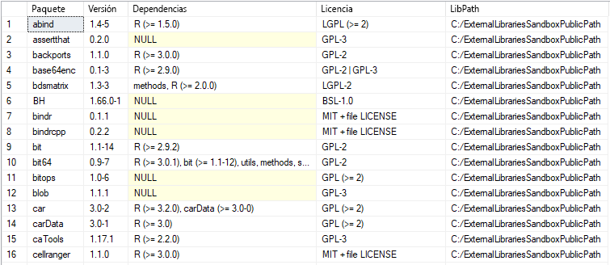

# <a name="quickstart-create-and-run-simple-r-scripts-in-azure-sql-database-machine-learning-services-preview"></a>Inicio rápido: Crear y ejecutar scripts de R sencillos en Azure SQL Database Machine Learning Services (versión preliminar)

En este inicio rápido, va a crear y ejecutar un conjunto de scripts de R mediante Machine Learning Services (con R) en Azure SQL Database.

[!INCLUDE[ml-preview-note](../../includes/sql-database-ml-preview-note.md)]

## <a name="prerequisites"></a>Prerequisites

- Una cuenta de Azure con una suscripción activa. [Cree una cuenta gratuita](https://azure.microsoft.com/free/?ref=microsoft.com&utm_source=microsoft.com&utm_medium=docs&utm_campaign=visualstudio).
- Una [base de datos de Azure SQL](sql-database-single-database-get-started.md) con una [regla de firewall de nivel de servidor](sql-database-server-level-firewall-rule.md)
- [Machine Learning Services](sql-database-machine-learning-services-overview.md) con R habilitado. [Suscríbase a la versión preliminar](sql-database-machine-learning-services-overview.md#signup).
- [SQL Server Management Studio](/sql/ssms/sql-server-management-studio-ssms) (SSMS)

> [!NOTE]
> Durante la versión preliminar pública, Microsoft le incorporará y habilitará el aprendizaje automático para la base de datos nueva o existente.

En este ejemplo, se usa el procedimiento almacenado [sp_execute_external_script](/sql/relational-databases/system-stored-procedures/sp-execute-external-script-transact-sql) para encapsular un script de R bien formado.

## <a name="run-a-simple-script"></a>Ejecución de un script sencillo

Para ejecutar un script de R, necesita pasarlo como un argumento al procedimiento almacenado del sistema, [sp_execute_external_script](https://docs.microsoft.com/sql/relational-databases/system-stored-procedures/sp-execute-external-script-transact-sql).

En los pasos siguientes, deberá ejecutar este script de R de ejemplo en la base de datos SQL:

```r
a <- 1
b <- 2
c <- a/b
d <- a*b
print(c(c, d))
```

1. Abra **SQL Server Management Studio** y conéctese a la base de datos SQL.

   Si necesita ayuda para conectarse, consulte [Inicio rápido: Uso de SQL Server Management Studio para conectarse a una base de datos de Azure SQL Database y realizar consultas en ella](sql-database-connect-query-ssms.md).

1. Pase el script de R completo al procedimiento almacenado [sp_execute_external_script](https://docs.microsoft.com/sql/relational-databases/system-stored-procedures/sp-execute-external-script-transact-sql).

   El script se pasa mediante el argumento `@script`. Todo lo que contenga el argumento `@script` tiene que ser código de R válido.

    ```sql
    EXECUTE sp_execute_external_script @language = N'R'
        , @script = N'
    a <- 1
    b <- 2
    c <- a/b
    d <- a*b
    print(c(c, d))
    '
    ```

   Si recibe algún error, es posible que la versión preliminar pública de Machine Learning Services (con R) no esté habilitada para la base de datos SQL. Consulte los [requisitos previos](#prerequisites) anteriores.

   > [!NOTE]
   > Si es un administrador, puede ejecutar código externo automáticamente. Puede conceder permiso a otros usuarios mediante el comando:
   <br>**GRANT EXECUTE ANY EXTERNAL SCRIPT TO** *\<nombreDeUsuario\>* .

2. Se calcula el resultado correcto y la función de R `print` devuelve el resultado a la ventana **Mensajes**.

   Necesita tener el siguiente aspecto.

    **Resultados**

    ```text
    STDOUT message(s) from external script:
    0.5 2
    ```

## <a name="run-a-hello-world-script"></a>Ejecución de un script Hola mundo

Un script de ejemplo típico es uno que simplemente muestra la cadena "Hola mundo". Ejecute el siguiente comando:

```sql
EXECUTE sp_execute_external_script @language = N'R'
    , @script = N'OutputDataSet<-InputDataSet'
    , @input_data_1 = N'SELECT 1 AS hello'
WITH RESULT SETS(([Hello World] INT));
GO
```

Las entradas a este procedimiento almacenado incluyen:

| | |
|-|-|
| @language | define la extensión del lenguaje a la que se llamará (en este caso, R). |
| @script | define los comandos que se pasarán al entorno de ejecución de R. Su script de R completo debe estar incluido en este argumento, como texto Unicode. También puede agregar texto a una variable del tipo **nvarchar** y, después, llamar a la variable. |
| @input_data_1 | los datos devueltos por la consulta se pasan al entorno de ejecución de R, que los devuelve a su vez a SQL Server como una trama de datos. |
|WITH RESULT SETS | cláusula que define el esquema de la tabla de datos devuelta a SQL Server (se agrega "Hola mundo" como el nombre de columna e **int** para el tipo de datos). |

El comando muestra el texto siguiente:

| Hola mundo |
|-------------|
| 1 |

## <a name="use-inputs-and-outputs"></a>Uso de entradas y salidas

De forma predeterminada, [sp_execute_external_script](https://docs.microsoft.com/sql/relational-databases/system-stored-procedures/sp-execute-external-script-transact-sql) acepta como entrada un único conjunto de datos que, normalmente, se proporciona en forma de una consulta SQL válida. Después, devuelve una única trama de datos de R como salida.

Por ahora, usaremos las variables de entrada y salida predeterminadas de [sp_execute_external_script](https://docs.microsoft.com/sql/relational-databases/system-stored-procedures/sp-execute-external-script-transact-sql): **InputDataset** y **OutputDataset**.

1. Cree una tabla pequeña con datos de prueba.

    ```sql
    CREATE TABLE RTestData (col1 INT NOT NULL)
    
    INSERT INTO RTestData
    VALUES (1);
    
    INSERT INTO RTestData
    VALUES (10);
    
    INSERT INTO RTestData
    VALUES (100);
    GO
    ```

1. Use la instrucción `SELECT` para consultar la tabla.
  
    ```sql
    SELECT *
    FROM RTestData
    ```

    **Resultados**

    

1. Ejecute el siguiente script de R. Recupera los datos de la tabla mediante la instrucción `SELECT`, los pasa mediante el entorno de ejecución de R y devuelve los datos como una trama de datos. La cláusula `WITH RESULT SETS` define el esquema de la tabla de datos devuelta para SQL Database y agrega el nombre de columna *NewColName*.

    ```sql
    EXECUTE sp_execute_external_script @language = N'R'
        , @script = N'OutputDataSet <- InputDataSet;'
        , @input_data_1 = N'SELECT * FROM RTestData;'
    WITH RESULT SETS(([NewColName] INT NOT NULL));
    ```

    **Resultados**

    

1. Ahora, cambie los nombres de las variables de entrada y salida. Los nombres predeterminados de las variables de entrada y salida son **InputDataSet** y **OutputDataSet**; este script cambia los nombres a **SQL_in** y **SQL_out**:

    ```sql
    EXECUTE sp_execute_external_script @language = N'R'
        , @script = N' SQL_out <- SQL_in;'
        , @input_data_1 = N' SELECT 12 as Col;'
        , @input_data_1_name = N'SQL_in'
        , @output_data_1_name = N'SQL_out'
    WITH RESULT SETS(([NewColName] INT NOT NULL));
    ```

    Tenga en cuenta que R distingue mayúsculas de minúsculas. Las variables de entrada y salida utilizadas en el script de R (**SQL_out**, **SQL_in**) deben coincidir con los valores definidos con `@input_data_1_name` y `@output_data_1_name`, incluido el caso.

   > [!TIP]
   > Solo se puede pasar un conjunto de datos de entrada como parámetro, y solo se puede devolver un conjunto de datos. Sin embargo, puede llamar a otros conjuntos de datos desde el interior del código R y puede devolver salidas de otros tipos además del conjunto de datos. También puede agregar la palabra clave OUTPUT a cualquier parámetro para que se devuelva con los resultados.

1. También puede generar valores con el script de R sin datos de entrada (`@input_data_1` se establece en blanco).

   El script siguiente genera el texto "hola" y "mundo".

    ```sql
    EXECUTE sp_execute_external_script @language = N'R'
        , @script = N'
    mytextvariable <- c("hello", " ", "world");
    OutputDataSet <- as.data.frame(mytextvariable);
    '
        , @input_data_1 = N''
    WITH RESULT SETS(([Col1] CHAR(20) NOT NULL));
    ```

    **Resultados**

    

## <a name="check-r-version"></a>Comprobación de la versión de R

Si quiere ver qué versión de R está instalada en la base de datos SQL, ejecute el siguiente script.

```sql
EXECUTE sp_execute_external_script @language = N'R'
    , @script = N'print(version)';
GO
```

La función `print` de R devuelve la versión en la ventana **Mensajes**. En el siguiente ejemplo de salida, puede ver que SQL Database en este caso tiene instalada la versión 3.4.4 de R.

**Resultados**

```text
STDOUT message(s) from external script:
                   _
platform       x86_64-w64-mingw32
arch           x86_64
os             mingw32
system         x86_64, mingw32
status
major          3
minor          4.4
year           2018
month          03
day            15
svn rev        74408
language       R
version.string R version 3.4.4 (2018-03-15)
nickname       Someone to Lean On
```

## <a name="list-r-packages"></a>Lista de paquetes de R

Microsoft proporciona una serie de paquetes de R preinstalados con Machine Learning Services en la base de datos SQL.

Para ver una lista de los paquetes de R instalados (además de la versión, las dependencias, la licencia y la información de la ruta de la biblioteca), ejecute el script siguiente.

```SQL
EXEC sp_execute_external_script @language = N'R'
    , @script = N'
OutputDataSet <- data.frame(installed.packages()[,c("Package", "Version", "Depends", "License", "LibPath")]);'
WITH result sets((
            Package NVARCHAR(255)
            , Version NVARCHAR(100)
            , Depends NVARCHAR(4000)
            , License NVARCHAR(1000)
            , LibPath NVARCHAR(2000)
            ));
```

El resultado es `installed.packages()` de R y se devuelve como un conjunto de resultados.

**Resultados**



## <a name="next-steps"></a>Pasos siguientes

Para crear un modelo de Machine Learning mediante R en SQL Database, siga esta guía de inicio rápido:

> [!div class="nextstepaction"]
> [Crear y entrenar un modelo predictivo en R con Machine Learning Services (versión preliminar) de Azure SQL Database](sql-database-quickstart-r-train-score-model.md)

Para más información acerca de Azure SQL Database Machine Learning Services con R (versión preliminar), consulte los siguientes artículos.

- [Azure SQL Database Machine Learning Services con R (versión preliminar)](sql-database-machine-learning-services-overview.md)
- [Escribir funciones de R avanzadas en Azure SQL Database Machine Learning Services (versión preliminar)](sql-database-machine-learning-services-functions.md)
- [Trabajar con datos SQL y R en Azure SQL Database Machine Learning Services (versión preliminar)](sql-database-machine-learning-services-data-issues.md)
