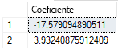

# <a name="create-and-train-a-predictive-model-in-r-with-azure-sql-database-machine-learning-services-preview"></a>Crear y entrenar un modelo predictivo en R con Machine Learning Services (versión preliminar) de Azure SQL Database

En esta guía de inicio rápido, deberá crear y entrenar un modelo predictivo mediante R, guardará el modelo en una tabla de la base de datos SQL y usará ese modelo para predecir valores a partir de datos nuevos mediante la versión preliminar pública de [Machine Learning Services (con R) en Azure SQL Database](sql-database-machine-learning-services-overview.md). 

El modelo que usará en la guía de inicio rápido es un modelo de regresión simple que predice la distancia de frenado de un automóvil en función de la velocidad. Deberá usar el conjunto de datos denominado **Automóviles** incluido con R, ya que es pequeño y fácil de entender.

> [!TIP]
> Muchos conjuntos de datos, pequeños y grandes, se incluyen con el entorno en tiempo de ejecución de R. Para obtener una lista de los conjuntos de datos instalados con R, escriba `library(help="datasets")` desde el símbolo del sistema de R.

[!INCLUDE[ml-preview-note](../../includes/sql-database-ml-preview-note.md)]

## <a name="prerequisites"></a>Requisitos previos

- Si no tiene una suscripción a Azure, [cree una cuenta](https://azure.microsoft.com/free/) antes de empezar.

- Para ejecutar el código de ejemplo en estos ejercicios, primero debe tener una instancia de Azure SQL Database con Machine Learning Services (con R) habilitada. Durante la versión preliminar pública, Microsoft le incorporará y habilitará el aprendizaje automático para la base de datos nueva o existente. Siga los pasos que se indican en [Suscríbase a la versión preliminar](sql-database-machine-learning-services-overview.md#signup).

- Asegúrese de que tiene instalada la versión más reciente de [SQL Server Management Studio](https://docs.microsoft.com/sql/ssms/sql-server-management-studio-ssms) (SSMS). Puede ejecutar los scripts de R con herramientas de consulta o de otro tipo de administración de base de datos, pero en este tutorial usará SSMS.

- En esta guía de inicio rápido, también es necesario configurar una regla de firewall de nivel de servidor. Para obtener información acerca de cómo puede realizar estos pasos, consulte [Crear una regla de firewall de nivel de servidor](sql-database-server-level-firewall-rule.md).

## <a name="create-and-train-a-predictive-model"></a>Crear y entrenar un modelo predictivo

Los datos de velocidad del automóvil en el conjunto de datos **Automóviles** contienen dos columnas numéricas: **distancia** y **velocidad**. Los datos incluyen diversas observaciones de las frenadas a distintas velocidades. A partir de estos datos, se creará un modelo de regresión lineal que describe la relación entre la velocidad del automóvil y la distancia necesaria para detenerlo.

Los requisitos de un modelo lineal son sencillos:
- Defina una fórmula que describa la relación entre la variable dependiente *velocidad* y la variable independiente *distancia*.
- Proporcione los datos de entrada para utilizarlos en el entrenamiento del modelo.

> [!TIP]
> Si necesita un actualizador de los modelos lineales, consulte este tutorial, que describe el proceso de ajuste de un modelo mediante rxLinMod: [Ajuste de modelos lineales](https://docs.microsoft.com/machine-learning-server/r/how-to-revoscaler-linear-model)

En los siguientes pasos, configurará los datos de entrenamiento, creará un modelo de regresión, lo entrenará mediante esos datos de entrenamiento y, a continuación, guardará el modelo en una tabla SQL.

1. Abra **SQL Server Management Studio** y conéctese a la base de datos SQL.

   Si necesita ayuda para conectarse, consulte [Inicio rápido: Uso de SQL Server Management Studio para conectarse a una base de datos de Azure SQL Database y realizar consultas en ella](sql-database-connect-query-ssms.md).

1. Cree una tabla denominada **CarSpeed** para guardar los datos de entrenamiento.

    ```sql
    CREATE TABLE dbo.CarSpeed (
        speed INT NOT NULL
        , distance INT NOT NULL
        )
    GO
    
    INSERT INTO dbo.CarSpeed (
        speed
        , distance
        )
    EXECUTE sp_execute_external_script @language = N'R'
        , @script = N'car_speed <- cars;'
        , @input_data_1 = N''
        , @output_data_1_name = N'car_speed'
    GO
    ```

1. Cree un modelo de regresión mediante `rxLinMod`. 

   Para compilar el modelo, debe definir la fórmula dentro del código R y pasar los datos de entrenamiento de **CarSpeed** como un parámetro de entrada.

    ```sql
    DROP PROCEDURE IF EXISTS generate_linear_model;
    GO
    CREATE PROCEDURE generate_linear_model
    AS
    BEGIN
      EXECUTE sp_execute_external_script
      @language = N'R'
      , @script = N'
    lrmodel <- rxLinMod(formula = distance ~ speed, data = CarsData);
    trained_model <- data.frame(payload = as.raw(serialize(lrmodel, connection=NULL)));
    '
      , @input_data_1 = N'SELECT [speed], [distance] FROM CarSpeed'
      , @input_data_1_name = N'CarsData'
      , @output_data_1_name = N'trained_model'
      WITH RESULT SETS ((model VARBINARY(max)));
    END;
    GO
    ```

     El primer argumento para rxLinMod es el parámetro *formula*, que define la distancia como dependiente de la velocidad. Los datos de entrada se almacenan en la variable `CarsData`, que se rellena con la consulta SQL.

1. A continuación, cree una tabla para almacenar el modelo y así poder volver a entrenarlo o usarlo en la predicción. 

   La salida de un paquete de R que crea un modelo es normalmente un **objeto binario**, por lo que la tabla debe tener una columna de tipo **VARBINARY(max)** .

    ```sql
    CREATE TABLE dbo.stopping_distance_models (
        model_name VARCHAR(30) NOT NULL DEFAULT('default model') PRIMARY KEY
        , model VARBINARY(max) NOT NULL
        );
    ```

1. A continuación, llame al procedimiento almacenado, genere el modelo y guárdelo en una tabla.

   ```sql
   INSERT INTO dbo.stopping_distance_models (model)
   EXECUTE generate_linear_model;
   ```

   Tenga en cuenta que si ejecuta este código por segunda vez, obtendrá este error:

   ```text
   Violation of PRIMARY KEY constraint...Cannot insert duplicate key in object bo.stopping_distance_models
   ```

   Una opción para evitar este error consiste en actualizar el nombre de cada nuevo modelo. Por ejemplo, podría cambiar el nombre a algo más descriptivo e incluir el tipo de modelo, el día en que lo creó, etc.

   ```sql
   UPDATE dbo.stopping_distance_models
   SET model_name = 'rxLinMod ' + FORMAT(GETDATE(), 'yyyy.MM.HH.mm', 'en-gb')
   WHERE model_name = 'default model'
   ```

## <a name="view-the-table-of-coefficients"></a>Ver la tabla de coeficientes

Generalmente, la salida de R desde el procedimiento almacenado [sp_execute_external_script](https://docs.microsoft.com/sql/relational-databases/system-stored-procedures/sp-execute-external-script-transact-sql) se limita a una única trama de datos. Sin embargo, puede devolver salidas de otros tipos, como valores escalares, además de la trama de datos.

Por ejemplo, supongamos que quiere entrenar un modelo, pero ve inmediatamente la tabla de coeficientes de este. Para poder entrenar el modelo, debe crear la tabla de coeficientes como el conjunto de resultados principal y generar el modelo entrenado en una variable de SQL. Gracias a ello, puede reutilizar el modelo inmediatamente llamando a la variable, o puede guardarlo en una tabla tal como se muestra aquí.

```sql
DECLARE @model VARBINARY(max)
    , @modelname VARCHAR(30)

EXECUTE sp_execute_external_script @language = N'R'
    , @script = N'
speedmodel <- rxLinMod(distance ~ speed, CarsData)
modelbin <- serialize(speedmodel, NULL)
OutputDataSet <- data.frame(coefficients(speedmodel));
'
    , @input_data_1 = N'SELECT [speed], [distance] FROM CarSpeed'
    , @input_data_1_name = N'CarsData'
    , @params = N'@modelbin varbinary(max) OUTPUT'
    , @modelbin = @model OUTPUT
WITH RESULT SETS(([Coefficient] FLOAT NOT NULL));

-- Save the generated model
INSERT INTO dbo.stopping_distance_models (
    model_name
    , model
    )
VALUES (
    'latest model'
    , @model
    )
```

**Resultados**



## <a name="score-new-data-using-the-trained-model"></a>Puntuar los datos nuevos mediante el modelo entrenado

*Puntuación* es un término que se usa en la ciencia de datos para referirse a la generación de predicciones, probabilidades u otros valores basados en nuevos datos introducidos en un modelo entrenado. Usará el modelo que creó en la sección anterior para puntuar las predicciones con respecto a los nuevos datos.

¿Ha observado que los datos de entrenamiento originales se detienen a una velocidad de 25 millas por hora? Esto se debe a que los datos originales se basaron en un experimento de 1920. Es posible que se pregunte lo siguiente: ¿cuánto tiempo tardaría un automóvil de 1920 en detenerse, asumiendo que podría ir como máximo a 60 mph o incluso a 100 mph? Para responder a esta pregunta, debe proporcionar algunos valores de velocidad nuevos en el modelo.

1. Cree una tabla con los nuevos datos de velocidad.

   ```sql
    CREATE TABLE dbo.NewCarSpeed (
        speed INT NOT NULL
        , distance INT NULL
        )
    GO
    
    INSERT dbo.NewCarSpeed (speed)
    VALUES (40)
        , (50)
        , (60)
        , (70)
        , (80)
        , (90)
        , (100)
   ```

2. Prediga la distancia de frenado a partir de estos nuevos valores de velocidad.

   Como el modelo se basa en el algoritmo **rxLinMod** proporcionado como parte del paquete **RevoScaleR**, se llama a la función [rxPredict](https://docs.microsoft.com/machine-learning-server/r-reference/revoscaler/rxpredict), en lugar de a la función R `predict` genérica.

   Este script de ejemplo:
   - Usa una instrucción SELECT para obtener un modelo único de la tabla.
   - Pasa esa instrucción como parámetro de entrada.
   - Llama a la función `unserialize` en el modelo.
   - Aplica la función `rxPredict` con los argumentos apropiados al modelo.
   - Proporciona los nuevos datos de entrada.

   > [!TIP]
   > En cuanto a la puntuación en tiempo real, consulte el apartado sobre [funciones de serialización](https://docs.microsoft.com/machine-learning-server/r-reference/revoscaler/rxserializemodel) que proporciona RevoScaleR.

   ```sql
    DECLARE @speedmodel VARBINARY(max) = (
            SELECT model
            FROM dbo.stopping_distance_models
            WHERE model_name = 'latest model'
            );
    
    EXECUTE sp_execute_external_script @language = N'R'
        , @script = N'
    current_model <- unserialize(as.raw(speedmodel));
    new <- data.frame(NewCarData);
    predicted.distance <- rxPredict(current_model, new);
    str(predicted.distance);
    OutputDataSet <- cbind(new, ceiling(predicted.distance));
    '
        , @input_data_1 = N'SELECT speed FROM [dbo].[NewCarSpeed]'
        , @input_data_1_name = N'NewCarData'
        , @params = N'@speedmodel varbinary(max)'
        , @speedmodel = @speedmodel
    WITH RESULT SETS((
                new_speed INT
                , predicted_distance INT
                ));
   ```

   **Resultados**

   

> [!NOTE]
> En este script de ejemplo, la función `str` se agrega durante la fase de prueba, para comprobar el esquema de los datos que se devuelven desde R. Puede eliminar la instrucción más tarde.
>
> Los nombres de columna utilizados en el script de R no necesariamente se pasan a la salida del procedimiento almacenado. Aquí la instrucción WITH RESULTS define algunos nombres de columna nuevos.

## <a name="next-steps"></a>Pasos siguientes

Para más información acerca de Azure SQL Database Machine Learning Services con R (versión preliminar), consulte los siguientes artículos.

- [Azure SQL Database Machine Learning Services con R (versión preliminar)](sql-database-machine-learning-services-overview.md)
- [Crear y ejecutar scripts de R sencillos en Azure SQL Database Machine Learning Services (versión preliminar)](sql-database-quickstart-r-create-script.md)
- [Escribir funciones de R avanzadas en Azure SQL Database Machine Learning Services (versión preliminar)](sql-database-machine-learning-services-functions.md)
- [Trabajar con datos SQL y R en Machine Learning Services (versión preliminar) de Azure SQL Database](sql-database-machine-learning-services-data-issues.md)