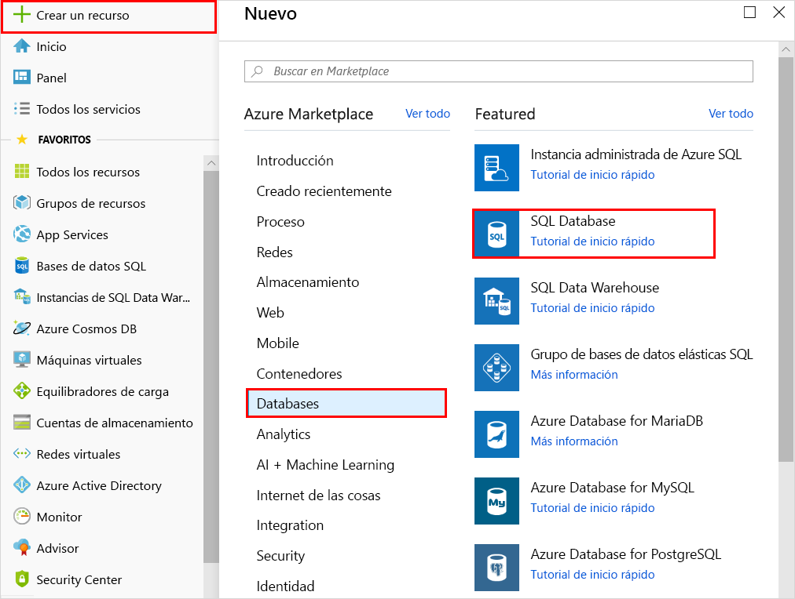
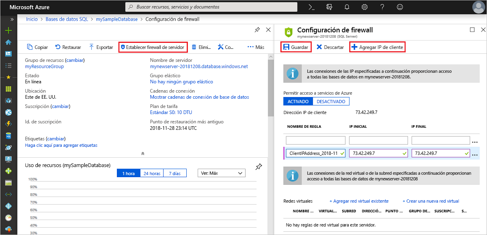

# Servidores de Azure SQL Database y cómo administrarlos

## Qué es un servidor de Azure SQL Database

Un servidor de SQL Database es una construcción lógica que funciona como punto de administración central para varias bases de datos únicas o [agrupadas](sql-database-elastic-pool.md), [inicios de sesión](sql-database-manage-logins.md), [reglas de firewall](sql-database-firewall-configure.md), [reglas de auditoría](sql-database-auditing.md), [directivas de detección de amenazas](sql-database-threat-detection.md) y [grupos de conmutación por error](sql-database-auto-failover-group.md). Asimismo, un servidor de SQL Database puede estar en otra región distinta a la del grupo de recursos. El servidor de SQL Database debe existir antes de crear la base de datos de Azure SQL. Todas las bases de datos que administra un servidor de SQL Database se crean en la misma región que ese servidor de SQL Database.

Un servidor de SQL Database es diferente a una instancia de SQL Server, con la que puede estar familiarizado en el mundo de los entornos locales. En concreto, el servicio SQL Database no ofrece ninguna garantía con respecto a la ubicación de las bases de datos relacionadas con el servidor de SQL Database que las administra, y no expone ningún acceso de nivel de instancia ni características. En cambio, las bases de datos de instancia correspondientes a una instancia administrada están ubicadas de forma conjunta, imitando la manera en que SQL Server las usa en entornos locales.

Al crear un servidor de SQL Database, debe proporcionar una cuenta y una contraseña para iniciar sesión en el servidor con derechos administrativos, y así obtener acceso a la base de datos maestra de dicho servidor y a todas las bases de datos creadas en el servidor. Esta cuenta inicial es una cuenta de inicio de sesión de SQL. Azure SQL Database admite la autenticación de SQL y la autenticación de Azure Active Directory. Para obtener información sobre inicios de sesión y autenticación, vea [Administración de bases de datos e inicios de sesión en Azure SQL Database](sql-database-manage-logins.md). La autenticación de Windows no es compatible.

Un servidor de SQL Database:

- Se crea en una suscripción de Azure, pero puede transferirse a otra suscripción con los recursos que contiene.
- Es el recurso primario para bases de datos, grupos elásticos y almacenamientos de datos.
- Proporciona un espacio de nombres para bases de datos, grupos elásticos y almacenamientos de datos.
- Es un contenedor lógico con semántica de duración segura. Si se elimina un servidor, se eliminan las bases de datos independientes, los grupos elásticos y los almacenamientos de datos.
- Participa en el [control de acceso basado en rol (RBAC) de Azure](/azure/role-based-access-control/overview). Las bases de datos, los grupos elásticos y los almacenamientos de datos dentro de un servidor heredan los derechos de acceso del servidor.
- Es un elemento de orden superior de la identidad de las bases de datos, los grupos elásticos y los almacenamientos de datos con fines de administración de recursos de Azure (vea el esquema de direcciones URL para bases de datos y grupos).
- Coloca recursos en una región.
- Proporciona un punto de conexión para el acceso a la base de datos (`<serverName>`. database.windows.net).
- Proporciona acceso a los metadatos de recursos contenidos a través de las DMV conectándose a una base de datos maestra.
- Proporciona el ámbito de las directivas de administración que se aplican a sus bases de datos: inicios de sesión, firewall, auditoría y detección de amenazas, entre otros.
- Está restringido por una cuota dentro de la suscripción primaria (seis servidores por suscripción de forma predeterminada; [consulte el artículo sobre los límites de la suscripción aquí](../azure-subscription-service-limits.md)).
- Proporciona el ámbito de la cuota de la base de datos y la cuota de DTU o de núcleos virtuales para los recursos que contiene (por ejemplo, 45 000 DTU).
- Es el ámbito de control de versiones para funciones que se habilitan en los recursos contenidos.
- Los inicios de sesión de la entidad de seguridad en el nivel de servidor pueden administrar todas las bases de datos en un servidor.
- Puede contener inicios de sesión similares a los de las instancias de SQL Server en sus instalaciones que tienen acceso a una o más bases de datos en el servidor y puede ser concesionario de derechos administrativos limitados. Para obtener más información, consulte el artículo sobre [inicios de sesión](sql-database-manage-logins.md).
- La intercalación predeterminada para todas las bases de datos de creadas en un servidor de SQL Database es `SQL_LATIN1_GENERAL_CP1_CI_AS`, donde `LATIN1_GENERAL` es inglés (Estados Unidos), `CP1` es la página de códigos 1252, `CI` distingue mayúsculas de minúsculas y `AS` distingue acentos.

## Administración de servidores, bases de datos y firewalls de Azure SQL en Azure Portal

Puede crear el grupo de recursos de la base de datos de Azure SQL con antelación o mientras crea el propio servidor. Existen varios métodos para obtener un nuevo formulario de servidor SQL, bien mediante la creación de un nuevo servidor SQL o como parte de la creación de una base de datos nueva.

### Crear un servidor de SQL Database en blanco

Para crear un servidor de Azure SQL Database (sin una base de datos) en [Azure Portal](https://portal.azure.com), vaya a un formulario vacío de SQL Server (servidor lógico).  

### Creación de una base de datos SQL de ejemplo o en blanco

Para crear una base de datos de Azure SQL Database en [Azure Portal](https://portal.azure.com), vaya al formulario en blanco de SQL Database y facilite la información requerida. Puede crear un servidor de SQL Database y un grupo de recursos de Azure SQL Database con antelación o mientras crea la propia base de datos. Puede crear una base de datos en blanco o de ejemplo basada en Adventure Works LT.

  

> [!IMPORTANT]
> Para obtener información sobre cómo seleccionar el plan de tarifa de la base de datos, consulte el [modelo de compra basado en DTU](sql-database-service-tiers-dtu.md) y el [modelo de compra basado en núcleo virtual](sql-database-service-tiers-vcore.md).

Para crear una instancia administrada, consulte [Creación de una instancia administrada](sql-database-managed-instance-get-started.md).

### Administración de un servidor SQL Server existente

Para administrar un servidor existente, vaya al servidor mediante una serie de métodos, como la página específica de SQL Database, la página de **Servidores SQL Server** o la página de **Todos los recursos**.

Para administrar una base de datos existente, vaya a la página de **SQL Database** y haga clic en la base de datos que desea administrar. En la captura de pantalla siguiente se muestra cómo empezar a configurar un firewall de nivel de servidor para una base de datos desde la página de **información general** de una base de datos.

   

> [!IMPORTANT]
> Para configurar las propiedades de rendimiento de una base de datos, consulte el [modelo de compra basado en DTU](sql-database-service-tiers-dtu.md) y el [modelo de compra basado en núcleo virtual](sql-database-service-tiers-vcore.md).
> [!TIP]
> Para acceder a una guía de inicio rápido de Azure Portal, consulte [Creación de una base de datos de Azure SQL en Azure Portal](sql-database-single-database-get-started.md).

## Administración de servidores, bases de datos y firewalls de Azure SQL con PowerShell

[!INCLUDE [updated-for-az](../../includes/updated-for-az.md)]
> [!IMPORTANT]
> El módulo de PowerShell de Azure Resource Manager es compatible aún con Azure SQL Database, pero todo el desarrollo futuro es para el módulo Az.Sql. Para estos cmdlets, consulte [AzureRM.Sql](https://docs.microsoft.com/powershell/module/AzureRM.Sql/). Los argumentos para los comandos en el módulo de Az y en los módulos AzureRm son esencialmente idénticos.

Para crear y administrar servidores, bases de datos y firewalls SQL de Azure con Azure PowerShell, use los siguientes cmdlets de PowerShell. Si necesita instalar o actualizar PowerShell, consulte [Install and configure Azure PowerShell](/powershell/azure/install-az-ps) (Instalación y configuración de Azure PowerShell). Para crear y administrar grupos elásticos, consulte [Grupos elásticos](sql-database-elastic-pool.md).

| Cmdlet | DESCRIPCIÓN |
| --- | --- |
|[New-AzSqlDatabase](/powershell/module/az.sql/new-azsqldatabase)|Crea una base de datos. |
|[Get-AzSqlDatabase](/powershell/module/az.sql/get-azsqldatabase)|Obtiene una o más bases de datos.|
|[Set-AzSqlDatabase](/powershell/module/az.sql/set-azsqldatabase)|Establece las propiedades de una base de datos, o mueve una base de datos existente en un grupo elástico.|
|[Remove-AzSqlDatabase](/powershell/module/az.sql/remove-azsqldatabase)|Quita una base de datos.|
|[New-AzResourceGroup](/powershell/module/az.resources/new-azresourcegroup)|Crea un grupo de recursos.|
|[New-AzSqlServer](/powershell/module/az.sql/new-azsqlserver)|Crea un servidor.|
|[Get-AzSqlServer](/powershell/module/az.sql/get-azsqlserver)|Devuelve información sobre los servidores.|
|[Set-AzSqlServer](https://docs.microsoft.com/powershell/module/az.sql/set-azsqlserver)|Modifica las propiedades de un servidor.|
|[Remove-AzSqlServer](/powershell/module/az.sql/remove-azsqlserver)|Quita un servidor.|
|[New-AzSqlServerFirewallRule](/powershell/module/az.sql/new-azsqlserverfirewallrule)|Crea una regla de firewall de nivel de servidor. |
|[Get-AzSqlServerFirewallRule](/powershell/module/az.sql/get-azsqlserverfirewallrule)|Obtiene reglas de firewall para un servidor|
|[Set-AzSqlServerFirewallRule](/powershell/module/az.sql/set-azsqlserverfirewallrule)|Modifica una regla de firewall en un servidor.|
|[Remove-AzSqlServerFirewallRule](/powershell/module/az.sql/remove-azsqlserverfirewallrule)|Obtiene una regla de firewall de un servidor.|
| New-AzSqlServerVirtualNetworkRule | Permite crear una [*regla de red virtual*](sql-database-vnet-service-endpoint-rule-overview.md) basada en una subred que es un punto de conexión de servicio de red virtual. |

> [!TIP]
> Para obtener una guía de inicio rápido de PowerShell, consulte [Create an Azure SQL single database using PowerShell](sql-database-single-database-get-started.md) (Creación de una instancia de Azure SQL Database con PowerShell). Para obtener información sobre los scripts de ejemplo de PowerShell, consulte [Uso de PowerShell para crear una instancia única de Azure SQL Database y configurar una regla de firewall](scripts/sql-database-create-and-configure-database-powershell.md) y [Supervisión y escalado de una instancia única de Azure SQL Database mediante PowerShell](scripts/sql-database-monitor-and-scale-database-powershell.md).
>

## Administración de servidores, bases de datos y firewalls de Azure SQL con la CLI de Azure

Para crear y administrar servidores, bases de datos y firewalls SQL de Azure con la [CLI de Azure](/cli/azure), use los siguientes comandos de la [CLI de Azure para SQL Database](/cli/azure/sql/db). Use [Cloud Shell](/azure/cloud-shell/overview) para ejecutar la CLI en el explorador o [instálela](/cli/azure/install-azure-cli) en Windows, Linux o macOS. Para crear y administrar grupos elásticos, consulte [Grupos elásticos](sql-database-elastic-pool.md).

| Cmdlet | DESCRIPCIÓN |
| --- | --- |
|[az sql db create](/cli/azure/sql/db#az-sql-db-create) |Crea una base de datos.|
|[az sql db list](/cli/azure/sql/db#az-sql-db-list)|Enumera todas las bases de datos y almacenes de datos de un servidor, o todas las bases de datos de un grupo elástico.|
|[az sql db list-editions](/cli/azure/sql/db#az-sql-db-list-editions)|Enumera los objetivos de servicio y los límites de almacenamiento disponibles.|
|[az sql db list-usages](/cli/azure/sql/db#az-sql-db-list-usages)|Devuelve los usos de la base de datos.|
|[az sql db show](/cli/azure/sql/db#az-sql-db-show)|Obtiene una base de datos o un almacenamiento de datos.|
|[az sql db update](/cli/azure/sql/db#az-sql-db-update)|Actualiza una base de datos.|
|[az sql db delete](/cli/azure/sql/db#az-sql-db-delete)|Quita una base de datos.|
|[az group create](/cli/azure/group#az-group-create)|Crea un grupo de recursos.|
|[az sql server create](/cli/azure/sql/server#az-sql-server-create)|Crea un servidor.|
|[az sql server list](/cli/azure/sql/server#az-sql-server-list)|Enumera los servidores.|
|[az sql server list-usages](/cli/azure/sql/server#az-sql-server-list-usages)|Devuelve los usos del servidor.|
|[az sql server show](/cli/azure/sql/server#az-sql-server-show)|Obtiene un servidor.|
|[az sql server update](/cli/azure/sql/server#az-sql-server-update)|Actualiza un servidor.|
|[az sql server delete](/cli/azure/sql/server#az-sql-server-delete)|Permite eliminar un servidor.|
|[az sql server firewall-rule create](/cli/azure/sql/server/firewall-rule#az-sql-server-firewall-rule-create)|Crea una regla de firewall del servidor.|
|[az sql server firewall-rule list](/cli/azure/sql/server/firewall-rule#az-sql-server-firewall-rule-list)|Enumera las reglas de firewall en un servidor.|
|[az sql server firewall-rule show](/cli/azure/sql/server/firewall-rule#az-sql-server-firewall-rule-show)|Muestra los detalles de una regla de firewall.|
|[az sql server firewall-rule update](/cli/azure/sql/server/firewall-rule##az-sql-server-firewall-rule-update)|Actualiza una regla de firewall.|
|[az sql server firewall-rule delete](/cli/azure/sql/server/firewall-rule#az-sql-server-firewall-rule-delete)|Elimina una regla de firewall.|

> [!TIP]
> Para obtener una guía de inicio rápido de la CLI de Azure, consulte [Create an Azure SQL single database using the Azure CLI](sql-database-cli-samples.md) (Creación de una única instancia de Azure SQL Database mediante la CLI de Azure). Para obtener información sobre los scripts de ejemplo de la CLI de Azure, consulte [Uso de la CLI para crear una instancia única de Azure SQL Database y configurar una regla de firewall](scripts/sql-database-create-and-configure-database-cli.md) y [Uso de la CLI para supervisar y escalar una instancia de Azure SQL Database](scripts/sql-database-monitor-and-scale-database-cli.md).
>

## Administración de servidores, bases de datos y firewalls de Azure SQL con Transact-SQL

Para crear y administrar servidores, bases de datos y firewalls SQL de Azure con Transact-SQL, use los siguientes comandos de Transact-SQL. Puede emitir estos comandos mediante Azure Portal, [SQL Server Management Studio](/sql/ssms/use-sql-server-management-studio), [Visual Studio Code](https://code.visualstudio.com/docs) o cualquier otro programa que pueda conectarse a un servidor de Azure SQL Database y pasar comandos de Transact-SQL. Para administrar grupos de bases de datos elásticas, consulte [Grupos elásticos](sql-database-elastic-pool.md).

> [!IMPORTANT]
> No se puede crear ni eliminar un servidor mediante Transact-SQL.
>

| Get-Help | DESCRIPCIÓN |
| --- | --- |
|[CREATE DATABASE (Azure SQL Database)](/sql/t-sql/statements/create-database-azure-sql-database)|Crear una base de datos. Debe estar conectado a la base de datos maestra para crear una base de datos.|
| [ALTER DATABASE (Azure SQL Database)](/sql/t-sql/statements/alter-database-azure-sql-database) |Modifica una base de datos de Azure SQL. |
|[ALTER DATABASE (Azure SQL Data Warehouse)](/sql/t-sql/statements/alter-database-azure-sql-data-warehouse)|Modifica una instancia de Azure SQL Data Warehouse.|
|[DROP DATABASE (Transact-SQL)](/sql/t-sql/statements/drop-database-transact-sql)|Permite eliminar una base de datos.|
|[sys.database_service_objectives (Azure SQL Database)](/sql/relational-databases/system-catalog-views/sys-database-service-objectives-azure-sql-database)|Devuelve la edición (nivel de servicio), el objetivo de servicio (plan de tarifa) y el nombre del grupo elástico, si existe, para una base de datos de Azure SQL o una instancia de Azure SQL Data Warehouse. Si inició sesión en la base de datos maestra en un servidor de Azure SQL Database, devuelve información sobre todas las bases de datos. Para Azure SQL Data Warehouse, debe estar conectado a la base de datos maestra.|
|[sys.dm_db_resource_stats (Azure SQL Database)](/sql/relational-databases/system-dynamic-management-views/sys-dm-db-resource-stats-azure-sql-database)| Devuelve el consumo de CPU, E/S y memoria para una base de datos de Azure SQL Database. Hay una fila para cada 15 segundos, incluso si no hay ninguna actividad en la base de datos.|
|[sys.resource_stats (Azure SQL Database)](/sql/relational-databases/system-catalog-views/sys-resource-stats-azure-sql-database)|Devuelve datos de almacenamiento y uso de CPU para una base de datos de Azure SQL. Los datos se recopilan y agregan en intervalos de cinco minutos.|
|[sys.database_connection_stats (Azure SQL Database)](/sql/relational-databases/system-catalog-views/sys-database-connection-stats-azure-sql-database)|Contiene estadísticas de eventos de conectividad de base de datos de SQL Database, que proporcionan una visión general de los aciertos y errores de conexión a la base de datos. |
|[sys.event_log (Azure SQL Database)](/sql/relational-databases/system-catalog-views/sys-event-log-azure-sql-database)|Devuelve las conexiones realizadas correctamente a la base de datos de Azure SQL Database, los errores de conexión y los interbloqueos. Puede usar esta información para realizar el seguimiento de la actividad de base de datos o solucionar problemas con SQL Database.|
|[sp_set_firewall_rule (Azure SQL Database)](/sql/relational-databases/system-stored-procedures/sp-set-firewall-rule-azure-sql-database)|Crea o actualiza la configuración del firewall de nivel de servidor del servidor de SQL Database. Este procedimiento almacenado solo está disponible en la base de datos maestra para el inicio de sesión de entidad de seguridad de nivel de servidor. Solo se puede crear una regla de firewall de nivel de servidor mediante Transact-SQL después de que un usuario con permisos a nivel de Azure haya creado la primera regla de firewall de nivel de servidor.|
|[sys.firewall_rules (Azure SQL Database)](/sql/relational-databases/system-catalog-views/sys-firewall-rules-azure-sql-database)|Devuelve información sobre la configuración del firewall de nivel de servidor asociada a Microsoft Azure SQL Database.|
|[sp_delete_firewall_rule (Azure SQL Database)](/sql/relational-databases/system-stored-procedures/sp-delete-firewall-rule-azure-sql-database)|Quita la configuración del firewall de nivel de servidor del servidor de SQL Database. Este procedimiento almacenado solo está disponible en la base de datos maestra para el inicio de sesión de entidad de seguridad de nivel de servidor.|
|[sp_set_database_firewall_rule (Azure SQL Database)](/sql/relational-databases/system-stored-procedures/sp-set-database-firewall-rule-azure-sql-database)|Crea o actualiza las reglas de firewall de nivel de base de datos para su base de datos de Azure SQL o almacenamiento de SQL Data Warehouse. Las reglas de firewall de base de datos pueden configurarse para la base de datos maestra y las bases de datos de usuario de SQL Database. Las reglas de firewall de base de datos son útiles cuando se usan usuarios de base de datos independientes. |
|[sys.database_firewall_rules (Azure SQL Database)](/sql/relational-databases/system-catalog-views/sys-database-firewall-rules-azure-sql-database)|Devuelve información sobre la configuración del firewall de nivel de base de datos asociada a Microsoft Azure SQL Database. |
|[sp_delete_database_firewall_rule (Azure SQL Database)](/sql/relational-databases/system-stored-procedures/sp-delete-database-firewall-rule-azure-sql-database)|Quita las reglas de firewall de nivel de base de datos de su base de datos de Azure SQL o almacenamiento de SQL Data Warehouse. |

> [!TIP]
> Para acceder a un artículo de inicio rápido sobre el uso de SQL Server Management Studio en Microsoft Windows, consulte [Azure SQL Database: uso de SQL Server Management Studio para conectarse a los datos y realizar consultas en ellos](sql-database-connect-query-ssms.md). Para acceder a un inicio rápido sobre el uso de Visual Studio Code en macOS, Linux o Windows, consulte [Azure SQL Database: uso de Visual Studio Code para conectarse a los datos y realizar consultas en ellos](sql-database-connect-query-vscode.md).

## Administración de servidores, bases de datos y firewalls de Azure SQL con la API de REST

Para crear y administrar servidores, bases de datos y firewalls de Azure SQL, use estas solicitudes de la API REST.

| Get-Help | DESCRIPCIÓN |
| --- | --- |
|[Servers - Create or update](https://docs.microsoft.com/rest/api/sql/servers/createorupdate)|Crea o actualiza un nuevo servidor.|
|[Servers - Delete](https://docs.microsoft.com/rest/api/sql/servers/delete)|Elimina un servidor de SQL Server.|
|[Servers - Get](https://docs.microsoft.com/rest/api/sql/servers/get)|Obtiene un servidor.|
|[Servers - List](https://docs.microsoft.com/rest/api/sql/servers/list)|Devuelve una lista de servidores.|
|[Servers - List by resource group](https://docs.microsoft.com/rest/api/sql/servers/listbyresourcegroup)|Devuelve una lista de servidores en un grupo de recursos.|
|[Servers - Update](https://docs.microsoft.com/rest/api/sql/servers/update)|Actualiza un servidor existente.|
|[Databases - Create or update](https://docs.microsoft.com/rest/api/sql/databases/createorupdate)|Crea una nueva base de datos o actualiza una ya existente.|
|[Databases - Delete](https://docs.microsoft.com/rest/api/sql/databases/delete)|Permite eliminar una base de datos.|
|[Databases - Get](https://docs.microsoft.com/rest/api/sql/databases/get)|Obtiene una base de datos.|
|[Databases - List by elastic pool](https://docs.microsoft.com/rest/api/sql/databases/listbyelasticpool)|Devuelve una lista de bases de datos de un grupo elástico.|
|[Databases - List by server](https://docs.microsoft.com/rest/api/sql/databases/listbyserver)|Devuelve una lista de bases de datos de un servidor.|
|[Databases - Update](https://docs.microsoft.com/rest/api/sql/databases/update)|Actualiza una base de datos existente.|
|[Firewall rules - Create or update](https://docs.microsoft.com/rest/api/sql/firewallrules/createorupdate)|Crea o actualiza una regla de firewall.|
|[Firewall rules - Delete](https://docs.microsoft.com/rest/api/sql/firewallrules/delete)|Elimina una regla de firewall.|
|[Firewall rules - Get](https://docs.microsoft.com/rest/api/sql/firewallrules/get)|Obtiene una regla de firewall.|
|[Firewall rules - List by server](https://docs.microsoft.com/rest/api/sql/firewallrules/listbyserver)|Devuelve una lista de reglas de firewall.|

## Pasos siguientes

- Para obtener información sobre cómo migrar una base de datos de SQL Server a Azure, vea [Migración a Azure SQL Database](sql-database-single-database-migrate.md).
- Para obtener información sobre las características admitidas, consulte el [artículo que trata sobre dicho tema](sql-database-features.md).
