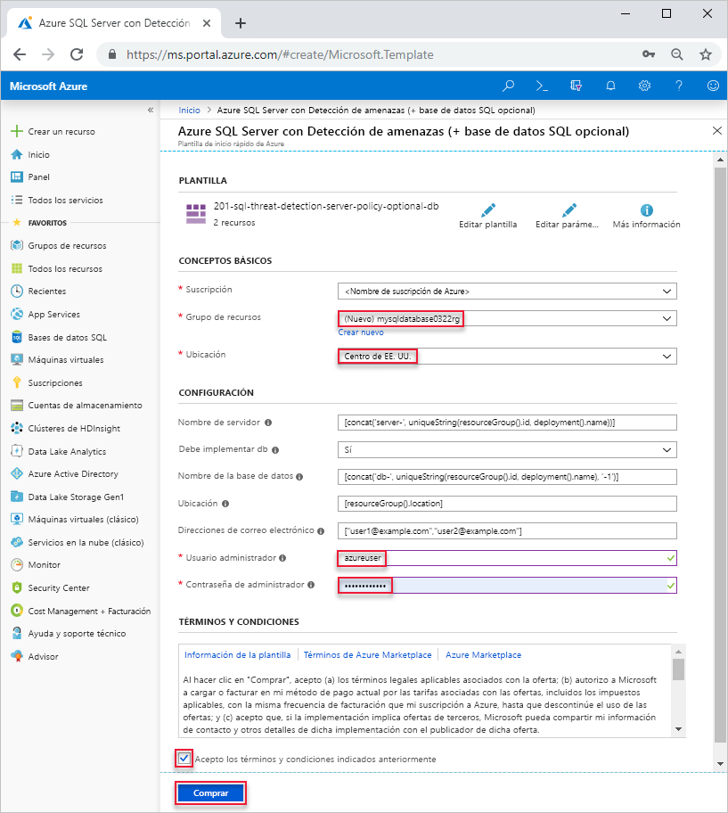

# <a name="quickstart-create-a-single-database-in-azure-sql-database-using-the-azure-resource-manager-template"></a>Inicio rápido: Creación de una base de datos única en Azure SQL Database con una plantilla de Azure Resource Manager

La creación de una [base de datos única](sql-database-single-database.md) es la opción de implementación más rápida y sencilla para crear una base de datos en Azure SQL Database. En este inicio rápido se muestra cómo crear una base de datos única con una plantilla de Azure Resource Manager. Para más información, consulte la [documentación de Azure Resource Manager](/azure/azure-resource-manager/).

Si no tiene una suscripción a Azure, [cree una cuenta gratuita](https://azure.microsoft.com/free/).

## <a name="create-a-single-database"></a>Creación de una base de datos única

Una base de datos única tiene un conjunto definido de recursos de proceso, memoria, E/S y almacenamiento y se usa uno de los dos [modelos de compra](sql-database-purchase-models.md). Cuando se crea una base de datos única, también se define un [servidor de SQL Database](sql-database-servers.md) para administrarla y colocarla dentro de un [grupo de recursos de Azure](../azure-resource-manager/resource-group-overview.md) de una región determinada.

El siguiente archivo JSON es la plantilla que se usa en este artículo. La plantilla se almacena en una cuenta de Azure Storage. Puede encontrar más ejemplos de plantillas de Azure SQL Database [aquí](https://azure.microsoft.com/resources/templates/?resourceType=Microsoft.Sql&pageNumber=1&sort=Popular).

```json
{
  "$schema": "https://schema.management.azure.com/schemas/2015-01-01/deploymentTemplate.json#",
  "contentVersion": "1.0.0.0",
  "parameters": {
    "serverName": {
      "type": "string",
      "defaultValue": "[concat('server-', uniqueString(resourceGroup().id, deployment().name))]",
      "metadata": {
        "description": "Name for the SQL server"
      }
    },
    "shouldDeployDb": {
      "type": "string",
      "allowedValues": [
        "Yes",
        "No"
      ],
      "defaultValue": "Yes",
      "metadata": {
        "description": "Whether an Azure SQL Database should be deployed under the server"
      }
    },
    "databaseName": {
      "type": "string",
      "defaultValue": "[concat('db-', uniqueString(resourceGroup().id, deployment().name), '-1')]",
      "metadata": {
        "description": "Name for the SQL database under the SQL server"
      }
    },
    "location": {
      "type": "string",
      "defaultValue": "[resourceGroup().location]",
      "metadata": {
        "description": "Location for server and optional DB"
      }
    },
    "emailAddresses": {
      "type": "array",
      "defaultValue": [
        "user1@example.com",
        "user2@example.com"
      ],
      "metadata": {
        "description": "Email addresses for receiving alerts"
      }
    },
    "adminUser": {
      "type": "string",
      "metadata": {
        "description": "Username for admin"
      }
    },
    "adminPassword": {
      "type": "securestring",
      "metadata": {
        "description": "Password for admin"
      }
    }
  },
  "variables": {
    "databaseServerName": "[toLower(parameters('serverName'))]",
    "databaseName": "[parameters('databaseName')]",
    "shouldDeployDb": "[parameters('shouldDeployDb')]",
    "databaseServerLocation": "[parameters('location')]",
    "databaseServerAdminLogin": "[parameters('adminUser')]",
    "databaseServerAdminLoginPassword": "[parameters('adminPassword')]",
    "emailAddresses": "[parameters('emailAddresses')]"
  },
  "resources": [
    {
      "type": "Microsoft.Sql/servers",
      "name": "[variables('databaseServerName')]",
      "location": "[variables('databaseServerLocation')]",
      "apiVersion": "2015-05-01-preview",
      "properties": {
        "administratorLogin": "[variables('databaseServerAdminLogin')]",
        "administratorLoginPassword": "[variables('databaseServerAdminLoginPassword')]",
        "version": "12.0"
      },
      "tags": {
        "DisplayName": "[variables('databaseServerName')]"
      },
      "resources": [
        {
          "type": "securityAlertPolicies",
          "name": "DefaultSecurityAlert",
          "apiVersion": "2017-03-01-preview",
          "dependsOn": [
            "[variables('databaseServerName')]"
          ],
          "properties": {
            "state": "Enabled",
            "emailAddresses": "[variables('emailAddresses')]",
            "emailAccountAdmins": true
          }
        }
      ]
    },
    {
      "condition": "[equals(variables('shouldDeployDb'), 'Yes')]",
      "type": "Microsoft.Sql/servers/databases",
      "name": "[concat(string(variables('databaseServerName')), '/', string(variables('databaseName')))]",
      "location": "[variables('databaseServerLocation')]",
      "apiVersion": "2017-10-01-preview",
      "dependsOn": [
        "[concat('Microsoft.Sql/servers/', variables('databaseServerName'))]"
      ],
      "properties": {},
      "tags": {
        "DisplayName": "[variables('databaseServerName')]"
      }
    }
  ]
}
```

1. Seleccione la imagen siguiente para iniciar sesión en Azure y abrir una plantilla.

    <a href="https://portal.azure.com/#create/Microsoft.Template/uri/https%3A%2F%2Farmtutorials.blob.core.windows.net%2Fcreatesql%2Fazuredeploy.json"></a>

2. Seleccione o escriba los siguientes valores.  

    

    A menos que se indique otra cosa, utilice los valores predeterminados.

    * **Suscripción**: seleccione una suscripción de Azure.
    * **Grupo de recursos**: seleccione **Crear nuevo**, escriba un nombre único para el grupo de recursos y, a continuación, haga clic en **Aceptar**. 
    * **Ubicación**: seleccione una ubicación.  Por ejemplo, **Centro de EE. UU**.
    * **Usuario administrador**: especifique el nombre de usuario del administrador del servidor de SQL Database.
    * **Contraseña de administrador**: especifique la contraseña del administrador. 
    * **Acepto los términos y condiciones anteriores**: Seleccionar.
3. Seleccione **Comprar**.

## <a name="query-the-database"></a>Consulta de la base de datos

Para consultar la base de datos, vea [Consulta de la base de datos](./sql-database-single-database-get-started.md#query-the-database).

## <a name="clean-up-resources"></a>Limpieza de recursos

Mantenga este grupo de recursos, el servidor de bases de datos y la base de datos única si quiere ir a [Pasos siguientes](#next-steps). Los pasos siguientes muestran cómo conectarse a la base de datos y consultarla mediante distintos métodos.

Para eliminar el grupo de recursos mediante Azure PowerShell o la CLI de Azure:

```azurecli-interactive
echo "Enter the Resource Group name:" &&
read resourceGroupName &&
az group delete --name $resourceGroupName 
```

```azurepowershell-interactive
$resourceGroupName = Read-Host -Prompt "Enter the Resource Group name"
Remove-AzResourceGroup -Name $resourceGroupName 
```

## <a name="next-steps"></a>Pasos siguientes

- Cree una regla de firewall de nivel de servidor para conectarse a la base de datos única desde herramientas locales o remotas. Para más información, consulte [Creación de una regla de firewall de nivel de servidor](sql-database-server-level-firewall-rule.md).
- Después de crear una regla de firewall de nivel de servidor, puede usar varias herramientas y lenguajes para [conectarse a la base de datos y realizar consultas en ella](sql-database-connect-query.md).
  - [Conexión y consulta mediante SQL Server Management Studio](sql-database-connect-query-ssms.md)
  - [Conexión y consulta mediante Azure Data Studio](https://docs.microsoft.com/sql/azure-data-studio/quickstart-sql-database?toc=/azure/sql-database/toc.json)
- Para crear una base de datos única mediante la CLI de Azure, consulte [Ejemplos de la CLI de Azure](sql-database-cli-samples.md).
- Para crear una base de datos única mediante Azure PowerShell, consulte [Ejemplos de Azure PowerShell](sql-database-powershell-samples.md).
