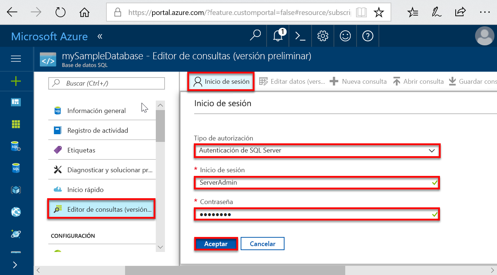
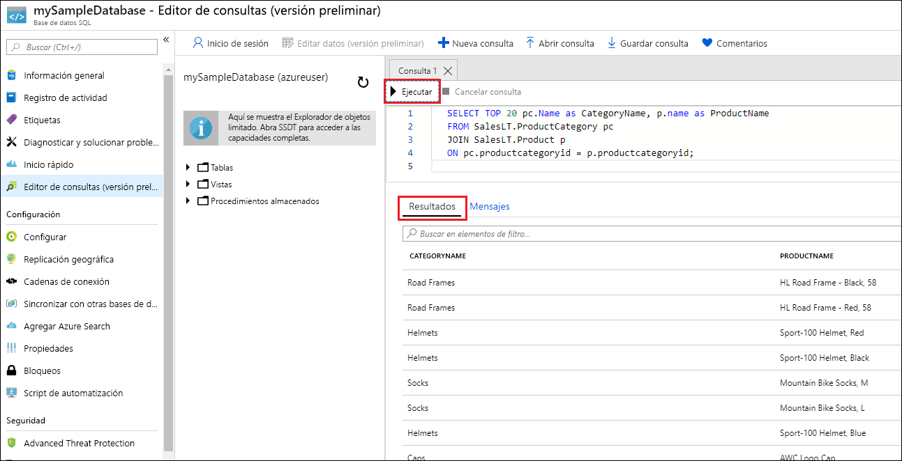

# <a name="quickstart-create-a-single-database-in-azure-sql-database-using-the-azure-portal-powershell-and-azure-cli"></a>Inicio rápido: Creación de una base de datos única en Azure SQL Database con Azure Portal, PowerShell o la CLI de Azure

La creación de una [base de datos única](sql-database-single-database.md) es la opción de implementación más rápida y sencilla para crear una base de datos en Azure SQL Database. En esta guía de inicio rápido se muestra cómo crear, para su posterior consulta, una base de datos única mediante Azure Portal.

Si no tiene una suscripción a Azure, [cree una cuenta gratuita](https://azure.microsoft.com/free/). 

Para seguir todos los pasos de este artículo de inicio rápido debe iniciar sesión en [Azure Portal](https://portal.azure.com/).

## <a name="create-a-single-database"></a>Crear una base de datos única

Se puede crear una base de datos única en el nivel de proceso aprovisionado o sin servidor.

- Una base de datos única en el nivel de proceso aprovisionado tiene asignada previamente una cantidad fija de recursos de proceso, como memoria y CPU con uno o dos [modelos de compra](sql-database-purchase-models.md).
- Una base de datos única en el nivel de proceso sin servidor tiene una variedad de recursos de proceso, como memoria y CPU que se escalan automáticamente, y solo está disponible en los [modelos de compra basados en núcleo virtual](sql-database-service-tiers-vcore.md).

Cuando se crea una base de datos única, también se define un [servidor de SQL Database](sql-database-servers.md) para administrarla y colocarla dentro de un [grupo de recursos de Azure](../azure-resource-manager/management/overview.md) de una región determinada.

> [!NOTE]
> En este inicio rápido se usa el [modelo de compra basado en núcleo virtual](sql-database-service-tiers-DTU.md), pero también está disponible el [modelo de compra basado en DTU](sql-database-service-tiers-vcore.md).

Para crear una base de datos única que contenga los datos de ejemplo de AdventureWorksLT:

[!INCLUDE [sql-database-create-single-database](includes/sql-database-create-single-database.md)]

## <a name="query-the-database"></a>Consulta de la base de datos

Ahora que ha creado la base de datos, use la herramienta de consulta integrada en Azure Portal para conectarse a la base de datos y realizar consultas en los datos.

1. En la página **SQL Database** de su base de datos, seleccione **Editor de consultas (versión preliminar)** en el menú de la izquierda.

   

2. Escriba su información de inicio de sesión y seleccione **Aceptar**.
3. Escriba la siguiente consulta en el panel del **Editor de consultas**.

   ```sql
   SELECT TOP 20 pc.Name as CategoryName, p.name as ProductName
   FROM SalesLT.ProductCategory pc
   JOIN SalesLT.Product p
   ON pc.productcategoryid = p.productcategoryid;
   ```

4. Seleccione **Ejecutar** y examine los resultados de la consulta en el panel **Resultados**.

   

5. Cierre la página **Editor de consultas** y seleccione **Aceptar** cuando se le pida que descarte los cambios que no se hayan guardado.

## <a name="clean-up-resources"></a>Limpieza de recursos

Mantenga este grupo de recursos, el servidor de bases de datos y la base de datos única si quiere ir a [Pasos siguientes](#next-steps). Los pasos siguientes muestran cómo conectarse a la base de datos y consultarla mediante distintos métodos.

Cuando haya terminado con estos recursos, puede eliminarlos como se indica a continuación:

1. En el menú izquierdo de Azure Portal, seleccione **Grupos de recursos** y, después, **myResourceGroup**.
2. En la página del grupo de recursos, seleccione **Eliminar grupo de recursos**.
3. Escriba *myResourceGroup* en el campo y, después, seleccione **Eliminar**.

## <a name="next-steps"></a>Pasos siguientes

- Cree una regla de firewall de nivel de servidor para conectarse a la base de datos única desde herramientas locales o remotas. Para más información, consulte [Creación de una regla de firewall de nivel de servidor](sql-database-server-level-firewall-rule.md).
- Después de crear una regla de firewall de nivel de servidor, puede usar varias herramientas y lenguajes para [conectarse a la base de datos y realizar consultas en ella](sql-database-connect-query.md).
  - [Conexión y consulta con SQL Server Management Studio](sql-database-connect-query-ssms.md)
  - [Conexión y consulta de datos con Azure Data Studio](https://docs.microsoft.com/sql/azure-data-studio/quickstart-sql-database?toc=/azure/sql-database/toc.json)
- Para crear una base de datos única en el nivel de proceso aprovisionado con la CLI de Azure, consulte los [ejemplos de la CLI de Azure](sql-database-cli-samples.md).
- Para crear una base de datos única en el nivel de proceso aprovisionado con Azure PowerShell, consulte los [ejemplos de Azure PowerShell](sql-database-powershell-samples.md).
- Para crear una base de datos única en el nivel de proceso sin servidor con Azure PowerShell, consulte [Create serverless database](sql-database-serverless.md#create-new-database-in-serverless-compute-tier) (Creación de una base de datos sin servidor).
