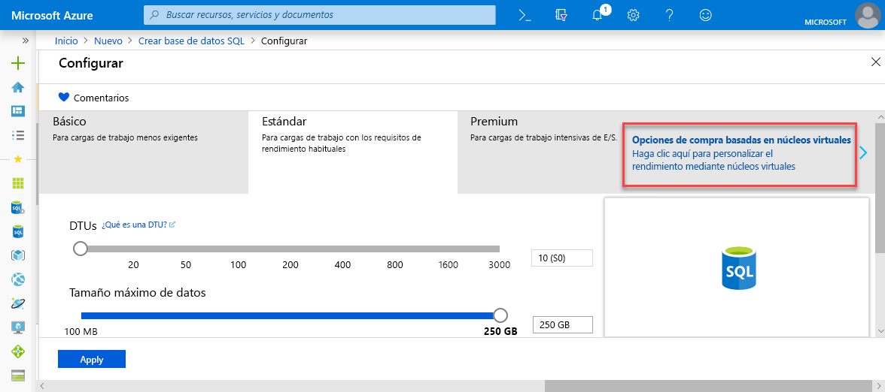
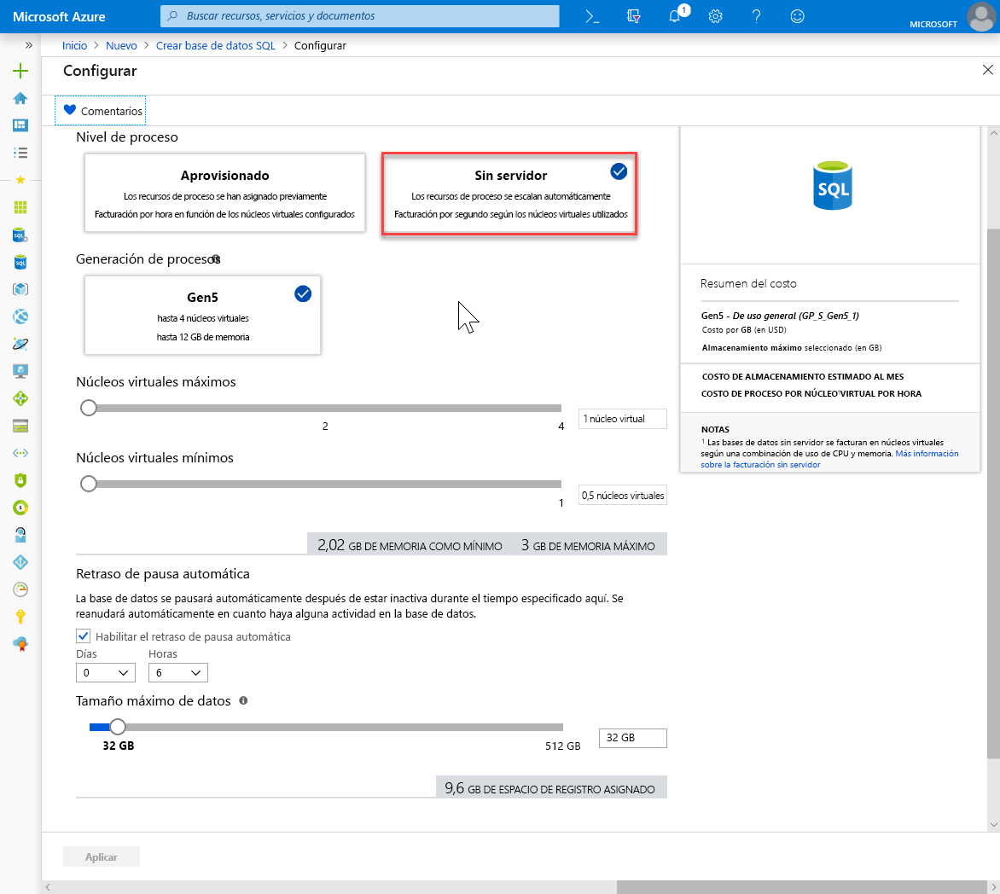

# <a name="quickstart-create-a-single-database-in-azure-sql-database-using-the-azure-portal"></a>Inicio rápido: Creación de una base de datos única en Azure SQL Database con Azure Portal

La creación de una [base de datos única](sql-database-single-database.md) es la opción de implementación más rápida y sencilla para crear una base de datos en Azure SQL Database. En esta guía de inicio rápido se muestra cómo crear, para su posterior consulta, una base de datos única mediante Azure Portal.

Si no tiene una suscripción a Azure, [cree una cuenta gratuita](https://azure.microsoft.com/free/).

Para seguir todos los pasos de este artículo de inicio rápido debe iniciar sesión en [Azure Portal](https://portal.azure.com/).

## <a name="create-a-single-database"></a>Creación de una base de datos única

Una base de datos única se puede crear en el nivel de proceso aprovisionado o sin servidor (versión preliminar).

- Una base de datos única en el nivel de proceso aprovisionado tiene una cantidad definida de recursos de proceso asignados previamente más un conjunto de recursos de memoria y almacenamiento con uno o dos [modelos de compra](sql-database-purchase-models.md).
- Una base de datos única en el nivel de proceso sin servidor tiene una variedad de recursos de proceso que se escalan automáticamente más una cantidad especificada de memoria por núcleo y una cantidad especificada de recursos de proceso y solo está disponible en los [modelos de compra basados en núcleo virtual](sql-database-service-tiers-vcore.md).

Cuando se crea una base de datos única, también se define un [servidor de SQL Database](sql-database-servers.md) para administrarla y colocarla dentro de un [grupo de recursos de Azure](../azure-resource-manager/resource-group-overview.md) de una región determinada.

> [!NOTE]
> En este inicio rápido se usa el [modelo de compra basado en núcleo virtual](sql-database-service-tiers-vcore.md) y el nivel de proceso [sin servidor](sql-database-serverless.md), pero también está disponible el [modelo de compra basado en DTU](sql-database-service-tiers-DTU.md).

Para crear una base de datos única que contenga los datos de ejemplo de AdventureWorksLT:

1. Haga clic en **Crear un recurso** en la esquina superior izquierda de Azure Portal.
2. Seleccione **Bases de datos** y, a continuación, seleccione **SQL Database** para abrir la página **Crear SQL Database**.

   

3. En la pestaña **Conceptos básicos**, en la sección **Detalles del proyecto**, escriba o seleccione los siguientes valores:

   - **Suscripción**: Abra la lista desplegable y seleccione la suscripción correcta, en caso de que no aparezca.
   - **Grupo de recursos**: Seleccione **Crear nuevo**, escriba `myResourceGroup` y seleccione **Aceptar**.

     

4. En la sección **Detalles de la base de datos**, escriba o seleccione los siguientes valores:

   - **Nombre de base de datos**: Escriba `mySampleDatabase`.
   - **Servidor**: En la página **Crear nuevo**, escriba los valores siguientes y elija **Seleccionar**:
       - **Nombre del servidor**: Escriba `mysqlserver`, junto con algunos números con fines de unicidad.
       - **Inicio de sesión del administrador del servidor**: Escriba `azureuser`.
       - **Contraseña**: Escriba una contraseña compleja que cumpla los requisitos de contraseña.
       - **Ubicación**: Elija una ubicación en la lista desplegable, como `West US 2`.

         

      > [!IMPORTANT]
      > No olvide registrar el inicio de sesión y la contraseña del administrador del servidor, con el fin de poder iniciar sesión en el servidor y las bases de datos en este y otros inicios rápidos. Si olvida la contraseña o el inicio de sesión, puede obtener el nombre de inicio de sesión o restablecer la contraseña en la página de **SQL server**. Para abrir la página de **SQL server**, seleccione el nombre del servidor en la página de **información general** de la base de datos después de la creación de esta.

        

   - **¿Quiere usar un grupo elástico de SQL?** Seleccione la opción **No**.
   - **Proceso y almacenamiento**: Seleccione **Configurar base de datos** y, para este inicio rápido, seleccione**Opciones de compra basadas en núcleos virtuales**.

     

   - Seleccione **Sin servidor**.

     

   - Revise los valores de **Max vCores** (Máximo de núcleos virtuales), **Min vCores** (Mínimo de núcleos virtuales), **Auto-pause delay** (Retraso de pausa automática) y **Data max size** (Tamaño máximo de datos). Cámbielos según sea necesario.
   - Acepte los términos de la versión preliminar y haga clic en **Aceptar**.
   - Seleccione **Aplicar**.

5. Seleccione la pestaña **Configuración adicional**. 
6. En la sección **Origen de datos**, en **Usar datos existentes**, seleccione `Sample`. 

   

   > [!IMPORTANT]
   > Asegúrese de seleccionar los datos de **Sample (AdventureWorksLT)** para poder seguir fácilmente este y otros inicios rápidos de Azure SQL Database que usan estos datos.

7. Deje el resto de los valores como predeterminados y seleccione **Revisar y crear** en la parte inferior del formulario.
8. Revise la configuración final y seleccione **Crear**.

9. En el formulario **SQL Database**, seleccione **Crear** para implementar y aprovisionar el grupo de recursos, el servidor y la base de datos.

## <a name="query-the-database"></a>Consulta de la base de datos

Ahora que ha creado la base de datos, use la herramienta de consulta integrada en Azure Portal para conectarse a la base de datos y realizar consultas en los datos.

1. En la página **SQL Database** de su base de datos, seleccione **Editor de consultas (versión preliminar)** en el menú de la izquierda.

   

2. Escriba su información de inicio de sesión y seleccione **Aceptar**.
3. Escriba la siguiente consulta en el panel del **Editor de consultas**.

   ```sql
   SELECT TOP 20 pc.Name as CategoryName, p.name as ProductName
   FROM SalesLT.ProductCategory pc
   JOIN SalesLT.Product p
   ON pc.productcategoryid = p.productcategoryid;
   ```

4. Seleccione **Ejecutar** y examine los resultados de la consulta en el panel **Resultados**.

   

5. Cierre la página **Editor de consultas** y seleccione **Aceptar** cuando se le pida que descarte los cambios que no se hayan guardado.

## <a name="clean-up-resources"></a>Limpieza de recursos

Mantenga este grupo de recursos, el servidor de bases de datos y la base de datos única si quiere ir a [Pasos siguientes](#next-steps). Los pasos siguientes muestran cómo conectarse a la base de datos y consultarla mediante distintos métodos.

Cuando haya terminado con estos recursos, puede eliminarlos como se indica a continuación:

1. En el menú izquierdo de Azure Portal, seleccione **Grupos de recursos** y, después, **myResourceGroup**.
2. En la página del grupo de recursos, seleccione **Eliminar grupo de recursos**.
3. Escriba *myResourceGroup* en el campo y, después, seleccione **Eliminar**.

## <a name="next-steps"></a>Pasos siguientes

- Cree una regla de firewall de nivel de servidor para conectarse a la base de datos única desde herramientas locales o remotas. Para más información, consulte [Creación de una regla de firewall de nivel de servidor](sql-database-server-level-firewall-rule.md).
- Después de crear una regla de firewall de nivel de servidor, puede usar varias herramientas y lenguajes para [conectarse a la base de datos y realizar consultas en ella](sql-database-connect-query.md).
  - [Conexión y consulta con SQL Server Management Studio](sql-database-connect-query-ssms.md)
  - [Conexión y consulta de datos con Azure Data Studio](https://docs.microsoft.com/sql/azure-data-studio/quickstart-sql-database?toc=/azure/sql-database/toc.json)
- Para crear una base de datos única en el nivel de proceso aprovisionado con la CLI de Azure, consulte los [ejemplos de la CLI de Azure](sql-database-cli-samples.md).
- Para crear una base de datos única en el nivel de proceso aprovisionado con Azure PowerShell, consulte los [ejemplos de Azure PowerShell](sql-database-powershell-samples.md).
- Para crear una base de datos única en el nivel de proceso sin servidor con Azure PowerShell, consulte [Create serverless database using PowerShell](sql-database-serverless.md#create-new-database-in-serverless-compute-tier-using-powershell) (Creación de una base de datos sin servidor con PowerShell)