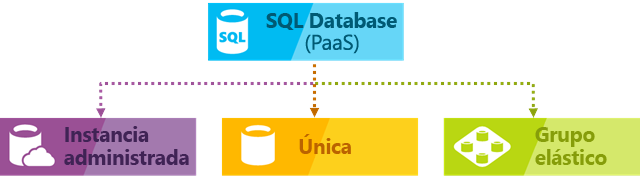
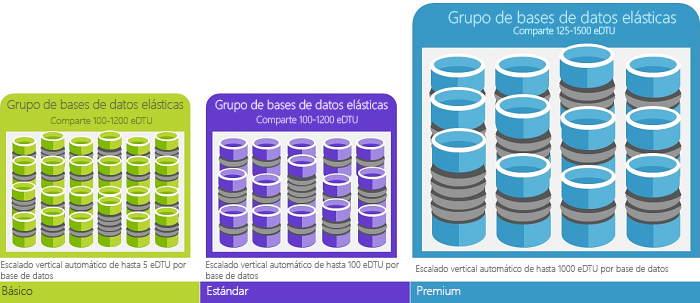

# Servicio Azure SQL Database

SQL Database es un servicio administrado de base de datos relacional de uso general de Microsoft Azure que admite estructuras como datos relacionales, JSON, espacial y XML. SQL Database ofrece un rendimiento escalable de modo dinámico dentro de dos modelos de compra diferentes: un [modelo de compra basado en núcleos virtuales](sql-database-service-tiers-vcore.md) y un [modelo de compra basado en DTU](sql-database-service-tiers-dtu.md). SQL Database también proporciona opciones como [índices de almacén de columnas](https://docs.microsoft.com/sql/relational-databases/indexes/columnstore-indexes-overview) para un análisis analítico extremo, y [OLTP en memoria](sql-database-in-memory.md) para un procesamiento de transacciones extremo. Microsoft controla perfectamente toda la aplicación de revisiones y de actualizaciones del código base de SQL y desaparece toda la administración de la infraestructura subyacente.

Azure SQL Database proporciona las siguientes opciones de implementación para una base de datos SQL de Azure:

- Como una base de datos única con su propio conjunto de recursos administrados mediante un servidor de SQL Database
- Como una base de datos agrupada en un [grupo elástico](sql-database-elastic-pool.md) con un conjunto de recursos compartido que se administra a través de un servidor de SQL Database
- Como parte de una colección de bases de datos que se conoce como [instancia administrada](sql-database-managed-instance.md) que contiene bases de datos de usuario y de sistema, y que comparten un conjunto de recursos

En la siguiente ilustración se muestran estas opciones de implementación:

SQL Database comparte su base de código con el [motor de base de datos de Microsoft SQL Server](https://docs.microsoft.com/sql/sql-server/sql-server-technical-documentation). Con la estrategia de primero en la nube de Microsoft, las funcionalidades más recientes de SQL Server se publican en primer lugar en SQL Database y, después, en el propio SQL Server. Este enfoque proporciona las funcionalidades más recientes de SQL Server sin sobrecarga alguna en la aplicación de revisiones o actualizaciones (y con estas nuevas características probadas en millones de bases de datos). Para obtener información acerca de las nuevas funcionalidades, consulte:

- **[Hoja de ruta de Azure para SQL Database](https://azure.microsoft.com/roadmap/?category=databases)**:

  Lugar en el que puede encontrar las novedades y lo que vendrá después.

- **[Blog de Azure SQL Database](https://azure.microsoft.com/blog/topics/database)**:

  Lugar en el que los miembros del equipo de producto de SQL Server escriben entradas acerca de las noticias y características de SQL Database.

> [!IMPORTANT]
> Para entender las diferentes características de SQL Database y SQL Server, consulte las [características de SQL](sql-database-features.md).

SQL Database ofrece un rendimiento predecible con varios tipos de recursos, niveles de servicio y tamaños de proceso que proporciona escalabilidad dinámica sin tiempo de inactividad, optimización inteligente integrada, escalabilidad y disponibilidad globales, y opciones de seguridad avanzadas (todo ello casi sin necesidad de administración). Estas funcionalidades permiten centrarse en el desarrollo rápido de aplicaciones y en reducir el plazo de acceso al mercado, en lugar de tener que dedicar tiempo y recursos a la administración tanto de máquinas virtuales como de la infraestructura. El servicio SQL Database está actualmente en 38 centros de datos de todo el mundo, y constantemente se incorporan más, lo que le permite ejecutar la base de datos en un centro de datos próximo.

## Grupos y rendimiento escalable

Con SQL Database, cada base de datos está aislada de las demás y es portátil, cada una con su propio nivel de servicio dentro del [modelo de compra basado en DTU](sql-database-service-tiers-dtu.md) o el [modelo de compra basado en núcleos virtuales](sql-database-service-tiers-vcore.md) y un tamaño de proceso garantizado. SQL Database proporciona diferentes tamaños de proceso para cubrir distintas necesidades y permite que las bases de datos puedan agruparse para maximizar el uso de recursos y ahorrar dinero.

- Con [Instancia administrada de SQL Database](sql-database-managed-instance.md), cada instancia está aislada de otras instancias con recursos garantizados. Para más información, consulte [Instancia administrada de SQL Database](sql-database-managed-instance.md).
- Con el [nivel de servicio de hiperescala](sql-database-service-tier-hyperscale.md) (versión preliminar) en el modelo de compra de núcleos virtuales, puede escalar hasta 100 TB con funcionalidades de copia de seguridad rápida y restauración.

### Ajuste del rendimiento y escalabilidad sin tiempo de inactividad

SQL Database ofrece un [modelo de compra basado en DTU](sql-database-service-tiers-dtu.md) o el [modelo de compra basado en núcleos virtuales](sql-database-service-tiers-vcore.md).

- El modelo de compra basado en DTU ofrece una combinación de recursos de proceso, memoria y E/S en tres niveles de servicio para admitir cargas de trabajo de base de datos de ligeras a pesadas: Básico, Estándar y Premium. Los tamaños de proceso de cada nivel ofrecen una combinación diferente de estos recursos, a los que puede agregar recursos de almacenamiento adicionales.
- El modelo de compra basado en núcleos virtuales le permite elegir el número de núcleos virtuales, la cantidad de memoria y la cantidad y velocidad del almacenamiento.

La primera aplicación se puede compilar en una base de datos pequeña con un costo muy pequeño al mes en el nivel de servicio de uso general y, después, cambiar el nivel de servicio manualmente o mediante programación en cualquier momento al nivel de servicio crítico para la empresa para adecuarlo a las necesidades de su solución. El rendimiento se puede ajustar sin que la aplicación o los clientes sufran ningún tipo de inactividad. La escalabilidad dinámica permite que una base de datos responda transparentemente a los requisitos de recursos, que cambian con rapidez, y le permite pagar solo por los recursos que necesite cuando los necesite.

> [!IMPORTANT]
> El [nivel de servicio de hiperescala](sql-database-service-tier-hyperscale.md) está actualmente en versión preliminar pública. No se recomienda ejecutar ninguna carga de trabajo de producción en las bases de datos de hiperescala todavía. No se puede actualizar una base de datos de hiperescala a otros niveles de servicio. Con fines de prueba, se recomienda realizar una copia de la base de datos actual y actualizar la copia al nivel de servicio de hiperescala.

La escalabilidad dinámica es diferente del escalado automático. El escalado automático se produce al escalarse un servicio automáticamente en función de determinados criterios, mientras la escalabilidad dinámica permite el escalado manual sin tiempo de inactividad. Una base de datos única admite la escalabilidad dinámica manual, pero no la escalabilidad automática. Para ganar experiencia con el uso *automático*, considere los grupos elásticos, que permiten que las bases de datos compartan recursos en un grupo en función de las necesidades individuales de las bases de datos. Pero hay scripts que pueden ayudar a automatizar la escalabilidad en una base de datos única. Consulte [Uso de PowerShell para supervisar y escalar una sola base de datos SQL](scripts/sql-database-monitor-and-scale-database-powershell.md) encontrará un ejemplo.

### Grupos elásticos para maximizar la utilización de los recursos

Para muchas empresas y aplicaciones, poder crear bases de datos individuales y aumentar o reducir el rendimiento a petición es suficiente, especialmente si los patrones de uso son relativamente predecibles. Pero si dichos patrones son impredecibles, pueden dificultar la administración de los costos y del modelo de negocio. Los [grupos elásticos](sql-database-elastic-pool.md) están diseñadas para solucionar este problema. El concepto es sencillo. Se asignan los recursos de rendimiento a un grupo, en lugar a una base de datos individual y se paga por los recursos de rendimiento colectivos del grupo, no por el rendimiento de la base de datos única.

   

Con los grupos elásticos no es preciso centrarse en marcar el ascenso y la bajada de rendimiento de la base de datos a medida que varía la demanda de recursos. Las bases de datos en grupos consumen los recursos de rendimiento del grupo elástico a medida que se necesiten. Las bases de datos en grupos consumen los recursos, pero nunca superan los límites del grupo, por lo que el costo es en todo momento predecible, aunque el uso de las bases de datos individuales no lo sea. Es más, puede [agregar bases de datos al grupo y quitarlas del mismo](sql-database-elastic-pool-manage-portal.md), lo que escala la aplicación de un puñado de bases de datos a miles, y todo sin perder el control del presupuesto. También puede controlar el número mínimo y máximo de recursos disponibles para las bases de datos del grupo, con el fin de asegurarse de que ninguna de ellas utiliza todos los recursos del grupo y que todas las bases de datos del grupo tienen un número mínimo garantizado de recursos. Para más información acerca de los modelos de diseño de las aplicaciones SaaS que usan grupos elásticos, consulte [Modelos de diseño para las aplicaciones SaaS multiinquilino y SQL Database de Azure](sql-database-design-patterns-multi-tenancy-saas-applications.md).

Los scripts pueden ayudarle con la supervisión y el escalado de grupos elásticos. En [Uso de PowerShell para supervisar y escalar un grupo elástico de SQL en Azure SQL Database](scripts/sql-database-monitor-and-scale-pool-powershell.md) encontrará un ejemplo

> [!IMPORTANT]
> Instancia administrada de SQL Database no admite grupos elásticos.

### Fusión de bases de datos únicas con bases de datos en grupos

Independientemente de lo que use (bases de datos únicas o grupos elásticos) no se encontrará bloqueado. Puede fusionar bases de datos únicas con grupos elásticos y cambiar los niveles de servicio tanto de las primeras como de los segundos de forma rápida y sencilla para adaptarlos a su situación. Con la potencia y el alcance de Azure, puede combinar otros servicios de Azure con SQL Database para satisfacer sus necesidades únicas de diseño de aplicaciones, impulsar las eficiencias de costos y recursos, y acceder a nuevas oportunidades de negocio.

### Extensas funcionalidades de supervisión y alerta

Pero, ¿cómo se puede comparar el rendimiento relativo de las bases de datos únicas con el de los grupos elásticos? ¿Cómo se sabe el momento correcto en el que debe hacer clic para detenerse al subir y bajar por el dial? Utilice las herramientas de [supervisión de rendimiento integrado](sql-database-performance.md) y de [alertas](sql-database-insights-alerts-portal.md) en combinación con las clasificaciones del rendimiento. Uso de estas herramientas, puede evaluar rápidamente el impacto de escalar verticalmente en función de su suscripción actual o se proyecta necesidades de rendimiento. Para más información, consulte los artículos sobre el [modelo de compra basado en DTU](sql-database-service-tiers-dtu.md) y el [modelo de compra basado en núcleos virtuales](sql-database-service-tiers-vcore.md).

Además, SQL Database puede [emitir métricas y registros de diagnóstico](sql-database-metrics-diag-logging.md) para facilitar la supervisión. SQL Database se puede configurar para que almacene el uso de recursos, los trabajadores y sesiones, y la conectividad en uno de estos recursos de Azure:

- **Azure Storage**: Para archivar grandes cantidades de telemetría a un pequeño precio
- **Azure Event Hub**: Para integrar la telemetría de SQL Database con una solución de supervisión personalizada o canalizaciones activas
- **Azure Log Analytics**: Para la solución de supervisión integrada con funcionalidades de generación de informes, alertas y mitigación.

    

## Funcionalidades de disponibilidad

El contrato de nivel de servicio [(SLA)](https://azure.microsoft.com/support/legal/sla/)de Azure de disponibilidad del 99,99 %, líder del sector, con la tecnología de una red global de centros de datos administrados por Microsoft, ayuda a mantener las aplicaciones en funcionamiento de forma ininterrumpida. La plataforma de Azure administra completamente cada instancia de Azure SQL Database y garantiza un alto porcentaje de disponibilidad de los datos sin pérdida de datos. Azure controla automáticamente la aplicación de revisiones, las copias de seguridad, la replicación, la detección de errores, los posibles errores de hardware, de software o de red subyacentes, la implementación de correcciones de errores, las conmutaciones por error, las actualizaciones de base de datos y otras tareas de mantenimiento. La disponibilidad Estándar se consigue mediante una separación de las capas de proceso y de almacenamiento. La disponibilidad Premium se logra mediante la integración de los recursos de proceso y almacenamiento en un único nodo para obtener un buen rendimiento y, después, mediante la implementación de tecnología similar para los grupos de disponibilidad AlwaysOn en segundo plano. Para obtener una explicación completa de las funcionalidades de alta disponibilidad de Azure SQL Database, consulte [Disponibilidad de SQL Database](sql-database-high-availability.md). Además, SQL Database proporciona características de [continuidad empresarial y escalabilidad global](sql-database-business-continuity.md) integradas, entre las que se incluyen:

- **[Copias de seguridad automáticas](sql-database-automated-backups.md)**:

  SQL Database realiza automáticamente copias de seguridad completas, diferenciales y del registro de transacciones.
- **[Restauraciones a un momento dado](sql-database-recovery-using-backups.md)**:

  SQL Database admite la recuperación a cualquier momento dado que esté dentro del período de retención de copia de seguridad automática.
- **[Replicación geográfica activa](sql-database-active-geo-replication.md)**:

  SQL Database permite configurar hasta cuatro bases de datos secundarias legibles en los mismos centros de datos de Azure o en centros de datos distribuidos globalmente.  Por ejemplo, si tiene una aplicación SaaS con una base de datos de catálogos tiene un alto volumen de transacciones simultáneas de solo lectura, utilice la replicación geográfica activa para habilitar la escala de lectura global y quitar cuellos de botella en el servidor principal debidos a las cargas de trabajo de lectura.
- **[Grupos de conmutación por error automática](sql-database-auto-failover-group.md)**:

  SQL Database permite habilitar la alta disponibilidad y el equilibrio de carga a escala global, lo que incluye la replicación geográfica transparente y la conmutación por error de grandes conjuntos de bases de datos y grupos elásticos. Los grupos de conmutación por error y la replicación geográfica activa permiten la creación de aplicaciones SaaS distribuidas globalmente con una sobrecarga administrativa mínima que deja la supervisión compleja, el enrutamiento y la orquestación de la conmutación por error a SQL Database.
- **[Bases de datos con redundancia de zona](sql-database-high-availability.md)**:

  SQL Database le permite aprovisionar bases de datos de nivel Premium o Crítico para la empresa o grupos elásticos a través de varias zonas de disponibilidad. Dado que tanto estas bases de datos como los grupos elásticos tienen varias réplicas redundantes para lograr la alta disponibilidad, la colocación de estas réplicas en varias zonas de disponibilidad proporciona mayor resistencia, lo que incluye la capacidad de recuperarse automáticamente de errores de escala de centro de datos sin pérdida de datos.  

## Inteligencia integrada

Con SQL Database, obtendrá la inteligencia integrada que le ayudará a reducir drásticamente los costos de ejecutar y administrar bases de datos y maximiza el rendimiento y seguridad de la aplicación. Mediante la ejecución de millones de cargas de trabajo de clientes las 24 horas del día, SQL Database recopila y procesa una cantidad masiva de datos de telemetría y, al mismo tiempo, respeta totalmente la privacidad de los clientes. Varios algoritmos evalúan continuamente los datos de telemetría para que el servicio pueda obtener información de la aplicación y adaptarse a ella. En función de este análisis, el servicio proporciona recomendaciones para mejorar el rendimiento que se adaptan a su carga de trabajo concreta.

### Supervisión y ajuste del rendimiento automático

SQL Database proporciona información detallada de las consultas que necesita supervisar. SQL Database aprende sus patrones de base de datos y permite adaptar el esquema de la base de datos a su carga de trabajo. SQL Database proporciona [recomendaciones para el ajuste del rendimiento](sql-database-advisor.md), donde puede consultar las acciones de ajuste y aplicarlas.

Sin embargo, supervisar constantemente una base de datos es una tarea ardua y tediosa, sobre todo cuando se trabaja con muchas bases de datos. [Intelligent Insights](sql-database-intelligent-insights.md) realiza este trabajo automáticamente mediante la supervisión del rendimiento de SQL Database a escala y le informa de los problemas de degradación del rendimiento, identifica la causa principal del problema y proporciona recomendaciones para la mejora del rendimiento cuando es posible.

La administración de un número ingente de bases de datos podría ser imposible de realizar eficazmente, ni siquiera con todas las herramientas e informes que proporcionan SQL Database y Azure Portal. En lugar de supervisar y ajustar la base de datos manualmente, puede considerar la posibilidad de delegar algunas de las acciones de supervisión y ajuste en SQL Database con el [ajuste automático](sql-database-automatic-tuning.md). SQL Database aplica automáticamente las recomendaciones y pruebas, y comprueba cada una de sus acciones de ajuste para garantizar que el rendimiento no deja de mejorar. De esta forma, SQL Database se adapta automáticamente a su carga de trabajo de una forma controlada y segura. El ajuste automático significa que el rendimiento de la base de datos se supervisa y compara meticulosamente antes y después de cada acción de ajuste, y si el rendimiento no mejora, la acción se revierte.

En la actualidad, muchos de nuestros asociados que ejecutan [aplicaciones SaaS multiinquilino](sql-database-design-patterns-multi-tenancy-saas-applications.md) sobre SQL Database confían en el ajuste automático del rendimiento para asegurarse de que sus aplicaciones siempre tienen un rendimiento estable y predecible. Para ellos, esta característica reduce enormemente el riesgo de que se produzca un incidente de rendimiento durante la noche. Además, puesto que una parte de su base de clientes también utiliza SQL Server, usan las mismas recomendaciones de indización que proporciona SQL Database para ayudar a sus clientes de SQL Server.

Hay dos aspectos del ajuste automático [disponibles en SQL Database](sql-database-automatic-tuning.md):

- **Administración automática de índices**: Identifica tanto los índices que se deben agregar a la base de datos como los que se deben quitar.
- **Corrección automática de planes**: Identifica planes problemáticos y corrige los problemas de rendimiento de los planes de SQL (próximamente, ya disponible en SQL Server 2017).

### Procesamiento adaptable de consultas

También vamos a agregar la familia de características de [procesamiento adaptable de consultas](/sql/relational-databases/performance/adaptive-query-processing) a SQL Database, lo que incluye la ejecución intercalada de funciones con valores de tabla de varias instrucciones, comentarios de concesión de memoria del modo por lotes y combinaciones adaptables del modo por lotes. Cada una de estas características del procesamiento adaptable de consultas aplica técnicas de "aprendizaje y adaptación" similares, lo que ayuda a solucionar los problemas de rendimiento relacionados con problemas de optimización de consultas históricamente intrincados.

## Conformidad y seguridad avanzada

SQL Database proporciona varias [características integradas de seguridad y cumplimiento](sql-database-security-overview.md) que facilitan que su aplicación cumpla los distintos requisitos de seguridad y cumplimiento normativo.

### Protección contra amenazas avanzada

Advanced Data Security de SQL es un paquete unificado de funcionalidades avanzadas de seguridad de SQL. Incluye una funcionalidad para detectar y clasificar datos confidenciales, administrar los puntos vulnerables de una base de datos y detectar actividades anómalas que puedan indicar una amenaza para dicha base de datos. Proporciona una ubicación única para habilitar y administrar estas funcionalidades.

- [Clasificación y detección de datos](sql-database-data-discovery-and-classification.md):

  Esta característica (actualmente en vista previa) proporciona funcionalidades integradas en Azure SQL Database para detectar, clasificar, etiquetar y proteger la información confidencial de las bases de datos. Se puede utilizar para proporcionar visibilidad del estado de clasificación de una base de datos y para realizar un seguimiento del acceso a información confidencial dentro de la base de datos y más allá de sus límites.
- [Evaluación de vulnerabilidades](sql-vulnerability-assessment.md):

  Este servicio puede detectar y realizar un seguimiento de posibles vulnerabilidades de la base de datos, así como ayudarle a corregirlas. Permite ver el estado de la seguridad e incluye los pasos necesarios para resolver problemas de seguridad y mejorar las defensas de cualquier base de datos.
- [Detección de amenazas](sql-database-threat-detection.md):

  Esta característica detecta actividades anómalas que indiquen intentos inusuales y potencialmente perjudiciales de acceder a una base de datos o de aprovechar sus vulnerabilidades. Supervisa constantemente una base de datos para detectar actividades sospechosas y proporciona de forma inmediata alertas de seguridad de posibles puntos vulnerables, ataques por inyección de código SQL y patrones anómalos de acceso a las bases de datos. Las alertas de Detección de amenazas proporcionan detalles de la actividad sospechosa y recomiendan acciones para investigar y mitigar la amenaza.

### Auditoría de seguridad y cumplimiento

[SQL Database Auditing](sql-database-auditing.md) realiza un seguimiento de eventos de bases de datos y los escribe en un registro de auditoría de su cuenta de Azure Storage. La auditoría puede ayudarle a mantener el cumplimiento de normativas, comprender la actividad de las bases de datos y conocer las discrepancias y anomalías que pueden indicar problemas en el negocio o infracciones de seguridad sospechosas.

### Cifrado de datos

Para proteger los datos, SQL Database cifra los datos en movimiento a través del protocolo de [Seguridad de la capa de transporte](https://support.microsoft.com/kb/3135244), los datos en reposo a través del [Cifrado de datos transparente](https://docs.microsoft.com/sql/relational-databases/security/encryption/transparent-data-encryption-azure-sql) y los datos en uso a través de [Always Encrypted](https://docs.microsoft.com/sql/relational-databases/security/encryption/always-encrypted-database-engine).

### Integración de Azure Active Directory y autenticación multifactor

SQL Database permite administrar centralmente las identidades de usuario de base de datos y otros servicios de Microsoft con la [integración de Azure Active Directory](sql-database-aad-authentication.md). Esta funcionalidad simplifica la administración de permisos y mejora la seguridad. Azure Active Directory admite la [autenticación multifactor](sql-database-ssms-mfa-authentication.md) (MFA) para aumentar la seguridad tanto de los datos como de las aplicaciones y admite un proceso de inicio de sesión único.

### Certificación de cumplimiento

SQL Database participa en auditorías periódicas y se ha certificado con varios estándares de cumplimiento. Para más información, consulte el [Centro de confianza de Microsoft Azure](https://azure.microsoft.com/support/trust-center/), donde podrá encontrar la lista más reciente de [certificaciones de cumplimiento de SQL Database](https://azure.microsoft.com/support/trust-center/services/).

## Herramientas fáciles de usar

SQL Database facilita la creación y el mantenimiento de aplicaciones y aumenta su productividad. SQL Database le permite centrarse en lo que mejor hace: crear magníficas aplicaciones. En SQL Database, puede realizar labores de administración y desarrollo mediante las herramientas y los conocimientos que ya posee.

- **[Azure Portal](https://portal.azure.com/)**:

  Aplicación web para administrar todos los servicios de Azure.
- **[SQL Server Management Studio](https://docs.microsoft.com/sql/ssms/download-sql-server-management-studio-ssms)**:

  Aplicación cliente gratuita que se puede descargar para administrar cualquier infraestructura de SQL, desde SQL Server hasta SQL Database.
- **[SQL Server Data Tools en Visual Studio](https://docs.microsoft.com/sql/ssdt/download-sql-server-data-tools-ssdt)**:

  Aplicación cliente gratuita que se puede descargar para desarrollar bases de datos relacionales de SQL Server, bases de datos de Azure SQL, paquetes de Integration Services, modelos de datos de Analysis Services e informes de Reporting Services.
- **[Visual Studio Code](https://code.visualstudio.com/docs)**:

  Editor de código abierto, gratuito y que se puede descargar para Windows, macOS y Linux que admite extensiones, entre las que se incluye la [extensión mssql](https://aka.ms/mssql-marketplace), para realizar consultas en Microsoft SQL Server, Azure SQL Database y SQL Data Warehouse.

SQL Database admite la compilación de aplicaciones con Python, Java, Node.js, PHP, Ruby y .NET en MacOS, Linux y Windows. SQL Database admite las mismas [bibliotecas de conexiones](sql-database-libraries.md) como SQL Server.

## Contactar con el equipo de ingeniería de SQL Server

- [DBA Stack Exchange](https://dba.stackexchange.com/questions/tagged/sql-server): formule preguntas sobre administración de base de datos
- [Stack Overflow](http://stackoverflow.com/questions/tagged/sql-server): formule preguntas sobre desarrollo
- [Foros de MSDN](https://social.msdn.microsoft.com/Forums/home?category=sqlserver): realice preguntas técnicas
- [Comentarios](https://aka.ms/sqlfeedback): informe de errores y solicitud de características
- [Reddit](https://www.reddit.com/r/SQLServer/): analice SQL Server

## Pasos siguientes

- Consulte la [página de precios](https://azure.microsoft.com/pricing/details/sql-database/), para ver comparativas y calculadoras de los costos tanto de las bases de datos únicas como de los grupos elásticos.
- Consulte estas guías de inicio rápido para comenzar:

  - [Creación de una base de datos SQL en Azure Portal](sql-database-get-started-portal.md)  
  - [Creación de una base de datos SQL con la CLI de Azure](sql-database-get-started-cli.md)
  - [Creación de una base de datos SQL con PowerShell](sql-database-get-started-powershell.md)

- Para obtener ejemplos de la CLI de Azure y de PowerShell, consulte:
  - [Ejemplos de la CLI de Azure para SQL Database](sql-database-cli-samples.md)
  - [Ejemplos de Azure PowerShell para SQL Database](sql-database-powershell-samples.md)
