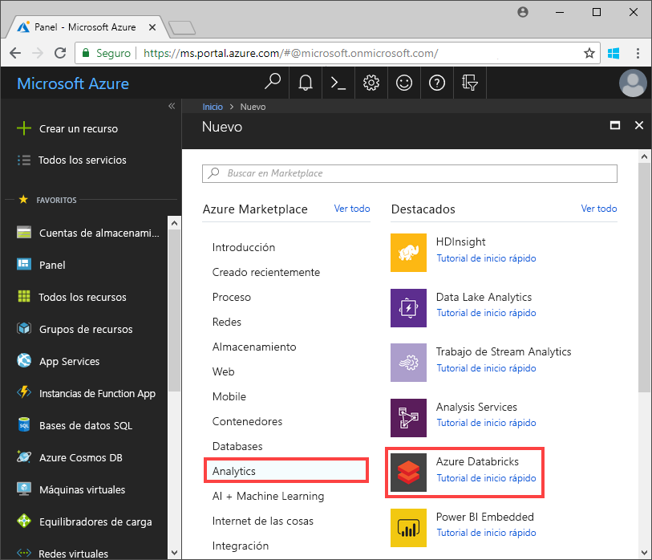
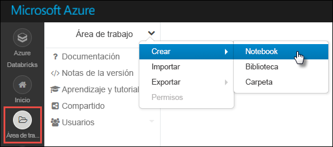

# <a name="tutorial-implement-the-data-lake-capture-pattern-to-update-a-databricks-delta-table"></a>Tutorial: Implementación del patrón de captura de Data Lake para actualizar una tabla de Databricks Delta

En este tutorial se muestra cómo controlar eventos en una cuenta de almacenamiento que tiene un espacio de nombres jerárquico.

Creará una pequeña solución que permitirá a un usuario rellenar una tabla de Databricks Delta al cargar un archivo de valores separados por comas (CSV) que describe un pedido de ventas. Esta solución se creará conectando una suscripción a Event Grid, una función de Azure y un [trabajo](https://docs.azuredatabricks.net/user-guide/jobs.html) en Azure Databricks.

En este tutorial, aprenderá lo siguiente:

> [!div class="checklist"]
> * Creará una suscripción a Event Grid que llama a una función de Azure.
> * Creará una función de Azure que recibe una notificación de un evento y, a continuación, ejecuta el trabajo en Azure Databricks.
> * Creará un trabajo de Databricks que inserta un pedido de cliente en una tabla de Databricks Delta que se encuentra en la cuenta de almacenamiento.

Crearemos esta solución en orden inverso, empezando por el área de trabajo de Azure Databricks.

## <a name="prerequisites"></a>Prerrequisitos

* Si no tiene una suscripción a Azure, cree una [cuenta gratuita](https://azure.microsoft.com/free/?WT.mc_id=A261C142F) antes de empezar.

* Cree una cuenta de almacenamiento que tenga un espacio de nombres jerárquico (Azure Data Lake Storage Gen2). En este tutorial se usa una cuenta de almacenamiento denominada `contosoorders`. Asegúrese de que la cuenta de usuario tiene asignado el rol [Colaborador de datos de Storage Blob](https://docs.microsoft.com/azure/storage/common/storage-auth-aad-rbac).

  Consulte [Cree una cuenta de Azure Data Lake Storage Gen2](data-lake-storage-quickstart-create-account.md).

* Crear una entidad de servicio. Consulte [Cómo: portal para crear una aplicación de Azure AD y una entidad de servicio que puedan acceder a los recursos](https://docs.microsoft.com/azure/active-directory/develop/howto-create-service-principal-portal).

  Hay un par de cosas que tendrá que hacer cuando realice los pasos de este artículo.

  :heavy_check_mark: Al realizar los pasos que se describen en la sección [Asignación de la aplicación a un rol](https://docs.microsoft.com/azure/active-directory/develop/howto-create-service-principal-portal#assign-a-role-to-the-application), asegúrese de asignar el rol de **Colaborador de datos de blobs de almacenamiento** a la entidad de servicio.

  > [!IMPORTANT]
  > Asegúrese de asignar el rol en el ámbito de la cuenta de almacenamiento de Data Lake Storage Gen2. Puede asignar un rol al grupo de recursos o suscripción primario, pero recibirá errores relacionados con los permisos hasta que esas asignaciones de roles se propaguen a la cuenta de almacenamiento.

  :heavy_check_mark: Al realizar los pasos de la sección [Obtención de valores para iniciar sesión](https://docs.microsoft.com/azure/active-directory/develop/howto-create-service-principal-portal#get-values-for-signing-in) del artículo, pegue los valores de identificador de inquilino, identificador de aplicación y contraseña en un archivo de texto, Los necesitará más adelante.

## <a name="create-a-sales-order"></a>Creación de un pedido de ventas

En primer lugar, cree un archivo CSV que describa un pedido de ventas y, a continuación, cargue ese archivo en la cuenta de almacenamiento. Más adelante, usará los datos de este archivo para rellenar la primera fila de la tabla de Databricks Delta.

1. Abra el Explorador de Azure Storage. A continuación, vaya a la cuenta de almacenamiento y, en la sección **Contenedores de blobs**, cree un nuevo contenedor denominado **data**.

   

   Para más información sobre cómo usar el Explorador de Storage, consulte [Uso del Explorador de Azure Storage para administrar los datos de una cuenta de Azure Data Lake Storage Gen2](data-lake-storage-explorer.md).

2. En el contenedor **data**, cree una carpeta denominada **input**.

3. En un editor de texto, pegue el texto siguiente.

   ```
   InvoiceNo,StockCode,Description,Quantity,InvoiceDate,UnitPrice,CustomerID,Country
   536365,85123A,WHITE HANGING HEART T-LIGHT HOLDER,6,12/1/2010 8:26,2.55,17850,United Kingdom
   ```

4. Guarde este archivo en el equipo local y asígnele el nombre **data.csv**.

5. En el Explorador de Storage, cargue este archivo en la carpeta **input**.  

## <a name="create-a-job-in-azure-databricks"></a>Creación de un trabajo en Azure Databricks

En esta sección, realizará estas tareas:

* Crear un área de trabajo de Azure Databricks.
* Cree un cuaderno.
* Crear y rellenar una tabla de Databricks Delta.
* Agregar código que inserta filas en la tabla de Databricks Delta.
* Crear un trabajo.

### <a name="create-an-azure-databricks-workspace"></a>Creación de un área de trabajo de Azure Databricks

En esta sección, creará un área de trabajo de Azure Databricks mediante Azure Portal.

1. En Azure Portal, seleccione **Crear un recurso** > **Análisis** > **Azure Databricks**.

    

2. En **Azure Databricks Service**, proporcione los valores para crear un área de trabajo de Databricks.

    

    Se tarda unos minutos en crear el área de trabajo. Para supervisar el estado de la operación, consulte la barra de progreso en la parte superior.

### <a name="create-a-spark-cluster-in-databricks"></a>Creación de un clúster de Spark en Databricks

1. En [Azure Portal](https://portal.azure.com), vaya al área de trabajo de Azure Databricks que ha creado y, después, seleccione **Launch Workspace** (Iniciar área de trabajo).

2. Se le redirigirá al portal de Azure Databricks. En el portal, seleccione **Nuevo** > **Clúster**.

    

3. En la página **Nuevo clúster**, proporcione los valores para crear un clúster.

    

    Acepte los demás valores predeterminados, salvo los siguientes:

    * Escriba un nombre para el clúster.
    * Asegúrese de que selecciona la casilla **Terminate after 120 minutes of inactivity** (Terminar después de 120 minutos de inactividad). Proporcione una duración (en minutos) para terminar el clúster, si este no se usa.

4. Seleccione **Create cluster** (Crear clúster). Una vez que el clúster se está ejecutando, puede asociarle notebooks y ejecutar trabajos de Spark.

Para obtener más información sobre la creación de clústeres, consulte [Create a Spark cluster in Azure Databricks](https://docs.azuredatabricks.net/user-guide/clusters/create.html) (Creación de un clúster de Spark en Azure Databricks).

### <a name="create-a-notebook"></a>Creación de un cuaderno

1. En el panel izquierdo, seleccione **Workspace** (Área de trabajo). En la lista desplegable **Workspace** (Área de trabajo), seleccione **Create** > **Notebook** (Crear > Cuaderno).

    

2. En el cuadro de diálogo **Create Notebook** (Crear cuaderno), escriba un nombre para el cuaderno. Seleccione **Python** como lenguaje y, a continuación, seleccione el clúster de Spark que creó anteriormente.

    

    Seleccione **Crear**.

### <a name="create-and-populate-a-databricks-delta-table"></a>Creación y relleno de una tabla de Databricks Delta

1. En el cuaderno que ha creado, copie y pegue el siguiente bloque de código en la primera celda, pero no ejecute el código aún.  

   Reemplace los valores de marcador de posición `appId`, `password` y `tenant` por los valores que recopiló al completar los requisitos previos de este tutorial.

    ```Python
    dbutils.widgets.text('source_file', "", "Source File")

    spark.conf.set("fs.azure.account.auth.type", "OAuth")
    spark.conf.set("fs.azure.account.oauth.provider.type", "org.apache.hadoop.fs.azurebfs.oauth2.ClientCredsTokenProvider")
    spark.conf.set("fs.azure.account.oauth2.client.id", "<appId>")
    spark.conf.set("fs.azure.account.oauth2.client.secret", "<password>")
    spark.conf.set("fs.azure.account.oauth2.client.endpoint", "https://login.microsoftonline.com/<tenant>/oauth2/token")

    adlsPath = 'abfss://data@contosoorders.dfs.core.windows.net/'
    inputPath = adlsPath + dbutils.widgets.get('source_file')
    customerTablePath = adlsPath + 'delta-tables/customers'
    ```

    Este código crea un widget denominado **source_file**. Más adelante, creará una función de Azure que llama a este código y pasa una ruta de acceso de archivo a ese widget.  Este código también autentica la entidad de servicio con la cuenta de almacenamiento y crea algunas variables que usará en otras celdas.

    > [!NOTE]
    > En una configuración de producción, considere la posibilidad de almacenar su clave de autenticación en Azure Databricks. A continuación, agregue una clave de búsqueda a su bloque de código en lugar de la clave de autenticación. <br><br>Por ejemplo, en lugar de usar esta línea de código: `spark.conf.set("fs.azure.account.oauth2.client.secret", "<password>")`, debería usar la siguiente: `spark.conf.set("fs.azure.account.oauth2.client.secret", dbutils.secrets.get(scope = "<scope-name>", key = "<key-name-for-service-credential>"))`. <br><br>Una vez completado este tutorial, consulte el artículo [Azure Data Lake Storage Gen2](https://docs.azuredatabricks.net/spark/latest/data-sources/azure/azure-datalake-gen2.html) en el sitio Web de Azure Databricks para ver ejemplos de este enfoque.

2. Presione las teclas **MAYÚS + ENTRAR** para ejecutar el código de este bloque.

3. Copie y pegue el siguiente bloque de código en una celda diferente y, a continuación, presione las teclas **MAYÚS + ENTRAR** para ejecutar el código de este bloque.

   ```Python
   from pyspark.sql.types import StructType, StructField, DoubleType, IntegerType, StringType


   inputSchema = StructType([
   StructField("InvoiceNo", IntegerType(), True),
   StructField("StockCode", StringType(), True),
   StructField("Description", StringType(), True),
   StructField("Quantity", IntegerType(), True),
   StructField("InvoiceDate", StringType(), True),
   StructField("UnitPrice", DoubleType(), True),
   StructField("CustomerID", IntegerType(), True),
   StructField("Country", StringType(), True)
   ])

   rawDataDF = (spark.read
    .option("header", "true")
    .schema(inputSchema)
    .csv(adlsPath + 'input')
   )

   (rawDataDF.write
     .mode("overwrite")
     .format("delta")
     .saveAsTable("customer_data", path=customerTablePath))
   ```

   Este código crea la tabla de Databricks Delta en la cuenta de almacenamiento y, a continuación, carga algunos datos iniciales del archivo CSV que cargó anteriormente.

4. Después de que este bloque de código se ejecute correctamente, quítelo del cuaderno.

### <a name="add-code-that-inserts-rows-into-the-databricks-delta-table"></a>Agregar código que inserta filas en la tabla de Databricks Delta

1. Copie y pegue el siguiente bloque de código en otra celda, pero no ejecute la celda.

   ```Python
   upsertDataDF = (spark
     .read
     .option("header", "true")
     .csv(inputPath)
   )
   upsertDataDF.createOrReplaceTempView("customer_data_to_upsert")
   ```

   Este código inserta datos en una vista de tabla temporal con datos de un archivo CSV. La ruta de acceso a ese archivo CSV procede del widget de entrada que creó en un paso anterior.

2. Agregue el código siguiente para combinar el contenido de la vista de tabla temporal con la tabla de Databricks Delta.

   ```
   %sql
   MERGE INTO customer_data cd
   USING customer_data_to_upsert cu
   ON cd.CustomerID = cu.CustomerID
   WHEN MATCHED THEN
     UPDATE SET
       cd.StockCode = cu.StockCode,
       cd.Description = cu.Description,
       cd.InvoiceNo = cu.InvoiceNo,
       cd.Quantity = cu.Quantity,
       cd.InvoiceDate = cu.InvoiceDate,
       cd.UnitPrice = cu.UnitPrice,
       cd.Country = cu.Country
   WHEN NOT MATCHED
     THEN INSERT (InvoiceNo, StockCode, Description, Quantity, InvoiceDate, UnitPrice, CustomerID, Country)
     VALUES (
       cu.InvoiceNo,
       cu.StockCode,
       cu.Description,
       cu.Quantity,
       cu.InvoiceDate,
       cu.UnitPrice,
       cu.CustomerID,
       cu.Country)
   ```

### <a name="create-a-job"></a>Creación de un trabajo

Cree un trabajo que ejecute el cuaderno que creó anteriormente. Más adelante, creará una función de Azure que ejecuta este trabajo cuando se produce un evento.

1. Haga clic en **Trabajos**.

2. En la página **Trabajos**, haga clic en **Crear trabajo**.

3. Asigne un nombre al trabajo y, a continuación, seleccione el libro `upsert-order-data`.

   

## <a name="create-an-azure-function"></a>Creación de una Función de Azure

Cree una función de Azure que ejecute el trabajo.

1. En la esquina superior del área de trabajo de Databricks, elija el icono de personas y, a continuación, seleccione **Configuración de usuario**.

   

2. Haga clic en el botón **Generar nuevo token** y, después, en el botón **Generar**.

   Asegúrese de copiar el token en un lugar seguro. La función de Azure necesita este token para autenticarse con Databricks, para poder ejecutar el trabajo.
  
3. Seleccione el botón **Crear un recurso** de la esquina superior izquierda de Azure Portal y, después, **Proceso > Function App**.

   

4. En la página **Crear** de la aplicación de funciones, asegúrese de seleccionar **.NET Core** para la pila en tiempo de ejecución y de configurar una instancia de Application Insights.

   

5. En la página **Información general** de la aplicación de funciones, haga clic en **Configuración**.

   

6. En la página **Configuración de la aplicación**, seleccione el botón **Nueva configuración de la aplicación** para agregar cada opción de configuración.

   

   Agregue la configuración siguiente:

   |Nombre del valor | Value |
   |----|----|
   |**DBX_INSTANCE**| La región del área de trabajo de Databricks. Por ejemplo: `westus2.azuredatabricks.net`|
   |**DBX_PAT**| El token de acceso personal que generó anteriormente. |
   |**DBX_JOB_ID**|El identificador del trabajo en ejecución. En este caso, este valor es `1`.|
7. En la página de información general de la aplicación de funciones, haga clic en el botón **Nueva función**.

   

8. Seleccione **Azure Event Grid Trigger** (Desencadenador de Azure Event Grid).

   Instale la extensión **Microsoft.Azure.WebJobs.Extensions.EventGrid** si se le solicita. Si tiene que instalarla, tendrá que volver a seleccionar **Azure Event Grid Trigger** (Desencadenador de Azure Event Grid) para crear la función.

   Aparecerá el panel **Nueva función**.

9. En el panel **Nueva función**, asigne a la función el nombre **UpsertOrder** y, a continuación, haga clic en el botón **Crear**.

10. Reemplace el contenido del archivo de código por este código y, a continuación, haga clic en el botón **Guardar**:

    ```cs
    using "Microsoft.Azure.EventGrid"
    using "Newtonsoft.Json"
    using Microsoft.Azure.EventGrid.Models;
    using Newtonsoft.Json;
    using Newtonsoft.Json.Linq;

    private static HttpClient httpClient = new HttpClient();

    public static async Task Run(EventGridEvent eventGridEvent, ILogger log)
    {
        log.LogInformation("Event Subject: " + eventGridEvent.Subject);
        log.LogInformation("Event Topic: " + eventGridEvent.Topic);
        log.LogInformation("Event Type: " + eventGridEvent.EventType);
        log.LogInformation(eventGridEvent.Data.ToString());

        if (eventGridEvent.EventType == "Microsoft.Storage.BlobCreated" | | eventGridEvent.EventType == "Microsoft.Storage.FileRenamed") {
            var fileData = ((JObject)(eventGridEvent.Data)).ToObject<StorageBlobCreatedEventData>();
            if (fileData.Api == "FlushWithClose") {
                log.LogInformation("Triggering Databricks Job for file: " + fileData.Url);
                var fileUrl = new Uri(fileData.Url);
                var httpRequestMessage = new HttpRequestMessage {
                    Method = HttpMethod.Post,
                    RequestUri = new Uri(String.Format("https://{0}/api/2.0/jobs/run-now", System.Environment.GetEnvironmentVariable("DBX_INSTANCE", EnvironmentVariableTarget.Process))),
                    Headers = {
                        { System.Net.HttpRequestHeader.Authorization.ToString(), "Bearer " +  System.Environment.GetEnvironmentVariable ("DBX_PAT", EnvironmentVariableTarget.Process)},
                        { System.Net.HttpRequestHeader.ContentType.ToString (), "application/json" }
                    },
                    Content = new StringContent(JsonConvert.SerializeObject(new {
                        job_id = System.Environment.GetEnvironmentVariable ("DBX_JOB_ID", EnvironmentVariableTarget.Process) ,
                        notebook_params = new {
                            source_file = String.Join("", fileUrl.Segments.Skip(2))
                        }
                    }))
                 };
                var response = await httpClient.SendAsync(httpRequestMessage);
                response.EnsureSuccessStatusCode();
            }
        }
    }
    ```

   Este código analiza la información sobre el evento de almacenamiento que se ha generado y, a continuación, crea un mensaje de solicitud con la dirección URL del archivo que desencadenó el evento. Como parte del mensaje, la función pasa un valor al widget **source_file** que creó anteriormente. El código de la función envía el mensaje al trabajo de Databricks y usa el token que obtuvo anteriormente como autenticación.

## <a name="create-an-event-grid-subscription"></a>Creación de una suscripción de Event Grid

En esta sección, creará una suscripción a Event Grid que llama a la función de Azure cuando los archivos se cargan en la cuenta de almacenamiento.

1. En la página de código de la función, haga clic en el botón **Agregar suscripción a Event Grid**.

   

2. En la página **Crear suscripción de eventos**, asigne un nombre a la suscripción y, a continuación, use los campos de la página para seleccionar su cuenta de almacenamiento.

   

3. En la lista desplegable **Filtro para tipos de evento**, seleccione los eventos **Blob creado** y **Blob eliminado** y, a continuación, haga clic en el botón **Crear**.

## <a name="test-the-event-grid-subscription"></a>Comprobación de la suscripción a Event Grid

1. Cree un archivo denominado `customer-order.csv`, pegue la siguiente información en ese archivo y guárdelo en el equipo local.

   ```
   InvoiceNo,StockCode,Description,Quantity,InvoiceDate,UnitPrice,CustomerID,Country
   536371,99999,EverGlow Single,228,1/1/2018 9:01,33.85,20993,Sierra Leone
   ```

2. En el Explorador de Storage, cargue este archivo en la carpeta **input** de su cuenta de almacenamiento.

   Al cargar un archivo, se genera el evento **Microsoft.Storage.BlobCreated**. Event Grid notifica a todos los suscriptores de ese evento. En nuestro caso, la función de Azure es el único suscriptor. La función de Azure analiza los parámetros del evento para determinar qué evento se ha producido. A continuación, pasa la dirección URL del archivo al trabajo de Databricks. El trabajo de Databricks lee el archivo y agrega una fila a la tabla de Databricks Delta que se encuentra en su cuenta de almacenamiento.

3. Para comprobar si el trabajo se ha realizado correctamente, abra el área de trabajo de Databricks, haga clic en el botón **Trabajos** y, a continuación, abra el trabajo.

4. Seleccione el trabajo para abrir la página del trabajo.

   

   Cuando el trabajo se complete, verá un estado de finalización.

   

5. En una nueva celda del libro, ejecute esta consulta para ver la tabla Delta actualizada.

   ```
   %sql select * from customer_data
   ```

   La tabla devuelta muestra el registro más reciente.

   

6. Para actualizar este registro, cree un archivo denominado `customer-order-update.csv`, pegue la siguiente información en ese archivo y guárdelo en el equipo local.

   ```
   InvoiceNo,StockCode,Description,Quantity,InvoiceDate,UnitPrice,CustomerID,Country
   536371,99999,EverGlow Single,22,1/1/2018 9:01,33.85,20993,Sierra Leone
   ```

   Este archivo CSV es casi idéntico al anterior, salvo que la cantidad del pedido se cambia de `228` a `22`.

7. En el Explorador de Storage, cargue este archivo en la carpeta **input** de su cuenta de almacenamiento.

8. Ejecute la consulta `select` de nuevo para ver la tabla delta actualizada.

   ```
   %sql select * from customer_data
   ```

   La tabla devuelta muestra el registro actualizado.

   

## <a name="clean-up-resources"></a>Limpieza de recursos

Cuando ya no los necesite, elimine el grupo de recursos y todos los recursos relacionados. Para ello, seleccione el grupo de recursos de la cuenta de almacenamiento y seleccione **Eliminar**.

## <a name="next-steps"></a>Pasos siguientes

> [!div class="nextstepaction"]
> [Reacción a eventos de Blob Storage](storage-blob-event-overview.md)
