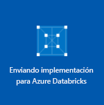

# <a name="quickstart-run-a-spark-job-on-azure-databricks-using-the-azure-portal"></a>Inicio rápido: Ejecución de un trabajo de Spark en Azure Databricks con Azure Portal

Esta guía de inicio rápido muestra cómo ejecutar un trabajo de Apache Spark mediante Azure Databricks para realizar el análisis de los datos almacenados en una cuenta de almacenamiento con Azure Data Lake Storage Gen2 (versión preliminar) habilitado.

Como parte del trabajo de Spark, se analizan los datos de suscripción a un canal de radio para obtener información sobre el uso gratis o de pago basado en datos demográficos.

Si no tiene una suscripción a Azure, cree una [cuenta gratuita](https://azure.microsoft.com/free/) antes de empezar.

## <a name="prerequisites"></a>Requisitos previos

- [Creación de una cuenta de almacenamiento con Data Lake Storage Gen2 habilitado](data-lake-storage-quickstart-create-account.md)

## <a name="set-aside-storage-account-configuration"></a>Reserva de la configuración de la cuenta de almacenamiento

> [!IMPORTANT]
> Durante este tutorial, debe tener acceso a la clave de acceso y al nombre de la cuenta de almacenamiento. En Azure Portal, seleccione **Todos los servicios** y escriba *almacenamiento*. Seleccione **Cuentas de almacenamiento** y busque la cuenta que creó para este tutorial.
>
> En **Información general**, copie el **nombre** de la cuenta de almacenamiento en un editor de texto. A continuación, seleccione **Claves de acceso** y copie el valor de **key1** en el editor de texto, ya que ambos valores se necesitan para los comandos posteriores.

## <a name="create-an-azure-databricks-workspace"></a>Creación de un área de trabajo de Azure Databricks

En esta sección, creará un área de trabajo de Azure Databricks mediante Azure Portal.

1. En Azure Portal, seleccione **Crear un recurso** > **Análisis** > **Azure Databricks**.

    

2. En **Azure Databricks Service**, proporcione los valores para crear un área de trabajo de Databricks.

    

    Proporcione los valores siguientes:

    |Propiedad  |Descripción  |
    |---------|---------|
    |**Workspace name** (Nombre del área de trabajo)     | Proporcione un nombre para el área de trabajo de Databricks        |
    |**Suscripción**     | En el cuadro desplegable, seleccione la suscripción de Azure.        |
    |**Grupos de recursos**     | Especifique si desea crear un nuevo grupo de recursos o utilizar uno existente. Un grupo de recursos es un contenedor que almacena los recursos relacionados con una solución de Azure. Para más información, consulte [Información general del grupo de recursos de Azure](../../azure-resource-manager/resource-group-overview.md). |
    |**Ubicación**     | Seleccione **Oeste de EE. UU. 2**. No dude en seleccionar otra región pública si lo prefiere.        |
    |**Plan de tarifa**     |  Elija entre **Standard** o **Premium**. Para más información sobre estos planes, consulte la [página de precios de Databricks](https://azure.microsoft.com/pricing/details/databricks/).       |

    Seleccione **Anclar al panel** y luego haga clic en **Crear**.

3. Se tarda unos minutos en crear el área de trabajo. Durante la creación del área de trabajo, el portal muestra el icono **Enviando implementación para Azure Databricks** a la derecha. Puede que deba desplazarse a la derecha del panel para ver el icono. También hay una barra de progreso que se muestra en la parte superior de la pantalla. Puede ver cualquier área para el progreso.

    

## <a name="create-a-spark-cluster-in-databricks"></a>Creación de un clúster de Spark en Databricks

1. En Azure Portal, vaya al área de trabajo de Databricks que ha creado y, después, seleccione **Launch Workspace** (Iniciar área de trabajo).

2. Se le redirigirá al portal de Azure Databricks. En el portal, seleccione **Nuevo** > **Clúster**.

    

3. En la página **Nuevo clúster**, proporcione los valores para crear un clúster.

    

    Acepte los demás valores predeterminados, salvo los siguientes:

    * Escriba un nombre para el clúster.
    * Cree un clúster con el entorno de tiempo de ejecución **5.1 beta**.
    * Asegúrese de que selecciona la casilla **Terminate after 120 minutes of inactivity** (Terminar después de 120 minutos de inactividad). Proporcione una duración (en minutos) para terminar el clúster, si este no se usa.

4. Seleccione **Create cluster** (Crear clúster). Una vez que el clúster se está ejecutando, puede asociarle notebooks y ejecutar trabajos de Spark.

Para obtener más información sobre la creación de clústeres, consulte [Create a Spark cluster in Azure Databricks](https://docs.azuredatabricks.net/user-guide/clusters/create.html) (Creación de un clúster de Spark en Azure Databricks).

## <a name="create-storage-account-file-system"></a>Creación de un sistema de archivos de la cuenta de almacenamiento

En esta sección, creará un cuaderno en el área de trabajo de Azure Databricks y, a continuación, ejecutará fragmentos de código para configurar la cuenta de almacenamiento.

1. En [Azure Portal](https://portal.azure.com), vaya al área de trabajo de Azure Databricks que creó y seleccione **Launch Workspace** (Iniciar área de trabajo).

2. En el panel izquierdo, seleccione **Workspace** (Área de trabajo). En la lista desplegable **Workspace** (Área de trabajo), seleccione **Create** > **Notebook** (Crear > Cuaderno).

    

3. En el cuadro de diálogo **Create Notebook** (Crear cuaderno), escriba un nombre para el cuaderno. Seleccione **Scala** como lenguaje y, a continuación, seleccione el clúster de Spark que creó anteriormente.

    

    Seleccione **Crear**.

4. Conecte el área de trabajo de Databricks con su cuenta de ADLS Gen2. Existen tres mecanismos compatibles para lograr esto: realizar el montaje mediante OAuth, acceso directo con OAuth y acceso directo con clave compartida. 

    Cada mecanismo se muestra en el ejemplo siguiente. Al probar los ejemplos, no olvide reemplazar el marcador de posición que se muestra entre paréntesis en el ejemplo por sus propios valores:

    **Realizar el montaje mediante OAuth**     
        
    ```scala
    %python%
    configs = {"fs.azure.account.auth.type": "OAuth",
        "fs.azure.account.oauth.provider.type": "org.apache.hadoop.fs.azurebfs.oauth2.ClientCredsTokenProvider",
        "fs.azure.account.oauth2.client.id": "<service-client-id>",
        "fs.azure.account.oauth2.client.secret": "<service-credentials>",
        "fs.azure.account.oauth2.client.endpoint": "https://login.microsoftonline.com/<tenant-id>/oauth2/token"}
    
    dbutils.fs.mount(
        source = "abfss://<file-system-name>@<account-name>.dfs.core.windows.net/[<directory-name>]",
        mount_point = "/mnt/<mount-name>",
        extra_configs = configs)
    ```

    **Acceso directo con OAuth**

    ```scala
    spark.conf.set("fs.azure.account.auth.type.<account-name>.dfs.core.windows.net": "OAuth")
    spark.conf.set("fs.azure.account.oauth.provider.type.<account-name>.dfs.core.windows.net", "org.apache.hadoop.fs.azurebfs.oauth2.ClientCredsTokenProvider")
    spark.conf.set("fs.azure.account.oauth2.client.id.<account-name>.dfs.core.windows.net": "<service-client-id>")
    spark.conf.set("fs.azure.account.oauth2.client.secret.<account-name>.dfs.core.windows.net": "<service-credentials>")
    spark.conf.set("fs.azure.account.oauth2.client.endpoint.<account-name>.dfs.core.windows.net": "https://login.microsoftonline.com/<tenant-id>/oauth2/token")

    dbutils.fs.ls("abfss://<file-system-name>@<account-name>.dfs.core.windows.net/")
    ```
        
    **Acceso directo con la clave compartida** 

    ```scala    
    spark.conf.set("fs.azure.account.key.<account-name>.dfs.core.windows.net", "<account-key>")

    dbutils.fs.ls("abfs://<file-system-name>@<account-name>.dfs.core.windows.net/")
    ```

5. Escriba el código en la primera celda y presione **MAYÚS + ENTRAR** para ejecutarlo.

Ahora el sistema de archivos se crea para la cuenta de almacenamiento.

## <a name="ingest-sample-data"></a>Ingesta de datos de ejemplo

Antes de empezar esta sección, debe completar lo siguientes requisitos previos:

Escriba el código siguiente en una celda del cuaderno:

    %sh wget -P /tmp https://raw.githubusercontent.com/Azure/usql/master/Examples/Samples/Data/json/radiowebsite/small_radio_json.json

En la celda, presione **MAYÚS + ENTRAR** para ejecutar el código.

Ahora, en una nueva celda debajo de esta, escriba el código siguiente, reemplazando los valores entre paréntesis por los mismos valores que usó anteriormente:

    dbutils.fs.cp("file:///tmp/small_radio_json.json", "abfss://<file-system>@<account-name>.dfs.core.windows.net/")

En la celda, presione **MAYÚS + ENTRAR** para ejecutar el código.

## <a name="run-a-spark-sql-job"></a>Ejecución de un trabajo de Spark SQL

Realice las siguientes tareas para ejecutar un trabajo de Spark SQL en los datos.

1. Ejecute una instrucción SQL para crear una tabla temporal con datos desde el archivo de datos JSON de ejemplo, **small_radio_json.json**. En el siguiente fragmento de código, reemplace los valores del marcador de posición con el nombre del sistema de archivos y el nombre de la cuenta de almacenamiento. Use el cuaderno que ha creado antes, pegue el fragmento de código en una nueva celda de código y, después, presione MAYÚS + ENTRAR.

    ```sql
    %sql
    DROP TABLE IF EXISTS radio_sample_data;
    CREATE TABLE radio_sample_data
    USING json
    OPTIONS (
     path  "abfss://<file-system-name>@<account-name>.dfs.core.windows.net/<PATH>/small_radio_json.json"
    )
    ```

    Una vez que el comando se completa correctamente, tiene todos los datos desde el archivo JSON como una tabla en el clúster de Databricks.

    El comando mágico del lenguaje `%sql` le permite ejecutar un código SQL desde el notebook, aunque este sea de otro tipo. Para obtener más información, consulte [Combinación de lenguajes en un notebook](https://docs.azuredatabricks.net/user-guide/notebooks/index.html#mixing-languages-in-a-notebook).

2. Echemos un vistazo a una instantánea de los datos JSON de ejemplo para entender mejor la consulta que se ejecuta. Pegue el siguiente fragmento de código en una celda vacía y presione **MAYÚS + ENTRAR**.

    ```sql
    %sql
    SELECT * from radio_sample_data
    ```

3. Verá un resultado tabular como se muestra en la siguiente captura de pantalla (solo se ven algunas columnas):

    

    Entre otros detalles, los datos de ejemplo capturan el género de la audiencia de un canal de radio (nombre de columna, **género**) y si su suscripción es gratis o de pago (nombre de columna, **nivel**).

4. Ahora cree una representación visual de estos datos para mostrar para cada género, cuántos usuarios tienen cuentas gratis y cuántas son de suscriptores pagados. En la parte inferior de la salida tabular, haga clic en el icono **Gráfico de barras** y, a continuación, haga clic en **Opciones de trazado**.

    

5. En **Personalizar trazado**, arrastre y coloque los valores como se muestra en la captura de pantalla.

    

    - Establezca **Claves** en **gender** (género).
    - Establezca **Agrupaciones de serie** en **level** (nivel).
    - Establezca **Valores** en **level** (nivel).
    - Establezca **Agregación** en **COUNT** (recuento).

6. Haga clic en **Aplicar**.

7. El resultado muestra la representación visual, como se describe en la siguiente captura de pantalla:

     

## <a name="clean-up-resources"></a>Limpieza de recursos

Cuando haya finalizado con este artículo, puede terminar el clúster. En el área de trabajo de Azure Databricks, seleccione **Clusters** (Clústeres) y localice el clúster que desea terminar. Mueva el cursor sobre el botón de puntos suspensivos en la columna **Actions** (Acciones) y seleccione el icono **Terminate** (Finalizar).


Si no finaliza manualmente el clúster, este se detendrá automáticamente si seleccionó la casilla **Terminate after \_\_ minutes of inactivity** (Finalizar después de __ minutos de inactividad) al crear el clúster. Si establece esta opción, el clúster se detendrá después de haber estado inactivo durante la cantidad de tiempo designada.

## <a name="next-steps"></a>Pasos siguientes

En este artículo, ha creado un clúster de Spark en Azure Databricks y ha ejecutado un trabajo de Spark mediante los datos de una cuenta de almacenamiento con Data Lake Storage Gen2 habilitado. También puede mirar [Spark data sources](https://docs.azuredatabricks.net/spark/latest/data-sources/index.html) (Orígenes de datos de Spark) para aprender a importar datos desde otros orígenes de datos en Azure Databricks. Vaya al siguiente artículo para aprender cómo realizar una operación ETL (extraer, transformar y cargar datos) mediante Azure Databricks.

> [!div class="nextstepaction"]
>[Extracción, transformación y carga de datos mediante Azure Databricks](../../azure-databricks/databricks-extract-load-sql-data-warehouse.md)
