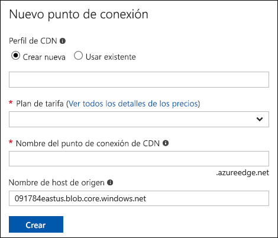

# Integración de un sitio web estático con Azure CDN

Puede habilitar [Azure Content Delivery Network (CDN)](../../cdn/cdn-overview.md) para almacenar en caché el contenido de un [sitio web estático](storage-blob-static-website.md) que esté hospedado en una cuenta de Azure Storage. Puede usar Azure CDN para configurar el punto de conexión del dominio personalizado de su sitio web estático, aprovisionar certificados SSL personalizados y configurar reglas de reescritura personalizadas. La configuración de Azure CDN da como resultado cargos adicionales, pero proporciona latencias bajas y coherentes a su sitio web desde cualquier parte del mundo. Azure CDN también proporciona el cifrado SSL con su propio certificado. 

Para más información sobre los precios de Azure CDN, consulte [Precios de Azure CDN](https://azure.microsoft.com/pricing/details/cdn/).

## Habilitación de Azure CDN para un sitio web estático

Puede habilitar Azure CDN para su sitio web estático directamente desde su cuenta de almacenamiento. Si quiere especificar valores de configuración avanzados para el punto de conexión de CDN, como la [optimización de la descarga de archivos grandes](../../cdn/cdn-optimization-overview.md#large-file-download), puede usar la [extensión Azure CDN](../../cdn/cdn-create-new-endpoint.md) para crear un perfil y un punto de conexión de CDN.

1. Busque la cuenta de almacenamiento en Azure Portal y muestre la información general de la cuenta.

2. Seleccione **Azure CDN** en el menú **Blob Service** para configurar Azure CDN.

    Aparece la página **Azure CDN**.

    

3. En la sección **Perfil de CDN**, especifique un perfil de CDN nuevo o uno existente. 

4. Especifique un plan de tarifa para el punto de conexión de CDN. Para más información sobre los precios, consulte [Precios de Content Delivery Network](https://azure.microsoft.com/pricing/details/cdn/). Para obtener información sobre las características disponibles en cada nivel de servicio, consulte [Comparación de las características de los productos de Azure CDN](../../cdn/cdn-features.md).

5. En el campo **Nombre del punto de conexión de CDN**, especifique el nombre del punto de conexión de CDN. El punto de conexión de CDN debe ser único en Azure.

6. Escriba el punto de conexión del sitio web estático en el campo **Nombre de host de origen**. 

   Para buscar el punto de conexión del sitio web estático, vaya al valor **Sitio web estático** de la cuenta de almacenamiento.  Copie el punto de conexión principal y péguelo en la configuración de CDN.

   > [!IMPORTANT]
   > Asegúrese de quitar el identificador de protocolo (*por ejemplo*, HTTPS) y la barra diagonal final de la dirección URL. Por ejemplo, si el punto de conexión del sitio web estático es `https://mystorageaccount.z5.web.core.windows.net/`, debe especificar `mystorageaccount.z5.web.core.windows.net` en el campo **Nombre de host de origen**.

   La siguiente imagen muestra una configuración de punto de conexión de ejemplo:

   

7. Seleccione **Crear** y espere a que se propague. Después de que se crea el punto de conexión, aparece en la lista de puntos de conexión.

8. Para comprobar que el punto de conexión de CDN está configurado correctamente, haga clic en él para ir a su configuración. Desde la información general de la red CDN de la cuenta de almacenamiento, busque el nombre de host del punto de conexión y vaya al punto de conexión, como se muestra en la siguiente imagen. El formato de punto de conexión de CDN será similar a `https://staticwebsitesamples.azureedge.net`.

    

9. Una vez que se ha completado la propagación del punto de conexión de CDN, si se desplaza hasta dicho punto de conexión, se mostrará el contenido del archivo index.html que ha cargado previamente en su sitio web estático.

10. Para revisar la configuración del origen del punto de conexión de CDN, vaya a **Origen** en la sección **Configuración** del punto de conexión de CDN. Verá que el valor del campo **Tipo de origen** es *Origen personalizado* y que el campo **Nombre de host de origen** muestra el punto de conexión del sitio web estático.

    

## Eliminación de contenido de Azure CDN

Si ya no desea almacenar en caché un objeto en Azure CDN, puede realizar uno de los siguientes pasos:

* Convierta el contenedor en privado en lugar de público. Para más información, consulte [Administración del acceso de lectura anónimo a contenedores y blobs](storage-manage-access-to-resources.md).
* Deshabilite o elimine el punto de conexión de CDN mediante Azure Portal.
* Modifique su servicio hospedado para no seguir respondiendo a las solicitudes del objeto.

Un objeto que ya está almacenado en caché en Azure CDN permanece en caché hasta que cumple el período de vida del objeto o hasta que se [purgue](../../cdn/cdn-purge-endpoint.md) el punto de conexión. Al cumplir el período de vida, Azure CDN determina si el punto de conexión de CDN sigue siendo válido y si el objeto sigue siendo accesible de forma anónima. En caso negativo, el objeto dejará de estar almacenado en caché.

## Pasos siguientes

(Opcional) Adición de un dominio personalizado a un punto de conexión de Azure CDN. Consulte [Tutorial: Incorporación de un dominio personalizado a un punto de conexión de Azure CDN](../../cdn/cdn-map-content-to-custom-domain.md).
