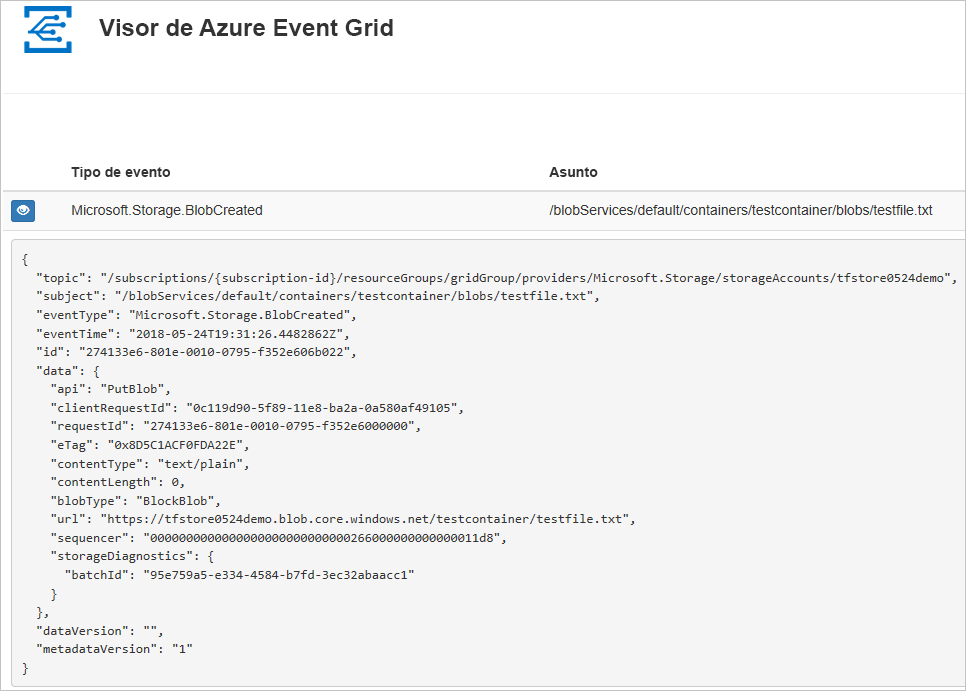
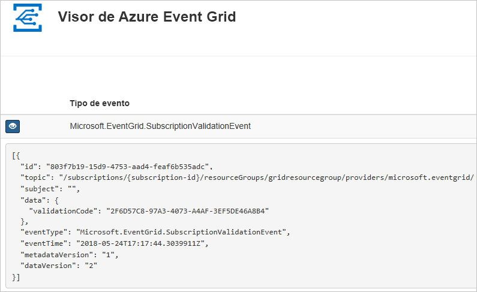

# <a name="quickstart-route-storage-events-to-web-endpoint-with-azure-cli"></a>Inicio rápido: Enrutamiento de eventos de almacenamiento a un punto de conexión web con la CLI de Azure

Azure Event Grid es un servicio de eventos para la nube. En este artículo, se usa la CLI de Azure para suscribirse a los eventos de Blob Storage y desencadenar el evento para ver el resultado.

Por lo general, se envían eventos a un punto de conexión que procesa los datos del evento y realiza acciones. Sin embargo, para simplificar en este artículo, los eventos se envían a una aplicación web que recopila y muestra los mensajes.

Al completar los pasos descritos en este artículo, verá que los datos del evento se han enviado a la aplicación web.




[!INCLUDE [quickstarts-free-trial-note.md](../../../includes/quickstarts-free-trial-note.md)]

[!INCLUDE [cloud-shell-try-it.md](../../../includes/cloud-shell-try-it.md)]

Si decide instalar y usar la CLI de Azure localmente, para los fines de este artículo, es preciso que ejecute la versión más reciente (2.0.24 o posterior). Para encontrar la versión, ejecute `az --version`. Si necesita instalarla o actualizarla, vea [Instalación de la CLI de Azure](/cli/azure/install-azure-cli).

Si no usa Cloud Shell, primero debe iniciar sesión con `az login`.

## <a name="create-a-resource-group"></a>Crear un grupo de recursos

Los temas de Event Grid son recursos de Azure y se deben colocar en un grupo de recursos de Azure. El grupo de recursos de Azure es una colección lógica en la que se implementan y administran los recursos de Azure.

Cree un grupo de recursos con el comando [az group create](/cli/azure/group). 

En el ejemplo siguiente, se crea un grupo de recursos denominado `<resource_group_name>` en la ubicación *westcentralus*.  Reemplace `<resource_group_name>` por un nombre único para grupo de recursos.

```azurecli-interactive
az group create --name <resource_group_name> --location westcentralus
```

## <a name="create-a-storage-account"></a>Crear una cuenta de almacenamiento

Los eventos de Blob Storage están disponibles en las cuentas de almacenamiento de uso general v2 y en las cuentas de Blob Storage. Las cuentas de almacenamiento de **uso general v2** admiten todas las características de todos los servicios de almacenamiento, como blobs, archivos, colas y tablas. Una **cuenta de Blob Storage** es una cuenta de almacenamiento especializada para almacenar los datos no estructurados como blobs (objetos) en Azure Storage. Las cuentas de Blob Storage son similares a las cuentas de almacenamiento de uso general y comparten las excelentes características de rendimiento, escalabilidad, disponibilidad y durabilidad que se usan en la actualidad, incluida la coherencia total de la API con blobs en bloques y blobs en anexos. Para más información, vea [Introducción a las cuentas de Azure Storage](../common/storage-account-overview.md).

Reemplace `<storage_account_name>` por el nombre único de la cuenta de almacenamiento y `<resource_group_name>` por el grupo de recursos que creó anteriormente.

```azurecli-interactive
az storage account create \
  --name <storage_account_name> \
  --location westcentralus \
  --resource-group <resource_group_name> \
  --sku Standard_LRS \
  --kind BlobStorage \
  --access-tier Hot
```

## <a name="create-a-message-endpoint"></a>Creación de un punto de conexión de mensaje

Antes de suscribirse al tema, vamos a crear el punto de conexión para el mensaje de evento. Normalmente, el punto de conexión realiza acciones en función de los datos del evento. Para simplificar esta guía de inicio rápido, se implementa una [aplicación web pregenerada](https://github.com/Azure-Samples/azure-event-grid-viewer) que muestra los mensajes de los eventos. La solución implementada incluye un plan de App Service, una aplicación web de App Service y el código fuente desde GitHub.

Reemplace `<your-site-name>` por un nombre único para la aplicación web. El nombre de la aplicación web debe ser único, ya que es parte de la entrada DNS.

```azurecli-interactive
sitename=<your-site-name>

az group deployment create \
  --resource-group <resource_group_name> \
  --template-uri "https://raw.githubusercontent.com/Azure-Samples/azure-event-grid-viewer/master/azuredeploy.json" \
  --parameters siteName=$sitename hostingPlanName=viewerhost
```

La implementación puede tardar unos minutos en completarse. Después de que la implementación se haya realizado correctamente, puede ver la aplicación web para asegurarse de que se está ejecutando. En un explorador web, vaya a: `https://<your-site-name>.azurewebsites.net`

Debería ver el sitio, que no muestra ningún mensaje actualmente.

[!INCLUDE [event-grid-register-provider-cli.md](../../../includes/event-grid-register-provider-cli.md)]

## <a name="subscribe-to-your-storage-account"></a>Suscríbase a una cuenta de almacenamiento

Suscríbase a un tema que indique a Event Grid los eventos cuyo seguimiento desea realizar y el lugar al que deben enviarse dichos eventos. En el ejemplo siguiente se realiza la suscripción a la cuenta de almacenamiento que ha creado y se pasa la dirección URL de su aplicación web como punto de conexión para la notificación de eventos. Reemplace `<event_subscription_name>` por un nombre para la suscripción de eventos. En `<resource_group_name>` y `<storage_account_name>`, use los valores que creó anteriormente.

El punto de conexión de la aplicación web debe incluir el sufijo `/api/updates/`.

```azurecli-interactive
storageid=$(az storage account show --name <storage_account_name> --resource-group <resource_group_name> --query id --output tsv)
endpoint=https://$sitename.azurewebsites.net/api/updates

az eventgrid event-subscription create \
  --resource-id $storageid \
  --name <event_subscription_name> \
  --endpoint $endpoint
```

Vuelva a la aplicación web y observe que se ha enviado un evento de validación de suscripción. Seleccione el icono del ojo para expandir los datos del evento. Event Grid envía el evento de validación para que el punto de conexión pueda verificar que desea recibir datos de eventos. La aplicación web incluye código para validar la suscripción.



## <a name="trigger-an-event-from-blob-storage"></a>Desencadenamiento de un evento desde Blob Storage

Ahora, vamos a desencadenar un evento para ver cómo Event Grid distribuye el mensaje al punto de conexión. En primer lugar, vamos a configurar el nombre y la clave de la cuenta de almacenamiento. Luego, crearemos un contenedor y, después, crearemos y cargaremos un archivo. De nuevo, utilice los valores `<storage_account_name>` y `<resource_group_name>` que creó anteriormente.

```azurecli-interactive
export AZURE_STORAGE_ACCOUNT=<storage_account_name>
export AZURE_STORAGE_ACCESS_KEY="$(az storage account keys list --account-name <storage_account_name> --resource-group <resource_group_name> --query "[0].value" --output tsv)"

az storage container create --name testcontainer

touch testfile.txt
az storage blob upload --file testfile.txt --container-name testcontainer --name testfile.txt
```

Ha desencadenado el evento y Event Grid ha enviado el mensaje al punto de conexión que configuró al realizar la suscripción. Vaya a la aplicación web para ver el evento que acaba de enviar.


```json
[{
  "topic": "/subscriptions/xxxxxxxx-xxxx-xxxx-xxxx-xxxxxxxxxxxx/resourceGroups/myrg/providers/Microsoft.Storage/storageAccounts/myblobstorageaccount",
  "subject": "/blobServices/default/containers/testcontainer/blobs/testfile.txt",
  "eventType": "Microsoft.Storage.BlobCreated",
  "eventTime": "2017-08-16T20:33:51.0595757Z",
  "id": "4d96b1d4-0001-00b3-58ce-16568c064fab",
  "data": {
    "api": "PutBlockList",
    "clientRequestId": "d65ca2e2-a168-4155-b7a4-2c925c18902f",
    "requestId": "4d96b1d4-0001-00b3-58ce-16568c000000",
    "eTag": "0x8D4E4E61AE038AD",
    "contentType": "text/plain",
    "contentLength": 0,
    "blobType": "BlockBlob",
    "url": "https://myblobstorageaccount.blob.core.windows.net/testcontainer/testblob1.txt",
    "sequencer": "00000000000000EB0000000000046199",
    "storageDiagnostics": {
      "batchId": "dffea416-b46e-4613-ac19-0371c0c5e352"
    }
  },
  "dataVersion": "",
  "metadataVersion": "1"
}]

```

## <a name="clean-up-resources"></a>Limpieza de recursos
Si planea seguir trabajando con esta cuenta de almacenamiento y suscripción de eventos, no elimine los recursos creados en este artículo. Si no va a continuar, use el siguiente comando para eliminar los recursos creados en este artículo.

Sustituya `<resource_group_name>` por el nombre del grupo de recursos que ha creado.

```azurecli-interactive
az group delete --name <resource_group_name>
```

## <a name="next-steps"></a>Pasos siguientes

Ahora que sabe cómo crear suscripciones a temas y eventos, obtenga más información acerca de los eventos de Blob Storage y lo que Event Grid puede ayudarle a hacer:

- [Reacción a eventos de Blob Storage](storage-blob-event-overview.md)
- [Una introducción a Azure Event Grid](../../event-grid/overview.md)
