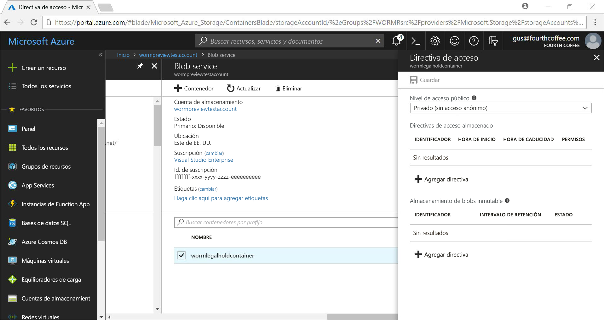
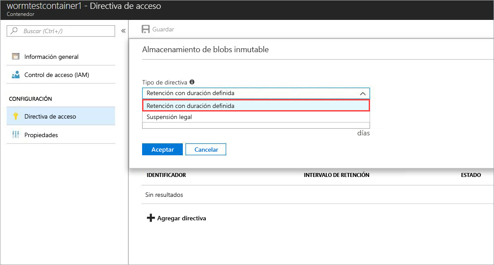
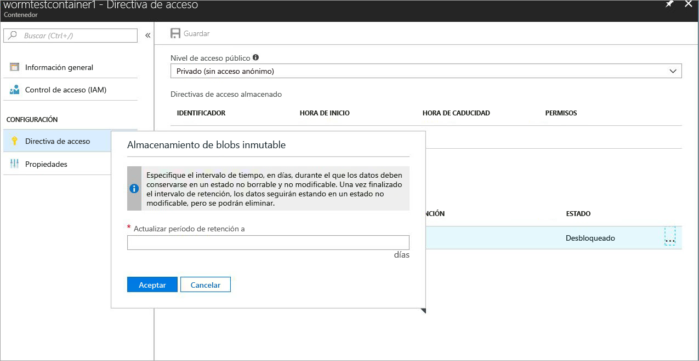
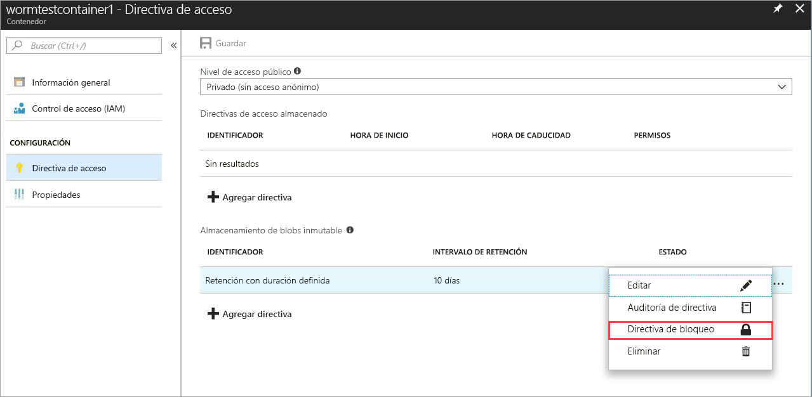
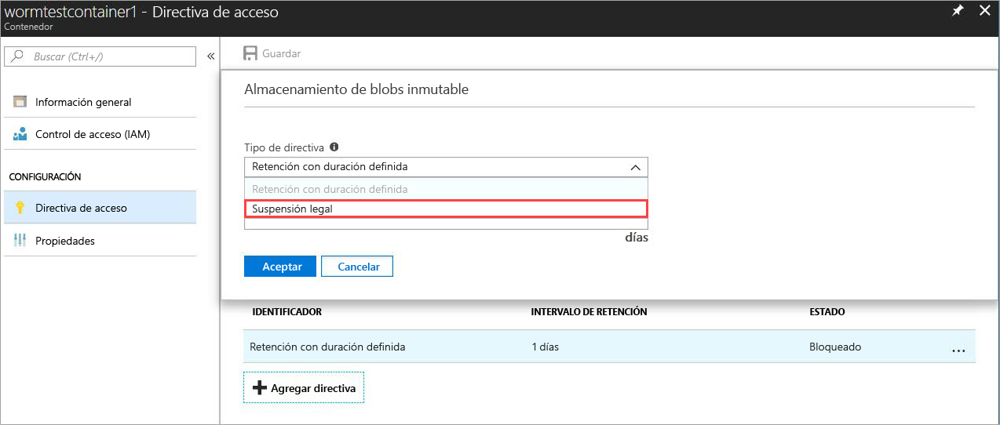

# <a name="immutable-storage-feature-of-azure-blob-storage-preview"></a>Característica Immutable Storage de Azure Blob Storage (versión preliminar)

La característica Immutable Storage de Azure Blob Storage permite a los usuarios almacenar los datos empresariales críticos en Azure Blob Storage en un estado WORM (una escritura, muchas lecturas). Este estado hace que no se puedan eliminar ni modificar durante un intervalo de tiempo especificado por el usuario. Los blobs se pueden crear y leer, pero no modificar ni eliminar durante el intervalo de retención.

## <a name="overview"></a>Información general

La característica Immutable Storage permite a las organizaciones de numerosos sectores regulados, especialmente las organizaciones de agentes de bolsa, almacenar los datos de una manera compatible con SEC 17a-4(f) y otras reglamentaciones.

Las aplicaciones típicas son:

- **Cumplimiento de normas**: la característica Immutable Storage de Azure Blob Storage está diseñada para ayudar a cumplir a las instituciones financieras y los sectores relacionados las normas SEC 17a-4(f), CFTC 1.31©-(d), FINRA, etc.

- **Protección de la retención de documentos**: los usuarios reciben una protección de los datos máxima, ya que el servicio Blob Storage garantiza que los datos no pueden ser modificados ni eliminados por ningún usuario, incluidos aquellos que tienen privilegios administrativos en la cuenta.

- **Retención legal**: Immutable Storage de Azure Blob Storage permite a los usuarios almacenar información confidencial fundamental para un juicio o investigación de delitos etc. en un estado a prueba de manipulaciones para la duración deseada.

La característica Immutable Storage ofrece:

- **Compatibilidad con directivas de retención basadas en el tiempo:** los usuarios establecen directivas para almacenar los datos durante un intervalo de tiempo especificado.

- **Compatibilidad con directivas de retención legal** cuando no se conoce el intervalo de retención, los usuarios pueden establecer retenciones legales para almacenar los datos de una manera inmutable hasta que se elimine la retención legal.  Cuando se establece una retención legal, los blobs se pueden crear y leer, pero no modificar ni eliminar. Cada retención legal está asociada a una etiqueta alfanumérica definida por el usuario que se utiliza como una cadena de identificador (por ejemplo, un identificador de caso).

- **Compatibilidad con todos los niveles de blobs:** las directivas WORM son independientes del nivel de Azure Blob Storage y se aplican a todos los niveles: frecuente, nivel de acceso esporádico y nivel de acceso de archivo. Esto permite a los clientes almacenar los datos en el nivel con mayor optimización de costos para sus cargas de trabajo mientras se mantiene la inmutabilidad de los datos

- **Configuración en el nivel de contenedor:** la característica Immutable Storage permite a los usuarios configurar directivas de retención basadas en el tiempo y etiquetas de retención legal en el nivel de contenedor.  Los usuarios pueden crear y bloquear directivas de retención basadas en el tiempo, ampliar intervalos de retención o establecer y eliminar retenciones legales, entre otras acciones, con una sola configuración en el nivel de contenedor.  Estas directivas se aplicarán a todos los blobs del contenedor, nuevos y existentes.

- **Compatibilidad con el registro de auditoría:** cada contenedor contiene un registro de auditoría que muestra hasta cinco comandos de retención basados en el tiempo para directivas de retención basadas en el tiempo bloqueadas con un máximo de tres registros para las extensiones del intervalo de retención.  Para la retención basada en el tiempo, el registro contiene el identificador de usuario, el tipo de comando, las marcas de tiempo y el intervalo de retención. Para las retenciones legales, el registro contiene el identificador de usuario, el tipo de comando, las marcas de tiempo y las etiquetas de retención legal. Este registro se conserva durante el tiempo de vida del contenedor según las directrices de regulación SEC 17a-4(f). Un registro más completo de todas las actividades del plano de control se puede encontrar en el [Registro de actividad de Azure](https://docs.microsoft.com/azure/monitoring-and-diagnostics/monitoring-overview-activity-logs). Es responsabilidad del usuario almacenar dichos registros de forma persistente, ya que pueden ser requeridos para fines legales u otros propósitos.

 La característica está habilitada en todas las regiones públicas de Azure.

## <a name="how-it-works"></a>Cómo funciona

Immutable Storage de Azure Blob Storage admite dos tipos de directivas inmutables o WORM: retención basada en el tiempo y retenciones legales. Consulte la sección [Introducción](#Getting-started) para más información sobre cómo crear estas directivas inmutables.
Cuando se aplica una directiva de retención basada en el tiempo o una retención legal a un contenedor, todos los blobs existentes se cambiarán al estado inmutable (protegido frente a escritura y eliminación). Todos los nuevos blobs cargados en el contenedor también se cambiarán al estado inmutable.

> [!IMPORTANT]
> Una directiva de retención basada en el tiempo debe estar *bloqueada* para que el blob esté en un estado inmutable (protegido frente a escritura y eliminación) para el cumplimiento de SEC 17a-4(f) y otras regulaciones. Se recomienda que la directiva se bloquee en un período razonable de tiempo, normalmente antes de 24 horas. No se recomienda usar el estado *desbloqueado* con ningún fin que no sea evaluar la característica a corto plazo.

 Cuando se aplica una directiva de retención basada en el tiempo a un contenedor, todos los blobs del contenedor permanecen en estado inmutable durante la duración del período de retención *efectivo*. El período de retención efectivo para los blobs existentes es igual a la diferencia entre la hora de creación de blob y el intervalo de retención especificado por el usuario. Para los nuevos blobs, el período de retención efectivo es igual al intervalo de retención especificado por el usuario. Puesto que los usuarios pueden cambiar el intervalo de retención, se utilizará el valor más reciente del intervalo de retención especificado por el usuario para calcular el período de retención efectivo.

> [!TIP]
> Ejemplo: el usuario crea una directiva de retención basada en el tiempo con un intervalo de retención de cinco años.
> Hay un blob existente en ese contenedor, testblob1, que se creó hace un año. El período de retención efectivo para testblob1 será de cuatro años.
> Un nuevo blob, testblob2, se carga ahora en el contenedor. El período de retención efectivo para este nuevo blob será de cuatro años.

### <a name="legal-holds"></a>Retenciones legales

En el caso de las retenciones legales, todos los blobs nuevos y existentes permanecerán en el estado inmutable hasta que se elimine la retención legal.
Para más información sobre cómo establecer y eliminar retenciones legales, consulte la sección [Introducción](#Getting-started).

Un contenedor puede tener una retención legal y una directiva de retención basada en el tiempo al mismo tiempo. Todos los blobs de ese contenedor permanecerán en estado inmutable hasta que se eliminen todas las retenciones legales, incluso si ha expirado el período de retención efectivo. De modo similar, un blob permanecerá en estado inmutable hasta que expire el período de retención efectivo incluso si se han eliminado todas las retenciones legales.
La tabla siguiente muestra los tipos de operaciones de blob que se deshabilitarán para los diferentes escenarios de inmutabilidad.
Consulte la documentación de la [API del servicio Azure Blob](https://docs.microsoft.com/rest/api/storageservices/blob-service-rest-api) para obtener los detalles de la API REST Blob.

|Escenario  |Estado del blob  |Operaciones de blob no permitidas  |
|---------|---------|---------|
|El intervalo de retención efectivo del blob no ha expirado todavía o se ha establecido una retención legal     |Inmutable: protegido frente a eliminación y escritura         |Delete Container, Delete Blob, Put Blob1, Put Block, Put Block List, Set Blob Metadata, Put Page, Set Blob Properties, Snapshot Blob, Incremental Copy Blob, Append Block         |
|El intervalo de retención efectivo del blob ha expirado     |Protegido contra escritura únicamente (están permitidas las operaciones de eliminación)         |Put Blob, Put Block, Put Block List, Set Blob Metadata, Put Page, Set Blob Properties, Snapshot Blob, Incremental Copy Blob, Append Block         |
|Todas las retenciones legales se han eliminado y no hay ninguna directiva de retención basada en el tiempo establecida en el contenedor     |Mutable         |None         |
|No se ha creado ninguna directiva WORM (retención basada en el tiempo o retención legal)     |Mutable         |None         |

> [!NOTE]
> Se permiten la primera operación Put Blob y las operaciones Put Block List y Put Block necesarias para crear un blob en los primeros dos escenarios de la tabla anterior y las operaciones subsiguientes no son permitidas.
> La característica Immutable Storage solo está disponible en cuentas de almacenamiento GPv2 y Blob, y se debe crear mediante [Azure Resource Manager](https://docs.microsoft.com/azure/azure-resource-manager/resource-group-overview).

## <a name="pricing"></a>Precios

No hay ningún cargo adicional por usar esta característica y el precio de los datos inmutables se determina de la misma manera que los datos normales mutables. Consulte en la [página de precios de Azure Storage](https://azure.microsoft.com/pricing/details/storage/blobs/) toda la información sobre precios.

### <a name="restrictions"></a>Restricciones

Las siguientes restricciones se aplican durante la versión preliminar pública:

- **No almacene datos críticos del negocio ni datos de producción**
- Se aplican todas las restricciones de la versión preliminar y del contrato de confidencialidad

## <a name="getting-started"></a>Introducción

Azure Immutable Storage para Azure Blobs es compatible con las versiones más recientes de [Azure Portal](http://portal.azure.com), [la CLI de Azure 2.0](https://docs.microsoft.com/cli/azure/install-azure-cli?view=azure-cli-latest) y Azure [PowerShell](https://github.com/Azure/azure-powershell/releases/tag/Azure.Storage.v4.4.0-preview-May2018)

### <a name="azure-portal"></a>Azure Portal

1. Cree un nuevo contenedor o seleccione un contenedor existente para almacenar los blobs que se deben conservar en estado inmutable.
 El contenedor debe estar en una cuenta de almacenamiento GPv2.
2. Haga clic en Directiva de acceso en la configuración del contenedor y, a continuación, haga clic en **+ Agregar directiva** en la directiva **Immutable Blob Storage** como se muestra a continuación.

    

3. Para habilitar la retención basada en el tiempo, elija Retención basada en el tiempo en el menú desplegable.

    

4. Escriba el intervalo de retención deseado en días (el mínimo es 1 día)

    

    Como puede ver arriba, el estado inicial de la directiva es desbloqueado. Esto permite probar la característica con un intervalo de retención más pequeño y realizar cambios en la directiva antes de bloquearla. El bloqueo es esencial para el cumplimiento de las normas SEC 17a-4 y otras.

5. Para bloquear la directiva, haga clic con el botón derecho en los puntos suspensivos (...) y aparecerá el siguiente menú:

    

    Haga clic en Bloquear directiva y el estado de la directiva ahora aparecerá como bloqueado. Una vez bloqueada, la directiva ya no se puede eliminar y se permitirán únicamente las extensiones del intervalo de retención.

6. Para habilitar las retenciones legales, haga clic en + Agregar directiva y elija Retención Legal en el menú desplegable

    

7. Crear una retención legal con una o varias etiquetas

    

### <a name="cli-20"></a>CLI 2.0

Instale la [extensión de la CLI](http://docs.microsoft.com/cli/azure/install-azure-cli?view=azure-cli-latest) con `az extension add -n storage-preview`

Si ya tiene la extensión instalada, use el siguiente comando para habilitar la característica Immutable Storage: `az extension update -n storage-preview`

La característica se incluye en los siguientes grupos de comandos (ejecute "-h" en ellos para ver los comandos): `az storage container immutability-policy` y `az storage container legal-hold`.

### <a name="powershell"></a>PowerShell

La característica Immutable Storage se admite en [PowerShell versión 4.4.0-preview](https://github.com/Azure/azure-powershell/releases/tag/Azure.Storage.v4.4.0-preview-May20180).
Para habilitar la característica, siga los pasos siguientes:

1. Asegúrese de que tiene instalada la versión más reciente de PowerShellGet mediante `Install-Module PowerShellGet –Repository PSGallery –Force`.
2. Elimine las instalaciones anteriores de Azure PowerShell.
3. Instale AzureRM (AzureRM se puede instalar de forma similar desde este repositorio).`Install-Module AzureRM –Repository PSGallery –AllowClobber`
4. Instale la versión preliminar de los cmdlets del plano de administración de Storage.`Install-Module -Name AzureRM.Storage -AllowPrerelease -Repository PSGallery -AllowClobber`

A continuación se proporciona código de PowerShell de ejemplo que ilustra el uso de la característica.

## <a name="client-libraries"></a>Bibliotecas de clientes

Immutable Storage para Azure Blobs es compatible con las siguientes versiones de la biblioteca de cliente:

- [Biblioteca de cliente .NET (versión 7.2.0-preview y versiones posteriores](https://www.nuget.org/packages/Microsoft.Azure.Management.Storage/7.2.0-preview)
- [Biblioteca de cliente Node.js (versión 4.0.0 y versiones posteriores)](https://www.npmjs.com/package/azure-arm-storage)
- [Biblioteca de cliente de Python (versión 2.0.0 Release Candidate 2 y versiones posteriores)](https://pypi.org/project/azure-mgmt-storage/2.0.0rc1/)

## <a name="supported-values"></a>Valores admitidos

- El intervalo de retención mínimo es de un día, el máximo es de 400 años
- Para una cuenta de almacenamiento determinada, el número máximo de contenedores por cuenta de almacenamiento con directivas de inmutabilidad bloqueadas es 1000
- Para una cuenta de almacenamiento determinada, el número máximo de contenedores con una retención legal establecida es 1000
- En un contenedor determinado, el número máximo de etiquetas de retención legal es 10
- La longitud máxima de una etiqueta de retención legal es de 23 caracteres alfanuméricos, la longitud mínima es de tres caracteres
- En un contenedor determinado, el número máximo de extensiones de intervalo de retención permitido para las directivas de inmutabilidad bloqueadas es tres
- En un contenedor determinado con una directiva de inmutabilidad bloqueada, hay un máximo de cinco registros de directiva de retención basada en el tiempo y un máximo de 10 registros de directiva de retención legal que se conservan durante la duración del contenedor.

## <a name="faq"></a>Preguntas más frecuentes

**¿La característica se aplica solo a los blobs en bloques o también a los blobs en páginas y los blobs en anexos?**

La característica Immutable Storage para blobs se puede utilizar con cualquier tipo de blob.  Sin embargo, tenga en cuenta que se recomienda que la característica se use principalmente para blobs en bloques. A diferencia de los blobs en bloques, los blobs en páginas y los blobs en anexos se deben crear fuera de un contenedor WORM y luego copiarlos en él.  Una vez copiado en un contenedor WORM, no se permiten más *anexos* en un blob en anexos ni cambios en un blob en páginas.

**Para usar esta característica, ¿debo crear siempre una nueva cuenta de almacenamiento?**

Puede usar la característica Immutable Storage con cualquier cuenta GPv2 existente o en nuevas cuentas de almacenamiento si el tipo de cuenta es GPv2. Esta característica solo está disponible con Blob Storage.

**¿Qué ocurre si se intenta eliminar un contenedor con una directiva de retención basada en el tiempo o una retención legal *bloqueada*?**

Se producirá un error en la operación Delete Container (eliminar contenedor) si hay al menos un blob con una directiva de retención basada en el tiempo bloqueada o una retención legal. La operación de eliminación del contenedor se realizará correctamente si no hay ningún blob con un intervalo de retención activo y no hay retenciones legales. Primero debe eliminar los blobs antes de poder eliminar el contenedor.

**¿Qué ocurre si se intenta eliminar una cuenta de almacenamiento con un contenedor WORM que tiene una directiva de retención basada en el tiempo o una retención legal*bloqueada*?**

Se producirá un error en la eliminación de la cuenta de almacenamiento si hay al menos un contenedor WORM con una retención legal o un blob con un intervalo de retención activo.  Se deben eliminar todos los contenedores WORM antes de que se pueda eliminar la cuenta de almacenamiento.  Consulte la pregunta 2 para obtener información sobre la eliminación del contenedor.

**¿Puedo mover los datos entre distintos niveles de blob (nivel de acceso frecuente, esporádico, poco frecuente) cuando el blob está en estado inmutable?**

Sí, puede usar el comando Set Blob Tier para mover datos entre los niveles de blob manteniendo los datos en estado inmutable. La característica Immutable Storage se admite en los niveles de blob de acceso frecuente, esporádico y poco frecuente.

**¿Qué ocurre si dejo de pagar y no ha expirado el intervalo de retención?**

En el caso de impago, las directivas de retención de datos normales se aplicarán como estipulado en el período de gracia especificado en los términos y condiciones de su contrato con Microsoft.

**¿Se ofrece una evaluación o un período de gracia para probar la característica?**

Sí, cuando se crea por primera vez una directiva de retención basada en el tiempo, estará en estado *desbloqueado*. En este estado, puede realizar los cambios que desee en el intervalo de retención, por ejemplo, aumentarlo o disminuirlo e incluso eliminar la directiva. Una vez que la directiva está bloqueada, permanece bloqueada indefinidamente para impedir su eliminación. Además, ya no se puede disminuir el intervalo de retención cuando la directiva está bloqueada. Se recomienda encarecidamente que utilice el estado *desbloqueado* únicamente para fines de prueba y que bloquee la directiva en un plazo de 24 horas, para evitar el riesgo de no cumplir la regulación SEC 17a-4(f) y otras reglamentaciones.

**¿Está disponible la característica en las nubes nacionales y gubernamentales?**

Actualmente, la característica Immutable Storage solo está disponible en las regiones públicas de Azure. Envíe un correo electrónico a azurestoragefeedback@microsoft.com sobre su interés en una nube nacional específica.

## <a name="sample-code"></a>Código de ejemplo

Se indica a continuación un script de PowerShell de ejemplo como referencia.
Este script crea una nueva cuenta de almacenamiento y un contenedor; a continuación, muestra cómo establecer y eliminar retenciones legales, crear y bloquear una directiva de retención basada en el tiempo (también conocida como ImmutabilityPolicy), ampliar el intervalo de retención, etc.

```powershell
\$ResourceGroup = "\<Enter your resource group\>”

\$StorageAccount = "\<Enter your storage account name\>"

\$container = "\<Enter your container name\>"

\$container2 = "\<Enter another container name\>”

\$location = "\<Enter the storage account location\>"

\# Login to the Azure Resource Manager Account

Login-AzureRMAccount

Register-AzureRmResourceProvider -ProviderNamespace "Microsoft.Storage"

\# Create your Azure Resource Group

New-AzureRmResourceGroup -Name \$ResourceGroup -Location \$location

\# Create your Azure storage account

New-AzureRmStorageAccount -ResourceGroupName \$ResourceGroup -StorageAccountName
\$StorageAccount -SkuName Standard_LRS -Location \$location -Kind Storage

\# Create a new container

New-AzureRmStorageContainer -ResourceGroupName \$ResourceGroup
-StorageAccountName \$StorageAccount -Name \$container

\# Create Container 2 with Storage Account object

\$accountObject = Get-AzureRmStorageAccount -ResourceGroupName \$ResourceGroup
-StorageAccountName \$StorageAccount

New-AzureRmStorageContainer -StorageAccount \$accountObject -Name \$container2

\# Get container

Get-AzureRmStorageContainer -ResourceGroupName \$ResourceGroup
-StorageAccountName \$StorageAccount -Name \$container

\# Get Container with Account object

\$containerObject = Get-AzureRmStorageContainer -StorageAccount \$accountObject
-Name \$container

\#list container

Get-AzureRmStorageContainer -ResourceGroupName \$ResourceGroup
-StorageAccountName \$StorageAccount

\#remove container (Add -Force to dismiss prompt)

Remove-AzureRmStorageContainer -ResourceGroupName \$ResourceGroup
-StorageAccountName \$StorageAccount -Name \$container2

\#with Account object

Remove-AzureRmStorageContainer -StorageAccount \$accountObject -Name
\$container2

\#with Container object

\$containerObject2 = Get-AzureRmStorageContainer -StorageAccount \$accountObject
-Name \$container2

Remove-AzureRmStorageContainer -InputObject \$containerObject2

\#Set LegalHold

Add-AzureRmStorageContainerLegalHold -ResourceGroupName \$ResourceGroup
-StorageAccountName \$StorageAccount -Name \$container -Tag tag1,tag2

\#with Account object

Add-AzureRmStorageContainerLegalHold -StorageAccount \$accountObject -Name
\$container -Tag tag3

\#with Container object

Add-AzureRmStorageContainerLegalHold -Container \$containerObject -Tag tag4,tag5

\#Clear LegalHold

Remove-AzureRmStorageContainerLegalHold -ResourceGroupName \$ResourceGroup
-StorageAccountName \$StorageAccount -Name \$container -Tag tag2

\#with Account object

Remove-AzureRmStorageContainerLegalHold -StorageAccount \$accountObject -Name
\$container -Tag tag3,tag5

\#with Container object

Remove-AzureRmStorageContainerLegalHold -Container \$containerObject -Tag tag4

\# create/update ImmutabilityPolicy

\#\# with account/container name

Set-AzureRmStorageContainerImmutabilityPolicy -ResourceGroupName \$ResourceGroup
-StorageAccountName \$StorageAccount -ContainerName \$container
-ImmutabilityPeriod 10

\#with Account object

Set-AzureRmStorageContainerImmutabilityPolicy -StorageAccount \$accountObject
-ContainerName \$container -ImmutabilityPeriod 1 -Etag \$policy.Etag

\#with Container object

\$policy = Set-AzureRmStorageContainerImmutabilityPolicy -Container
\$containerObject -ImmutabilityPeriod 7

\#\# with ImmutabilityPolicy object

Set-AzureRmStorageContainerImmutabilityPolicy -ImmutabilityPolicy \$policy
-ImmutabilityPeriod 5

\#get ImmutabilityPolicy

Get-AzureRmStorageContainerImmutabilityPolicy -ResourceGroupName \$ResourceGroup
-StorageAccountName \$StorageAccount -ContainerName \$container

\#with Account object

Get-AzureRmStorageContainerImmutabilityPolicy -StorageAccount \$accountObject
-ContainerName \$container

\#with Container object

Get-AzureRmStorageContainerImmutabilityPolicy -Container \$containerObject

\#Lock ImmutabilityPolicy (Add -Force to dismiss prompt)

\#\# with ImmutabilityPolicy object

\$policy = Get-AzureRmStorageContainerImmutabilityPolicy -ResourceGroupName
\$ResourceGroup -StorageAccountName \$StorageAccount -ContainerName \$container

\$policy = Lock-AzureRmStorageContainerImmutabilityPolicy -ImmutabilityPolicy
\$policy -force

\#\# with account/container name

\$policy = Lock-AzureRmStorageContainerImmutabilityPolicy -ResourceGroupName
\$ResourceGroup -StorageAccountName \$StorageAccount -ContainerName \$container
-Etag \$policy.Etag

\#with Account object

\$policy = Lock-AzureRmStorageContainerImmutabilityPolicy -StorageAccount
\$accountObject -ContainerName \$container -Etag \$policy.Etag

\#with Container object

\$policy = Lock-AzureRmStorageContainerImmutabilityPolicy -Container
\$containerObject -Etag \$policy.Etag -force

\#Extend ImmutabilityPolicy

\#\# with ImmutabilityPolicy object

\$policy = Get-AzureRmStorageContainerImmutabilityPolicy -ResourceGroupName
\$ResourceGroup -StorageAccountName \$StorageAccount -ContainerName \$container

\$policy = Set-AzureRmStorageContainerImmutabilityPolicy -ImmutabilityPolicy
\$policy -ImmutabilityPeriod 11 -ExtendPolicy

\#\# with account/container name

\$policy = Set-AzureRmStorageContainerImmutabilityPolicy -ResourceGroupName
\$ResourceGroup -StorageAccountName \$StorageAccount -ContainerName \$container
-ImmutabilityPeriod 11 -Etag \$policy.Etag -ExtendPolicy

\#with Account object

\$policy = Set-AzureRmStorageContainerImmutabilityPolicy -StorageAccount
\$accountObject -ContainerName \$container -ImmutabilityPeriod 12 -Etag
\$policy.Etag -ExtendPolicy

\#with Container object

\$policy = Set-AzureRmStorageContainerImmutabilityPolicy -Container
\$containerObject -ImmutabilityPeriod 13 -Etag \$policy.Etag -ExtendPolicy

\#Remove ImmutabilityPolicy (Add -Force to dismiss prompt)

\#\# with ImmutabilityPolicy object

\$policy = Get-AzureRmStorageContainerImmutabilityPolicy -ResourceGroupName
\$ResourceGroup -StorageAccountName \$StorageAccount -ContainerName \$container

Remove-AzureRmStorageContainerImmutabilityPolicy -ImmutabilityPolicy \$policy

\#\# with account/container name

Remove-AzureRmStorageContainerImmutabilityPolicy -ResourceGroupName
\$ResourceGroup -StorageAccountName \$StorageAccount -ContainerName \$container
-Etag \$policy.Etag

\#with Account object

Remove-AzureRmStorageContainerImmutabilityPolicy -StorageAccount \$accountObject
-ContainerName \$container -Etag \$policy.Etag

\#with Container object

Remove-AzureRmStorageContainerImmutabilityPolicy -Container \$containerObject
-Etag \$policy.Etag
```