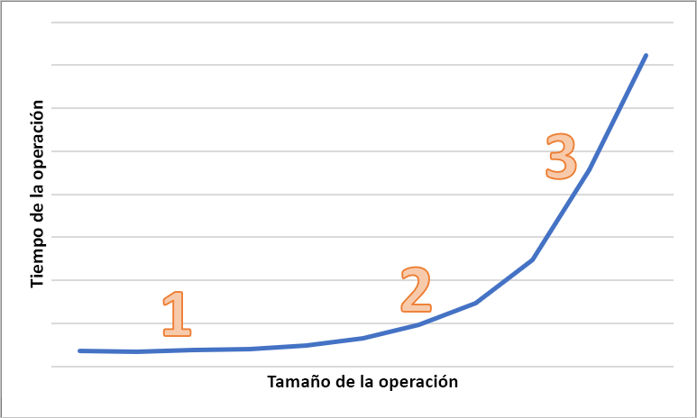

# Latencia en Blob Storage

La latencia, a la que a veces se hace referencia como tiempo de respuesta, es la cantidad de tiempo que una aplicación debe esperar a que se complete una solicitud. Puede afectar directamente al rendimiento de una aplicación. Una latencia baja suele ser importante para escenarios en los que las personas operan en un bucle, por ejemplo, en la realización de transacciones de tarjetas de crédito o la carga de páginas Web. Los sistemas que necesitan procesar eventos entrantes con tarifas elevadas, como el registro de telemetría o los eventos de IoT, también requieren una latencia baja. En este artículo se describe cómo conocer y medir la latencia de las operaciones en blob en bloques y cómo diseñar las aplicaciones para que tengan una latencia baja.

Azure Storage ofrece dos opciones de rendimiento diferentes para los blobs en bloques: Premium y Standard. Los blobs en bloques Premium ofrecen una latencia significativamente menor y más coherente que los blobs en bloques estándar a través de discos SSD de alto rendimiento. Para más información, consulte **Almacenamiento de blobs en bloques de rendimiento Premium** en [Azure Blob Storage: niveles de acceso frecuente, esporádico y de archivo](storage-blob-storage-tiers.md).

## Acerca de la latencia de Azure Storage

La latencia de Azure Storage está relacionada con las tasas de solicitudes para las operaciones de Azure Storage. Las tarifas de solicitud también se conocen como operaciones de entrada/salida por segundo (IOPS).

Para calcular la tasa de solicitudes, primero determine el período de tiempo que tarda cada solicitud en completarse y, a continuación, calcule el número de solicitudes que se pueden procesar por segundo. Por ejemplo, supongamos que una solicitud tarda 50 milisegundos (MS) en completarse. Una aplicación que usa un subproceso con una operación de lectura o escritura pendiente debe lograr 20 IOPS (1 segundo o 1000 ms / 50 ms por solicitud). En teoría, si el recuento de subprocesos se duplica por dos, la aplicación debe poder alcanzar 40 IOPS. Si las operaciones de lectura o escritura asincrónicas pendientes de cada subproceso se duplican por dos, la aplicación debe ser capaz de lograr 80 IOPS.

En la práctica, las tasas de solicitudes no siempre se escalan de forma lineal, debido a la sobrecarga en el cliente de la programación de tareas, el cambio de contexto, etc. Con respecto al servicio, puede haber variabilidad en la latencia debido a la presión sobre el sistema de Azure Storage, las diferencias en el medio de almacenamiento usado, el ruido de otras cargas de trabajo, las tareas de mantenimiento y otros factores. Por último, la conexión de red entre el cliente y el servidor puede afectar a la latencia de Azure Storage debida a la congestión, el redireccionamiento o a otras interrupciones.

El ancho de banda de Azure Storage, también conocido como "rendimiento", está relacionado con la tasa de solicitudes y se puede calcular multiplicando la tasa de solicitudes (IOPS) por el tamaño de la solicitud. Por ejemplo, suponiendo 160 solicitudes por segundo, cada 256 KiB de datos da como resultado un rendimiento de 40 960 KiB por segundo o 40 MiB por segundo.

## Métricas de latencia para blobs en bloques

Azure Storage proporciona dos métricas de latencia para los blobs en bloques. Estas métricas se pueden ver en Azure Portal:

- **La latencia de un extremo a otro (E2E)** mide el intervalo desde el momento en que Azure Storage recibe el primer paquete de la solicitud hasta que recibe una confirmación del cliente en el último paquete de la respuesta.

- **La latencia del servidor** mide el intervalo desde el momento en que Azure Storage recibe el último paquete de la solicitud hasta que devuelve el primer paquete de la respuesta.

En la imagen siguiente se muestra la **Latencia media de E2E correcta** y la **Latencia media de servidor correcta** para una carga de trabajo de ejemplo que llama a la operación `Get Blob`:

En condiciones normales, hay poca diferencia entre la latencia de un extremo a otro y la latencia del servidor, que es lo que se muestra en la imagen para la carga de trabajo de ejemplo.

Si revisa las métricas de la latencia del servidor y la de un extremo a otro, y descubre que la de un extremo a otro es significativamente mayor que la del servidor, investigue y solucione el origen de la latencia adicional.

Si son similares, pero necesita una menor, considere la posibilidad de migrar al almacenamiento de blobs en bloques Premium.

## Factores que influyen en la latencia

El factor principal es el tamaño de la operación. Se tarda más en completar operaciones mayores, debido a la cantidad de datos que se transfieren a través de la red y que se procesan mediante Azure Storage.

En el diagrama siguiente se muestra el tiempo total para operaciones de varios tamaños. En el caso de cantidades pequeñas de datos, el intervalo de latencia se dedica principalmente a controlar la solicitud, en lugar de transferir los datos. El intervalo de latencia aumenta ligeramente a medida que aumenta el tamaño de la operación (marcado con 1 en el diagrama siguiente). A medida que aumenta el tamaño de la operación, se dedica más tiempo a transferir los datos, de modo que el intervalo de latencia total se divida entre el control de solicitudes y la transferencia de datos (marcado como 2 en el diagrama siguiente). Con tamaños de operación mayores, el intervalo de latencia se emplea casi exclusivamente en la transferencia de datos y el tratamiento de la solicitud no es significativo en gran medida (se marca como 3 en el diagrama siguiente).

Los factores de configuración del cliente, como la simultaneidad y el subprocesamiento, también afectan a la latencia. El rendimiento general depende del número de solicitudes de almacenamiento que están activas en un momento dado y del modo en que la aplicación controla los subprocesos. Los recursos de cliente, como la CPU, la memoria, el almacenamiento local y las interfaces de red, también pueden afectar a la latencia.

El procesamiento de las solicitudes de Azure Storage requiere CPU del cliente y recursos de memoria. Si el cliente está bajo presión debido a que la máquina virtual es menor de la que debe o a algún proceso descontrolado en el sistema, hay menos recursos disponibles para procesar las solicitudes de Azure Storage. Cualquier contención o falta de recursos de cliente producirá un aumento de la latencia de un extremo a otro sin aumentar la latencia del servidor, lo que aumenta la diferencia entre las dos métricas.

Igual de importante es la interfaz de red y la canalización de red entre el cliente y Azure Storage. La distancia física por sí sola puede ser un factor importante, por ejemplo, si una máquina virtual de cliente está en una región de Azure diferente o en un entorno local. Otros factores, como los saltos de red, el enrutamiento de ISP y el estado de Internet, pueden afectar a la latencia de almacenamiento global.

Para evaluar la latencia, establezca primero métricas de referencia para su escenario. Las métricas de referencia proporcionan las latencias de extremo a extremo y de servidor esperadas en el contexto de su entorno de aplicación, según el perfil de carga de trabajo, las opciones de configuración de la aplicación, los recursos de cliente, la canalización de red y otros factores. Si tiene métricas de referencia, puede identificar más fácilmente las condiciones anómalas frente a las normales. Las métricas de referencia también permiten observar los efectos de los parámetros modificados, como la configuración de la aplicación o los tamaños de las máquinas virtuales.

## Pasos siguientes

- [Objetivos de escalabilidad y rendimiento de Azure Storage en cuentas de almacenamiento](../common/storage-scalability-targets.md)
- [Lista de comprobación del rendimiento y la escalabilidad de Azure Storage](../common/storage-performance-checklist.md)
