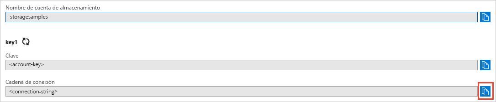
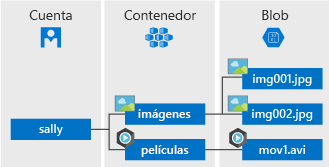

# <a name="quickstart-azure-blob-storage-client-library-for-net"></a>Inicio rápido: Biblioteca cliente de Azure Blob Storage para .NET

Introducción a la biblioteca cliente de Azure Blob Storage para .NET. Azure Blob Storage es la solución de almacenamiento de objetos de Microsoft para la nube. Siga los pasos para instalar el paquete y probar el código de ejemplo para realizar tareas básicas. Blob Storage está optimizado para el almacenamiento de cantidades masivas de datos no estructurados.

Use la biblioteca cliente de Azure Blob Storage para .NET para:

* Crear un contenedor
* Establecer los permisos en un contenedor
* Crear un blob en Azure Storage
* Descargar el blob en el equipo local
* Enumerar todos los blobs de un contenedor
* Eliminación de un contenedor

[Documentación de referencia de la API](https://docs.microsoft.com/dotnet/api/overview/azure/storage?view=azure-dotnet) | [Código fuente de la biblioteca](https://github.com/Azure/azure-storage-net/tree/master/Blob) | [Paquete (NuGet)](https://www.nuget.org/packages/Microsoft.Azure.Storage.Blob/) | [Ejemplos](https://azure.microsoft.com/resources/samples/?sort=0&service=storage&platform=dotnet&term=blob)

[!INCLUDE [storage-multi-protocol-access-preview](../../../includes/storage-multi-protocol-access-preview.md)]

## <a name="required-before-you-begin"></a>Requisitos previos

* Una suscripción a Azure: [cree una cuenta gratuita](https://azure.microsoft.com/free/)
* Una cuenta de Azure Storage: [cree una cuenta de almacenamiento](https://docs.microsoft.com/azure/storage/common/storage-quickstart-create-account)
* [SDK de NET Core](https://dotnet.microsoft.com/download/dotnet-core) para el sistema operativo. Asegúrese de obtener el SDK y no el entorno de ejecución.

## <a name="setting-up"></a>Instalación

En esta sección se explica cómo preparar un proyecto para que funcione con la biblioteca de cliente de Azure Blob Storage para. NET.

### <a name="create-the-project"></a>Creación del proyecto

En primer lugar, cree una aplicación de .NET Core llamada *blob-quickstar*.

1. En una ventana de consola (por ejemplo, cmd, PowerShell o Bash), use el comando `dotnet new` para crear una nueva aplicación de consola con el nombre *blob-quickstar*. Este comando crea un sencillo proyecto "Hola mundo" de C# con un solo archivo de origen: *Program.cs*.

   ```console
   dotnet new console -n blob-quickstart
   ```

2. Cambie a la carpeta *blob-quicstart* recién creada y compile la aplicación para comprobar que todo está bien.

   ```console
   cd blob-quickstart
   ```

   ```console
   dotnet build
   ```

El resultado esperado de la compilación debe parecerse a lo siguiente:

```output
C:\QuickStarts\blob-quickstart> dotnet build
Microsoft (R) Build Engine version 16.0.450+ga8dc7f1d34 for .NET Core
Copyright (C) Microsoft Corporation. All rights reserved.

  Restore completed in 44.31 ms for C:\QuickStarts\blob-quickstart\blob-quickstart.csproj.
  blob-quickstart -> C:\QuickStarts\blob-quickstart\bin\Debug\netcoreapp2.1\blob-quickstart.dll

Build succeeded.
    0 Warning(s)
    0 Error(s)

Time Elapsed 00:00:03.08
```

### <a name="install-the-package"></a>Instalación del paquete

Mientras sigue en el directorio de aplicaciones, instale el paquete de la biblioteca de cliente de Azure Blob Storage para .NET con el comando `dotnet add package`.

```console
dotnet add package Microsoft.Azure.Storage.Blob
```

### <a name="set-up-the-app-framework"></a>Instalación del marco de la aplicación

Desde el directorio del proyecto:

1. Abra el archivo *Program.cs* en el editor.
2. Quite la instrucción `Console.WriteLine`.
3. Agregue directivas `using`.
4. Cree un método `ProcessAsync`, en el que residirá el código principal para el ejemplo.
5. Llame de forma asincrónica al método `ProcessAsync` desde `Main`.

Este es el código:

```csharp
using System;
using System.IO;
using System.Threading.Tasks;
using Microsoft.Azure.Storage;
using Microsoft.Azure.Storage.Blob;

namespace blob_quickstart
{
    class Program
    {
        public static void Main()
        {
            Console.WriteLine("Azure Blob Storage - .NET quickstart sample\n");

            // Run the examples asynchronously, wait for the results before proceeding
            ProcessAsync().GetAwaiter().GetResult();

            Console.WriteLine("Press any key to exit the sample application.");
            Console.ReadLine();
        }

        private static async Task ProcessAsync()
        {
        }
    }
}
```

### <a name="copy-your-credentials-from-the-azure-portal"></a>Copia de las credenciales desde Azure Portal

Cuando la aplicación de ejemplo realiza una solicitud a Azure Storage, debe estar autorizada. Para autorizar una solicitud, agregue a la aplicación las credenciales de la cuenta de almacenamiento en forma de cadena de conexión. Para ver las credenciales de la cuenta de almacenamiento, siga estos pasos:

1. Acceda a [Azure Portal](https://portal.azure.com).
2. Busque su cuenta de almacenamiento.
3. En la sección **Configuración** de la información general de la cuenta de almacenamiento, seleccione **Claves de acceso**. Aquí puede ver las claves de acceso de la cuenta, así como la cadena de conexión completa de cada clave.
4. Busque el valor de **Cadena de conexión** en **key1** y seleccione el botón **Copiar** para copiar la cadena de conexión. En el paso siguiente, agregará el valor de la cadena de conexión a una variable de entorno.

    

### <a name="configure-your-storage-connection-string"></a>Configuración de la cadena de conexión de almacenamiento.

Una vez que haya copiado la cadena de conexión, escríbala en una variable de entorno nueva en la máquina local que ejecuta la aplicación. Para establecer la variable de entorno, abra una ventana de consola y siga las instrucciones de su sistema operativo. Reemplace `<yourconnectionstring>` por la cadena de conexión real.

#### <a name="windows"></a>Windows

```cmd
setx CONNECT_STR "<yourconnectionstring>"
```

Después de agregar la variable de entorno en Windows, debe iniciar una nueva instancia de la ventana de comandos.

#### <a name="linux"></a>Linux

```bash
export CONNECT_STR="<yourconnectionstring>"
```

#### <a name="macos"></a>MacOS

```bash
export CONNECT_STR="<yourconnectionstring>"
```

Después de agregar la variable de entorno, reinicie todos los programas en ejecución que necesiten leer esta variable. Por ejemplo, reinicie el entorno de desarrollo o el editor antes de continuar.

## <a name="object-model"></a>Modelo de objetos

Azure Blob Storage está optimizado para el almacenamiento de cantidades masivas de datos no estructurados. Los datos no estructurados son datos que no cumplen un modelo de datos o definición concreta, como texto o datos binarios. Blob Storage ofrece tres tipos de recursos:

* La cuenta de almacenamiento
* Un contenedor en la cuenta de almacenamiento
* Un blob en un contenedor

En el siguiente diagrama se muestra la relación entre estos recursos.



Use las siguientes clases de .NET para interactuar con estos recursos:

* [CloudStorageAccount](/dotnet/api/microsoft.azure.storage.cloudstorageaccount): La clase `CloudStorageAccount` representa la cuenta de almacenamiento de Azure. Utilice esta clase para autorizar el acceso a Blob Storage mediante las claves de acceso de cuenta.
* [CloudBlobClient](/dotnet/api/microsoft.azure.storage.blob.cloudblobclient): La clase `CloudBlobClient` proporciona un punto de acceso a Blob service en el código.
* [CloudBlobContainer](/dotnet/api/microsoft.azure.storage.blob.cloudblobcontainer): La clase `CloudBlobContainer` representa un contenedor de blobs en el código.
* [CloudBlockBlob](/dotnet/api/microsoft.azure.storage.blob.cloudblockblob): El objeto `CloudBlockBlob` representa un blob en bloques en el código. Los blobs en bloques se componen de bloques de datos que se pueden administrar de forma individual.

## <a name="code-examples"></a>Ejemplos de código

Estos fragmentos de código de ejemplo muestran cómo realizar las siguientes acciones con la biblioteca de cliente de Azure Blob Storage para. NET:

   * [Autenticación del cliente](#authenticate-the-client)
   * [Creación de un contenedor](#create-a-container)
   * [Establecimiento de los permisos en un contenedor](#set-permissions-on-a-container)
   * [Carga de los blobs en un contenedor](#upload-blobs-to-a-container)
   * [Enumeración de los blobs de un contenedor](#list-the-blobs-in-a-container)
   * [Descarga de los blobs](#download-blobs)
   * [Eliminación de un contenedor](#delete-a-container)

### <a name="authenticate-the-client"></a>Autenticación del cliente

El código siguiente comprueba que la variable de entorno contiene una cadena de conexión que se pueda analizar para crear un objeto [CloudStorageAccount](/dotnet/api/microsoft.azure.storage.cloudstorageaccount?view=azure-dotnet) que señala a la cuenta de almacenamiento. Para comprobar que la cadena de conexión es válida, use el método [TryParse](/dotnet/api/microsoft.azure.storage.cloudstorageaccount.tryparse?view=azure-dotnet). Si `TryParse` es correcto, inicializa la variable `storageAccount` y devuelve `true`.

Agregue este código dentro del método `ProcessAsync`:

```csharp
// Retrieve the connection string for use with the application. The storage 
// connection string is stored in an environment variable on the machine 
// running the application called CONNECT_STR. If the 
// environment variable is created after the application is launched in a 
// console or with Visual Studio, the shell or application needs to be closed
// and reloaded to take the environment variable into account.
string storageConnectionString = Environment.GetEnvironmentVariable("CONNECT_STR");

// Check whether the connection string can be parsed.
CloudStorageAccount storageAccount;
if (CloudStorageAccount.TryParse(storageConnectionString, out storageAccount))
{
    // If the connection string is valid, proceed with operations against Blob
    // storage here.
    // ADD OTHER OPERATIONS HERE
}
else
{
    // Otherwise, let the user know that they need to define the environment variable.
    Console.WriteLine(
        "A connection string has not been defined in the system environment variables. " +
        "Add an environment variable named 'CONNECT_STR' with your storage " +
        "connection string as a value.");
    Console.WriteLine("Press any key to exit the application.");
    Console.ReadLine();
}
```

> [!NOTE]
> Para llevar a cabo el resto de las operaciones de este artículo, reemplace `// ADD OTHER OPERATIONS HERE` en el código anterior con los fragmentos de código de las secciones siguientes.

### <a name="create-a-container"></a>Crear un contenedor

Para crear el contenedor, en primer lugar cree una instancia del objeto [CloudBlobClient](/dotnet/api/microsoft.azure.storage.blob.cloudblobclient) que apunte a Blob Storage en la cuenta de almacenamiento. Cree una instancia del objeto [CloudBlobContainer](/dotnet/api/microsoft.azure.storage.blob.cloudblobcontainer) y, después, cree el contenedor.

En este caso, el código llama al método [CreateAsync](/dotnet/api/microsoft.azure.storage.blob.cloudblobcontainer.createasync) para crear el contenedor. Un valor de GUID se anexa al nombre de contenedor para asegurarse de que sea único. En un entorno de producción, a menudo es preferible utilizar el método [CreateIfNotExistsAsync](/dotnet/api/microsoft.azure.storage.blob.cloudblobcontainer.createifnotexistsasync) para crear un contenedor solo si no existe.

> [!IMPORTANT]
> Los nombres de contenedor deben estar en minúsculas. Para más información acerca de los contenedores de nomenclatura y los blobs, consulte [Naming and Referencing Containers, Blobs, and Metadata](https://docs.microsoft.com/rest/api/storageservices/naming-and-referencing-containers--blobs--and-metadata) (Asignación de nombres y realización de referencias a contenedores, blobs y metadatos).

```csharp
// Create the CloudBlobClient that represents the 
// Blob storage endpoint for the storage account.
CloudBlobClient cloudBlobClient = storageAccount.CreateCloudBlobClient();

// Create a container called 'quickstartblobs' and 
// append a GUID value to it to make the name unique.
CloudBlobContainer cloudBlobContainer = 
    cloudBlobClient.GetContainerReference("quickstartblobs" + 
        Guid.NewGuid().ToString());
await cloudBlobContainer.CreateAsync();
```

### <a name="set-permissions-on-a-container"></a>Establecimiento de los permisos en un contenedor

Establezca los permisos en el contenedor para que sus blobs sean públicos. Si un blob es público, cualquier cliente puede acceder de forma anónima.

```csharp
// Set the permissions so the blobs are public.
BlobContainerPermissions permissions = new BlobContainerPermissions
{
    PublicAccess = BlobContainerPublicAccessType.Blob
};
await cloudBlobContainer.SetPermissionsAsync(permissions);
```

### <a name="upload-blobs-to-a-container"></a>Carga de los blobs en un contenedor

El fragmento de código siguiente obtiene una referencia a un objeto `CloudBlockBlob` mediante una llamada al método [GetBlockBlobReference](/dotnet/api/microsoft.azure.storage.blob.cloudblobcontainer.getblockblobreference) en el contenedor creado en la sección anterior. Luego carga el archivo local seleccionado en el blob mediante una llamada al método [UploadFromFileAsync](/dotnet/api/microsoft.azure.storage.blob.cloudblockblob.uploadfromfileasync). Esta operación crea el blob si no existe y lo sobrescribe, en caso de que ya exista.

```csharp
// Create a file in your local MyDocuments folder to upload to a blob.
string localPath = Environment.GetFolderPath(Environment.SpecialFolder.MyDocuments);
string localFileName = "QuickStart_" + Guid.NewGuid().ToString() + ".txt";
string sourceFile = Path.Combine(localPath, localFileName);
// Write text to the file.
File.WriteAllText(sourceFile, "Hello, World!");

Console.WriteLine("Temp file = {0}", sourceFile);
Console.WriteLine("Uploading to Blob storage as blob '{0}'", localFileName);

// Get a reference to the blob address, then upload the file to the blob.
// Use the value of localFileName for the blob name.
CloudBlockBlob cloudBlockBlob = cloudBlobContainer.GetBlockBlobReference(localFileName);
await cloudBlockBlob.UploadFromFileAsync(sourceFile);
```

### <a name="list-the-blobs-in-a-container"></a>Enumerar los blobs de un contenedor

Enumera los blobs del contenedor mediante el método [ListBlobsSegmentedAsync](/dotnet/api/microsoft.azure.storage.blob.cloudblobcontainer.listblobssegmentedasync). En este caso, solo se ha agregado un blob al contenedor, por lo que la operación de enumeración devuelve simplemente dicho blob.

Si hay demasiados blobs para que se devuelvan en una sola llamada (de manera predeterminada más de 5000), el método `ListBlobsSegmentedAsync` devuelve un segmento del conjunto total de resultados y un token de continuación. Para recuperar el siguiente segmento de blobs, proporciónelo en el token de continuación devuelto por la llamada anterior, etc. hasta que el token de continuación es nulo. Un token de continuación nulo indica que se han recuperado todos los blobs. El código muestra cómo utilizar el token de continuación para los procedimientos recomendados.

```csharp
// List the blobs in the container.
Console.WriteLine("List blobs in container.");
BlobContinuationToken blobContinuationToken = null;
do
{
    var results = await cloudBlobContainer.ListBlobsSegmentedAsync(null, blobContinuationToken);
    // Get the value of the continuation token returned by the listing call.
    blobContinuationToken = results.ContinuationToken;
    foreach (IListBlobItem item in results.Results)
    {
        Console.WriteLine(item.Uri);
    }
} while (blobContinuationToken != null); // Loop while the continuation token is not null.

```

### <a name="download-blobs"></a>Descargar blobs

Descargue el blob creado anteriormente en el sistema de archivos local con el método [DownloadToFileAsync](/dotnet/api/microsoft.azure.storage.blob.cloudblob.downloadtofileasync). El código de ejemplo agrega el sufijo "_DOWNLOADED" al nombre del blob para que pueda ver ambos archivos en el sistema de archivos local.

```csharp
// Download the blob to a local file, using the reference created earlier.
// Append the string "_DOWNLOADED" before the .txt extension so that you 
// can see both files in MyDocuments.
string destinationFile = sourceFile.Replace(".txt", "_DOWNLOADED.txt");
Console.WriteLine("Downloading blob to {0}", destinationFile);
await cloudBlockBlob.DownloadToFileAsync(destinationFile, FileMode.Create);
```

### <a name="delete-a-container"></a>Eliminación de un contenedor

El código siguiente limpia los recursos que creó; para ello, elimina todo el contenedor con [CloudBlobContainer.DeleteAsync](/dotnet/api/microsoft.azure.storage.blob.cloudblobcontainer.deleteasync). Si lo desea, también puede eliminar los archivos locales.

```csharp
Console.WriteLine("Press the 'Enter' key to delete the example files, " +
    "example container, and exit the application.");
Console.ReadLine();
// Clean up resources. This includes the container and the two temp files.
Console.WriteLine("Deleting the container");
if (cloudBlobContainer != null)
{
    await cloudBlobContainer.DeleteIfExistsAsync();
}
Console.WriteLine("Deleting the source, and downloaded files");
File.Delete(sourceFile);
File.Delete(destinationFile);
```

## <a name="run-the-code"></a>Ejecución del código

Esta aplicación crea un archivo de prueba en la carpeta *Mis documentos* local y lo carga en Blob Storage. Después, en el ejemplo se enumeran los blobs del contenedor y se descarga el archivo con un nombre nuevo para que pueda comparar los archivos antiguo y nuevo.

Vaya al directorio de la aplicación y compile y ejecute la aplicación.

```console
dotnet build
```

```console
dotnet run
```

La salida de la aplicación de ejemplo es similar a la siguiente:

```output
Azure Blob storage - .NET Quickstart example

Created container 'quickstartblobs33c90d2a-eabd-4236-958b-5cc5949e731f'

Temp file = C:\Users\myusername\Documents\QuickStart_c5e7f24f-a7f8-4926-a9da-96
97c748f4db.txt
Uploading to Blob storage as blob 'QuickStart_c5e7f24f-a7f8-4926-a9da-9697c748f
4db.txt'

Listing blobs in container.
https://storagesamples.blob.core.windows.net/quickstartblobs33c90d2a-eabd-4236-
958b-5cc5949e731f/QuickStart_c5e7f24f-a7f8-4926-a9da-9697c748f4db.txt

Downloading blob to C:\Users\myusername\Documents\QuickStart_c5e7f24f-a7f8-4926
-a9da-9697c748f4db_DOWNLOADED.txt

Press any key to delete the example files and example container.
```

Al presionar la tecla **Entrar**, la aplicación elimina el contenedor de almacenamiento y los archivos. Antes de eliminarlos, compruebe si la carpeta *Mis documentos* contiene los dos archivos. Puede abrirlos y ver que son idénticos. Copie la dirección URL del blob de la ventana de la consola y péguela en un explorador para ver el contenido del blob.

Después de haber comprobado los archivos, presione cualquier tecla para finalizar la demostración y eliminar los archivos de prueba.

## <a name="next-steps"></a>Pasos siguientes

En esta guía de inicio rápido, ha aprendido a cargar, descargar y enumerar blobs mediante .NET.

Para aprender a crear una aplicación web que cargue una imagen en Blob Storage, diríjase a:

> [!div class="nextstepaction"]
> [Carga y procesamiento de una imagen](storage-upload-process-images.md).

* Para más información sobre .NET Core, consulte [Get started with .NET in 10 minutes](https://www.microsoft.com/net/learn/get-started/) (Introducción a .NET en 10 minutos).
* Para explorar una aplicación de ejemplo que puede implementar desde Visual Studio para Windows, consulte el artículo [.NET Photo Gallery Web Application Sample with Azure Blob Storage](https://azure.microsoft.com/resources/samples/storage-blobs-dotnet-webapp/) (Ejemplo de aplicación web de galería fotográfica .NET con Azure Blob Storage).
