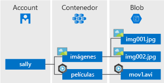

# <a name="quickstart-manage-blobs-with-java-v12-sdk"></a>Inicio rápido: Administración de blobs con el SDK de Java v12

En este inicio rápido, aprenderá a administrar blobs mediante Java. Los blobs son objetos que pueden contener grandes cantidades de texto o datos binarios, como imágenes, documentos, medios de transmisión y datos de archivo. Cargará, descargará y enumerará los blobs, y creará y eliminará los contenedores.

[Documentación de referencia de la API](https://azuresdkdocs.blob.core.windows.net/$web/java/azure-storage-blob/12.0.0/index.html) | [Código fuente de la biblioteca](https://github.com/Azure/azure-sdk-for-java/tree/master/sdk/storage/azure-storage-blob) | [Paquete (Maven)](https://mvnrepository.com/artifact/com.azure/azure-storage-blob?repo=jcenter) | [Ejemplos](https://github.com/Azure/azure-sdk-for-java/tree/master/sdk/storage/azure-storage-blob/src/samples/java/com/azure/storage/blob)

## <a name="prerequisites"></a>Prerequisites

- Una cuenta de Azure con una suscripción activa. [Cree una cuenta gratuita](https://azure.microsoft.com/free/?ref=microsoft.com&utm_source=microsoft.com&utm_medium=docs&utm_campaign=visualstudio).
- Una cuenta de Azure Storage. [Crear una cuenta de almacenamiento](../common/storage-account-create.md).
- [Kit de desarrollo de Java (JDK)](/java/azure/jdk/?view=azure-java-stable), versión 8 o posterior.
- [Apache Maven](https://maven.apache.org/download.cgi).

> [!NOTE]
> Para empezar a trabajar con la versión anterior del SDK, consulte [Inicio rápido: Administración de blobs con el SDK de Java v8](storage-quickstart-blobs-java-legacy.md)

[!INCLUDE [storage-multi-protocol-access-preview](../../../includes/storage-multi-protocol-access-preview.md)]

## <a name="setting-up"></a>Instalación

En esta sección se explica cómo preparar un proyecto para que funcione con la biblioteca cliente de Azure Blob Storage v12 para Java.

### <a name="create-the-project"></a>Creación del proyecto

Cree una aplicación de Java llamada *blob-quickstart-v12*.

1. En una ventana de consola (por ejemplo, cmd, PowerShell o Bash), use Maven para crear una nueva aplicación de consola con el nombre *blob-quickstart-v12*. Escriba el siguiente comando **mvn** para crear un proyecto "Hola mundo" sencillo de Java.

   ```console
   mvn archetype:generate -DgroupId=com.blobs.quickstart \
                          -DartifactId=blob-quickstart-v12 \
                          -DarchetypeArtifactId=maven-archetype-quickstart \
                          -DarchetypeVersion=1.4 \
                          -DinteractiveMode=false
   ```

1. La salida a partir de la generación del proyecto debe ser similar a la siguiente:

    ```console
    [INFO] Scanning for projects...
    [INFO]
    [INFO] ------------------< org.apache.maven:standalone-pom >-------------------
    [INFO] Building Maven Stub Project (No POM) 1
    [INFO] --------------------------------[ pom ]---------------------------------
    [INFO]
    [INFO] >>> maven-archetype-plugin:3.1.2:generate (default-cli) > generate-sources @ standalone-pom >>>
    [INFO]
    [INFO] <<< maven-archetype-plugin:3.1.2:generate (default-cli) < generate-sources @ standalone-pom <<<
    [INFO]
    [INFO]
    [INFO] --- maven-archetype-plugin:3.1.2:generate (default-cli) @ standalone-pom ---
    [INFO] Generating project in Batch mode
    [INFO] ----------------------------------------------------------------------------
    [INFO] Using following parameters for creating project from Archetype: maven-archetype-quickstart:1.4
    [INFO] ----------------------------------------------------------------------------
    [INFO] Parameter: groupId, Value: com.blobs.quickstart
    [INFO] Parameter: artifactId, Value: blob-quickstart-v12
    [INFO] Parameter: version, Value: 1.0-SNAPSHOT
    [INFO] Parameter: package, Value: com.blobs.quickstart
    [INFO] Parameter: packageInPathFormat, Value: com/blobs/quickstart
    [INFO] Parameter: version, Value: 1.0-SNAPSHOT
    [INFO] Parameter: package, Value: com.blobs.quickstart
    [INFO] Parameter: groupId, Value: com.blobs.quickstart
    [INFO] Parameter: artifactId, Value: blob-quickstart-v12
    [INFO] Project created from Archetype in dir: C:\QuickStarts\blob-quickstart-v12
    [INFO] ------------------------------------------------------------------------
    [INFO] BUILD SUCCESS
    [INFO] ------------------------------------------------------------------------
    [INFO] Total time:  7.056 s
    [INFO] Finished at: 2019-10-23T11:09:21-07:00
    [INFO] ------------------------------------------------------------------------
        ```

1. Switch to the newly created *blob-quickstart-v12* folder.

   ```console
   cd blob-quickstart-v12
   ```

1. En el directorio *blob-quickstart-v12*, cree otro directorio denominado *data*. Aquí es donde se crearán y almacenarán los archivos de datos de blobs.

    ```console
    mkdir data
    ```

### <a name="install-the-package"></a>Instalar el paquete

Abra el archivo *pom.xml* en el editor de texto. Agregue el siguiente elemento de dependencia al grupo de dependencias.

```xml
<dependency>
    <groupId>com.azure</groupId>
    <artifactId>azure-storage-blob</artifactId>
    <version>12.0.0</version>
</dependency>
```

### <a name="set-up-the-app-framework"></a>Instalación del marco de la aplicación

Desde el directorio del proyecto:

1. Navegue al directorio */src/main/java/com/blobs/quickstart*.
1. Abra el archivo *App.java* en el editor.
1. Eliminar la instrucción `System.out.println("Hello world!");`.
1. Agregue directivas `import`.

Este es el código:

```java
package com.blobs.quickstart;

/**
 * Azure blob storage v12 SDK quickstart
 */
import com.azure.storage.blob.*;
import com.azure.storage.blob.models.*;
import java.io.*;

public class App
{
    public static void main( String[] args ) throws IOException
    {
    }
}
```

[!INCLUDE [storage-quickstart-credentials-include](../../../includes/storage-quickstart-credentials-include.md)]

## <a name="object-model"></a>Modelo de objetos

Azure Blob Storage está optimizado para el almacenamiento de cantidades masivas de datos no estructurados. Los datos no estructurados son datos que no cumplen un modelo de datos o definición concreta, como texto o datos binarios. Blob Storage ofrece tres tipos de recursos:

* La cuenta de almacenamiento
* Un contenedor en la cuenta de almacenamiento
* Un blob en el contenedor

En el siguiente diagrama se muestra la relación entre estos recursos.



Use las siguientes clases de Java para interactuar con estos recursos:

* [BlobServiceClient](https://azuresdkdocs.blob.core.windows.net/$web/java/azure-storage-blob/12.0.0/com/azure/storage/blob/BlobServiceClient.html): La clase `BlobServiceClient` permite manipular recursos de Azure Storage y contenedores de blobs. La cuenta de almacenamiento proporciona el espacio de nombres de nivel superior para el Blob service.
* [BlobServiceClientBuilder](https://azuresdkdocs.blob.core.windows.net/$web/java/azure-storage-blob/12.0.0/com/azure/storage/blob/BlobServiceClientBuilder.html): La clase `BlobServiceClientBuilder` proporciona una API de generador fluida que ayuda a la configuración y la creación de instancias de objetos `BlobServiceClient`.
* [BlobContainerClient](https://azuresdkdocs.blob.core.windows.net/$web/java/azure-storage-blob/12.0.0/com/azure/storage/blob/BlobContainerClient.html): La clase `BlobContainerClient` permite manipular contenedores de Azure Storage y sus blobs.
* [BlobClient](https://azuresdkdocs.blob.core.windows.net/$web/java/azure-storage-blob/12.0.0/com/azure/storage/blob/BlobClient.html): La clase `BlobClient` permite manipular los blobs de Azure Storage.
* [BlobItem](https://azuresdkdocs.blob.core.windows.net/$web/java/azure-storage-blob/12.0.0/com/azure/storage/blob/models/BlobItem.html): La clase `BlobItem` representa los blobs individuales devueltos por una llamada a `listBlobsFlat`.

## <a name="code-examples"></a>Ejemplos de código

Estos fragmentos de código de ejemplo muestran cómo realizar las siguientes acciones con la biblioteca cliente de Azure Blob Storage para Java:

* [Obtención de la cadena de conexión](#get-the-connection-string)
* [Creación de un contenedor](#create-a-container)
* [Carga de los blobs en un contenedor](#upload-blobs-to-a-container)
* [Enumeración de los blobs de un contenedor](#list-the-blobs-in-a-container)
* [Descarga de los blobs](#download-blobs)
* [Eliminación de un contenedor](#delete-a-container)

### <a name="get-the-connection-string"></a>Obtención de la cadena de conexión

El código siguiente recupera la cadena de conexión de la cuenta de almacenamiento de la variable de entorno creada en la sección [Configuración de la cadena de conexión de almacenamiento](#configure-your-storage-connection-string).

Agregue este código dentro del método `Main`:

```java
System.out.println("Azure Blob storage v12 - Java quickstart sample\n");

// Retrieve the connection string for use with the application. The storage
// connection string is stored in an environment variable on the machine
// running the application called AZURE_STORAGE_CONNECTION_STRING. If the environment variable
// is created after the application is launched in a console or with
// Visual Studio, the shell or application needs to be closed and reloaded
// to take the environment variable into account.
String connectStr = System.getenv("AZURE_STORAGE_CONNECTION_STRING");
```

### <a name="create-a-container"></a>Crear un contenedor

Decida un nombre para el nuevo contenedor. El código siguiente anexa un valor de UUID al nombre de contenedor para asegurarse de que sea único.

> [!IMPORTANT]
> Los nombres de contenedor deben estar en minúsculas. Para más información acerca de los contenedores de nomenclatura y los blobs, consulte [Naming and Referencing Containers, Blobs, and Metadata](/rest/api/storageservices/naming-and-referencing-containers--blobs--and-metadata) (Asignación de nombres y realización de referencias a contenedores, blobs y metadatos).

A continuación, cree una instancia de la clase [BlobContainerClient](https://azuresdkdocs.blob.core.windows.net/$web/java/azure-storage-blob/12.0.0/com/azure/storage/blob/BlobContainerClient.html) y, a continuación, llame al método [create](https://azuresdkdocs.blob.core.windows.net/$web/java/azure-storage-blob/12.0.0/com/azure/storage/blob/BlobContainerClient.html#create--) para crear realmente el contenedor en la cuenta de almacenamiento.

Agregue este código al final del método `Main`:

```java
// Create a BlobServiceClient object which will be used to create a container client
BlobServiceClient blobServiceClient = new BlobServiceClientBuilder().connectionString(connectStr).buildClient();

//Create a unique name for the container
String containerName = "quickstartblobs" + java.util.UUID.randomUUID();

// Create the container and return a container client object
BlobContainerClient containerClient = blobServiceClient.createBlobContainer(containerName);
```

### <a name="upload-blobs-to-a-container"></a>Carga de los blobs en un contenedor

El siguiente fragmento de código:

1. Crea un archivo de texto en el directorio *data* local.
1. Obtiene una referencia a un objeto [BlobClient](https://azuresdkdocs.blob.core.windows.net/$web/java/azure-storage-blob/12.0.0/com/azure/storage/blob/BlobClient.html) llamando al método [getBlobClient](https://azuresdkdocs.blob.core.windows.net/$web/java/azure-storage-blob/12.0.0/com/azure/storage/blob/BlobContainerClient.html#getBlobClient-java.lang.String-) en el contenedor de la sección [Crear un contenedor](#create-a-container).
1. Carga el archivo de texto local en el blob llamando al método [uploadFromFile](https://azuresdkdocs.blob.core.windows.net/$web/java/azure-storage-blob/12.0.0/com/azure/storage/blob/BlobClient.html#uploadFromFile-java.lang.String-). Este método crea el blob si no existe aún, pero no lo sobrescribirá en caso de que ya exista.

Agregue este código al final del método `Main`:

```java
// Create a local file in the ./data/ directory for uploading and downloading
String localPath = "./data/";
String fileName = "quickstart" + java.util.UUID.randomUUID() + ".txt";
File localFile = new File(localPath + fileName);

// Write text to the file
FileWriter writer = new FileWriter(localPath + fileName, true);
writer.write("Hello, World!");
writer.close();

// Get a reference to a blob
BlobClient blobClient = containerClient.getBlobClient(fileName);

System.out.println("\nUploading to Blob storage as blob:\n\t" + blobClient.getBlobUrl());

// Upload the blob
blobClient.uploadFromFile(localPath + fileName);
```

### <a name="list-the-blobs-in-a-container"></a>Enumerar los blobs de un contenedor

Enumere los blobs en el contenedor llamando al método [listBlobs](https://azuresdkdocs.blob.core.windows.net/$web/java/azure-storage-blob/12.0.0/com/azure/storage/blob/BlobContainerClient.html#listBlobs--). En este caso, solo se ha agregado un blob al contenedor, por lo que la operación de enumeración devuelve simplemente dicho blob.

Agregue este código al final del método `Main`:

```java
System.out.println("\nListing blobs...");

// List the blob(s) in the container.
for (BlobItem blobItem : containerClient.listBlobs()) {
    System.out.println("\t" + blobItem.getName());
}
```

### <a name="download-blobs"></a>Descargar blobs

Descargue el blob creado previamente llamando al método [downloadToFile](https://azuresdkdocs.blob.core.windows.net/$web/java/azure-storage-blob/12.0.0/com/azure/storage/blob/specialized/BlobClientBase.html#downloadToFile-java.lang.String-). El código de ejemplo agrega el sufijo "DOWNLOAD" al nombre de archivo para que pueda ver ambos archivos en el sistema de archivos local.

Agregue este código al final del método `Main`:

```java
// Download the blob to a local file
// Append the string "DOWNLOAD" before the .txt extension so that you can see both files.
String downloadFileName = fileName.replace(".txt", "DOWNLOAD.txt");
File downloadedFile = new File(localPath + downloadFileName);

System.out.println("\nDownloading blob to\n\t " + localPath + downloadFileName);

blobClient.downloadToFile(localPath + downloadFileName);
```

### <a name="delete-a-container"></a>Eliminación de un contenedor

El código siguiente limpia los recursos que creó la aplicación; para ello, quita todo el contenedor con el método [delete](https://azuresdkdocs.blob.core.windows.net/$web/java/azure-storage-blob/12.0.0/com/azure/storage/blob/BlobContainerClient.html#delete--). También elimina los archivos locales creados por la aplicación.

La aplicación se detiene para la entrada del usuario mediante una llamada a `System.console().readLine()` antes de eliminar el blob, el contenedor y los archivos locales. Esta es una buena oportunidad para verificar que los recursos se han creado correctamente antes de eliminarlos.

Agregue este código al final del método `Main`:

```java
// Clean up
System.out.println("\nPress the Enter key to begin clean up");
System.console().readLine();

System.out.println("Deleting blob container...");
containerClient.delete();

System.out.println("Deleting the local source and downloaded files...");
localFile.delete();
downloadedFile.delete();

System.out.println("Done");
```

## <a name="run-the-code"></a>Ejecución del código

Esta aplicación crea un archivo de prueba en la carpeta local y lo carga en Blob Storage. Después, en el ejemplo se enumeran los blobs del contenedor y se descarga el archivo con un nombre nuevo para que pueda comparar los archivos antiguo y nuevo.

Navegue hasta el directorio que contiene el archivo *pom.xml* y compile el proyecto mediante el siguiente comando `mvn`.

```console
mvn compile
```

A continuación, compile el paquete.

```console
mvn package
```

Ejecute el siguiente comando `mvn` para ejecutar la aplicación.

```console
mvn exec:java -Dexec.mainClass="com.blobs.quickstart.App" -Dexec.cleanupDaemonThreads=false
```

La salida de la aplicación es similar a la del ejemplo siguiente:

```output
Azure Blob storage v12 - Java quickstart sample

Uploading to Blob storage as blob:
        https://mystorageacct.blob.core.windows.net/quickstartblobsf9aa68a5-260e-47e6-bea2-2dcfcfa1fd9a/quickstarta9c3a53e-ae9d-4863-8b34-f3d807992d65.txt

Listing blobs...
        quickstarta9c3a53e-ae9d-4863-8b34-f3d807992d65.txt

Downloading blob to
        ./data/quickstarta9c3a53e-ae9d-4863-8b34-f3d807992d65DOWNLOAD.txt

Press the Enter key to begin clean up

Deleting blob container...
Deleting the local source and downloaded files...
Done
```

Antes de comenzar a limpiar el proceso, compruebe la carpeta *data* para los dos archivos. Puede abrirlos y ver que son idénticos.

Después de haber comprobado los archivos, presione la tecla **Entrar** para eliminar los archivos de prueba y terminar la demostración.

## <a name="next-steps"></a>Pasos siguientes

En esta guía de inicio rápido, ha aprendido a cargar, descargar y enumerar blobs mediante Java.

Para ver las aplicaciones de ejemplo de Blob Storage, siga estos pasos:

> [!div class="nextstepaction"]
> [Ejemplos de Azure Blob Storage v12 para Java](https://github.com/Azure/azure-sdk-for-java/tree/master/sdk/storage/azure-storage-blob/src/samples/java/com/azure/storage/blob)

* Para más información, consulte el [SDK de Azure para Java](https://github.com/Azure/azure-sdk-for-java/blob/master/README.md).
* Para ver tutoriales, ejemplos, artículos de inicio rápido y otra documentación, visite [Azure para desarrolladores de nube de Java](/azure/java/).
