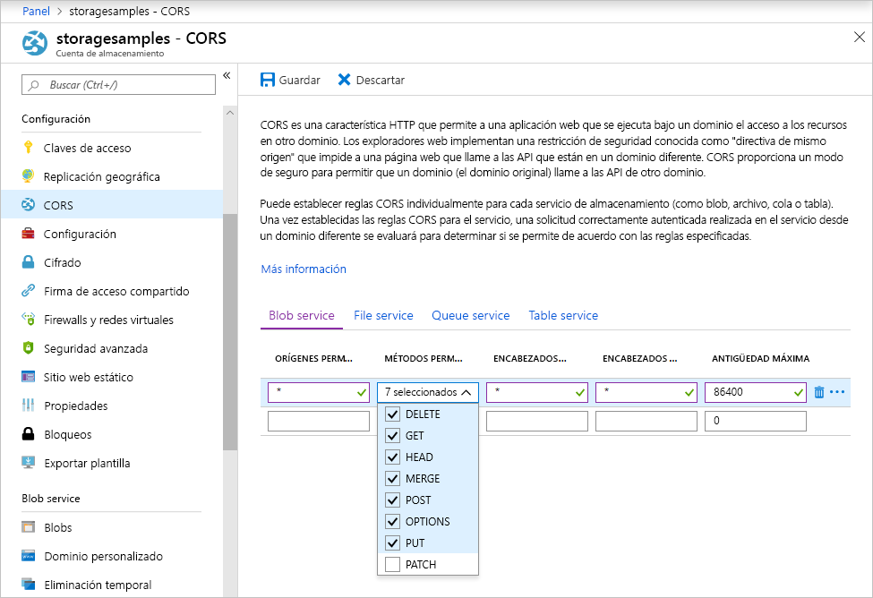

<!-- Customer intent: As a web application developer I want to interface with Azure Blob storage entirely on the client so that I can build a SPA application that is able to upload and delete files on blob storage. -->

# <a name="quickstart-upload-list-and-delete-blobs-using-azure-storage-v10-sdk-for-javascripthtml-in-the-browser"></a>Inicio rápido: Carga, enumeración y eliminación de blobs mediante la versión v10 del SDK de Azure Storage para JavaScript/HTML en el explorador

En este inicio rápido, aprenderá a usar la biblioteca [Azure Storage SDK V10 for JavaScript - Blob](https://github.com/Azure/azure-sdk-for-js/tree/master/sdk/storage/storage-blob#readme) para administrar blobs desde código de JavaScript que se ejecuta completamente en el explorador. El enfoque aquí usado muestra cómo utilizar las medidas de seguridad necesarias para garantizar el acceso protegido a su cuenta de Blob Storage.

## <a name="prerequisites"></a>Requisitos previos

[!INCLUDE [storage-quickstart-prereq-include](../../../includes/storage-quickstart-prereq-include.md)]

Las bibliotecas de cliente JavaScript de Azure Storage no funcionarán directamente desde el sistema de archivos y deben ser atendidas desde un servidor web. En este tema se usa [Node.js](https://nodejs.org) para iniciar un servidor básico. Si no quiere instalar Node.js, puede usar cualquier otro medio de ejecución de un servidor web local.

Para seguir los pasos de depuración, necesitará [Visual Studio Code](https://code.visualstudio.com) y la extensión [Depurador para Chrome](vscode:extension/msjsdiag.debugger-for-chrome) o [Depurador para Microsoft Edge](vscode:extension/msjsdiag.debugger-for-edge).

## <a name="setting-up-storage-account-cors-rules"></a>Configuración de reglas de CORS de cuenta de almacenamiento

Para que la aplicación web pueda acceder a un almacenamiento de blobs desde el cliente, debe configurar la cuenta para habilitar el [uso compartido de recursos entre orígenes](https://docs.microsoft.com/rest/api/storageservices/cross-origin-resource-sharing--cors--support-for-the-azure-storage-services), o CORS.

Vuelva a Azure Portal y seleccione la cuenta de almacenamiento. Para definir una nueva regla de CORS, vaya a la sección **Configuración** y haga clic en el vínculo **CORS**. A continuación, haga clic en el botón **Agregar** para abrir la ventana **Agregar regla de CORS**. En esta guía de inicio rápido, se crea una regla de CORS abierta:



En la tabla siguiente se describe cada opción de configuración de CORS y se explican los valores que se utilizan para definir la regla.

|Configuración  |Valor  | DESCRIPCIÓN |
|---------|---------|---------|
| Orígenes permitidos | * | Acepta una lista delimitada por comas de dominios establecidos como orígenes aceptables. Establecer el valor en `*` permite el acceso de todos los dominios a la cuenta de almacenamiento. |
| Verbos permitidos     | delete, get, head, merge, post, options y put | Enumera los verbos HTTP permitidos para ejecutar en la cuenta de almacenamiento. Para los fines de esta guía de rápido, seleccione todas las opciones disponibles. |
| Encabezados permitidos | * | Define una lista de encabezados de solicitud (incluidos los encabezados con prefijo) permitidos por la cuenta de almacenamiento. Establecer el valor en `*` permite el acceso de todos los encabezados. |
| Encabezados expuestos | * | Enumera los encabezados de respuesta permitidos por la cuenta. Establecer el valor en `*` permite que la cuenta envíe cualquier encabezado.  |
| Antigüedad máxima (segundos) | 86400 | La cantidad máxima de tiempo que el explorador almacena en caché la solicitud OPTIONS preparatoria. El valor *86400* permite que la memoria caché permanezca un día completo. |

> [!IMPORTANT]
> Asegúrese de que cualquier configuración que utilice en producción exponga la cantidad mínima de acceso necesario para la cuenta de almacenamiento a fin de mantener un acceso seguro. La configuración de CORS descrita aquí es adecuada para una guía de inicio rápido, ya que define una directiva de seguridad flexible. Sin embargo, esta configuración no se recomienda para un contexto real.

A continuación, se usa Azure Cloud Shell para crear un token de seguridad.

[!INCLUDE [Open the Azure cloud shell](../../../includes/cloud-shell-try-it.md)]

## <a name="create-a-shared-access-signature"></a>Creación de una firma de acceso compartido

La firma de acceso compartido (SAS) es usada por el código que se ejecuta en el explorador para autorizar las solicitudes para Blob Storage. Mediante el uso de una firma de acceso compartido, el cliente puede autorizar el acceso a los recursos de almacenamiento sin la clave de acceso de cuenta ni la cadena de conexión. Para más información, consulte [Uso de firmas de acceso compartido (SAS)](../common/storage-dotnet-shared-access-signature-part-1.md).

Puede crear una SAS mediante la CLI de Azure a través de Azure Cloud Shell, con Azure Portal o con el Explorador de Azure Storage. En la tabla siguiente se describen los parámetros para los que necesita proporcionar valores con el fin de generar una firma de acceso compartido con la CLI.

| Parámetro      |DESCRIPCIÓN  | Marcador de posición |
|----------------|-------------|-------------|
| *expiry*       | La fecha de expiración del token de acceso en formato AAAA-MM-DD. Escriba la fecha de mañana para usarla con este guía de inicio rápido. | *FUTURE_DATE* |
| *account-name* | El nombre de la cuenta de almacenamiento. Utilice el nombre que se reservó en un paso anterior. | *YOUR_STORAGE_ACCOUNT_NAME* |
| *account-key*  | La clave de la cuenta de almacenamiento. Utilice la clave que se reservó en un paso anterior. | *YOUR_STORAGE_ACCOUNT_KEY* |

Use el siguiente comando de la CLI, con valores reales para cada marcador de posición, para generar una SAS que pueda usar en el código de JavaScript.

```azurecli-interactive
az storage account generate-sas \
  --permissions racwdl \
  --resource-types sco \
  --services b \
  --expiry FUTURE_DATE \
  --account-name YOUR_STORAGE_ACCOUNT_NAME \
  --account-key YOUR_STORAGE_ACCOUNT_KEY
```

Puede encontrar un poco críptica la serie de valores después de cada parámetro. Los valores de estos parámetros se toman de la primera letra de sus permisos correspondientes. La siguiente tabla explica la procedencia de los valores:

| Parámetro        | Valor   | DESCRIPCIÓN  |
|------------------|---------|---------|
| *permissions*    | racwdl  | Esta firma de acceso compartido permite *leer*, *anexar*, *crear*, *escribir*, *eliminar* y *enumerar*. |
| *resource-types* | sco     | Los recursos afectados por las firmas de acceso compartido son *servicio*, *contenedor* y *objeto*. |
| *services*       | b       | El servicio afectado por la firma de acceso compartido es el servicio *blob*. |

Ahora que se genera la SAS, copie el valor devuelto y guárdelo en alguna parte para usarlo en un próximo paso. Si ha generado la SAS con un método distinto de la CLI de Azure, deberá quitar el signo `?` inicial en caso de que esté presente. Este carácter es un separador de dirección URL que ya se ha proporcionado en la plantilla de dirección URL más adelante en este tema donde se usa la SAS.

> [!IMPORTANT]
> En producción, pase siempre los tokens de SAS mediante SSL. Además, los tokens de SAS deben generarse en el servidor y enviarse a la página HTML para pasarlos de vuelta a Azure Blob Storage. Un enfoque que se puede considerar consiste en utilizar una función sin servidor para generar tokens de SAS. Azure Portal incluye plantillas de función que ofrecen la posibilidad de generar una firma de acceso compartido con una función de JavaScript.

## <a name="implement-the-html-page"></a>Implementación de la página HTML

En esta sección, creará una página web básica y configurará VS Code para iniciar y depurar la página. Sin embargo, antes de iniciarla, deberá usar Node.js para iniciar un servidor web local y suministrar la página cuando el explorador la solicite. Luego, agregará código de JavaScript para llamar a varias API de almacenamiento de blobs y mostrar los resultados en la página. También puede ver los resultados de estas llamadas en [Azure Portal](https://portal.azure.com), el [Explorador de Azure Storage](https://azure.microsoft.com/features/storage-explorer) y la [extensión de Azure Storage](vscode:extension/ms-azuretools.vscode-azurestorage) para VS Code.

### <a name="set-up-the-web-application"></a>Configuración de la aplicación web

En primer lugar, cree una carpeta llamada *azure-blobs-javascript* y ábrala en VS Code. Luego, cree un archivo en VS Code, agregue el siguiente código HTML y guárdelo como *index.html* en la carpeta *azure-blobs-javascript*.

```html
<!DOCTYPE html>
<html>

<body>
    <button id="create-container-button">Create container</button>
    <button id="delete-container-button">Delete container</button>
    <button id="select-button">Select and upload files</button>
    <input type="file" id="file-input" multiple style="display: none;" />
    <button id="list-button">List files</button>
    <button id="delete-button">Delete selected files</button>
    <p><b>Status:</b></p>
    <p id="status" style="height:160px; width: 593px; overflow: scroll;" />
    <p><b>Files:</b></p>
    <select id="file-list" multiple style="height:222px; width: 593px; overflow: scroll;" />
</body>

<!-- You'll add code here later in this quickstart. -->

</html>
```

### <a name="configure-the-debugger"></a>Configuración del depurador

Para configurar la extensión del depurador en VS Code, seleccione **Debug > Add Configuration...**  (Depurar > Agregar configuración...) y, luego, **Chrome** o **Edge**, según la extensión que haya instalado anteriormente en la sección anterior de requisitos previos. Esta acción crea un archivo *launch.json* y lo abre en el editor.

A continuación, modifique el archivo *launch.json* para que el valor `url` incluya `/index.html`, tal como se muestra:

```json
{
    // Use IntelliSense to learn about possible attributes.
    // Hover to view descriptions of existing attributes.
    // For more information, visit: https://go.microsoft.com/fwlink/?linkid=830387
    "version": "0.2.0",
    "configurations": [
        {
            "type": "chrome",
            "request": "launch",
            "name": "Launch Chrome against localhost",
            "url": "http://localhost:8080/index.html",
            "webRoot": "${workspaceFolder}"
        }
    ]
}
```

Esta configuración indica a VS Code qué explorador iniciar y qué dirección URL cargar.

### <a name="launch-the-web-server"></a>Inicio del servidor web

Para iniciar el servidor web local de Node.js, seleccione **View > Terminal** (Ver > Terminal) para abrir una ventana de consola en VS Code y, luego, escriba el siguiente comando.

```console
npx http-server
```

Este comando instala el paquete *http-server* e inicia el servidor, lo que permite que la carpeta actual esté disponible mediante las direcciones URL predeterminadas, incluida la indicada en el paso anterior.

### <a name="start-debugging"></a>Iniciar la depuración

Para iniciar *index.html* en el explorador con el depurador de VS Code asociado, seleccione **Debug > Start Debugging** (Depurar > Iniciar depuración) o presione F5 en VS Code.

La interfaz de usuario que se muestra no hace nada aún, pero agregará código de JavaScript en la sección siguiente para implementar cada una de las funciones mostradas. Liego, puede establecer puntos de interrupción e interactuar con el depurador cuando haga una pausa en el código.

Cuando realice cambios en *index.html*, no olvide volver a cargar la página para verlos en el explorador. En VS Code, también puede seleccionar **Debug > Restart Debugging** (Depurar > Reiniciar depuración) o presionar CTRL + MAYÚS + F5.

### <a name="add-the-blob-storage-client-library"></a>Adición de la biblioteca de clientes de almacenamiento de blobs

Para permitir llamadas a la API de almacenamiento de blobs, primero descargue la biblioteca cliente [Azure Storage SDK for JavaScript - Blob](https://aka.ms/downloadazurestoragejsblob), extraiga el contenido del archivo ZIP y coloque el archivo *azure storage.blob.js* en la carpeta *azure-blobs-javascript*.

A continuación, pegue el siguiente código HTML en *index.html* tras la etiqueta de cierre `</body>` y reemplace el comentario del marcador de posición.

```html
<script src="azure-storage.blob.js" charset="utf-8"></script>

<script>
// You'll add code here in the following sections.
</script>
```

Este código agrega una referencia al archivo de script y proporciona un lugar para su propio código de JavaScript. Para los fines de este inicio rápido, vamos a usar el archivo de script *azure-storage.blob.js* para que pueda abrirlo en VS Code, leer su contenido y establecer puntos de interrupción. En producción, debe usar el archivo *azure storage.blob.min.js* más compacto que también se proporcionan en el archivo ZIP.

Puede encontrar más información sobre cada función de almacenamiento de blobs en la [documentación de referencia](https://docs.microsoft.com/javascript/api/%40azure/storage-blob/index). Tenga en cuenta que algunas de las funciones del SDK solo están disponibles en Node.js o solo están disponible en el explorador.

El código en *azure-storage.blob.js* exporta una variable global llamada `azblob`, que usará en el código de JavaScript para acceder a las API de almacenamiento de blobs.

### <a name="add-the-initial-javascript-code"></a>Adición del código inicial de JavaScript

A continuación, pegue el código siguiente en el elemento `<script>` mostrado en el bloque de código anterior y reemplace el comentario del marcador de posición.

```javascript
const createContainerButton = document.getElementById("create-container-button");
const deleteContainerButton = document.getElementById("delete-container-button");
const selectButton = document.getElementById("select-button");
const fileInput = document.getElementById("file-input");
const listButton = document.getElementById("list-button");
const deleteButton = document.getElementById("delete-button");
const status = document.getElementById("status");
const fileList = document.getElementById("file-list");

const reportStatus = message => {
    status.innerHTML += `${message}<br/>`;
    status.scrollTop = status.scrollHeight;
}
```

Este código crea campos para todos los elementos HTML que se van a usar en el siguiente código e implementa una función `reportStatus` para mostrar el resultado.

En las secciones siguientes, agregue cada nuevo bloque de código de JavaScript después del bloque anterior.

### <a name="add-your-storage-account-info"></a>Adición de la información de la cuenta de almacenamiento

A continuación, agregue código para acceder a la cuenta de almacenamiento y reemplace los marcadores de posición por el nombre de la cuenta y la SAS que generó en un paso anterior.

```javascript
const accountName = "<Add your storage account name>";
const sasString = "<Add the SAS you generated earlier>";
const containerName = "testcontainer";
const containerURL = new azblob.ContainerURL(
    `https://${accountName}.blob.core.windows.net/${containerName}?${sasString}`,
    azblob.StorageURL.newPipeline(new azblob.AnonymousCredential));
```

Este código usa la información de la cuenta y la SAS para crear una instancia [ContainerURL](https://docs.microsoft.com/javascript/api/@azure/storage-blob/ContainerURL), que resulta útil para crear y manipular un contenedor de almacenamiento.

### <a name="create-and-delete-a-storage-container"></a>Creación y eliminación de un contenedor de almacenamiento

A continuación, agregue código para crear y eliminar el contenedor de almacenamiento cuando se presiona el botón correspondiente.

```javascript
const createContainer = async () => {
    try {
        reportStatus(`Creating container "${containerName}"...`);
        await containerURL.create(azblob.Aborter.none);
        reportStatus(`Done.`);
    } catch (error) {
        reportStatus(error.body.message);
    }
};

const deleteContainer = async () => {
    try {
        reportStatus(`Deleting container "${containerName}"...`);
        await containerURL.delete(azblob.Aborter.none);
        reportStatus(`Done.`);
    } catch (error) {
        reportStatus(error.body.message);
    }
};

createContainerButton.addEventListener("click", createContainer);
deleteContainerButton.addEventListener("click", deleteContainer);
```

Este código llama a las funciones [create](https://docs.microsoft.com/javascript/api/@azure/storage-blob/ContainerURL#create-aborter--icontainercreateoptions-) y [delete](https://docs.microsoft.com/javascript/api/@azure/storage-blob/ContainerURL#delete-aborter--icontainerdeletemethodoptions-) de ContainerURL sin usar una instancia [Aborter](https://docs.microsoft.com/javascript/api/@azure/storage-blob/aborter). Para simplificar las cosas en este inicio rápido, el código da por hecho que la cuenta de almacenamiento se ha creado y está habilitada. En el código de producción, use una instancia Aborter para agregar funcionalidad de tiempo de espera.

### <a name="list-blobs"></a>Enumeración de blobs

A continuación, agregue código para mostrar el contenido del contenedor de almacenamiento cuando se presiona el botón **Enumerar archivos**.

```javascript
const listFiles = async () => {
    fileList.size = 0;
    fileList.innerHTML = "";
    try {
        reportStatus("Retrieving file list...");
        let marker = undefined;
        do {
            const listBlobsResponse = await containerURL.listBlobFlatSegment(
                azblob.Aborter.none, marker);
            marker = listBlobsResponse.nextMarker;
            const items = listBlobsResponse.segment.blobItems;
            for (const blob of items) {
                fileList.size += 1;
                fileList.innerHTML += `<option>${blob.name}</option>`;
            }
        } while (marker);
        if (fileList.size > 0) {
            reportStatus("Done.");
        } else {
            reportStatus("The container does not contain any files.");
        }
    } catch (error) {
        reportStatus(error.body.message);
    }
};

listButton.addEventListener("click", listFiles);
```

Este código llama a la función [ContainerURL.listBlobFlatSegment](https://docs.microsoft.com/javascript/api/@azure/storage-blob/ContainerURL#listblobflatsegment-aborter--string--icontainerlistblobssegmentoptions-) en un bucle para garantizar que se recuperan todos los segmentos. Para cada segmento, se recorre en iteración la lista de elementos de blob que contiene y se actualiza la lista **Archivos**.

### <a name="upload-blobs"></a>Cargar blobs

A continuación, agregue código para cargar los archivos en el contenedor de almacenamiento cuando se presiona el botón **Select and upload files** (Seleccionar y cargar archivos).

```javascript
const uploadFiles = async () => {
    try {
        reportStatus("Uploading files...");
        const promises = [];
        for (const file of fileInput.files) {
            const blockBlobURL = azblob.BlockBlobURL.fromContainerURL(containerURL, file.name);
            promises.push(azblob.uploadBrowserDataToBlockBlob(
                azblob.Aborter.none, file, blockBlobURL));
        }
        await Promise.all(promises);
        reportStatus("Done.");
        listFiles();
    } catch (error) {
        reportStatus(error.body.message);
    }
}

selectButton.addEventListener("click", () => fileInput.click());
fileInput.addEventListener("change", uploadFiles);
```

Este código conecta el botón **Select and upload files** (Seleccionar y cargar archivos) con el elemento `file-input` oculto. De esta manera, el evento `click` de botón desencadena el evento `click` de entrada del archivo y muestra el selector de archivos. Después de seleccionar los archivos y cerrar el cuadro de diálogo, se produce el evento `input` y se llama a la función `uploadFiles`. Esta función llama únicamente a la función [uploadBrowserDataToBlockBlob](https://docs.microsoft.com/javascript/api/@azure/storage-blob/#uploadbrowserdatatoblockblob-aborter--blob---arraybuffer---arraybufferview--blockbloburl--iuploadtoblockbloboptions-) del explorador para cada archivo seleccionado. Cada llamada devuelve una promesa, que se agrega a una lista para que se puedan esperar a la vez, lo que hace que los archivos se carguen en paralelo.

### <a name="delete-blobs"></a>Eliminar blobs

A continuación, agregue código para eliminar archivos del contenedor de almacenamiento cuando se presiona el botón **Delete selected files** (Eliminar archivos seleccionados).

```javascript
const deleteFiles = async () => {
    try {
        if (fileList.selectedOptions.length > 0) {
            reportStatus("Deleting files...");
            for (const option of fileList.selectedOptions) {
                const blobURL = azblob.BlobURL.fromContainerURL(containerURL, option.text);
                await blobURL.delete(azblob.Aborter.none);
            }
            reportStatus("Done.");
            listFiles();
        } else {
            reportStatus("No files selected.");
        }
    } catch (error) {
        reportStatus(error.body.message);
    }
};

deleteButton.addEventListener("click", deleteFiles);
```

Este código llama a la función [BlobURL.delete](https://docs.microsoft.com/javascript/api/@azure/storage-blob/BlobURL#delete-aborter--iblobdeleteoptions-) para quitar todos los archivos seleccionado de la lista. Luego, llama a la función `listFiles` mostrada anteriormente para actualizar el contenido de la lista **Archivos**.

### <a name="run-and-test-the-web-application"></a>Ejecución y prueba de la aplicación web

En este momento, puede iniciar la página y experimentar cómo funciona el almacenamiento de blobs. Si se produce algún error (por ejemplo, al intentar enumerar los archivos antes de haber creado el contenedor), el panel **Estado** mostrará el mensaje de error recibido. También puede establecer puntos de interrupción en el código de JavaScript para examinar los valores devueltos por las API de almacenamiento.

## <a name="clean-up-resources"></a>Limpieza de recursos

Para limpiar los recursos creados durante este inicio rápido, vaya a [Azure Portal](https://portal.azure.com) y elimine el grupo de recursos que creó en la sección Requisitos previos.

## <a name="next-steps"></a>Pasos siguientes

En este inicio rápido, ha creado un sitio web sencillo con acceso a almacenamiento de blobs desde JavaScript basado en explorador. Para saber cómo puede hospedar un sitio web en el almacenamiento de blobs, continúe con el tutorial siguiente:

> [!div class="nextstepaction"]
> [Hospedaje de un sitio web estático en Blob Storage](https://docs.microsoft.com/azure/storage/blobs/storage-blob-static-website-host)
