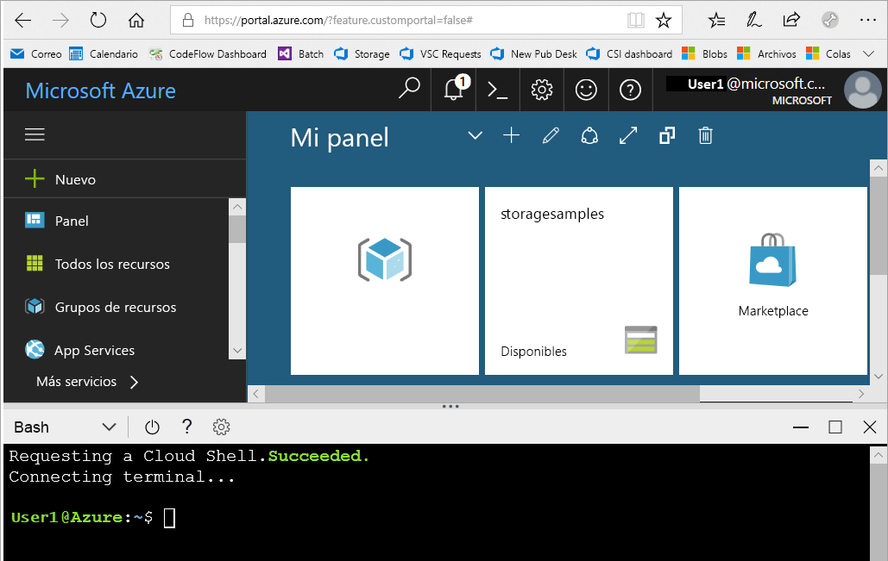

# <a name="create-a-storage-account"></a>Crear una cuenta de almacenamiento

En esta guía de inicio rápido, aprenderá a crear una cuenta de almacenamiento con [Azure Portal](https://portal.azure.com/), [Azure PowerShell](https://docs.microsoft.com/powershell/azure/overview) o la [CLI de Azure](https://docs.microsoft.com/cli/azure?view=azure-cli-latest).  

[!INCLUDE [updated-for-az](../../../includes/updated-for-az.md)]

## <a name="prerequisites"></a>Requisitos previos

Si no tiene una suscripción a Azure, cree una [cuenta gratuita](https://azure.microsoft.com/free/) antes de empezar.

# <a name="portaltabazure-portal"></a>[Portal](#tab/azure-portal)

Ninguno.

# <a name="powershelltabazure-powershell"></a>[PowerShell](#tab/azure-powershell)

Para realizar los pasos de este inicio rápido, se requiere la versión 0.7 del módulo Az de Azure PowerShell, o cualquier versión posterior. Ejecute `Get-Module -ListAvailable Az` para buscar la versión actual. Si necesita instalarla o actualizarla, consulte el artículo sobre [cómo instalar el módulo de Azure PowerShell](/powershell/azure/install-Az-ps).

# <a name="azure-clitabazure-cli"></a>[CLI de Azure](#tab/azure-cli)

Puede iniciar sesión en Azure y ejecutar los comandos de la CLI de Azure utilizando uno de los procedimientos siguientes:

- Puede ejecutar los comandos de la CLI desde Azure Portal, en Azure Cloud Shell. 
- Puede instalar la CLI y ejecutar los comandos de la CLI localmente.  

### <a name="use-azure-cloud-shell"></a>Uso de Azure Cloud Shell

Azure Cloud Shell es un shell de Bash gratuito que puede ejecutarse directamente en Azure Portal. Tiene la CLI de Azure preinstalada y configurada para utilizarla con la cuenta. Haga clic en el botón **Cloud Shell** del menú situado en la parte superior derecha de Azure Portal:

[](https://portal.azure.com)

Este botón inicia un shell interactivo que se puede utilizar para ejecutar los pasos de esta guía de inicio rápido:

[](https://portal.azure.com)

### <a name="install-the-cli-locally"></a>Instalación local de la CLI

También puede instalar y usar la CLI de Azure localmente. Para realizar este tutorial de inicio rápido, es necesario ejecutar la versión 2.0.4 o superior de la CLI de Azure. Ejecute `az --version` para encontrar la versión. Si necesita instalarla o actualizarla, consulte [Instalación de la CLI de Azure](/cli/azure/install-azure-cli). 

---

## <a name="log-in-to-azure"></a>Inicio de sesión en Azure

# <a name="portaltabazure-portal"></a>[Portal](#tab/azure-portal)

Inicie sesión en [Azure Portal](https://portal.azure.com).

# <a name="powershelltabazure-powershell"></a>[PowerShell](#tab/azure-powershell)

Inicie sesión en la suscripción de Azure con el comando `Connect-AzAccount` y siga las instrucciones que aparecen en pantalla para autenticarse.

```powershell
Connect-AzAccount
```

# <a name="azure-clitabazure-cli"></a>[CLI de Azure](#tab/azure-cli)

Para abrir Azure Cloud Shell, inicie sesión en [Azure Portal](https://portal.azure.com).

Para iniciar sesión en la instalación local de la CLI, ejecute el comando de inicio de sesión:

```cli
az login
```

---

## <a name="create-a-storage-account"></a>Crear una cuenta de almacenamiento

Ahora ya está listo para crear la cuenta de almacenamiento.

Cada cuenta de almacenamiento debe pertenecer a un grupo de recursos de Azure. Un grupo de recursos es un contenedor lógico para agrupar servicios de Azure. Al crear una cuenta de almacenamiento, puede elegir entre crear un grupo de recursos o usar uno existente. En esta guía de inicio rápido se muestra cómo crear un nuevo grupo de recursos. 

Una cuenta de almacenamiento de **uso general v2** proporciona acceso a todos los servicios de Azure Storage: Blob, File, Queue, Table y Disk. La guía de inicio rápido crea una cuenta de almacenamiento de uso general v2, pero los pasos para crear cualquier otro tipo de cuenta de almacenamiento son similares.   

# <a name="portaltabazure-portal"></a>[Portal](#tab/azure-portal)

[!INCLUDE [storage-create-account-portal-include](../../../includes/storage-create-account-portal-include.md)]

# <a name="powershelltabazure-powershell"></a>[PowerShell](#tab/azure-powershell)

En primer lugar, cree un grupo de recursos con PowerShell mediante el comando [New-AzResourceGroup](/powershell/module/az.resources/new-azresourcegroup): 

```powershell
# put resource group in a variable so you can use the same group name going forward,
# without hardcoding it repeatedly
$resourceGroup = "storage-quickstart-resource-group"
New-AzResourceGroup -Name $resourceGroup -Location $location 
```

Si no está seguro de qué región especificar para el parámetro `-Location`, puede recuperar una lista de regiones admitidas para la suscripción con el comando [Get-AzLocation](/powershell/module/az.resources/get-azlocation):

```powershell
Get-AzLocation | select Location 
$location = "westus"
```

A continuación, cree una cuenta de almacenamiento de uso general v2 con almacenamiento con redundancia local (LRS). Use el comando [New-AzStorageAccount](/powershell/module/az.storage/New-azStorageAccount): 

```powershell
New-AzStorageAccount -ResourceGroupName $resourceGroup `
  -Name "storagequickstart" `
  -Location $location `
  -SkuName Standard_LRS `
  -Kind StorageV2 
```

Para crear una cuenta de almacenamiento de uso general v2 con almacenamiento con redundancia de zona (ZRS) (versión preliminar), almacenamiento con redundancia geográfica (GRS) o almacenamiento con redundancia geográfica con acceso de lectura (RA-GRS), sustituya el valor deseado de la tabla siguiente por el parámetro **SkuName**. 

|Opción Replicación  |Parámetro SkuName  |
|---------|---------|
|Almacenamiento con redundancia local (LRS)     |Standard_LRS         |
|Almacenamiento con redundancia de zona (ZRS)     |Standard_ZRS         |
|Almacenamiento con redundancia geográfica (GRS)     |Standard_GRS         |
|Almacenamiento con redundancia geográfica con acceso de lectura (GRS)     |Standard_RAGRS         |

# <a name="azure-clitabazure-cli"></a>[CLI de Azure](#tab/azure-cli)

Primero, cree un grupo de recursos con la CLI de Azure mediante el comando [az group create](/cli/azure/group#az_group_create). 

```azurecli-interactive
az group create \
    --name storage-quickstart-resource-group \
    --location westus
```

Si no está seguro de qué región especificar para el parámetro `--location`, puede recuperar una lista de regiones admitidas para la suscripción con el comando [az account list-locations](/cli/azure/account#az_account_list).

```azurecli-interactive
az account list-locations \
    --query "[].{Region:name}" \
    --out table
```

A continuación, cree una cuenta de almacenamiento de uso general v2 con almacenamiento con redundancia local. Use el comando [az storage account create](/cli/azure/storage/account#az_storage_account_create):

```azurecli-interactive
az storage account create \
    --name storagequickstart \
    --resource-group storage-quickstart-resource-group \
    --location westus \
    --sku Standard_LRS \
    --kind StorageV2
```

Para crear una cuenta de almacenamiento de uso general v2 con almacenamiento con redundancia de zona (versión preliminar de ZRS), almacenamiento con redundancia geográfica (GRS) o almacenamiento con redundancia geográfica con acceso de lectura (RA-GRS), sustituya el valor deseado de la tabla siguiente por el parámetro **sku**. 

|Opción Replicación  |Parámetro sku  |
|---------|---------|
|Almacenamiento con redundancia local (LRS)     |Standard_LRS         |
|Almacenamiento con redundancia de zona (ZRS)     |Standard_ZRS         |
|Almacenamiento con redundancia geográfica (GRS)     |Standard_GRS         |
|Almacenamiento con redundancia geográfica con acceso de lectura (GRS)     |Standard_RAGRS         |

---

Para más información acerca de las opciones de replicación, consulte [Opciones de replicación de Azure Storage](storage-redundancy.md).

## <a name="clean-up-resources"></a>Limpieza de recursos

Si desea limpiar los recursos creados por esta guía de inicio rápido, basta con eliminar el grupo de recursos. Al eliminar el grupo de recursos, también se elimina la cuenta de almacenamiento asociada y cualquier otro recurso que esté asociado a dicho grupo.

# <a name="portaltabazure-portal"></a>[Portal](#tab/azure-portal)

Para quitar un grupo de recursos desde Azure Portal:

1. En Azure Portal, expanda el menú de la izquierda para abrir el menú de servicios y elija **Grupos de recursos** para ver una lista con sus grupos de recursos.
2. Busque el grupo de recursos que desea eliminar y haga clic con el botón derecho en el botón **Más** (**...** ) situado en la parte derecha de la lista.
3. Seleccione **Eliminar grupo de recursos** y confirme.

# <a name="powershelltabazure-powershell"></a>[PowerShell](#tab/azure-powershell)

Para quitar el grupo de recursos y sus recursos asociados, incluida la nueva cuenta de almacenamiento, use el comando [Remove-AzResourceGroup](/powershell/module/az.resources/remove-azresourcegroup): 

```powershell
Remove-AzResourceGroup -Name $resourceGroup
```

# <a name="azure-clitabazure-cli"></a>[CLI de Azure](#tab/azure-cli)

Para quitar el grupo de recursos y sus recursos asociados, incluida la nueva cuenta de almacenamiento, use el comando [az group delete](/cli/azure/group#az_group_delete).

```azurecli-interactive
az group delete --name storage-quickstart-resource-group
```

---

## <a name="next-steps"></a>Pasos siguientes

En este artículo de inicio rápido creó una cuenta de almacenamiento estándar v2 de propósito general. Para aprender a cargar y descargar blobs en la cuenta de almacenamiento, siga con la guía de inicio rápido de Blob Storage.

# <a name="portaltabazure-portal"></a>[Portal](#tab/azure-portal)

> [!div class="nextstepaction"]
> [Uso de blobs con Azure Portal](../blobs/storage-quickstart-blobs-portal.md)

# <a name="powershelltabazure-powershell"></a>[PowerShell](#tab/azure-powershell)

> [!div class="nextstepaction"]
> [Uso de blobs con PowerShell](../blobs/storage-quickstart-blobs-powershell.md)

# <a name="azure-clitabazure-cli"></a>[CLI de Azure](#tab/azure-cli)

> [!div class="nextstepaction"]
> [Uso de blobs con la CLI de Azure](../blobs/storage-quickstart-blobs-cli.md)

---
