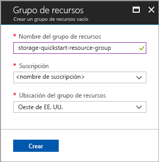
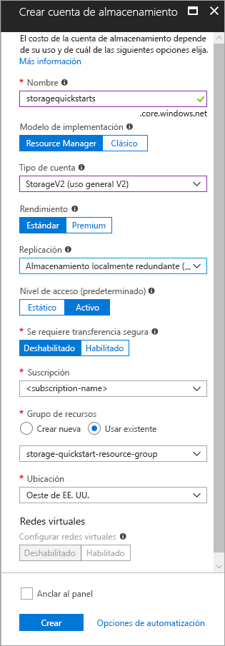

# <a name="create-a-storage-account"></a>Crear una cuenta de almacenamiento

Una cuenta de Azure Storage proporciona un espacio de nombres único en la nube para almacenar los objetos de datos en Azure Storage y acceder a ellos. Contiene los blobs, los archivos, las colas, las tablas y los discos que se crean en esa cuenta. 

Para comenzar a usar Azure Storage, primero tiene que crear una cuenta de almacenamiento. Puede crear una cuenta de Azure Storage mediante [Azure Portal](https://portal.azure.com/), [Azure PowerShell](https://docs.microsoft.com/powershell/azure/overview) o la [CLI de Azure](https://docs.microsoft.com/cli/azure?view=azure-cli-latest). Esta guía de inicio rápido muestra cómo usar cada una de estas opciones para crear la nueva cuenta de almacenamiento. 


## <a name="prerequisites"></a>requisitos previos

Si no tiene una suscripción a Azure, cree una [cuenta gratuita](https://azure.microsoft.com/free/) antes de empezar.

# <a name="portaltabportal"></a>[Portal](#tab/portal)

Ninguno.

# <a name="powershelltabpowershell"></a>[PowerShell](#tab/powershell)

Para realizar los pasos de esta guía, se requiere la versión 3.6 del módulo Azure PowerShell, o cualquier versión posterior. Ejecute `Get-Module -ListAvailable AzureRM` para buscar la versión actual. Si necesita instalarla o actualizarla, consulte el artículo sobre [cómo instalar el módulo de Azure PowerShell](/powershell/azure/install-azurerm-ps).

# <a name="azure-clitabazure-cli"></a>[CLI de Azure](#tab/azure-cli)

Puede iniciar sesión en Azure y ejecutar los comandos de la CLI de Azure utilizando uno de los procedimientos siguientes:

- Puede ejecutar los comandos de la CLI desde Azure Portal, en Azure Cloud Shell. 
- Puede instalar la CLI y ejecutar los comandos de la CLI localmente.  

### <a name="use-azure-cloud-shell"></a>Uso de Azure Cloud Shell

Azure Cloud Shell es un shell de Bash gratuito que puede ejecutarse directamente en Azure Portal. Tiene la CLI de Azure preinstalada y configurada para utilizarla con la cuenta. Haga clic en el botón **Cloud Shell** del menú situado en la parte superior derecha de Azure Portal:

[](https://portal.azure.com)

Este botón inicia un shell interactivo que se puede utilizar para ejecutar los pasos de esta guía de inicio rápido:

[](https://portal.azure.com)

### <a name="install-the-cli-locally"></a>Instalación local de la CLI

También puede instalar y usar la CLI de Azure localmente. Para realizar este tutorial de inicio rápido, es necesario ejecutar la versión 2.0.4 o superior de la CLI de Azure. Ejecute `az --version` para encontrar la versión. Si necesita instalarla o actualizarla, consulte [Instalación de la CLI de Azure 2.0](/cli/azure/install-azure-cli). 

---

## <a name="log-in-to-azure"></a>Inicio de sesión en Azure

# <a name="portaltabportal"></a>[Portal](#tab/portal)

Inicie sesión en [Azure Portal](https://portal.azure.com).

# <a name="powershelltabpowershell"></a>[PowerShell](#tab/powershell)

Inicie sesión en la suscripción de Azure con el comando `Connect-AzureRmAccount` y siga las instrucciones que aparecen en pantalla para autenticarse.

```powershell
Connect-AzureRmAccount
```

# <a name="azure-clitabazure-cli"></a>[CLI de Azure](#tab/azure-cli)

Para abrir Azure Cloud Shell, inicie sesión en [Azure Portal](https://portal.azure.com).

Para iniciar sesión en la instalación local de la CLI, ejecute el comando de inicio de sesión:

```cli
az login
```

---

## <a name="create-a-resource-group"></a>Crear un grupo de recursos

Un grupo de recursos de Azure es un contenedor lógico en el que se implementan y se administran los recursos de Azure. Para más información sobre los grupos de recursos, consulte [Información general de Azure Resource Manager](../../azure-resource-manager/resource-group-overview.md).

# <a name="portaltabportal"></a>[Portal](#tab/portal)

Para crear un grupo de recursos en Azure Portal, siga estos pasos:

1. En Azure Portal, expanda el menú situado en el lado izquierdo para abrir el menú de servicios y elija **Grupos de recursos**.
2. Haga clic en el botón **Agregar** para agregar un nuevo grupo de recursos.
3. Escriba un nombre para el nuevo grupo de recursos.
4. Seleccione la suscripción en la que desea crear el nuevo grupo de recursos.
5. Elija la ubicación del grupo de recursos.
6. Haga clic en el botón **Crear**.  



# <a name="powershelltabpowershell"></a>[PowerShell](#tab/powershell)

Para crear un grupo de recursos con PowerShell, use el comando [New-AzureRmResourceGroup](/powershell/module/azurerm.resources/new-azurermresourcegroup): 

```powershell
# put resource group in a variable so you can use the same group name going forward,
# without hardcoding it repeatedly
$resourceGroup = "storage-quickstart-resource-group"
New-AzureRmResourceGroup -Name $resourceGroup -Location $location 
```

Si no está seguro de qué región especificar para el parámetro `-Location`, puede recuperar una lista de regiones admitidas para la suscripción con el comando [Get-AzureRmLocation](/powershell/module/azurerm.resources/get-azurermlocation):

```powershell
Get-AzureRmLocation | select Location 
$location = "westus"
```

# <a name="azure-clitabazure-cli"></a>[CLI de Azure](#tab/azure-cli)

Para crear un grupo de recursos con la CLI de Azure, use el comando [az group create](/cli/azure/group#az_group_create). 

```azurecli-interactive
az group create \
    --name storage-quickstart-resource-group \
    --location westus
```

Si no está seguro de qué región especificar para el parámetro `--location`, puede recuperar una lista de regiones admitidas para la suscripción con el comando [az account list-locations](/cli/azure/account#az_account_list).

```azurecli-interactive
az account list-locations \
    --query "[].{Region:name}" \
    --out table
```

---

## <a name="create-a-general-purpose-storage-account"></a>Creación de una cuenta de almacenamiento de uso general

Una cuenta de almacenamiento de uso general proporciona acceso a todos los servicios de Azure Storage: Blob, File, Queue y Table. Puede crearse en el nivel Estándar o Premium. Los ejemplos de este artículo muestran cómo crear una cuenta de almacenamiento de uso general en el nivel Estándar (la opción predeterminada).

Azure Storage ofrece dos tipos de cuentas de almacenamiento general de uso general:

- Cuentas de uso general v2. 
- Cuentas de uso general v1. 

> [!NOTE]
> Para aprovechar las últimas características disponibles para las **cuentas uso general v2**, cuando desee crear nuevas cuentas de almacenamiento es aconsejable elegir estas.  

Para más información acerca de los tipos de cuentas de almacenamiento, consulte [Opciones de la cuenta de Azure Storage](storage-account-options.md).

Cuando especifique un nombre para la cuenta de almacenamiento, tenga en cuenta estas reglas:

- Los nombres de las cuentas de almacenamiento deben tener entre 3 y 24 caracteres y solo pueden incluir números y letras en minúscula.
- El nombre de la cuenta de almacenamiento debe ser único dentro de Azure. No puede haber dos cuentas de almacenamiento con el mismo nombre.

# <a name="portaltabportal"></a>[Portal](#tab/portal)

Para crear una cuenta de almacenamiento de uso general v2 en Azure Portal, siga estos pasos:

1. En Azure Portal, expanda el menú de la izquierda para abrir el menú de servicios y elija **Todos los servicios**. Desplácese hacia abajo hasta **Almacenamiento** y elija **Cuentas de almacenamiento**. En la ventana **Cuentas de almacenamiento** que aparece, elija **Agregar**.
2. Escriba un nombre para la cuenta de almacenamiento.
3. En el campo **Tipo de cuenta**, elija **StorageV2 (uso general v2)**.
4. En el campo **Replicación**, deje el valor **Almacenamiento con redundancia local (LRS)**. Como alternativa, puede elegir **Almacenamiento con redundancia de zona (ZRS)**, **Almacenamiento con redundancia geográfica (GRS)** o **Almacenamiento con redundancia geográfica con acceso de lectura (RA-GRS)**.
5. Deje estos campos con sus valores predeterminados: **Modelo de implementación**, **Rendimiento** y **Se requiere transferencia segura**.
6. Elija la suscripción en la que desea crear la nueva cuenta de almacenamiento.
7. En la sección **Grupo de recursos**, seleccione **Use existing** (Usar existente) y, a continuación, elija el grupo de recursos que creó en la sección anterior.
8. Elija la ubicación para la nueva cuenta de almacenamiento.
9. Haga clic en **Crear** para crear la cuenta de almacenamiento.      



# <a name="powershelltabpowershell"></a>[PowerShell](#tab/powershell)

Para crear una cuenta de almacenamiento de uso general v2 en PowerShell con LRS (almacenamiento con redundancia local), use el comando [New-AzureRmStorageAccount](/powershell/module/azurerm.storage/New-AzureRmStorageAccount): 

```powershell
New-AzureRmStorageAccount -ResourceGroupName $resourceGroup `
  -Name "storagequickstart" `
  -Location $location `
  -SkuName Standard_LRS `
  -Kind StorageV2 
```

Para crear una cuenta de almacenamiento de uso general v2 con almacenamiento con redundancia de zona (ZRS) (versión preliminar), almacenamiento con redundancia geográfica (GRS) o almacenamiento con redundancia geográfica con acceso de lectura (RA-GRS), sustituya el valor deseado de la tabla siguiente por el parámetro **SkuName**. 

|Opción Replicación  |Parámetro SkuName  |
|---------|---------|
|Almacenamiento con redundancia local (LRS)     |Standard_LRS         |
|Almacenamiento con redundancia de zona (ZRS)     |Standard_ZRS         |
|Almacenamiento con redundancia geográfica (GRS)     |Standard_GRS         |
|Almacenamiento con redundancia geográfica con acceso de lectura (GRS)     |Standard_RAGRS         |

# <a name="azure-clitabazure-cli"></a>[CLI de Azure](#tab/azure-cli)

Para crear una cuenta de almacenamiento de uso general v2 desde la CLI de Azure con redundancia local, use el comando [az storage account create](/cli/azure/storage/account#az_storage_account_create).

```azurecli-interactive
az storage account create \
    --name storagequickstart \
    --resource-group storage-quickstart-resource-group \
    --location westus \
    --sku Standard_LRS \
    --kind StorageV2
```

Para crear una cuenta de almacenamiento de uso general v2 con almacenamiento con redundancia de zona (versión preliminar de ZRS), almacenamiento con redundancia geográfica (GRS) o almacenamiento con redundancia geográfica con acceso de lectura (RA-GRS), sustituya el valor deseado de la tabla siguiente por el parámetro **sku**. 

|Opción Replicación  |Parámetro sku  |
|---------|---------|
|Almacenamiento con redundancia local (LRS)     |Standard_LRS         |
|Almacenamiento con redundancia de zona (ZRS)     |Standard_ZRS         |
|Almacenamiento con redundancia geográfica (GRS)     |Standard_GRS         |
|Almacenamiento con redundancia geográfica con acceso de lectura (GRS)     |Standard_RAGRS         |

---

Para más información acerca de las opciones de replicación, consulte [Opciones de replicación de Azure Storage](storage-redundancy.md).

## <a name="clean-up-resources"></a>Limpieza de recursos

Si desea limpiar los recursos creados por esta guía de inicio rápido, basta con eliminar el grupo de recursos. Al eliminar el grupo de recursos, también se elimina la cuenta de almacenamiento asociada y cualquier otro recurso que esté asociado a dicho grupo.

# <a name="portaltabportal"></a>[Portal](#tab/portal)

Para quitar un grupo de recursos desde Azure Portal:

1. En Azure Portal, expanda el menú de la izquierda para abrir el menú de servicios y elija **Grupos de recursos** para ver una lista con sus grupos de recursos.
2. Busque el grupo de recursos que desea eliminar y haga clic con el botón derecho en el botón **Más** (**...** ) situado en la parte derecha de la lista.
3. Seleccione **Eliminar grupo de recursos** y confirme.

# <a name="powershelltabpowershell"></a>[PowerShell](#tab/powershell)

Para quitar el grupo de recursos y sus recursos asociados, incluida la nueva cuenta de almacenamiento, use el comando [Remove-AzureRmResourceGroup](/powershell/module/azurerm.resources/remove-azurermresourcegroup): 

```powershell
Remove-AzureRmResourceGroup -Name $resourceGroup
```

# <a name="azure-clitabazure-cli"></a>[CLI de Azure](#tab/azure-cli)

Para quitar el grupo de recursos y sus recursos asociados, incluida la nueva cuenta de almacenamiento, use el comando [az group delete](/cli/azure/group#az_group_delete).

```azurecli-interactive
az group delete --name myResourceGroup
```

---

## <a name="next-steps"></a>Pasos siguientes

En esta guía de inicio rápido creó una cuenta de almacenamiento estándar de propósito general. Para aprender a cargar y descargar blobs en la cuenta de almacenamiento, siga con la guía de inicio rápido de Blob Storage.

# <a name="portaltabportal"></a>[Portal](#tab/portal)

> [!div class="nextstepaction"]
> [Transferencia de objetos a y desde Azure Blob Storage mediante Azure Portal](../blobs/storage-quickstart-blobs-portal.md)

# <a name="powershelltabpowershell"></a>[PowerShell](#tab/powershell)

> [!div class="nextstepaction"]
> [Transferencia de objetos a y desde Azure Blob Storage mediante PowerShell](../blobs/storage-quickstart-blobs-powershell.md)

# <a name="azure-clitabazure-cli"></a>[CLI de Azure](#tab/azure-cli)

> [!div class="nextstepaction"]
> [Transferencia de objetos a Azure Blob Storage y desde Azure Blob Storage mediante la CLI de Azure](../blobs/storage-quickstart-blobs-cli.md)

---
