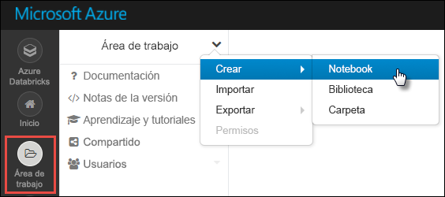
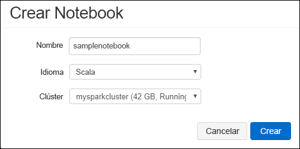

# <a name="tutorial-extract-transform-and-load-data-using-azure-databricks"></a>Tutorial: Extracción, transformación y carga de datos mediante Azure Databricks

En este tutorial, va a realizar una operación de extracción, transformación y carga de datos (ETL) para mover datos desde Azure Data Lake Storage Gen2 (versión preliminar) a Azure SQL Data Warehouse, mediante Azure Databricks.

La siguiente ilustración muestra el flujo de la aplicación:


En este tutorial se describen las tareas siguientes:

> [!div class="checklist"]
> * Creación de un área de trabajo de Azure Databricks
> * Creación de un clúster de Spark en Azure Databricks
> * Creación de una cuenta compatible con Data Lake Storage Gen2
> * Carga de datos en Azure Data Lake Storage Gen2
> * Creación de un cuaderno en Azure Databricks
> * Extracción de datos desde Data Lake Storage Gen2
> * Transformación de datos en Azure Databricks
> * Carga de datos en Azure SQL Data Warehouse

Si no tiene una suscripción a Azure, cree una [cuenta gratuita](https://azure.microsoft.com/free/) antes de empezar.

## <a name="prerequisites"></a>requisitos previos

Para completar este tutorial:

* Ha creado una instancia de Azure SQL Data Warehouse y una regla de firewall de nivel de servidor y se ha conectado al servidor como administrador. Siga las instrucciones que se indican en [Guía de inicio rápido: Creación de una instancia de Azure SQL Data Warehouse](../../sql-data-warehouse/create-data-warehouse-portal.md).
* Ha creado una clave maestra de base de datos para la instancia de Azure SQL Data Warehouse. Siga las instrucciones que se indican en [Crear la clave maestra de una base de datos](https://docs.microsoft.com/sql/relational-databases/security/encryption/create-a-database-master-key).
* [Creación de una cuenta de Azure Data Lake Storage Gen2](quickstart-create-account.md)

## <a name="sign-in-to-the-azure-portal"></a>Inicio de sesión en Azure Portal

Inicie sesión en el [Azure Portal](https://portal.azure.com/).

## <a name="create-an-azure-databricks-workspace"></a>Creación de un área de trabajo de Azure Databricks

En esta sección, creará un área de trabajo de Azure Databricks mediante Azure Portal. 

1. En Azure Portal, seleccione **Crear un recurso** > **Análisis** > **Azure Databricks**.

    

2. En **Azure Databricks Service**, proporcione los valores para crear un área de trabajo de Databricks.

    

    Proporcione los valores siguientes:

    |Propiedad  |DESCRIPCIÓN  |
    |---------|---------|
    |**Workspace name** (Nombre del área de trabajo)     | Proporcione un nombre para el área de trabajo de Databricks.        |
    |**Suscripción**     | En el cuadro desplegable, seleccione la suscripción de Azure.        |
    |**Grupos de recursos**     | Especifique si desea crear un nuevo grupo de recursos o utilizar uno existente. Un grupo de recursos es un contenedor que almacena los recursos relacionados con una solución de Azure. Para más información, consulte [Información general del grupo de recursos de Azure](../../azure-resource-manager/resource-group-overview.md). |
    |**Ubicación**     | Seleccione **Oeste de EE. UU. 2**. Para otras regiones disponibles, consulte [Productos disponibles por región](https://azure.microsoft.com/regions/services/).        |
    |**Plan de tarifa**     |  Elija entre **Standard** o **Premium**. Para más información sobre estos planes, consulte la [página de precios de Databricks](https://azure.microsoft.com/pricing/details/databricks/).       |

    Seleccione **Anclar al panel** y, después, seleccione **Crear**.

3. La cuenta tarda unos minutos en crearse. Durante la creación de la cuenta, el portal muestra el icono **Enviando implementación para Azure Databricks** a la derecha. Puede que deba desplazarse a la derecha del panel para ver el icono. También hay una barra de progreso que se muestra en la parte superior de la pantalla. Puede ver cualquier área para el progreso.

    

## <a name="create-a-spark-cluster-in-databricks"></a>Creación de un clúster de Spark en Databricks

1. En Azure Portal, vaya al área de trabajo de Databricks que ha creado y, después, seleccione **Launch Workspace** (Iniciar área de trabajo).

2. Se le redirigirá al portal de Azure Databricks. En el portal, seleccione **Cluster**.

    

3. En la página **Nuevo clúster**, proporcione los valores para crear un clúster.

    

    Rellene los valores para los campos siguientes y acepte los valores predeterminados para el resto de campos:

    * Escriba un nombre para el clúster.
    * Para este artículo, cree un clúster con el entorno en tiempo de ejecución **4.2**.
    * Asegúrese de que selecciona la casilla **Terminate after ____ minutes of inactivity** (Terminar después de ____ minutos de inactividad). Proporcione una duración (en minutos) para terminar el clúster, si este no se usa.

    Seleccione **Create cluster** (Crear clúster). Una vez que el clúster se está ejecutando, puede asociarle notebooks y ejecutar trabajos de Spark.

## <a name="create-storage-account-file-system"></a>Creación de un sistema de archivos de la cuenta de almacenamiento

En esta sección, creará un cuaderno en el área de trabajo de Azure Databricks y, a continuación, ejecutará fragmentos de código para configurar la cuenta de almacenamiento.

1. En [Azure Portal](https://portal.azure.com), vaya al área de trabajo de Azure Databricks que creó y seleccione **Launch Workspace** (Iniciar área de trabajo).

2. En el panel izquierdo, seleccione **Workspace** (Área de trabajo). En la lista desplegable **Workspace** (Área de trabajo), seleccione **Create** > **Notebook** (Crear > Cuaderno).

    

3. En el cuadro de diálogo **Create Notebook** (Crear cuaderno), escriba un nombre para el cuaderno. Seleccione **Scala** como lenguaje y, a continuación, seleccione el clúster de Spark que creó anteriormente.

    

    Seleccione **Crear**.

4. Escriba el código siguiente en la primera celda y ejecute el código:

    ```python
    spark.conf.set("fs.azure.account.key.<ACCOUNT_NAME>.dfs.core.windows.net", "<ACCOUNT_KEY>") 
    spark.conf.set("fs.azure.createRemoteFileSystemDuringInitialization", "true")
    dbutils.fs.ls("abfs://<FILE_SYSTEM_NAME>@<ACCOUNT_NAME>.dfs.core.windows.net/")
    spark.conf.set("fs.azure.createRemoteFileSystemDuringInitialization", "false") 
    ```

    Presione **MAYÚS + ENTRAR** para ejecutar la celda de código.

    Ahora el sistema de archivos se crea para la cuenta de almacenamiento.

## <a name="upload-data-to-the-storage-account"></a>Carga de archivos en la cuenta de almacenamiento

El siguiente paso es cargar un archivo de datos de ejemplo en la cuenta de almacenamiento para luego transformarlo en Azure Databricks. 

1. Si aún no tiene una cuenta creada para Data Lake Storage Gen2, siga la guía de inicio rápido para crear una cuenta de Data Lake Storage Gen2.
2. Los datos de ejemplo (**small_radio_json.json**) están disponibles en el repositorio [U-SQL Examples and Issue Tracking](https://github.com/Azure/usql/blob/master/Examples/Samples/Data/json/radiowebsite/small_radio_json.json) (Ejemplos y seguimiento de problemas de U-SQL). Descargue el archivo JSON y tome nota de la ruta de acceso en donde va a guardar el archivo.
3. Cargue los datos en la cuenta de almacenamiento. El método que utiliza para cargar datos en la cuenta de almacenamiento difiere dependiendo de si tiene habilitado el servicio de espacio de nombres jerárquico.

    Si el servicio de espacio de nombres jerárquico está habilitado en la cuenta de ADLS Gen2, puede usar Azure Data Factory, distp o AzCopy (versión 10) para controlar la carga. AzCopy versión 10 solo está disponible para los clientes de la versión preliminar. Para utilizar AzCopy desde Cloud Shell:

    ```bash
    set ACCOUNT_NAME=<ACCOUNT_NAME>
    set ACCOUNT_KEY=<ACCOUNT_KEY>
    azcopy cp "<DOWNLOAD_PATH>\small_radio_json.json" https://<ACCOUNT_NAME>.dfs.core.windows.net/data --recursive 
    ```
    
## <a name="extract-data-from-azure-storage"></a>Extracción de datos de Azure Storage

Vuelva al cuaderno de DataBricks y escriba el código siguiente en una nueva celda:

1. Agregue el siguiente fragmento de código a una celda de código vacía y reemplace los valores de marcador de posición por los valores que guardó anteriormente en la cuenta de almacenamiento.

    ```python
    dbutils.widgets.text("storage_account_name", "STORAGE_ACCOUNT_NAME", "<YOUR_STORAGE_ACCOUNT_NAME>")
    dbutils.widgets.text("storage_account_access_key", "YOUR_ACCESS_KEY", "<YOUR_STORAGE_ACCOUNT_SHARED_KEY>")
    ```

    Presione **MAYÚS + ENTRAR** para ejecutar la celda de código.

2. Ahora puede cargar el archivo JSON de ejemplo como trama de datos en Azure Databricks. Agregue el código siguiente a una nueva celda y, luego, presione **MAYÚS + ENTRAR** (asegúrese de reemplazar los valores del marcador de posición):

    ```python
    val df = spark.read.json("abfs://<FILE_SYSTEM_NAME>@<ACCOUNT_NAME>.dfs.core.windows.net/data/small_radio_json.json")
    ```

3. Ejecute el código siguiente para ver el contenido de la trama de datos.

    ```python
    df.show()
    ```

    Debe ver una salida similar al siguiente fragmento de código:

    ```bash
    +---------------------+---------+---------+------+-------------+----------+---------+-------+--------------------+------+--------+-------------+---------+--------------------+------+-------------+------+
    |               artist|     auth|firstName|gender|itemInSession|  lastName|   length|  level|            location|method|    page| registration|sessionId|                song|status|           ts|userId|
    +---------------------+---------+---------+------+-------------+----------+---------+-------+--------------------+------+--------+-------------+---------+--------------------+------+-------------+------+
    | El Arrebato         |Logged In| Annalyse|     F|            2|Montgomery|234.57914| free  |  Killeen-Temple, TX|   PUT|NextSong|1384448062332|     1879|Quiero Quererte Q...|   200|1409318650332|   309|
    | Creedence Clearwa...|Logged In|   Dylann|     M|            9|    Thomas|340.87138| paid  |       Anchorage, AK|   PUT|NextSong|1400723739332|       10|        Born To Move|   200|1409318653332|    11|
    | Gorillaz            |Logged In|     Liam|     M|           11|     Watts|246.17751| paid  |New York-Newark-J...|   PUT|NextSong|1406279422332|     2047|                DARE|   200|1409318685332|   201|
    ...
    ...
    ```

Ahora ha extraído los datos de Azure Data Lake Storage Gen2 en Azure Databricks.

## <a name="transform-data-in-azure-databricks"></a>Transformación de datos en Azure Databricks

Los datos de ejemplo sin procesar **small_radio_json.json** capturan la audiencia de una emisora de radio y presentan una variedad de columnas. En esta sección, transformará los datos para recuperar solo columnas específicas del conjunto de datos.

1. Para comenzar, recupere solo las columnas *firstName*, *lastName*, *gender*, *location* y *level* de la trama de datos que ha creado.

    ```python
    val specificColumnsDf = df.select("firstname", "lastname", "gender", "location", "level")
    ```

    Obtendrá una salida como la que se muestra en el fragmento de código siguiente:

    ```bash
    +---------+----------+------+--------------------+-----+
    |firstname|  lastname|gender|            location|level|
    +---------+----------+------+--------------------+-----+
    | Annalyse|Montgomery|     F|  Killeen-Temple, TX| free|
    |   Dylann|    Thomas|     M|       Anchorage, AK| paid|
    |     Liam|     Watts|     M|New York-Newark-J...| paid|
    |     Tess|  Townsend|     F|Nashville-Davidso...| free|
    |  Margaux|     Smith|     F|Atlanta-Sandy Spr...| free|
    |     Alan|     Morse|     M|Chicago-Napervill...| paid|
    |Gabriella|   Shelton|     F|San Jose-Sunnyval...| free|
    |   Elijah|  Williams|     M|Detroit-Warren-De...| paid|
    |  Margaux|     Smith|     F|Atlanta-Sandy Spr...| free|
    |     Tess|  Townsend|     F|Nashville-Davidso...| free|
    |     Alan|     Morse|     M|Chicago-Napervill...| paid|
    |     Liam|     Watts|     M|New York-Newark-J...| paid|
    |     Liam|     Watts|     M|New York-Newark-J...| paid|
    |   Dylann|    Thomas|     M|       Anchorage, AK| paid|
    |     Alan|     Morse|     M|Chicago-Napervill...| paid|
    |   Elijah|  Williams|     M|Detroit-Warren-De...| paid|
    |  Margaux|     Smith|     F|Atlanta-Sandy Spr...| free|
    |     Alan|     Morse|     M|Chicago-Napervill...| paid|
    |   Dylann|    Thomas|     M|       Anchorage, AK| paid|
    |  Margaux|     Smith|     F|Atlanta-Sandy Spr...| free|
    +---------+----------+------+--------------------+-----+
    ```

2.  Puede transformar aún más estos datos para renombrar la columna **level** como **subscription_type**.

    ```python
    val renamedColumnsDF = specificColumnsDf.withColumnRenamed("level", "subscription_type")
    renamedColumnsDF.show()
    ```

    Obtendrá una salida como la que se muestra en el fragmento de código siguiente:

    ```bash
    +---------+----------+------+--------------------+-----------------+
    |firstname|  lastname|gender|            location|subscription_type|
    +---------+----------+------+--------------------+-----------------+
    | Annalyse|Montgomery|     F|  Killeen-Temple, TX|             free|
    |   Dylann|    Thomas|     M|       Anchorage, AK|             paid|
    |     Liam|     Watts|     M|New York-Newark-J...|             paid|
    |     Tess|  Townsend|     F|Nashville-Davidso...|             free|
    |  Margaux|     Smith|     F|Atlanta-Sandy Spr...|             free|
    |     Alan|     Morse|     M|Chicago-Napervill...|             paid|
    |Gabriella|   Shelton|     F|San Jose-Sunnyval...|             free|
    |   Elijah|  Williams|     M|Detroit-Warren-De...|             paid|
    |  Margaux|     Smith|     F|Atlanta-Sandy Spr...|             free|
    |     Tess|  Townsend|     F|Nashville-Davidso...|             free|
    |     Alan|     Morse|     M|Chicago-Napervill...|             paid|
    |     Liam|     Watts|     M|New York-Newark-J...|             paid|
    |     Liam|     Watts|     M|New York-Newark-J...|             paid|
    |   Dylann|    Thomas|     M|       Anchorage, AK|             paid|
    |     Alan|     Morse|     M|Chicago-Napervill...|             paid|
    |   Elijah|  Williams|     M|Detroit-Warren-De...|             paid|
    |  Margaux|     Smith|     F|Atlanta-Sandy Spr...|             free|
    |     Alan|     Morse|     M|Chicago-Napervill...|             paid|
    |   Dylann|    Thomas|     M|       Anchorage, AK|             paid|
    |  Margaux|     Smith|     F|Atlanta-Sandy Spr...|             free|
    +---------+----------+------+--------------------+-----------------+
    ```

## <a name="load-data-into-azure-sql-data-warehouse"></a>Carga de datos en Azure SQL Data Warehouse

En esta sección, cargará los datos transformados en Azure SQL Data Warehouse. Mediante el conector de Azure SQL Data Warehouse para Azure Databricks, puede cargar directamente una trama de datos como una tabla en SQL Data Warehouse.

Como se mencionó anteriormente, el conector de SQL Data Warehouse usa Azure Blob Storage como almacenamiento temporal para cargar datos entre Azure Databricks y Azure SQL Data Warehouse. Por lo tanto, para comenzar, proporcione la configuración para conectarse a la cuenta de almacenamiento. Ya debe haber creado la cuenta como parte de los requisitos previos de este artículo.

1. Proporcione la configuración para acceder a la cuenta de Azure Storage desde Azure Databricks.

    ```python
    val storageURI = "<STORAGE_ACCOUNT_NAME>.dfs.core.windows.net"
    val fileSystemName = "<FILE_SYSTEM_NJAME>"
    val accessKey =  "<ACCESS_KEY>"
    ```

2. Especifique una carpeta temporal que se usará al mover datos entre Azure Databricks y Azure SQL Data Warehouse.

    ```python
    val tempDir = "abfs://" + fileSystemName + "@" + storageURI +"/tempDirs"
    ```

3. Ejecute el siguiente fragmento de código para almacenar las claves de acceso de Azure Blob Storage en la configuración. De esta forma, se garantiza que no tiene que guardar la clave de acceso en el cuaderno en texto sin formato.

    ```python
    val acntInfo = "fs.azure.account.key."+ storageURI
    sc.hadoopConfiguration.set(acntInfo, accessKey)
    ```

4. Proporcione los valores para conectarse a la instancia de Azure SQL Data Warehouse. Debe haber creado una instancia de SQL Data Warehouse como parte de los requisitos previos.

    ```python
    //SQL Data Warehouse related settings
    val dwDatabase = "<DATABASE NAME>"
    val dwServer = "<DATABASE SERVER NAME>" 
    val dwUser = "<USER NAME>"
    val dwPass = "<PASSWORD>"
    val dwJdbcPort =  "1433"
    val dwJdbcExtraOptions = "encrypt=true;trustServerCertificate=true;hostNameInCertificate=*.database.windows.net;loginTimeout=30;"
    val sqlDwUrl = "jdbc:sqlserver://" + dwServer + ".database.windows.net:" + dwJdbcPort + ";database=" + dwDatabase + ";user=" + dwUser+";password=" + dwPass + ";$dwJdbcExtraOptions"
    val sqlDwUrlSmall = "jdbc:sqlserver://" + dwServer + ".database.windows.net:" + dwJdbcPort + ";database=" + dwDatabase + ";user=" + dwUser+";password=" + dwPass
    ```

5. Ejecute el siguiente fragmento de código para cargar la trama de datos transformado, **renamedColumnsDF**, como una tabla en SQL Data Warehouse. Este fragmento de código crea una tabla denominada **SampleTable** en SQL Database.

    ```python
    spark.conf.set(
        "spark.sql.parquet.writeLegacyFormat",
        "true")
    
    renamedColumnsDF.write
        .format("com.databricks.spark.sqldw")
        .option("url", sqlDwUrlSmall) 
        .option("dbtable", "SampleTable")
        .option( "forward_spark_azure_storage_credentials","True")
        .option("tempdir", tempDir)
        .mode("overwrite")
        .save()
    ```

6. Conéctese a la instancia de SQL Database y compruebe que aparece una tabla **SampleTable**.

    

7. Ejecute una consulta select para comprobar el contenido de la tabla. Debe tener los mismos datos que la trama de datos **renamedColumnsDF**.

    

## <a name="clean-up-resources"></a>Limpieza de recursos

Cuando haya terminado de ejecutar el tutorial, puede finalizar el clúster. Para ello, desde el área de trabajo de Azure Databricks, en el panel izquierdo, seleccione **Clusters** (Clústeres). En el clúster que desea finalizar, mueva el cursor sobre el botón de puntos suspensivos en la columna **Actions** (Acciones) y seleccione el icono **Terminate** (Finalizar).


Si no finaliza manualmente el clúster, este se detendrá automáticamente si seleccionó la casilla **Terminate after __ minutes of inactivity** (Finalizar después de __ minutos de inactividad) al crear el clúster. En tal caso, el clúster se detiene automáticamente si ha estado inactivo durante el tiempo especificado.

## <a name="next-steps"></a>Pasos siguientes

En este tutorial aprendió lo siguiente:

> [!div class="checklist"]
> * Creación de un área de trabajo de Azure Databricks
> * Creación de un clúster de Spark en Azure Databricks
> * Creación de una cuenta compatible con Data Lake Storage Gen2
> * Carga de datos en Azure Data Lake Storage Gen2
> * Creación de un cuaderno en Azure Databricks
> * Extracción de datos desde Data Lake Storage Gen2
> * Transformación de datos en Azure Databricks
> * Carga de datos en Azure SQL Data Warehouse

Vaya al siguiente tutorial para aprender sobre el streaming de datos en tiempo real en Azure Databricks mediante Azure Event Hubs.

> [!div class="nextstepaction"]
>[Transmisión de datos a Azure Databricks con Event Hubs](../../azure-databricks/databricks-stream-from-eventhubs.md)
