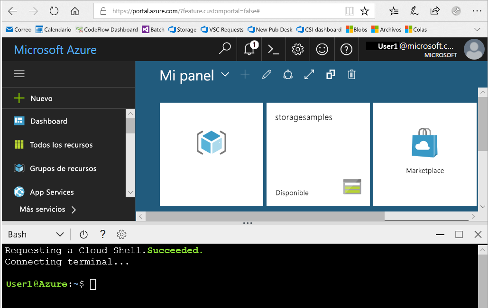
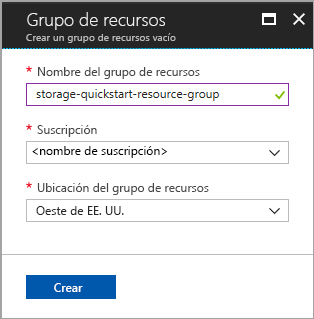
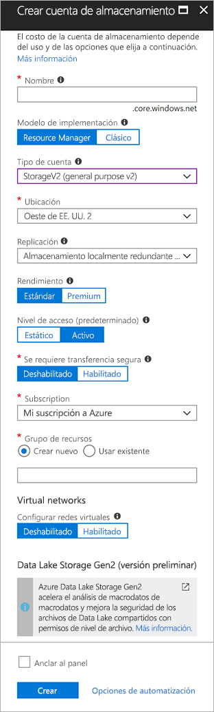

# <a name="quickstart-create-an-azure-data-lake-storage-gen2-preview-storage-account"></a>Guía de inicio rápido: Creación de una cuenta de almacenamiento de Azure Data Lake Storage Gen2 (versión preliminar)

Las cuentas de Azure Data Lake Storage Gen2 (versión preliminar) [admiten un servicio de espacio de nombres jerárquico](introduction.md) que proporciona un sistema de archivos nativo basado en directorios que se ha diseñado para trabajar con el sistema de archivos distribuido de Hadoop (HDFS). El acceso a los datos de Data Lake Storage Gen2 desde HDFS está disponible en el [controlador ABFS](abfs-driver.md).

Si desea habilitar las funcionalidades de Data Lake Storage Gen2 en la cuenta de almacenamiento, [rellene la encuesta de la versión preliminar para solicitar acceso](https://aka.ms/adlsgen2signup). Una vez aprobada la solicitud, podrá crear una nueva cuenta de Data Lake Storage Gen2. En esta guía de inicio rápido, se muestra cómo crear una cuenta en [Azure Portal](https://portal.azure.com/), [Azure PowerShell](https://docs.microsoft.com/powershell/azure/overview) o la [CLI de Azure](https://docs.microsoft.com/cli/azure?view=azure-cli-latest).

> [!NOTE]
> La interfaz de usuario de Azure Portal para crear la cuenta se actualiza una vez que se aprueba la creación de cuentas en Data Lake Storage Gen2. De la misma manera, los argumentos de PowerShell y la CLI relacionados con Data Lake Storage Gen2 solo funcionan una vez que se ha aprobado la solicitud para la versión preliminar.

## <a name="prerequisites"></a>Requisitos previos

Si no tiene una suscripción a Azure, cree una [cuenta gratuita](https://azure.microsoft.com/free/) antes de empezar.

|           | Requisito previo |
|-----------|--------------|
|Portal     | Ninguno         |
|PowerShell | Para poder realizar los pasos de esta guía de inicio rápido, se necesita la versión **5.0.4-preview** del módulo de Azure PowerShell o una versión posterior. Ejecute `Get-Module -ListAvailable AzureRM` para buscar la versión actual. Si necesita instalarla o actualizarla, consulte el artículo sobre [cómo instalar el módulo de Azure PowerShell](/powershell/azure/install-azurerm-ps). |
|CLI        | Puede iniciar sesión en Azure y ejecutar los comandos de la CLI de Azure utilizando uno de los procedimientos siguientes: <ul><li>Puede ejecutar los comandos de la CLI desde Azure Portal, en Azure Cloud Shell. </li><li>Puede instalar la CLI y ejecutar los comandos localmente.</li></ul>|

Si utiliza la línea de comandos, puede ejecutar Azure Cloud Shell o instalar la CLI localmente.

### <a name="use-azure-cloud-shell"></a>Uso de Azure Cloud Shell

Azure Cloud Shell es un shell de Bash gratuito que puede ejecutarse directamente en Azure Portal. Tiene la CLI de Azure preinstalada y configurada para utilizarla con la cuenta. Haga clic en el botón **Cloud Shell** del menú situado en la parte superior derecha de Azure Portal:

[](https://portal.azure.com)

Este botón inicia un shell interactivo que se puede utilizar para ejecutar los pasos de esta guía de inicio rápido:

[](https://portal.azure.com)

### <a name="install-the-cli-locally"></a>Instalación local de la CLI

También puede instalar y usar la CLI de Azure localmente. En esta guía de inicio rápido, es preciso que use la versión 2.0.38 de la CLI de Azure u otra posterior. Ejecute `az --version` para encontrar la versión. Si necesita instalarla o actualizarla, consulte [Instalación de la CLI de Azure 2.0](/cli/azure/install-azure-cli).

## <a name="overview-of-creating-an-azure-data-lake-storage-gen2-account"></a>Introducción a la creación de una cuenta de Azure Data Lake Gen2

Para poder crear una cuenta, primero debe crear un grupo de recursos que actúe como un contenedor lógico para las cuentas de almacenamiento o cualquier otro recurso de Azure que cree. Si desea limpiar los recursos creados por esta guía de inicio rápido, basta con eliminar el grupo de recursos. Al eliminar el grupo de recursos, también se elimina la cuenta de almacenamiento asociada y cualquier otro recurso que esté asociado a dicho grupo. Para más información sobre los grupos de recursos, consulte [Información general de Azure Resource Manager](../../azure-resource-manager/resource-group-overview.md).

> [!NOTE]
> Debe crear nuevas cuentas de almacenamiento de tipo **StorageV2 (V2 de propósito general)** para aprovechar las características de Data Lake Storage Gen2.  

Para más información acerca de los tipos de cuentas de almacenamiento, consulte [Opciones de la cuenta de Azure Storage](../common/storage-account-options.md).

Cuando especifique un nombre para la cuenta de almacenamiento, tenga en cuenta estas reglas:

- Los nombres de las cuentas de almacenamiento deben tener entre 3 y 24 caracteres y solo pueden incluir números y letras en minúscula.
- El nombre de la cuenta de almacenamiento debe ser único dentro de Azure. No puede haber dos cuentas de almacenamiento con el mismo nombre.

## <a name="create-an-account-using-the-azure-portal"></a>Creación de una cuenta en Azure Portal

Inicie sesión en [Azure Portal](https://portal.azure.com).

### <a name="create-a-resource-group"></a>Creación de un grupo de recursos

Para crear un grupo de recursos en Azure Portal, siga estos pasos:

1. En Azure Portal, expanda el menú situado en el lado izquierdo para abrir el menú de servicios y elija **Grupos de recursos**.
2. Haga clic en el botón **Agregar** para agregar un nuevo grupo de recursos.
3. Escriba un nombre para el nuevo grupo de recursos.
4. Seleccione la suscripción en la que desea crear el nuevo grupo de recursos.
5. Elija la ubicación del grupo de recursos.
6. Haga clic en el botón **Crear**.  



### <a name="create-a-general-purpose-v2-storage-account"></a>Creación de una cuenta de almacenamiento de uso general v2

Para crear una cuenta de almacenamiento de uso general v2 en Azure Portal, siga estos pasos:

> [!NOTE]
> El espacio de nombres jerárquico solo está habilitado en las regiones Oeste de EE. UU. 2 y Centro-oeste de EE. UU. No olvide especificar una de estas ubicaciones cuando cree la cuenta de almacenamiento.

1. En Azure Portal, expanda el menú de la izquierda para abrir el menú de servicios y elija **Todos los servicios**. Desplácese hacia abajo hasta **Almacenamiento** y elija **Cuentas de almacenamiento**. En la ventana **Cuentas de almacenamiento** que aparece, elija **Agregar**.
2. Escriba un nombre para la cuenta de almacenamiento.
3. Deje **Modelo de implementación** establecido en el valor predeterminado.
4. En el campo **Tipo de cuenta**, elija **StorageV2 (uso general v2)**.
5. Establezca **Ubicación** a **Oeste de EE. UU. 2**
6. En el campo **Replicación**, deje el valor **Almacenamiento con redundancia local (LRS)**.
7. Deje estos campos establecidos en sus valores predeterminados: **Replicación**. **Rendimiento** y **Nivel de acceso**.
8. Elija la suscripción en la que desea crear la nueva cuenta de almacenamiento.
9. En la sección **Grupo de recursos**, seleccione **Usar existente** y elija el grupo de recursos que creó en la sección anterior.
10. Mantenga el valor predeterminado de **Redes virtuales**.
11. En la sección **Data Lake Storage Gen2 (versión preliminar)**, establezca **Hierarchical namespace** (Espacio de nombres jerárquico) en **Habilitado**.
12. Haga clic en **Crear** para crear la cuenta de almacenamiento.



De este modo, ya ha creado la cuenta de almacenamiento en el portal.

### <a name="clean-up-resources"></a>Limpieza de recursos

Para quitar un grupo de recursos desde Azure Portal:

1. En Azure Portal, expanda el menú de la izquierda para abrir el menú de servicios y elija **Grupos de recursos** para ver una lista con sus grupos de recursos.
2. Busque el grupo de recursos que desea eliminar y haga clic con el botón derecho en el botón **Más** (**...** ) situado en la parte derecha de la lista.
3. Seleccione **Eliminar grupo de recursos** y confirme.


## <a name="upgrade-your-powershell-module"></a>Actualización del módulo de Powershell

Para poder interactuar con Data Lake Storage Gen2 mediante PowerShell, tendrá que actualizar el módulo a la versión preliminar.

Para ello, abra una instancia de PowerShell con permisos elevados y escriba el siguiente comando: `Install-Module AzureRM.Storage –Repository PSGallery -RequiredVersion 5.0.4-preview –AllowPrerelease –AllowClobber –Force `

Después, reinicie el shell.

## <a name="create-an-account-using-powershell"></a>Creación de una cuenta con PowerShell

Inicie sesión en la suscripción de Azure con el comando `Login-AzureRmAccount` y siga las instrucciones que aparecen en pantalla para autenticarse.

```powershell
Login-AzureRmAccount
```

### <a name="create-a-resource-group"></a>Creación de un grupo de recursos

Para crear un grupo de recursos con PowerShell, use el comando [New-AzureRmResourceGroup](/powershell/module/azurerm.resources/new-azurermresourcegroup): 

> [!NOTE]
> El espacio de nombres jerárquico solo está habilitado en las regiones Oeste de EE. UU. 2 y Centro-oeste de EE. UU. No olvide especificar una de estas ubicaciones cuando cree la cuenta de almacenamiento.

```powershell
# put resource group in a variable so you can use the same group name going forward,
# without hardcoding it repeatedly
$resourceGroup = "storage-quickstart-resource-group"
$location = "westus2"
New-AzureRmResourceGroup -Name $resourceGroup -Location $location
```

### <a name="create-a-general-purpose-v2-storage-account"></a>Creación de una cuenta de almacenamiento de uso general v2

Para crear una cuenta de almacenamiento de uso general v2 en PowerShell con LRS (almacenamiento con redundancia local), use el comando [New-AzureRmStorageAccount](/powershell/module/azurerm.storage/New-AzureRmStorageAccount):

```powershell
Get-AzureRmLocation | select Location 
$location = "westus2"

New-AzureRmStorageAccount -ResourceGroupName $resourceGroup `
  -Name "storagequickstart" `
  -Location $location `
  -SkuName Standard_LRS `
  -Kind StorageV2 
  -EnableHierarchicalNamespace $True
```

### <a name="clean-up-resources"></a>Limpieza de recursos

Para quitar el grupo de recursos y sus recursos asociados, incluida la nueva cuenta de almacenamiento, use el comando [Remove-AzureRmResourceGroup](/powershell/module/azurerm.resources/remove-azurermresourcegroup): 

```powershell
Remove-AzureRmResourceGroup -Name $resourceGroup
```

## <a name="upgrade-your-cli-module"></a>Actualización del módulo de la CLI

Para poder interactuar con Data Lake Storage Gen2 mediante la CLI, tendrá que agregar la extensión en el shell.

Para ello, mediante Cloud Shell o un shell local, escriba el siguiente comando: `az extension add --name storage-preview`

## <a name="create-an-account-using-azure-cli"></a>Creación de una cuenta con la CLI de Azure 

Para abrir Azure Cloud Shell, inicie sesión en [Azure Portal](https://portal.azure.com).

Para iniciar sesión en la instalación local de la CLI, ejecute el comando de inicio de sesión:

```cli
az login
```

### <a name="create-a-resource-group"></a>Creación de un grupo de recursos

Para crear un grupo de recursos con la CLI de Azure, use el comando [az group create](/cli/azure/group#az_group_create). 

```azurecli-interactive
az group create \
    --name storage-quickstart-resource-group \
    --location westus2
```

> [!NOTE]
> El espacio de nombres jerárquico solo está habilitado en las regiones Oeste de EE. UU. 2 y Centro-oeste de EE. UU. No olvide especificar una de estas ubicaciones cuando cree la cuenta de almacenamiento.

### <a name="create-a-general-purpose-v2-storage-account"></a>Creación de una cuenta de almacenamiento de uso general v2

Para crear una cuenta de almacenamiento de uso general v2 desde la CLI de Azure con redundancia local, use el comando [az storage account create](/cli/azure/storage/account#az_storage_account_create).

```azurecli-interactive
az storage account create \
    --name storagequickstart \
    --resource-group storage-quickstart-resource-group \
    --location westus2 \
    --sku Standard_LRS \
    --kind StorageV2 \
    --Enable-hierarchical-namespace true
```

### <a name="clean-up-resources"></a>Limpieza de recursos

Para quitar el grupo de recursos y sus recursos asociados, incluida la nueva cuenta de almacenamiento, use el comando [az group delete](/cli/azure/group#az_group_delete).

```azurecli-interactive
az group delete --name myResourceGroup
```

## <a name="next-steps"></a>Pasos siguientes

En esta guía de inicio rápido, ha creado una cuenta de almacenamiento de Data Lake Storage Gen2. Para aprender a cargar y descargar blobs en la cuenta de almacenamiento, siga con la guía de inicio rápido de Blob Storage.

* [Mover datos hacia y desde Azure Blob Storage con AzCopy](https://docs.microsoft.com/en-us/azure/machine-learning/team-data-science-process/move-data-to-azure-blob-using-azcopy)