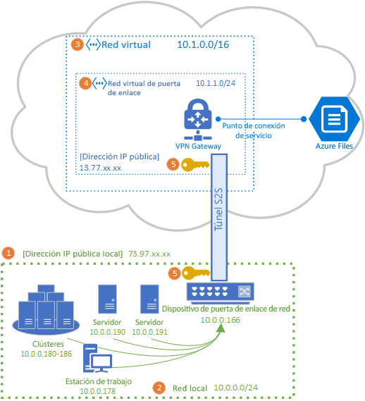
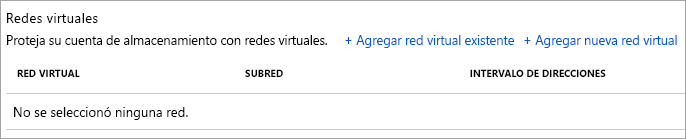
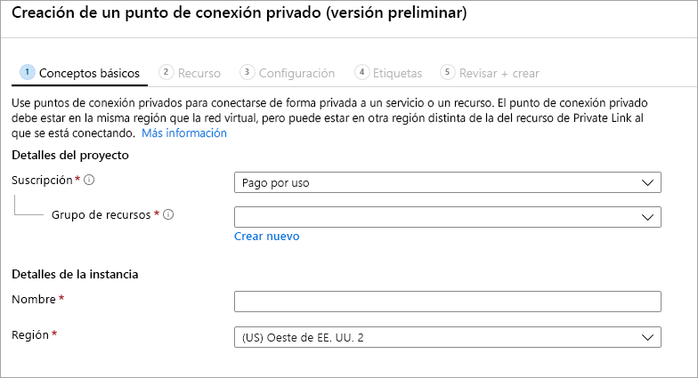

# Configuración de una VPN de sitio a sitio para su uso con Azure Files
Puede usar una conexión VPN de sitio a sitio (S2S) para montar los recursos compartidos de archivos de Azure a través de SMB desde su red local sin necesidad de abrir el puerto 445. Puede configurar una VPN de sitio a sitio mediante [Azure VPN Gateway](../../vpn-gateway/vpn-gateway-about-vpngateways.md), que es un recurso de Azure que ofrece servicios VPN y se implementa en un grupo de recursos junto con las cuentas de almacenamiento u otros recursos de Azure.

Se recomienda que lea [Introducción a las redes de Azure Files](storage-files-networking-overview.md) antes de continuar con este artículo para obtener una descripción completa de las opciones de red disponibles para Azure Files.

En este artículo se detallan los pasos para configurar una VPN de sitio a sitio para montar recursos compartidos de archivos de Azure directamente en el entorno local. Si quiere enrutar el tráfico sincrónico para Azure File Sync a través de una VPN de sitio a sitio, consulte [Configuración del proxy y el firewall de Azure File Sync](storage-sync-files-firewall-and-proxy.md).

## Requisitos previos
- Un recurso compartido de archivos de Azure que le gustaría montar en el entorno local. Puede usar un [recurso compartido de archivos de Azure estándar](storage-how-to-create-file-share.md) o [Premium](storage-how-to-create-premium-fileshare.md) con la VPN de sitio a sitio.

- Un dispositivo de red o un servidor en el centro de recursos local que sea compatible con Azure VPN Gateway. Azure Files es independiente del dispositivo de red local elegido, pero Azure VPN Gateway mantiene una [lista de los dispositivos probados](../../vpn-gateway/vpn-gateway-about-vpn-devices.md). Los diferentes dispositivos de red ofrecen distintas funciones, características de rendimiento y funcionalidades de administración, por lo que debe tenerlas en cuenta al seleccionar un dispositivo de red.

    Si no tiene un dispositivo de red existente, Windows Server contiene un rol de servidor integrado, enrutamiento y acceso remoto (RRAS), que puede usarse como el dispositivo de red local. Para obtener más información acerca de cómo configurar el enrutamiento y acceso remoto en Windows Server, consulte [Puerta de enlace de RAS](https://docs.microsoft.com/windows-server/remote/remote-access/ras-gateway/ras-gateway).

## Incorporación de una cuenta de almacenamiento a una red virtual
En Azure Portal, vaya a la cuenta de almacenamiento que contiene el recurso compartido de archivos de Azure que quiere montar en el entorno local. En la tabla de contenido de la cuenta de almacenamiento, seleccione la entrada **Firewalls y redes virtuales**. A menos que haya agregado una red virtual a su cuenta de almacenamiento al crearla, el panel resultante debe tener seleccionado el botón de radio **Permitir el acceso desde** para **Todas las redes**.

Para agregar la cuenta de almacenamiento a la red virtual deseada, seleccione **Redes seleccionadas**. En el subtítulo **Redes virtuales**, haga clic en **+ Agregar red virtual existente** o **+ Agregar nueva red virtual** en función del estado deseado. Al crear una nueva red virtual, se creará un nuevo recurso de Azure. El recurso de red virtual nuevo o existente no tiene que estar en el mismo grupo de recursos o suscripción que la cuenta de almacenamiento, pero debe estar en la misma región que la cuenta de almacenamiento. Además, el grupo de recursos y la suscripción en los que se implementará la red virtual deben coincidir con la cuenta en la que implementará la instancia de VPN Gateway. 

Si agrega una red virtual existente, se le pedirá que seleccione una o más subredes de la red virtual a la que se debe agregar la cuenta de almacenamiento. Si selecciona una nueva red virtual, creará una subred como parte de la creación de la red virtual y podrá agregar más tarde a través del recurso de Azure resultante para la red virtual.

Si no agregó una cuenta de almacenamiento a su suscripción antes, se tendrá que agregar el punto de conexión del servicio Microsoft.Storage a la red virtual. Esto puede tardar algún tiempo y hasta que se complete esta operación, no podrá acceder a los recursos compartidos de archivos de Azure dentro de esa cuenta de almacenamiento, incluso a través de la conexión VPN. 

## Implementación de una instancia de Azure VPN Gateway
En la tabla de contenido de Azure Portal, seleccione **Crear un recurso** y busque *puerta de enlace de red virtual*. La puerta de enlace de red virtual debe estar en la misma suscripción, región de Azure y grupo de recursos que la red virtual que implementó en el paso anterior (tenga en cuenta que el grupo de recursos se selecciona automáticamente al seleccionar la red virtual). 

Con el fin de implementar una instancia de Azure VPN Gateway, debe rellenar los campos siguientes:

- **Nombre**: nombre del recurso de Azure para VPN Gateway. Este puede ser cualquier nombre que le resulte útil para la administración.
- **Región**: región en la que se implementará la instancia de VPN Gateway.
- **Tipo de puerta de enlace**: con el fin de implementar una VPN de sitio a sitio, debe seleccionar **VPN**.
- **Tipo de VPN**: puede elegir entre *Basada en rutas* o **Basada en directivas** en función de su dispositivo VPN. Las VPN basadas en rutas son compatibles con IKEv2, mientras que las VPN basadas en directivas solo admiten IKEv1. Para obtener más información sobre los dos tipos de puertas de enlace de VPN, consulte [Acerca de las puertas de enlace de VPN basadas en directivas y en rutas](../../vpn-gateway/vpn-gateway-connect-multiple-policybased-rm-ps.md#about).
- **SKU**: la SKU controla el número de túneles de sitio a sitio permitidos y el rendimiento deseado de la VPN. Para seleccionar la SKU adecuada para su caso de uso, consulte la lista de [SKU de puerta de enlace](../../vpn-gateway/vpn-gateway-about-vpngateways.md#gwsku). La SKU de VPN Gateway se puede cambiar más adelante si es necesario.
- **Red virtual**: red virtual que creó en el paso anterior.
- **Dirección IP pública**: dirección IP de la instancia de VPN Gateway que se expondrá en Internet. Lo más probable es que necesite crear una nueva dirección IP. No obstante, también puede usar una dirección IP existente sin usar si es adecuado. Si selecciona **Crear nuevo**, se creará un nuevo recurso de Azure de dirección IP en el mismo grupo de recursos que la instancia de VPN Gateway y el **Nombre de la dirección IP pública** será el nombre de la dirección IP que se acaba de crear. Si selecciona **Usar existente**, debe seleccionar la dirección IP existente sin usar.
- **Habilitar el modo activo/activo**: seleccione **Habilitado** solo si va a crear una configuración de puerta de enlace activa/activa. De lo contrario, deje seleccionada la opción **Deshabilitado**. Para obtener más información sobre el modo activo/activo, consulte [Conectividad de alta disponibilidad entre locales y de red virtual a red virtual](../../vpn-gateway/vpn-gateway-highlyavailable.md).
- **Configure BGP ASN** (Configuración de ASN de BGP): seleccione **Habilitado** solo si la configuración requiere este ajuste específicamente. Para obtener más información acerca de esta configuración, consulte [Acerca de BGP con Azure VPN Gateway](../../vpn-gateway/vpn-gateway-bgp-overview.md).

Seleccione **Revisar y crear** para crear la instancia de VPN Gateway. Una instancia de VPN Gateway puede tardar hasta 45 minutos en crearse e implementarse completamente.

### Creación de una puerta de enlace de red local para la puerta de enlace local 
Una puerta de enlace de red local es un recurso de Azure que representa al dispositivo de red local. En la tabla de contenidos de Azure Portal, seleccione **Crear un recurso** y busque *puerta de enlace de red local*. La puerta de enlace de red local es un recurso de Azure que se implementará junto con la cuenta de almacenamiento, la red virtual y la instancia de VPN Gateway, pero no es necesario que esté en el mismo grupo de recursos o suscripción que la cuenta de almacenamiento. 

Con el fin de implementar el recurso de puerta de enlace de red local, debe rellenar los campos siguientes:

- **Nombre**: nombre del recurso de Azure para la puerta de enlace de red local. Este puede ser cualquier nombre que le resulte útil para la administración.
- **Dirección IP**: dirección IP pública de la puerta de enlace local en el entorno local.
- **Espacio de direcciones**: intervalo de direcciones de la red que representa esta puerta de enlace de red local. Puede agregar varios intervalos de espacios de direcciones, aunque debe asegurarse de que los intervalos especificados no se superpongan con los de otras redes a las que quiera conectarse. 
- **Configurar BGP**: solo debe configurar los valores de BGP si la configuración lo requiere. Para obtener más información acerca de esta configuración, consulte [Acerca de BGP con Azure VPN Gateway](../../vpn-gateway/vpn-gateway-bgp-overview.md).
- **Suscripción**: la suscripción deseada. No es necesario que coincida con la suscripción usada para la instancia de VPN Gateway o la cuenta de almacenamiento.
- **Grupo de recursos**: grupo de recursos deseado. No es necesario que coincida con el grupo de recursos usado para la instancia de VPN Gateway o la cuenta de almacenamiento.
- **Ubicación**: la región de Azure en la que debe crearse el recurso de puerta de enlace de red local. Debe coincidir con la región seleccionada para la instancia de VPN Gateway y la cuenta de almacenamiento.

Seleccione **Crear** para crear el recurso de la puerta de enlace de red local.  

## Configuración del dispositivo de red local
Los pasos específicos para configurar el dispositivo de red local dependen del dispositivo de red que haya seleccionado la organización. Según el dispositivo que haya elegido la organización, la [lista de dispositivos probados](../../vpn-gateway/vpn-gateway-about-vpn-devices.md) puede incluir un vínculo a las instrucciones del proveedor del dispositivo para configurarlo con Azure VPN Gateway.

## Creación de un punto de conexión privado (versión preliminar)
Al crear un punto de conexión privado para la cuenta de almacenamiento, la cuenta de almacenamiento proporciona una dirección IP dentro del espacio de direcciones IP de la red virtual. Al montar el recurso compartido de archivos de Azure desde el entorno local mediante esta dirección IP privada, las reglas de enrutamiento autodefinidas por la instalación de VPN enrutarán la solicitud de montaje a la cuenta de almacenamiento a través de la VPN. 

En la hoja de la cuenta de almacenamiento, seleccione **Conexiones de punto de conexión privado** en la tabla de contenido de la izquierda y **+ Punto de conexión privado** para crear un nuevo punto de conexión privado. El asistente resultante tiene varias páginas que debe completar:

En la pestaña **Aspectos básicos**, seleccione el grupo de recursos, el nombre y la región que desee para el punto de conexión privado. Estos pueden ser cualquier cosa que desee, no tienen que coincidir con la cuenta de almacenamiento en ningún aspecto, aunque debe crear el punto de conexión privado en la misma región que la red virtual en la que quiere crear el punto de conexión privado.

En la pestaña **Recurso**, seleccione el botón de radio para **Conectarse a un recurso de Azure en mi directorio**. En **Tipo de recurso**, seleccione **Microsoft.Storage/storageAccounts** para el tipo de recurso. El campo **Recurso** es la cuenta de almacenamiento con el recurso compartido de archivos de Azure al que quiere conectarse. El recurso secundario de destino es **archivo**, ya que es para Azure Files.

La pestaña **Configuración** permite seleccionar la red virtual específica y la subred a la que le gustaría agregar el punto de conexión privado. Seleccione la red virtual que creó anteriormente. Debe seleccionar una subred distinta de la subred en la que agregó el punto de conexión de servicio anteriormente.

La pestaña **Configuración** también le permite configurar una zona DNS privada. Esto no es necesario, pero le permite usar una ruta de acceso UNC descriptiva (como `\\mystorageaccount.privatelink.file.core.windows.net\myshare`) en lugar de una ruta de acceso UNC con una dirección IP para montar el recurso compartido de archivos de Azure. Esto también puede realizarse con sus propios servidores DNS en la red virtual.

Haga clic en **Revisar y crear** para crear el punto de conexión privado. Una vez creado el punto de conexión privado, verá dos nuevos recursos: un recurso de punto de conexión privado y una interfaz de red virtual emparejada. El recurso de interfaz de red virtual tendrá la dirección IP privada dedicada de la cuenta de almacenamiento. 

## Creación de la conexión de sitio a sitio
Para completar la implementación de una VPN de sitio a sitio, debe crear una conexión entre el dispositivo de red local (representado por el recurso de puerta de enlace de red local) y la instancia de VPN Gateway. Para ello, vaya a la instancia de VPN Gateway que creó anteriormente. En la tabla de contenido de VPN Gateway, seleccione **Conexiones** y haga clic en **Agregar**. En el panel **Agregar conexión** se necesitan los siguientes campos:

- **Nombre**: El nombre de la conexión Una instancia de VPN Gateway puede hospedar varias conexiones, por lo que debe elegir un nombre que le resulte útil para la administración y que distinga esta conexión concreta.
- **Tipo de conexión**: dad que se trata de una conexión S2S, seleccione **Sitio a sitio (IPSec)** en la lista desplegable.
- **Puerta de enlace de red virtual**: este campo se selecciona automáticamente para la instancia de VPN Gateway con la que está realizando la conexión y no se puede cambiar.
- **Puerta de enlace de red local**: esta es la puerta de enlace de red local que quiere conectar a su instancia de VPN Gateway. El panel de selección resultante debe tener el nombre de la puerta de enlace de red local que creó anteriormente.
- **Clave compartida (PSK)** : combinación de letras y números que se usa para establecer el cifrado de la conexión. Se debe usar la misma clave compartida tanto en la red virtual como en las puertas de enlace de red locales. Si el dispositivo de puerta de enlace no proporciona una, puede crearla aquí y establecerla en el dispositivo.

Seleccione **Aceptar** para crear la conexión. Puede comprobar que la conexión se realizó correctamente a través de la página **Conexiones**.

## Montaje de un recurso compartido de archivos de Azure 
El último paso para configurar una VPN de sitio a sitio es comprobar que funciona para Azure Files. Puede hacerlo montando el recurso compartido de archivos de Azure de forma local con el sistema operativo que prefiera. Consulte las instrucciones de montaje por sistema operativo aquí:

- [Windows](storage-how-to-use-files-windows.md)
- [macOS](storage-how-to-use-files-mac.md)
- [Linux](storage-how-to-use-files-linux.md)

## Otras referencias
- [Introducción a las redes de Azure Files](storage-files-networking-overview.md)
- [Configuración de una VPN de punto a sitio (P2S) en Windows para su uso con Azure Files](storage-files-configure-p2s-vpn-windows.md)
- [Configuración de una VPN de punto a sitio (P2S) en Linux para su uso con Azure Files](storage-files-configure-p2s-vpn-linux.md)
