# Inicio rápido: Creación y uso de un recurso compartido de archivos de Azure para Windows
El artículo muestra los pasos básicos para crear y usar un recurso compartido de archivos de Azure. Esta guía de inicio rápido se centra en la rápida configuración de un recurso compartido de archivos de Azure para experimentar el funcionamiento del servicio. Si necesita instrucciones más detalladas para crear y usar recursos compartidos de archivos de Azure en su propio entorno, consulte [Uso de un recurso compartido de archivos de Azure con Windows](storage-how-to-use-files-windows.md).

Si no tiene una suscripción a Azure, cree una [cuenta gratuita](https://azure.microsoft.com/free/?WT.mc_id=A261C142F) antes de empezar.

## Inicio de sesión en Azure
Inicie sesión en el [Azure Portal](https://portal.azure.com).

## Preparación del entorno
Antes de crear un recurso compartido de archivos de Azure para esta guía de inicio rápido, tiene que configurar los siguientes elementos:

- Una cuenta de Azure Storage y un recurso compartido de archivos de Azure
- Una máquina virtual Windows Server 2016 Datacenter

### Crear una cuenta de almacenamiento

Para poder trabajar con un recurso compartido de archivos de Azure, es necesario que cree una cuenta de Azure Storage. Una cuenta de almacenamiento es un grupo compartido de almacenamiento en el que puede implementar un recurso compartido de archivos de Azure u otros recursos de almacenamiento como blobs o colas. Una cuenta de almacenamiento puede contener un número ilimitado de recursos compartidos. Un recurso compartido puede almacenar un número ilimitado de archivos, hasta los límites de capacidad de la cuenta de almacenamiento.

[!INCLUDE [storage-create-account-portal-include](../../../includes/storage-create-account-portal-include.md)]

### Creación de un recurso compartido de archivos de Azure
A continuación creará un recurso compartido de archivos.

1. Cuando se complete la implementación de la cuenta de Azure Storage, seleccione **Ir al recurso**.
1. Seleccione **Archivos** en el panel de la cuenta de almacenamiento.

    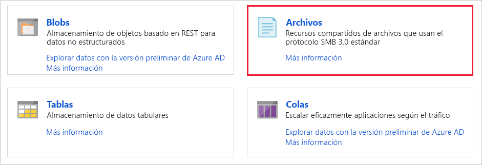

1. Seleccione **+ Recurso compartido de archivos**.

    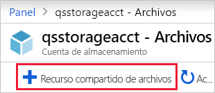

1. Dele al nuevo recurso compartido el nombre *qsfileshare* > escriba "1" para **Cuota** > seleccione **Crear**. El valor máximo de la cuota es 5 TiB, pero para esta guía de inicio rápido solo se necesita 1 GiB.
1. Cree un nuevo archivo txt denominado *qsTestFile* en la máquina local.
1. Seleccione el nuevo recurso compartido de archivos y en su ubicación, haga clic en **Cargar**.

    

1. Vaya a la ubicación donde creó el archivo .txt > seleccione *qsTestFile.txt* > seleccione **Cargar**.

Ya ha creado una cuenta de Azure Storage y un recurso compartido de archivos con un solo archivo en Azure. Ahora creará la máquina virtual de Azure con Windows Server 2016 Datacenter para representar el servidor local en esta guía de inicio rápido.

### Implementación de una máquina virtual
1. A continuación, expanda el menú del lado izquierdo del portal y elija **Crear un recurso** en la esquina superior izquierda de Azure Portal.
1. En el cuadro de búsqueda que está encima de la lista de recursos de **Azure Marketplace**, busque **Windows Server 2016 Datacenter**, selecciónelo y, después, elija **Crear**.
1. En la pestaña **Conceptos básicos**, en **Detalles del proyecto**, seleccione el grupo de recursos que creó para esta guía de inicio rápido.

   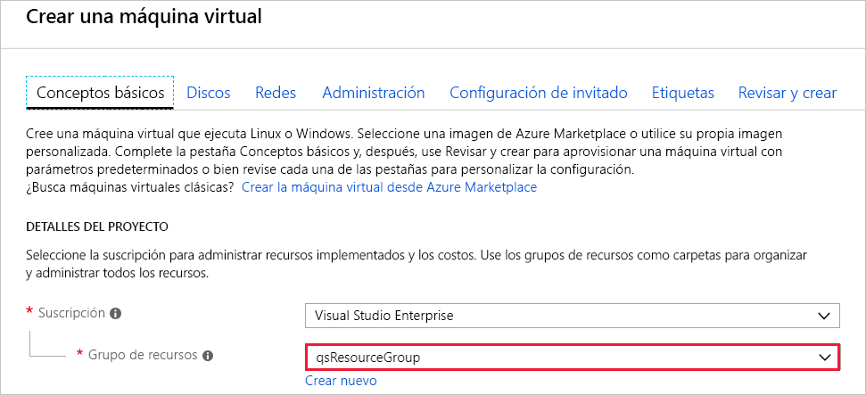

1. En **Detalles de la instancia**, asigne a la máquina virtual el nombre *qsVM*.
1. Deje la configuración predeterminada en **Región**, **Opciones de disponibilidad**, **Imagen** y **Tamaño**.
1. En **Cuenta de administrador**, agregue *VMadmin* como el **Nombre de usuario** y escriba una **Contraseña** para la máquina virtual.
1. En **Reglas de puerto de entrada**, elija **Permitir los puertos seleccionados** y luego seleccione **RDP (3389)** y **HTTP** en la lista desplegable.
1. Seleccione **Revisar + crear**.
1. Seleccione **Crear**. La creación de una máquina virtual nueva tardará varios minutos en completarse.

1. Después de completar la implementación de la máquina virtual, seleccione **Ir al recurso**.

Ya ha creado una nueva máquina virtual y ha conectado un disco de datos. Ahora tiene que conectarse a la máquina virtual.

### Conexión a la máquina virtual

1. Seleccione **Conectar** en la página de propiedades de la máquina virtual.

   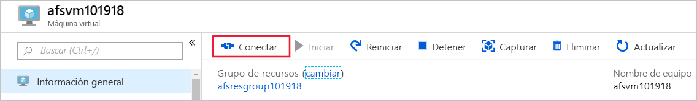

1. En la página **Connect to virtual machine** (Conectarse a una máquina virtual), mantenga las opciones predeterminadas para conectarse por **dirección IP** a través del **número de puerto** *3389* y seleccione **Descargar archivo RDP**.
1. Abra el archivo RDP que descargó y haga clic en **Conectar** cuando se le solicite.
1. En la ventana **Seguridad de Windows**, seleccione **Más opciones** y, después, **Usar otra cuenta**. Escriba el nombre de usuario con el siguiente formato, *localhost\nombre de usuario*, siendo &lt;nombre de usuario&gt; el nombre de usuario administrador de la máquina virtual que creó. Escriba la contraseña que creó para la máquina virtual y, luego seleccione **Aceptar**.

   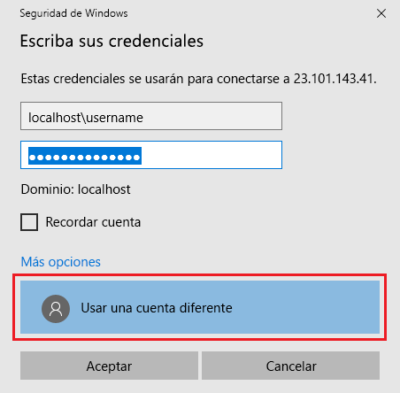

1. Puede recibir una advertencia de certificado durante el proceso de inicio de sesión. Seleccione **Sí** o **Continuar** para crear la conexión.

## Asigne el recurso compartido de archivos de Azure a una unidad de Windows

1. En Azure Portal, vaya al recurso compartido de archivos *qsfileshare* y seleccione **Conectar**.
1. Copie el contenido de la segunda casilla y péguelo en el **Bloc de notas**.

   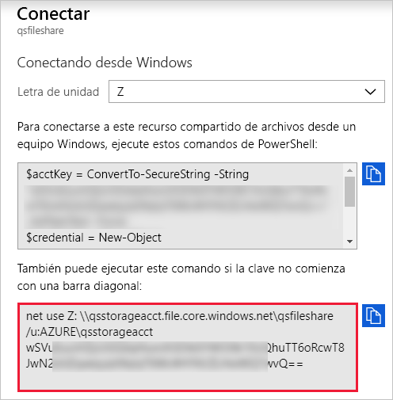

1. En la máquina virtual, abra **Explorador de archivos** y seleccione **Este equipo** en la ventana. Esta selección cambiará los menús disponibles en la barra de herramientas. En el menú **Equipo**, seleccione **Conectar a unidad de red**.
1. Seleccione la letra de unidad y escriba la ruta de acceso UNC. Si ha seguido las sugerencias de nomenclatura en esta guía de inicio rápido, copie *\\qsstorageacct.file.core.windows.net\qsfileshare* desde el **Bloc de notas**.

   Asegúrese de que ambas casillas están seleccionadas.

   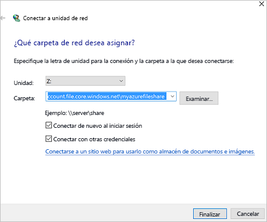

1. Seleccione **Finalizar**.
1. En el cuadro de diálogo **Seguridad de Windows**:

   - Desde el Bloc de notas, copie el nombre de la cuenta de almacenamiento precedido de AZURE\ y péguelo en el cuadro de diálogo **Windows Security** como nombre de usuario. Si ha seguido las sugerencias de nomenclatura en esta guía de inicio rápido, copie *AZURE\qsstorageacct*.
   - Desde el Bloc de notas, copie la clave de la cuenta de almacenamiento y péguela en el cuadro de diálogo **Windows Security** como contraseña.

      

## Creación de una instantánea de recurso compartido
Ahora que ha asignado la unidad, puede crear una instantánea.

1. En el portal, vaya al recurso compartido de archivos y seleccione **Crear instantánea**.

   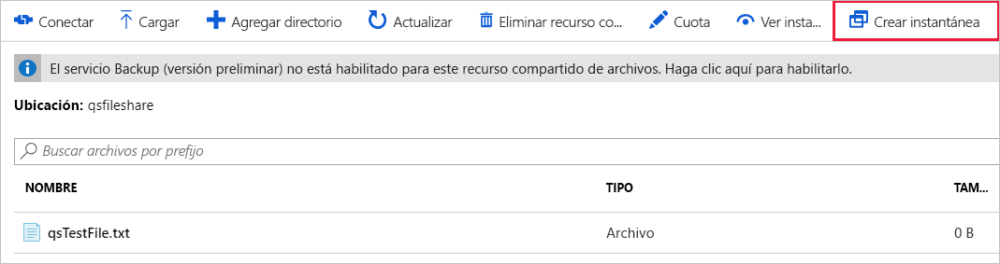

1. En la máquina virtual, abra *qstestfile.txt* y escriba "este archivo se ha modificado" > Guarde y cierre el archivo.
1. Cree otra instantánea.

## Búsqueda de una instantánea de recurso compartido

1. En el recurso compartido de archivos, seleccione **Ver instantáneas**.
1. En el panel **Instantáneas de recursos compartidos de archivos**, seleccione la primera instantánea en la lista.

   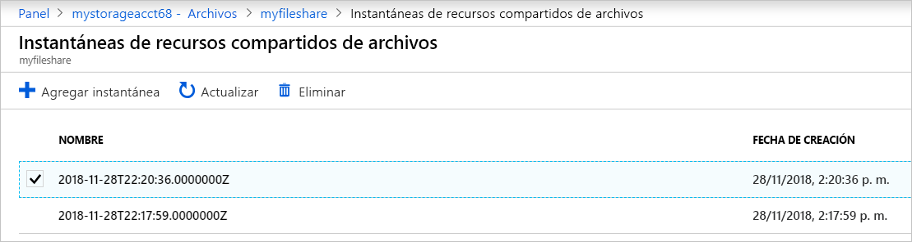

1. En el panel de esa instantánea, seleccione *qsTestFile.txt*.

## Restauración desde una instantánea

1. En el portal, seleccione *qsTestFile* > seleccione el botón **Restaurar**.
1. Seleccione **Sobrescribir el archivo original**.

   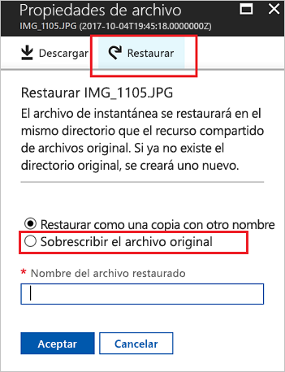

1. En la máquina virtual, abra el archivo. Se ha restaurado la versión no modificada.

## Eliminación de una instantánea de recurso compartido

1. En el recurso compartido de archivos, seleccione **Ver instantáneas**.
1. En el panel **Instantáneas de recursos compartidos de archivos**, seleccione las últimas instantáneas en la lista y haga clic en **Eliminar**.

   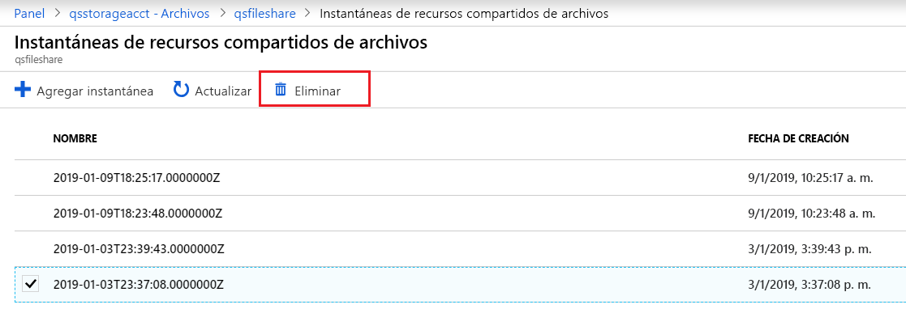

## Uso de una instantánea de recurso compartido en Windows
Al igual que con las instantáneas VSS en el entorno local, puede ver las instantáneas desde el recurso compartido de archivos de Azure montado en la pestaña Versiones anteriores.

1. Ubique el recurso compartido montado en el Explorador de archivos.

   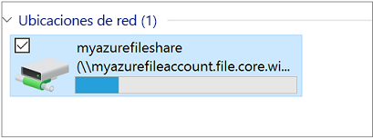

1. Seleccione *qsTestFile.txt* > haga clic con el botón derecho y seleccione **Propiedades** en el menú.

   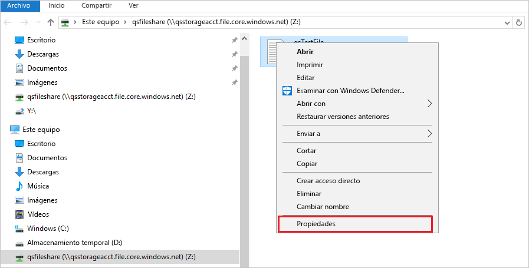

1. Seleccione **Versiones anteriores** para ver la lista de instantáneas de recursos compartidos de este directorio.

1. Seleccione **Abrir** para abrir el archivo.

   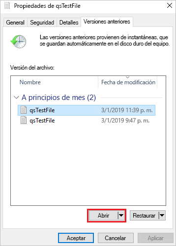

## Restaurar desde una versión anterior

1. Seleccione **Restaurar**. Esta acción copia el contenido de todo un directorio de forma recursiva en la ubicación original en el momento de la creación de la instantánea del recurso compartido.

   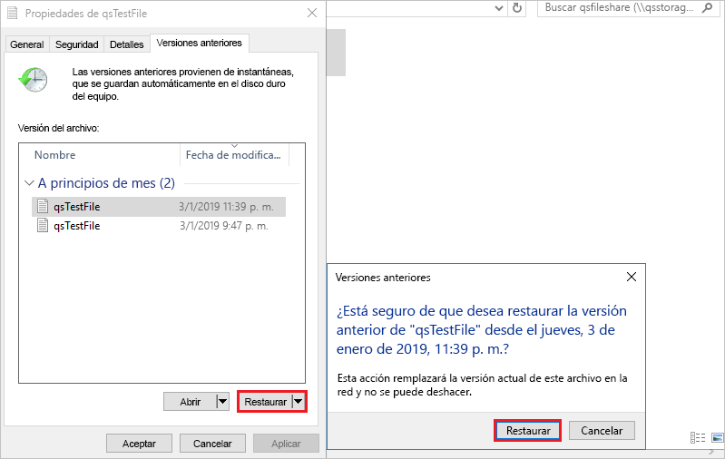

## Limpieza de recursos

[!INCLUDE [storage-files-clean-up-portal](../../../includes/storage-files-clean-up-portal.md)]

## Pasos siguientes

> [!div class="nextstepaction"]
> [Uso de un recurso compartido de archivos de Azure con Windows](storage-how-to-use-files-windows.md)